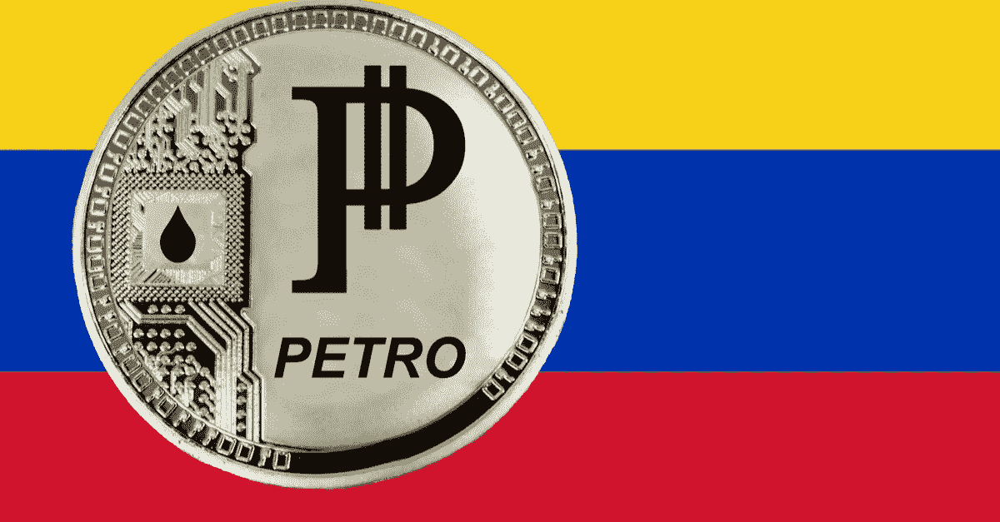
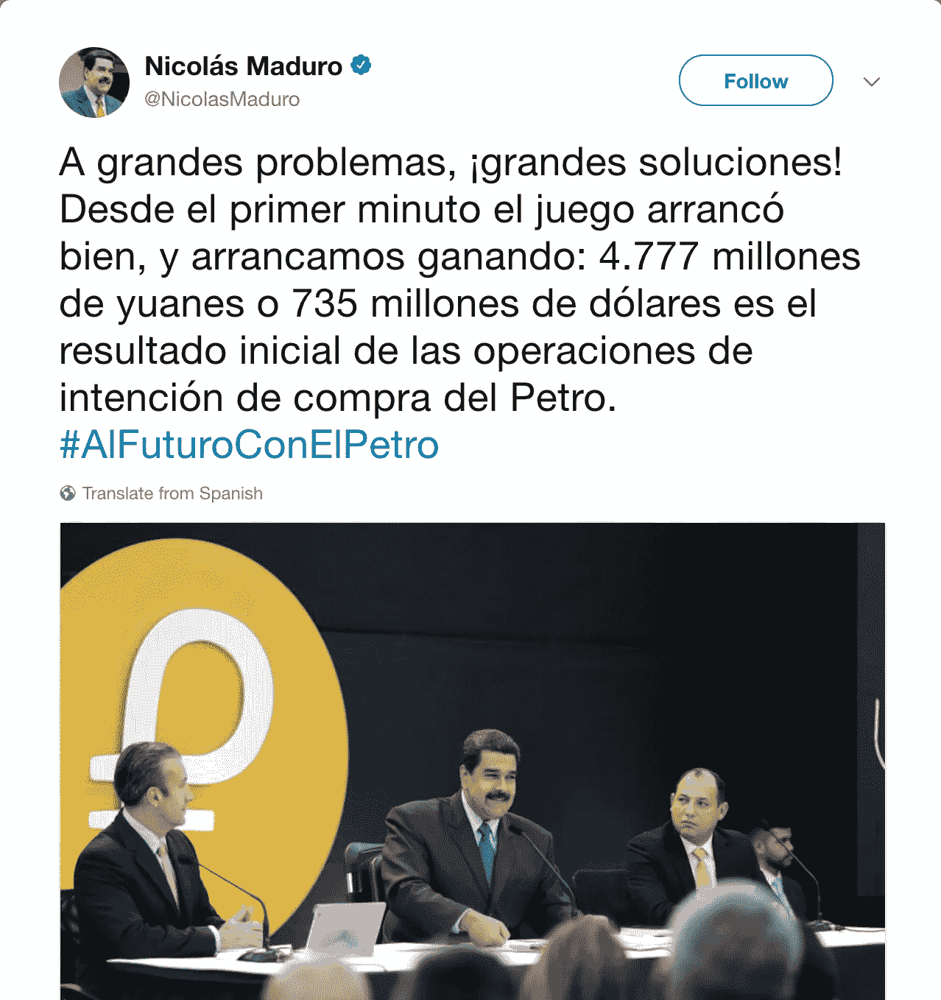
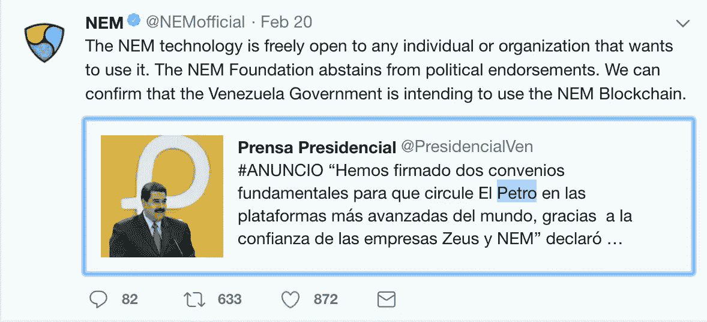

# 石油是对我们民主的威胁吗？

> 原文：<https://medium.com/hackernoon/is-the-petro-a-threat-to-our-democracy-7367f04c7037>

现在这是官方消息:第一种真正受到监管的主权加密货币已经推出，首次发行硬币(ICO)在第一次预售中筹集了近 8 亿美元，预计总额将达到 50 亿美元。考虑到去年通过 ICO 筹集的资金总额为 40 亿美元，这对单个 ICO 来说已经不错了。

Petro (PTR)是委内瑞拉政府发行的官方加密货币，由他们庞大的 3000 亿桶石油储备的充分信任支持。完全遵照 ICO 惯例，发布了一份[白皮书](http://www.elpetro.gob.ve/Whitepaper_Petro_en.pdf)供投资者审阅。这对区块链经济来说应该是个好消息。

然而，委内瑞拉政府和机构正受到美国政府的严厉制裁。是的，美国人或实体不能合法购买石油硬币，这样做的后果是不好玩的。任何违反这些制裁的美国人，每次违反的后果可高达[100 万美元和高达 20 年的监禁](http://sanctionsguide.eversheds.com/countries/the-u-s/)。

Maduro tweeted he raised $735M and named it a “big solution.”

根据 Petro 白皮书，其目标是创建一个更好、更公平的金融体系，这将有利于仍在发展中的国家。该报称，美元不利于世界稳定，因为它没有黄金做后盾。举例来说，美元一度由黄金支撑，但这种做法在 1933 年被终止，以帮助美国走出大萧条。美元现在是一种由美国政府完全信任支持的浮动货币。

自从它的 ICO，石油混淆了许多，因为它是使用区块链。白皮书声称它是关于新经济运动(NEM)区块链，但是[许多加密网站](https://foundico.com/ico/petro.html)已经把它列为 ERC-20 以太坊智能合约。这种混乱产生了欺骗投资者的机会。最重要的是，白皮书指出，最初的令牌可以在以后交换为另一个令牌。

真正的问题是:石油加密货币能帮助委内瑞拉政府逃脱美国政府对他们的制裁吗？加密货币技术现在是在为政治战争服务吗？参议员卢比奥已经要求美国财政部监控石油公司，并采取行动阻止他们逃避制裁。最有趣的是，史蒂夫·姆努钦(Steve Mnuchin)领导的美国财政部将如何阻止石油加密货币的成功？

毕竟，区块链的技术是分散的，实际上不受任何政府或实体的控制。成千上万的服务器正在验证和复制石油交易，并为此服务奖励矿工。政府应该如何阻止这种情况？当然，区块链可以被监控，因为它是一个公共账本，但确定谁拥有每一个石油将是极其困难的。

创造 Petro 的目的就是让它的表现和比特币一模一样。这是一种新的货币，供应量有限，技术上不受任何实体控制，甚至是委内瑞拉政府。它的目的是建立绝对的信任，因为它的分散性、不变性、透明性和安全性。自 2009 年以来，比特币已经证明了它的可靠性，它受到了数百万投资者的信任。Petro 会取得同样的成功吗？

创造比特币的人有没有想过这项技术可以被政府用来为经济融资？区块链现在正式成为任何流氓政府资助其活动的武器，不管它是否取悦美国政府。敬请关注，还会有更多政府发行的加密货币问世。