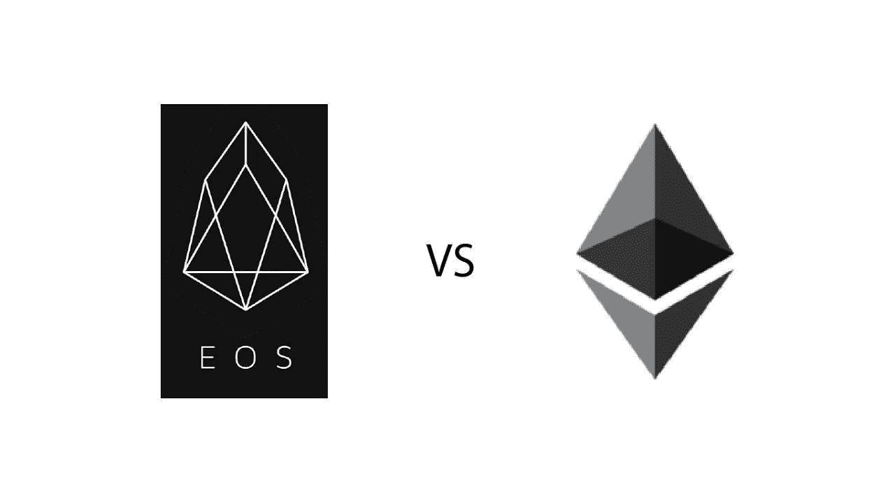

# EOS 的成功是否与以太坊的失败捆绑在一起？

> 原文：<https://medium.com/hackernoon/is-the-success-of-eos-tied-to-the-failure-of-ethereum-c5a2fdbf513d>

## 争夺奥特金霸权的激烈战斗

source: steemit.com

最近，EOS 和以太坊之间的争斗变得越来越离奇。虽然这两个平台在技术上有很大的不同，但许多人认为，在短期内，一个平台必须以牺牲另一个平台的利益为代价取得成功。有趣的是，两个阵营的成员都试图肯定他们平台的优越性，我认为这太幼稚了。也许毕竟，区块链仍处于起步阶段。

> 以防你不熟悉 EOS，你可以阅读这个平台的[快照概述](/@davidolarinoye/a-snap-overview-of-eos-8bb79ada9418)。这是一个锁定的职位。

许多年前，在互联网兴起之初，两个视自己为竞争对手的公司之间产生了深刻的敌意和冲突。但最终，即使他们仍然是竞争对手，**市场对每个人来说都变得足够大。在技术革命早期起步的 IBM 不得不一次又一次地不断改造自己，以符合当今技术时代的标准。我们可以说是相对新手的脸书也没有上场。我们也有失败者，比如雅虎(曾经是互联网之王，但现在只是公司的一部分)。那些仍然屹立不倒的公司的主要特征不是产品或服务，而是他们对相关性的承诺。**

我认为以太坊就像 IBM 公司。然而，EOS 就像任何一家在盖茨和乔布斯时代崛起的科技公司一样。几乎可以肯定以太坊将会存在。这并不是因为他们的解决方案是最好的，而是因为他们有一个坚实、忠诚的团队，一个强大的社区，并且他们的平台上已经有相当数量的用户。未来这个数字可能不会像其他平台那样快速增长，但我不认为它会下降。以太坊在他们的平台上有很多工作要做，因为他们需要解决许多令人信服的问题，其中最大的问题是缩放。拥挤的以太网对整个区块链社区都没有好处(即使有其他选择)。

老实说，EOS 展示了承诺，但承诺只能承载一个项目一段时间。需要结果来改变项目的故事。当全世界都在等待 EOS 上的第一个 dapp 时，有必要从有希望到好的转变(*或者 dapp 已经在 EOS 区块链上直播了？*)EOS 阵营中的一些人认为，开发者要为 EOS 离开以太坊，但生活并不是这样。开发商现在就跳槽还为时过早。 **EOS 需要吸引那些没有依附于以太坊的开发者进入他们的平台**。他们需要在其他平台醒来、市场变得拥挤之前做到这一点。

EOS 应该警惕的一个“竞争对手”是 Lisk。Lisk 将 JavaScript 编程带到了区块链。我有一个开发朋友，他仍然忙于区块链世界之外的事情，虽然我想让他上区块链的马车，但因为 Lisk 我有点犹豫。他已经懂 JavaScript 了。我不知道他是否有时间承诺学习另一种编程语言来开发 dapps。因此，带有侧链和 JavaScript 语言的 Lisk 似乎是一个不错的选择。但是让我们看看 Lisk 平台为开发者做好准备还需要多长时间。

> 如果你感兴趣的话，这里有一张 Lisk 的快照。然而，这是一个锁定的职位。

当然，如果我们不谈论近地天体，这是不公平的。市场上另一个强有力的竞争对手。没有太多关于尼奥的传言，对我来说这是一个好迹象。它给了平台健康成长的空间。一些 ico 已经倾向于 NEO 平台，但是 NEO 也有自己的问题。

考虑这些平台的一个难题是:对于这些，我们真的需要分权吗？这是一个棘手的问题，双方都有优点，但我相信只有时间才能揭示真正的答案。我不相信 EOS 需要以太坊失败才能成功。同样，所有其他平台。像大型科技公司一样，它们的命运掌握在自己手中。 **EOS 和以太坊可以并肩发展，甚至成为激烈的竞争对手**。尽管百事可乐和可口可乐很相似，但一家还没有杀死另一家。这两家公司已经存在了一段时间。所以，称 EOS 为以太坊杀手只是一个宣传噱头。如果以太坊要消亡了，那就掌握在维塔利克和研究它的人手中。平台总能重塑自我。

> 声明:我已经尽力不去过分偏袒任何一方，但是我必须声明，我没有试图推诿任何事情。EOS 和 NEO 是我过去拥有的硬币。截至发稿时，我还不拥有其中任何一个，但将来我可能会拥有。我从未拥有过 Lisk(尽管我认为这个项目很好)。我还有一点乙醚，虽然对我投资组合的其他部分来说不太重要。我交易替代硬币，但我不会长期持有。

干杯！