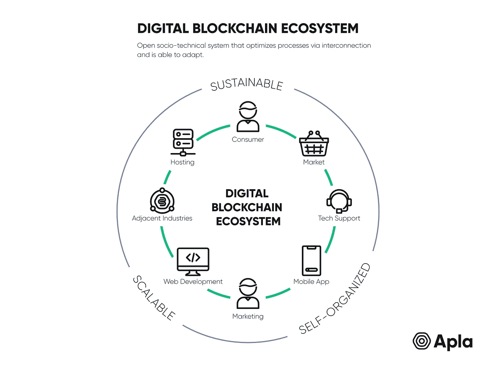
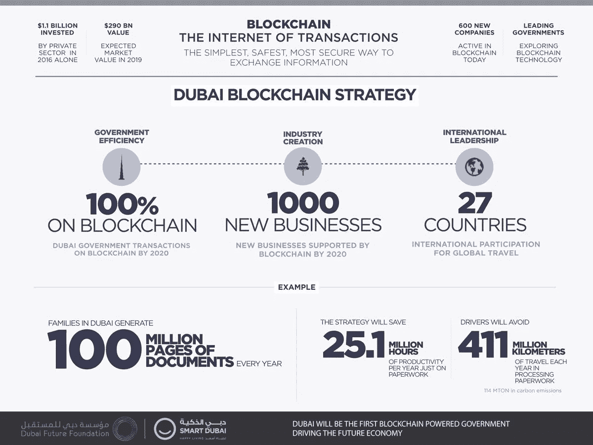
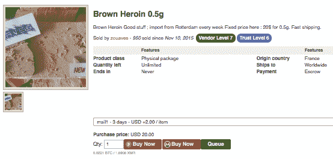
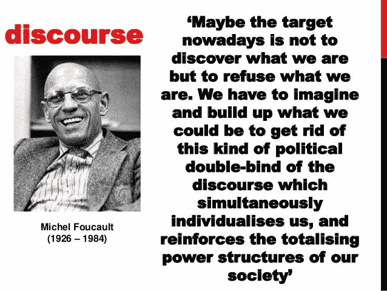

# 区块链没有加密货币还有机会吗？

> 原文：<https://medium.com/hackernoon/is-there-a-chance-for-blockchain-without-cryptocurrencies-2e6afa924549>

目前，政府和大企业正在像躲避瘟疫一样躲避加密货币。一方面，允许比特币作为额外货币可能会毁掉本币价值。另一方面，政府想要维持他们对印刷新钞票的垄断。

这就是为什么在秘密社区和真正的区块链采用之间有很大的差距。抱歉，但这场革命正在缓慢发生，并且不幸地与欺诈联系在一起。

仔细看看 IBM 是怎么做的:在没有任何加密货币的情况下开发区块链 POC 和试点。与其他公司(包括 Apla)一起，我们正在提高区块链的采用率，以帮助发放营业执照、区块链数字身份证、数字化土地注册和供应链。代币可能是这些案例的一部分，但没有任何额外的交易所像币安或火币。

同时，比特币指数的[合法性并不意味着你可以在当地银行购买比特币。在我的祖国乌克兰写着“是的，这是合法的”，但是我不能在街角的便利店里使用它。](https://en.wikipedia.org/wiki/Legality_of_bitcoin_by_country_or_territory)

# 如果区块链或 DLT 不采用加密货币，会发生什么？

**1** 。比特币创始人的梦想将会破灭。

**2** 。企业和政府将建立更值得信赖的 IT 系统。

**3** 。区块链将是像大数据一样的隐藏技术，所以公民或消费者不会意识到它正在变革任何东西。

**4** 。协议将成为 IT 人群的工具，远离大多数人。

如果我们区分公共关系民粹主义，并密切调查最进步的区块链政府倡议，如智能迪拜，你会发现没有加密的地方。在 Smartdubai.ae 网页上搜索:他们的区块链战略中没有密码。与此同时，迪拜的目标是到 2021 年成为一个区块链政府。这意味着他们将摆脱纸张，成为数字化政府。在这里，区块链被用作媒体关注、公民安全和尖端技术的来源。

智能治理不仅仅是加密货币的话题。流动性、生活质量、环境、互联社会和其他领域都是[艾莎·本·比什尔](https://www.linkedin.com/in/dr-aisha-bin-bishr-b5639b8/)(智慧迪拜总经理)博士感兴趣的领域。

Gazprom 是另一家对新兴技术感兴趣的企业巨头。区块链是 R&D it 部门的热门话题，因为它不仅是一项可以提高石油和天然气行业工作效率的新技术，而且是新人才的游乐场。俄罗斯天然气工业股份公司区块链相关领域的兴趣还不包括加密货币。一种新的加密货币不可能出现在这个商业巨头中，因为俄罗斯政府控制着俄罗斯天然气工业股份公司和该国的货币体系。

# 现在是数字货币时代吗？

日常生活中使用加密货币的人非常少。法规正在阻止 cryptos 成为主流，而 cryptos 要大规模用于购买鳄梨或文件翻译还需要几年时间。

所以我们生活在技术时代，这将导致数字货币时代。这个大规模数字化的时代见证了许多技术发明的出现和消失。当特定的技术(包括硬件和软件)不是强制性的(还记得 Windows Vista)时，这是一个不断测试和尝试的世界模式。

目前，像 SAP 和埃森哲这样的公司正在研究越来越多的区块链用例。最终，他们的目标是盈利，因此区块链是一个收入来源(特别是当它可以打开以前关闭的大门并产生线索时)。开源社区将反对企业巨头为了他们自己的目的“调整”区块链，并摆脱“让我们摆脱银行”的思维定势。

# 区块链战争

*老加泰罗尼亚无政府主义者无法理解现代数字抵抗*

两个独立的世界(姑且称之为“EOS 部落”和“亚马逊云区块链 dApps”)正在相互竞争。他们有一些共同的目标(想在采矿或加密交易中赚钱)，但他们的观点根本不同:政府想统治时代，企业想赚钱和加密社区…突然我们发现我们对大型加密社区一无所知。他们是控制比特币开采能力的中国矿工、美国出生的密码交易所投机者、以太坊社区还是 GitHub 上的自由开发者？区块链社区中有如此多的声音，以至于它实际上是分散的(Monero 的毒枭无法与麻省理工学院的技术团队联系在一起)。

*情人眼里出西施——密码既可用于坏事，也可用于好事。*

这是一场混合战争，原因有很多。而且这还不是战斗的高潮，因为区块链的采用率仍然很低。那么，我们为什么要对开源社区和企业、公共协议与无许可协议、赚钱者与社会福利信徒驱动的人开战呢？有机会出现统一的指数吗？

**是**:

当技术采用将帮助每个人实现它的目标；和

那时我们都将生活在一个由技术发展驱动的全新世界。

