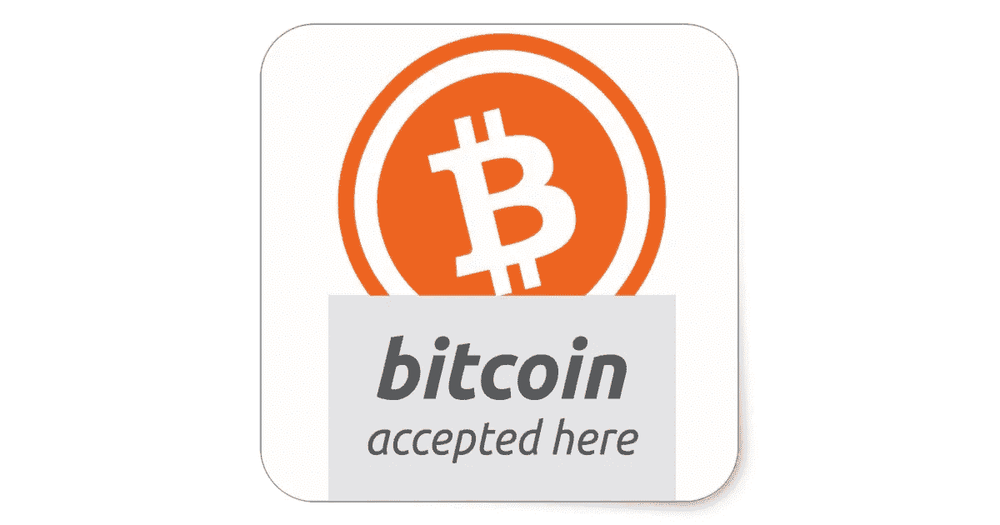
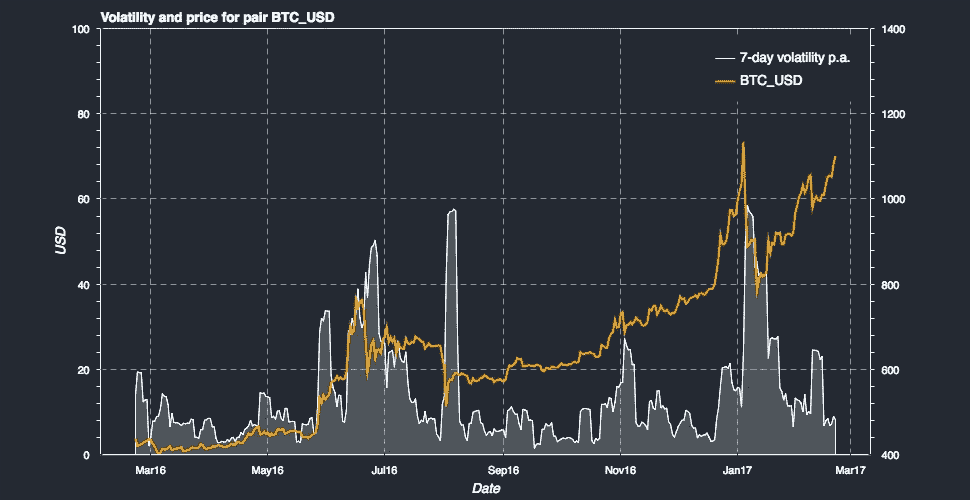

# 电子商务中的加密货币真的有被采用的趋势吗？

> 原文：<https://medium.com/hackernoon/is-there-a-real-adoption-trend-in-cryptocurrencies-for-e-commerce-570cdac4177a>

加密货币作为电子商务的主流支付手段早就被预测到了，尽管好处显而易见，但实现速度却很慢。现在这种情况正在改变，给了我们一些关于什么因素会真正在加密技术的采用中发挥作用的见解。

早在 2014 年，加密货币首次开始受到主流关注。发生在 2013 年底的比特币泡沫——尽管按照 2017 年的标准来看规模很小——引发了一波新的意识。随后是一个漫长的修正，但今天许多获得牵引力的倡议都源于当时兴起的爱好者群体。比特币直到 2017 年才退出公众视线，但种子已经播下。

**电子商务作为采纳的驱动力**

该社区的大部分人期望网络商务将成为加密货币采用的主要驱动力之一。当时的说法是，零售商——尤其是较小的在线商家——将首先把它整合到自己的网站上，因为它为他们和他们的客户带来了一系列好处。这个假设并非不合理:可以肯定的是，至少在理论上，加密货币支付有一些主要优势。当客户因为这样或那样的原因让他们的信用卡公司取消付款时，小型电子商务企业经常面临退款问题。也许他们对产品不满意，不管是合理的还是不合理的；也许他们的卡的详细资料被盗，其他人进行了购买；也许客户只是声称发生了这样的盗窃，以便欺诈性地免费获得产品。无论是哪种情况，商家都是以牺牲他们的底线为代价买单的一方。

加密货币支付作为不可逆的“推送”交易，彻底解决了这个问题。对于买家来说，也不存在恶意第三方窃取他们信用卡信息的问题。而且，就国际购买而言，加密货币远远高于传统支付系统。不管你是把钱寄到街对面还是世界的另一端，费用都是固定的，而且通常很低，收据几乎是即时的。

不幸的是，原则上起作用的东西在现实世界中不一定能兑现。俗话说‘理论上，理论和实践是一样的。实际上，他们不是。比特币作为一种支付方式并没有像预期的那样腾飞；由于加密货币优于信用卡，大批新消费者并没有从加密货币中受益。一些像戴尔和 Expedia 这样有远见的企业开始接受加密支付，但他们从未在客户中获得太多的关注。其他人尝试过这个想法，后来放弃了。当围绕比特币规模及其交易费用(高达 20 美元很常见)的争论升级时，购买任何低于 100 美元的东西都变得不划算。

**拉面**

Crypto’s worldwide adoption will take a while, but crypto payments are here to stay.

加密货币给电子商务带来了如此大的希望。那么是哪里出了问题呢？在这里，来自美国监狱系统的一个教训可能出乎意料地有益。

早在 2016 年，一项研究发现[拉面已经取代烟草成为美国监狱中最有价值的商品](http://www.bbc.co.uk/news/world-us-canada-37162373)。这看起来没什么大不了的，但它说明了监狱经济的一个重大潜在转变。烟草对囚犯来说是最完美的金钱形式。它满足了[所有的要求，对一种货币来说拥有](http://money.visualcapitalist.com/infographic-the-properties-of-money/)是很重要的。它具有高度的便携性和可分割性。很难伪造和立即识别。它是可替代的——除了对最挑剔的吸烟者来说，一缕烟草与另一缕非常相似。供应量有限，相对耐用。在美国和世界范围内，长期作为监狱现金使用，它具有巨大的网络效应:将烟草用作货币是有意义的，因为其他人都将烟草用作货币。

改变你的货币体系不是一时兴起或一夜之间发生的事情。要推翻一种现有货币的网络效应，需要一次重大的颠覆。历史上充斥着这样的例子，一个优秀的产品被扔进垃圾箱，因为一个低劣的产品能够建立一个更好的网络效应，Betamax 是最常被引用的例子。在拉面与烟草的案件中，几十年来对美国监狱系统的投资不足是罪魁祸首。食物的低质量和低数量促使人们认识到，面条具有烟草所不能提供的不同性质的东西:卡路里。

这给密码世界上了一课。促使货币发生变化需要一些大的东西——也许和饥饿一样基本，或者至少和 11 个国家之间的无边界贸易的经济利益一样重要。比特币只是没有提供足够的优势来取代现有的电子商务解决方案。它有优势，但优势不够。还有一些采用的障碍，阻碍了许多零售商整合它。加密货币的复杂性、涉及的技术和安全费用，以及比特币臭名昭著的波动性，足以说服大多数商家采取“等等看”的立场。

**尾巴不摇的狗**

事后看来，指望零售商推动采用几乎没有意义。现有系统运行良好。除非有使用比特币的根本原因(就像在暗网市场上一样)，否则没有理由通过设置额外的关卡让客户跳过来捣乱。

但是现在，情况终于开始改变了。我们开始见证加密货币在电子商务中的重要现实应用。尽管今年年初价格下跌引发了更广泛的质疑，但日本和韩国已经看到了加密货币支付在一些主要零售商店的[整合。尽管世界其他地区尚未以有意义的方式效仿，但这确实表明，人们的情绪正转向将比特币作为一种转移媒介以及投资或投机玩法。](https://www.newsbtc.com/2018/04/02/despite-price-drop-bitcoin-adoption-is-strong-in-japan-and-south-korea/)

与 2014 年不同的是，这些国家已经展示了他们对加密货币的开放，拥有繁荣的交易场景和活跃的加密货币社区。因此，我们可能会得出这样的结论:加密货币在日本和韩国的流行为商家的采用铺平了道路，而不是相反:简单地说，在网络效应和基础设施到位之前，零售商采用无人使用的支付机制没有什么意义。

因此，加密作为一种支付方式在亚洲越来越受欢迎[是随着更广泛的普及和规范化而来的。简单地说:如果你拥有 crypto 作为一种投机或长期投资，你可能会花一部分在消费品上；如果你不持有 crypto，你不太可能为了进行网上支付而购买它。](https://www.coindesk.com/crypto-payments-are-booming-in-asia/)

**需要什么样的密码**

Volatility is a main obstacle for the adoption of crypto for payments. Stable coins are probably going to solve this problem in a near future.

加密货币作为一种替代投资的流行带来了足够强大的网络效应和足够大的交易者池，这些交易者拥有加密技术，足以让零售商开始冒险。对于对交易不感兴趣的广大公众来说，价格稳定仍然是个障碍。加密货币已经取得了一些势头，但大多数人不准备冒价值每天两位数波动的风险。

因此，在一种可行的“钉住”货币出现之前，加密货币不太可能成为真正常见的转移媒介:一种不受市场波动影响的加密美元或加密日元。一个符合目的的稳定币将是真正的变革，但由于监管和技术原因，我们还远未实现。没有一种将自由交易的硬币与真实世界货币挂钩的分散方法赢得了市场的信心，而一种值得信赖的法定支持硬币需要央行和商业银行的支持。此外，这种方法重新引入了法定货币的中央集权，至少也带来了一些负面影响。正如那句名言所说(被认为是或被误认为是爱因斯坦)，你不能用让你陷入其中的思维去解决问题。

另一种选择可能是由零售商网络支持的分散货币:由集体经济活动和不断增长的用户群支持的分布式系统——有点像 19 世纪中期美国的野猫币，没有单点故障。无论如何，随着时间的推移、流动性的增强和订单深度的增加，去中心化货币的价值将会更加稳定，无论这是如何实现的。但这不会在一夜之间发生，只有通过有机的适应，一种货币需要与人民一起成长，而不是超越他们。无论哪种选择获胜，价值的稳定性都是广泛的加密商务的必要条件。或者选项 *s* ，复数:作为彼此自由交易的货币，这不是 Betamax vs VHS。稳定币将继续与原始加密货币并存，每种货币在特定情况下仍然受欢迎——就像比特币仍然是许多替代币的国王，或者香烟继续发挥白银对拉面黄金的作用。

但毫无疑问:广泛的加密商务即将到来。基础已经奠定，进步永不停息。如果说互联网的历史教会了我们一件事，那就是技术的发展速度比我们任何人预期的都要快。

