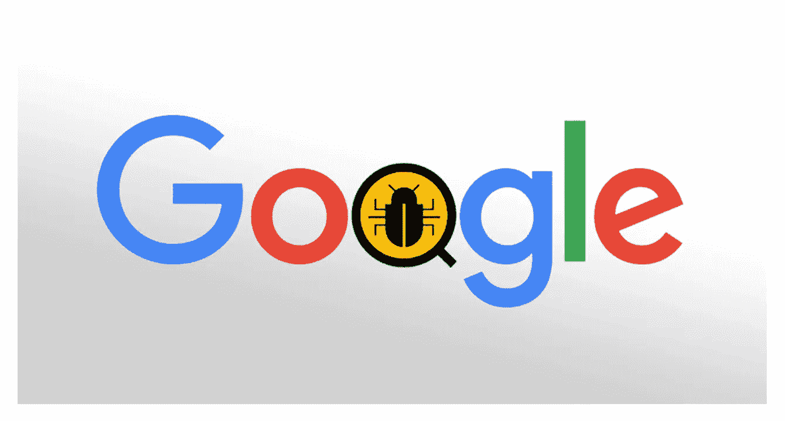

# 有没有无 Bug 软件这种东西？

> 原文：<https://medium.com/hackernoon/is-there-such-a-thing-as-bug-free-software-320cd862af17>

我们努力追求完美，当我们从一开始就没有把事情做对时，我们会感到沮丧。也许我们只需要改变我们的态度，追求卓越而不是完美。这也适用于应用程序。你大概在问自己:为什么软件会有 bug？有可能开发一个 100%无 bug 的软件吗？

你希望你的应用程序运行完美，像时钟一样，但是还是会出现错误。你可能会想:有没有一个没有 bug 的应用程序，我如何才能创建一个呢？答案就在这篇文章中。

我们先来讨论一下什么是软件开发中的缺陷，定义一下软件 bug 的类型。

# 软件缺陷定义

**bug** 是计算机程序或软件系统中的错误、瑕疵、失败或故障，导致应用程序产生不正确或意想不到的结果，并以意想不到的方式运行。

> *SteelKiwi 定义:bug 被发现被举报就是 bug。*

# 错误分类

1.  **危急。**系统的一个核心功能失效或系统完全不工作。
2.  **少校。**缺陷影响基本功能，系统无法正常运行。
3.  **适中**。该缺陷导致系统生成错误、不一致或不完整的结果。
4.  **小调。**缺陷会影响业务，但仅在极少数情况下。
5.  **化妆品。**缺陷仅与应用程序的界面和外观有关。

# bug 出现的原因

现在你知道了存在哪种类型的 bug，你需要知道它们为什么会出现。

*Source: public domain*

# 技术进化

事物会随着时间的推移而变化和发展，技术也不例外。时间不会放过软件，因此会出现 bug。以 iOS 为例。一旦苹果推出新版本的 iOS，比如说 10 号，并对界面进行更改，你就必须为新版本调整你的产品，以便你的应用程序按预期工作。通过这些更新，你消除了错误，并确保用户不会离开你的应用程序。

# 更新的 API

您的软件可能包含用于社交共享或支付集成的 API，这些 API 也会定期更新。这些更新也可能导致错误出现，这些错误需要被删除，以保持您的用户对您的应用程序提供的功能满意。

# 复杂软件

随着时间的推移，软件变得更加复杂。今天，我们可以享受人工智能、虚拟现实和增强现实的体验。这些和其他技术转化为复杂的解决方案。一个简单的可预测的程序可以没有错误。然而，背后有复杂逻辑的软件很可能包含错误，尤其是在添加新功能时。

# 没有软件是完美的

零 bug 开发是一个应该被抛弃的神话。为了保持相关性，你需要保持新鲜感。Twitter、脸书、Gmail、Dropbox 和其他公司不断改进他们的软件，我们可以在 app store 列表的“最新动态”部分看到这一点。随着网络和移动技术的不断变化，他们不断改进以满足最终用户不断变化的期望。

# 执行环境

您可以尽可能多地测试您的软件，但是您无法控制执行环境。鉴于所有不同的计算机和移动配置，最终用户几乎总是会发现错误和问题。因此，您应该提供客户支持和错误报告选项。

# 物理限制

质量保证工程师可以测试一个应用程序，但他们不能预见最终用户可能做的所有事情。每个人都不一样。人们的思维方式不同，因此使用应用的方式也不同。为你的用户提供错误报告选项和给应用评级的能力是很好的，因为你可以随时修复报告的错误并改进你的应用。看看人们在应用商店里对你的应用留下的评论。没有成功的应用程序获得了所有的 5 星评级，没有错误报告或零缺陷软件开发。

# 你应该如何进行软件开发？

当你开始做一件事时，你首先要准备和建立一个计划。你应该用同样的方法来创建一个应用程序。为了避免可能出现的关键问题并保持冷静，以下是你应该如何着手你的第一个或下一个开发项目。

*Source: public domain*

# 期望和目标

期望你的开发人员写出没有错误的代码是不现实的。尽量不要关注无 bug 代码。把你的重点放在给你的早期用户提供一个具有良好功能的产品，可以解决他们的痛苦。

# 清晰的功能规格

错误的出现是因为软件做的和最终用户期望它做的有差距。如果您在开发人员开始编码之前创建详细的技术规范和[项目需求](https://steelkiwi.com/blog/how-make-effective-product-requirements-document/)，就可以轻松解决这个问题。

# 质量高于价格

当你权衡价格时，你必须决定你是想要一般的便宜软件还是 99%的时候都能正常工作的昂贵软件。为了实现无摩擦的用户体验并消除 bug，你需要[雇佣一个熟练的开发团队](https://steelkiwi.com/blog/how-to-find-and-hire-a-python-django-development-company/)。但是为你的应用找到使用最好的编程语言[的优秀开发者需要时间和努力，所以不要着急。你的软件质量将取决于你和](https://steelkiwi.com/blog/why-python-django-are-your-top-choice-for-web-development/)一起工作的[团队。一个熟练的开发团队知道如何减少软件中的错误。](https://steelkiwi.com/blog/top-tips-for-managing-a-remote-software-development-team/)

# 过度测试

[为什么我需要质量保证？](https://steelkiwi.com/blog/is-a-qa-expert-that-necessary-during-development/)你可能会问。当您开始开发时，我们将过程分成冲刺或迭代。每一个新版本都要经过测试，在应用到达早期用户手中之前，质量保证工程师将是第一个试用该应用的人。就像文本要经过编辑和审核一样，你的应用也应该经过检查和测试其主要用户流的过程。有了一个好的 QA 团队，bug 可以在到达实际用户之前被报告和修复。许多技术允许 QA 工程师执行手动或[自动测试](https://steelkiwi.com/blog/main-advantages-automation-testing-your-software/)。开发者也可以使用[单元测试](https://steelkiwi.com/blog/how-write-unit-tests-and-how-they-help-development/)。简而言之，一个好的质量保证工程师知道如何识别软件缺陷。

您应该确保所有主要工作流和核心功能都经过测试。然而，100%的测试覆盖率是不可能的，因为你无法预测最终用户的行为。即使在发布后发现了 bug，你的团队也可能会免费修复一些 bug。开发公司通常会给客户一些时间来测试他们的软件，如果他们在这段时间内发现了错误，公司会免费修复它们。然后，公司会提供有偿的长期支持来修复其他漏洞。

# 著名的臭虫奖励计划的例子

在过去的七年里，主要的技术公司已经发布了 bug 奖励计划来帮助他们实现无 bug 软件。这些公司欢迎黑客提交漏洞报告，并向他们提供现金奖励。任何人都可以在一个平台上捕捉安全漏洞并指出它们，以换取现金奖励。那些没有技术专长来运行自己的赏金项目的公司会将这项重要的安全工作外包给外部公司。

# 苹果

苹果的 bug bounty 计划于 2016 年 9 月首次推出，并欢迎二十多名安全研究人员报告这家科技巨头软件中的漏洞。这个框架已经扩展到包括更多的臭虫赏金猎人。但是没有一个公开的网站，很难收集到关于这个项目的任何细节，包括哪些参与的有道德的黑客获得了奖金。

苹果公司将为这些缺陷支付 25000 美元，这些缺陷可能允许演员从沙盒程序中获取沙盒以外的用户数据。该计划还准备向那些能够提取受苹果安全飞地技术保护的数据的人支付超过 10 万美元。最高奖金为 20 万美元，用于举报影响苹果固件的安全问题。

# 谷歌

几乎所有的内容都在 google.com、youtube.com 和。博客域名属于谷歌的漏洞奖励计划。该计划涵盖影响用户数据机密性和完整性的设计和实施问题。这些弱点包括跨站点脚本漏洞和身份验证缺陷。在允许接管谷歌账户、普通谷歌应用和其他敏感应用的应用中发现远程代码执行漏洞值得最高奖金。这些缺陷包括沙盒转义和命令注入。[2017 年，谷歌支付了 290 万美元的漏洞奖金](https://security.googleblog.com/2018/02/vulnerability-reward-program-2017-year.html)。

*Source: public domain*

# 网飞

网飞在 2013 年首次推出漏洞披露计划，让研究人员报告安全问题。到目前为止，该公司已经收到并纠正了 190 个问题。

2016 年 9 月，网飞凭借其私人昆虫赏金计划进入了昆虫赏金领域。自 2016 年以来，研究人员的数量从 100 人增加到 700 人。在启动私人 bug bounty 计划后，网飞已经收到了 275 份关于网飞服务各种关键 bug 的有效提交文件中的 145 份。由于提交了这些报告，网飞改善了其外部安全态势，并在整个生态系统中进行了系统性的安全改进。

网飞说，到目前为止最高的奖金是 15000 美元，奖励识别一个关键的漏洞。现金奖励的金额取决于每个漏洞对系统性能的影响。

Bug 赏金猎人在软件安全领域扮演着关键角色。他们可以在黑客攻击之前发现一些最严重的漏洞。发现 bug 不仅仅是金钱上的回报——当 bug 赏金猎人发现一个大 bug 时，他们还会在他们的研究社区中提高知名度。

# 没有没有错误的应用程序这种东西

这个世界上没有什么是完美的，包括 app。它们需要在发布前进行严格的测试，并在发布后不断更新，以保持相关性并确保良好的用户体验。即使在一个应用程序发布后，你也无法控制它的执行环境，因为它可以在许多设备上运行。像脸书、英特尔和 GitHub 这样的大公司甚至愿意为重大错误的报告付费。许多组织甚至一些政府机构已经启动了他们自己的漏洞奖励计划(VRP)。

由于技术的不断变化，应用程序的质量保证是一个终生的过程。团结大家的努力，就能做出一个优秀的 app。开发人员、QA 工程师、bug 赏金猎人、用户以及您自己都可以帮助构建一个满足特定需求的好产品。你应该追求卓越，而不是完美，并意识到除非你在建造一架航天飞机，否则你不可能实现无 bug 开发。

如果您正在寻找一个能够克服技术挑战并以卓越为目标的开发团队，[请联系我们](https://steelkiwi.com/contacts/)。我们很高兴与您合作，并投入我们所有的努力以及我们的技术专长来构建一个您的用户会喜欢的应用程序。为了更好地了解我们已经完成的项目，请访问我们的[技术案例研究页面。](https://steelkiwi.com/projects/)