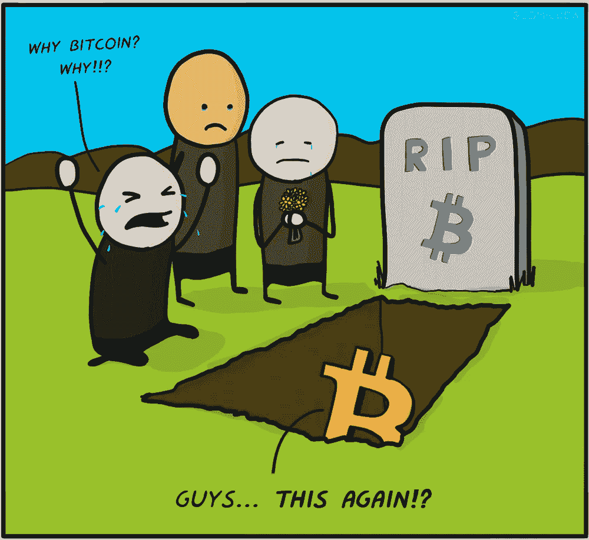

# 比特币真的就此终结了吗？

> 原文：<https://medium.com/hackernoon/is-this-really-the-end-for-bitcoin-3fa7cbee047>

## 新兴技术总是会遭遇成长的烦恼……再加上比特币经历了糟糕得多的情况。

image by comicbew.com

比特币目前的市值为 1150 亿美元，每枚比特币的价值约为 6700 美元。

上一次我们看到类似于这个水平的价格点是在 2 月初，也就是 4 个月前。同月，比特币反弹至 11000 美元以上。

与这一大规模调整相关的因素有很多，可能包括:

*   2017“比特币炒作”投资者离场
*   负面媒体报道
*   政治问题
*   价值增长 2800%后的自然价格调整

像这样的市场变化在加密货币领域并不罕见，因为它仍然是一个新兴的资产类别。

每项新技术都会经历成长的烦恼，互联网就是一个很好的例子。

1995 年，克利夫·斯托尔在《新闻周刊》上撰文预测互联网将会失败，以下是他最著名的批评:

**通过互联网购买书籍和报纸永远不会发生。**

然而，麻省理工学院媒体实验室主任尼古拉斯·尼葛洛庞帝预测，我们很快就会直接在网上购买书籍和报纸。呃，当然。”

**克利福德对在线新闻、课堂、教学和在线治理的看法。**

“任何在线数据库中的真理都不会取代你的日报，任何光盘都不会取代一位称职的教师，任何计算机网络都不会改变政府的工作方式，”

显然，互联网将无法处理网上购物、预订、机票预订和销售。

“我们被承诺可以即时购买商品目录——只需点击鼠标，就能买到物美价廉的商品。我们将通过网络订购机票、预订餐厅和谈判销售合同。商店会变得过时。为什么我当地的商场一个下午的生意比整个互联网一个月的生意还多？”

亚马逊自己否定了他的最后一个预测，事实上，实体销售正在下降，而在线和移动销售逐年增长。

最重要的是，17 年后《新闻周刊》结束了它的印刷出版，现在它是一份在线报纸。很讽刺吧。

克利福德的批评是在万维网发明仅 6 年后、网络成为互联网 12 年后提出的。比特币和区块链技术甚至还不到 10 年。

**新兴技术和资产类别**

关于比特币一直有负面新闻和政治问题，但这是因为世界仍然不知道如何看待比特币和区块链技术:

我们应该不管它吗？

该不该规范？

应该禁止吗？

到目前为止，大多数国家实际上已经接受了比特币和其他加密货币，而少数国家采取了谨慎的态度。

那么，比特币真的已经奄奄一息了吗？

我不这么认为，这甚至不是比特币最糟糕的一年，2011 年和 2013 年比 2018 年残酷得多，你什么都没看到。

一旦比特币价格回升，它通常会飙升至新高。如果我们看看它的历史记录，这个熊市对我来说看起来是一个很好的机会，如果你知道加密领域的任何好产品，这是你的打折季。

我们可以从另一个角度来看待这一点，比特币在 2017 年增长了近 3000%，今年仅下跌了 60%以上，与它的增长相比，这次回调并没有那么糟糕。

**最后的想法**

我不认为比特币会消亡，在我看来，这个市场只是在经历成长的阵痛，这种阵痛将在未来几年内逐渐消失。

事实上，我相信比特币在未来会达到新的高度，这篇文章对比特币为什么会蓬勃发展有一些很好的观点:[为什么比特币价格会超过 25000 美元，甚至达到 6 位数](/@cryptonitecj900/why-bitcoins-price-can-pass-25-000-and-even-reach-6-figures-aed16f6a3c31)

请记住，电话、互联网和铁路在早期都受到质疑，但现在你可以看到人们站在火车站用手机浏览互联网。

最后，我将留给你们最后一个关于互联网的失败的负面预测。

在 1995 年，以太网电缆的发明者罗伯特·梅特卡夫有过这样的预测:

"我预测互联网将很快成为壮观的超新星，并在 1996 年灾难性地崩溃."

这听起来熟悉吗？

**我希望你喜欢这个故事，请随时查看下面有用的资源:**

使用 [**CEX**](https://cex.io/r/0/up106280379/0/) 可以在世界任何地方购买比特币、以太坊、Ripple、比特币现金、比特币黄金、Dash、Zcash 和恒星流明

在欧洲任何地方居住都可以从 [**BitPanda**](https://web.bitpanda.com/user/register/3127933809251797450) 购买比特币、以太坊、IOTA、Komodo、Dash、比特币现金、莱特币。

也可以在 [**推特**](https://twitter.com/CryptoniteTweet) **上关注我。**