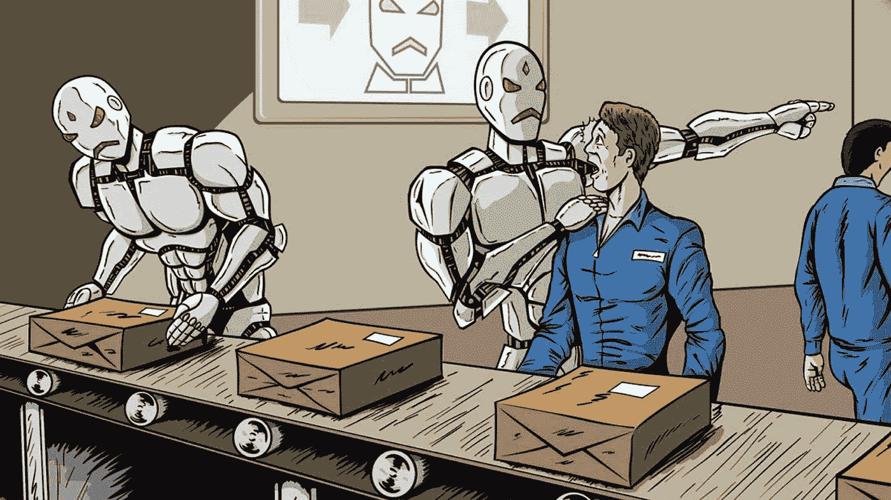

# 这是我们正在创造的世界吗？

> 原文：<https://medium.com/hackernoon/is-this-the-world-we-are-creating-c1c4ffb4ebf4>

## 数字技术对生活和工作的影响

想象一个可能的“不久的将来”去上班的经历:

> “当我喝下一天的第一杯咖啡时，我用智能手机上的应用程序订购了一辆汽车。在指定的时间，一辆无人驾驶汽车停在我的公寓外面，我手表上的推送通知提醒我它已经到达。车门由人脸识别传感器打开。坐下后，我用语音识别系统确认目的地，汽车就自动出发了。汽车采用车载导航系统与城市智能交通矩阵协调确定的最有效路线。软件代码允许汽车与其他车辆进行通信、交互和交易，以确保快速平稳的行程。提前预测到达时间，体验既安全又愉快。在没有其他事情可做的情况下，我唯一的任务就是坐下来，做一些重要的工作，同时听一段关于超级智能人工智能未来的播客。我来到办公室，精神焕发，准备迎接一天的挑战。”

我常常希望我们生活在这样一个世界里。在这个世界里，数字技术兑现了让我们的生活更加舒适和便捷的承诺。在这个世界里，技术为我们提供了更具生产力和创造力的空间。

但是现代生活的现实是非常不同的。

以通勤为例。我经常在早上遇到交通堵塞。我的挫败感在被浪费的时间里慢慢积累。

结果呢？

我带着糟糕的心情去上班，收件箱里塞满了急需处理的任务。

# 数字技术正在控制我们的生活

> 对我们许多人来说，技术并没有为日常生活的挑战提供解决方案。

相反，它正成为问题的一个重要部分。我们对技术的体验增加了我们的压力和疏离感。

一个简单的例子是电子邮件。像大多数人一样，我的工作日的特点是需要处理源源不断的电子邮件。至少，它们需要被阅读。许多需要某种行动。而且这种工作通常是没有产出的，枯燥的。通常，我需要遵守主导工作场所和现代生活的常规程序或流程。

## 数字技术给已经高度“程序化”和“标准化”的工作又增加了一层。

数字技术带来了更多的工作，更多的焦虑，更少的自由和个人表达的机会。当然，我们不应该让技术以这种方式控制我们的生活，但“逃离”并不总是容易的。

例如，我可以“掌控”自己的生活，学会如何“脱离”。

有很多故事讲述了人们早早醒来，赶在信息流和请求之前开始一天的工作。

真正的“夜魔侠”甚至更进一步，试图切断自己与电子邮件和社交媒体的联系。

人们经常认为这些人最有可能让他们的生活重新开始*(想想正常的对话和真正与人见面吧！)*，而不是挂在智能手机或者其他通讯设备上。

然而，这说起来容易做起来难。

我知道有人尝试过，他们的经验表明，并不是所有和你一起工作的人都会理解或欣赏这样的举措。毕竟，工作不会凭空消失。有人需要处理它，否则它只会累积，造成进一步的问题。

## **但是新的数字技术有一个更严重的“问题”。**

大数据、机器学习和人工智能的指数级增长意味着技术正变得越来越复杂。组织越来越多地使用这些数据和数据分析来管理和控制员工。新技术监控员工是为了让他们工作更有效率，从而提高生产力。

这方面的一个极端例子是亚马逊的腕带，它可以跟踪员工的手部动作。

 [## 如果工人偷懒，腕带会知道。(而且亚马逊有它的专利。)

### 但是专利的公开触及了关于隐私和安全的全球争论的核心。亚马逊已经有了…

www.nytimes.com](https://www.nytimes.com/2018/02/01/technology/amazon-wristband-tracking-privacy.html) 

但是，在更小的范围内，我们所有人都有一些被数据驱动技术衡量、监控和判断的经历。技术驱动的工作场所员工监控现已成为标准做法。人们的期望(需求)是，这种监督将促使我们做出必要的调整，以改善我们的表现。

这些数据驱动的技术远远超出了传统的时间管理和摄像系统，特别是当数据分析和人工智能被用来决定谁得到奖励、晋升或解雇时。

在现代工作场所，单方面将我们自己从网格中“断开”并不是一个可行的选择。至少，如果我们想继续工作的话。我们被锁定在一个不再提供断开选择的系统中。

# **但具有讽刺意味的是:数字技术提供了一个解决方案**

尽管如此，我仍然对数字未来保持乐观，并相信新技术可以成为解决方案的一部分。他们可以让我们重新掌控自己的生活，并为更美好的未来做出贡献。

以自动化为例。智能技术可以通过自动化组织多年来创建的许多常规流程和程序，使我们更具创造力。

如上所述，自动化汽车有可能消除日常通勤的焦虑和“损失的时间”。

> 数字技术可以解放我们，让我们从事“高价值”和更具创造性的活动。

但是，为了实现这个更美好的世界，我们必须变得更加知情和更加警惕。

我们必须严肃对待隐私和数据滥用问题。更一般地说，我们必须更加明智地对待我们与数字技术的关系。我们需要掌控技术及其在我们共同未来中的位置。

正如我在之前的几篇文章中提到的，这需要从非技术人员更加熟悉新的数字技术开始。太多的人是技术的被动消费者，而没有真正理解它。

我们必须更聪明、更努力地工作，确保更多的人了解新技术有创造新工作的潜力，同时增加我们的自由和创造力。

我们必须了解这些技术如何有潜力改变当前的社会和经济结构。在这样做的时候，我们还需要认识到，我们不能再简单地依赖传统的社会、经济和政治模式。

> 但同样，这需要从更好地理解数字技术开始。

只有到那时，我们才能创造一个在安全和健康的环境中提供更大自由的世界，在这个环境中，真正的创造力得到促进和奖励。在这个世界里，数字技术提供了自由而非控制的基础设施。

*感谢您的阅读！请点击*👏*(想点多少次就点多少次)，或者留言评论。*

*每周都有新的故事。因此，如果你关注我，你不会错过我关于数字时代如何改变我们生活和工作方式的最新见解。*