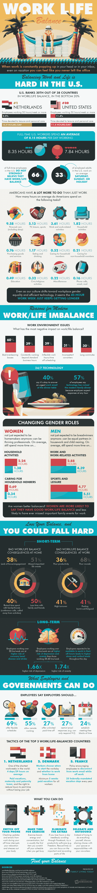

# 工作/生活平衡可能吗？

> 原文：<https://medium.com/hackernoon/is-work-life-balance-possible-b24e67cc951b>

科技为人类做了很多伟大的事情。它让我们更聪明地工作，而不是更努力。它让我们在生活中更加灵活。它娱乐我们，让我们保持联系。但是，即使是好东西也有不好的一面，科技最大的一个不好的一面就是模糊了工作生活和家庭生活之间的界限。以前是你下班回家陪家人。现在你下班了，你的老板仍然可以给你发邮件，甚至当你在餐桌上的时候，并期待着回复。这导致了工作/生活平衡的侵蚀，而美国是这种情况最严重的地方之一。

在工作/生活平衡方面，美国排在世界第 30 位——倒数 20%。将近 12%的美国工人每周工作超过 50 个小时，相比之下，荷兰的工人每周工作超过 50 个小时，荷兰在工作/生活平衡方面排名第一。每周 40 小时的工作时间正在慢慢增加，后果可能会很严重。

工作/生活平衡不佳会导致工作和家庭中的问题，如果不加以处理，会导致焦虑和抑郁的问题。从这张信息图中了解更多关于恢复工作/生活平衡的信息！

