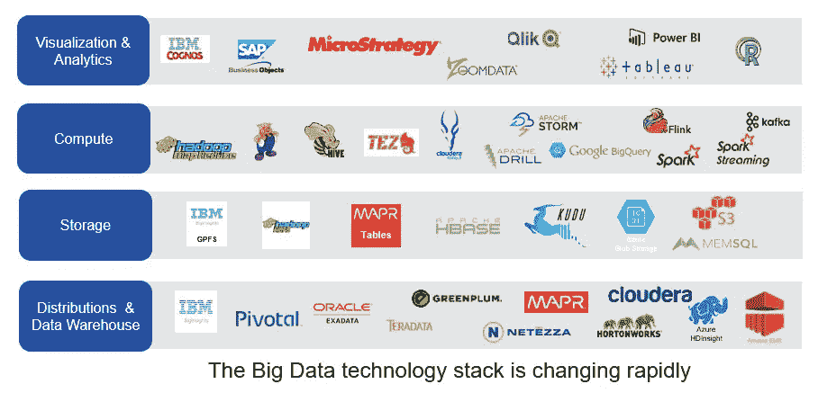
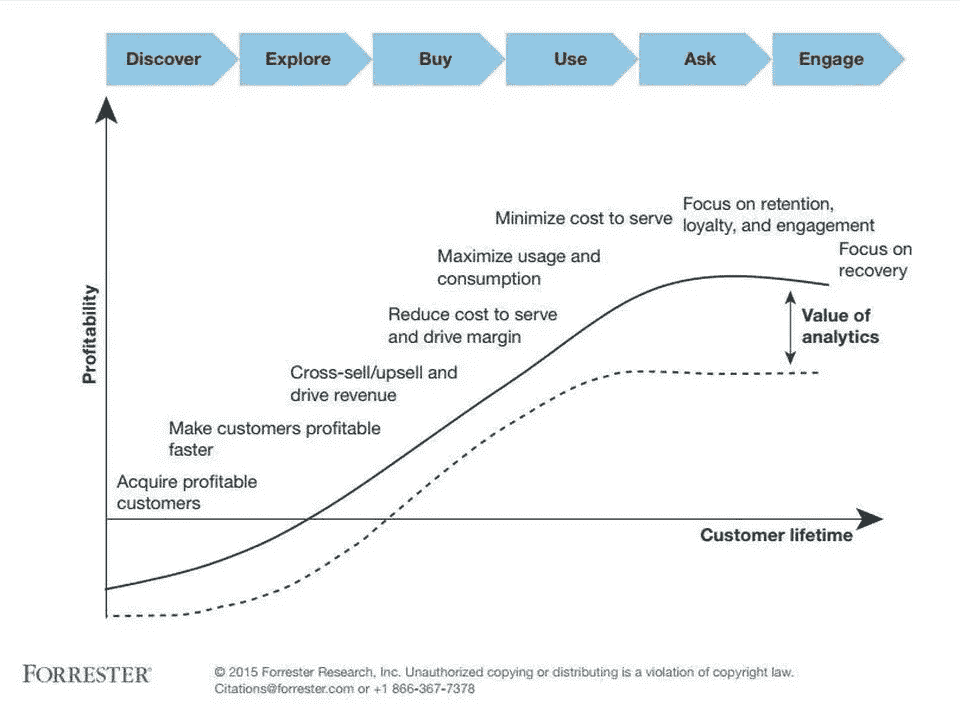

# 您的企业在营销中利用大数据了吗？

> 原文：<https://medium.com/hackernoon/is-your-business-utilizing-big-data-in-marketing-5277af9ca6d6>

谷歌知道你在搜索什么，甚至知道你对什么感兴趣。
知道你分享什么，你和谁是朋友，你去哪里玩，你在哪里度假，你在哪个城市扎根，在哪个城市学习，住在哪里。

亚马逊知道你买什么，你送什么！！

而这一切都是他们免费帮你做的！—基本上，当你不用支付他们一分钱，每个平台都是免费的，那么“你”就是产品！

你用什么来支付这些公司？—对，数据！！

今天的营销人员拥有关于你的海量数据——你要么是消费者，要么是潜在客户。然而，这些通过社交媒体和各种平台流入的数据是非结构化的。最近的一项调查显示，世界上 80%的数据是非结构化的。随着大量非结构化数据以惊人的速度涌入，我们良好的旧关系数据库很难分析它们，并在瞬间给出我们所要求的解决方案。

在这种情况下，是谁挽救了局面？

当然是大数据！！

# 那么什么是大数据呢？

名字就是游戏！！大数据是数量极其庞大的数据，可以对其进行分析、切片和切块，以揭示数据趋势、模式，甚至预测未来的增长和趋势。

它不仅数量巨大，而且是现代和未来营销的基础，因为它使企业能够利用它来分析人类行为和互动。

# 你是如何存储大数据的？

大数据是指超过万亿字节空间的数据，因此使用专门的系统是有意义的。Hadoop 是一个受欢迎的工具，它允许您存储和保存大数据，这些数据以后可以用于查询。NoSQl 是另一个流行的选项。Hive 是一种流行的数据管理 SQL 查询访问大数据的方式。Presto 是脸书开发的另一个处理大数据的查询引擎。

The Big Data stack , Source: Informatica blog

大数据在 21 世纪初声名鹊起，此后越来越多的企业认识到它是帮助员工高效工作的工具。在大数据的帮助下，结合[机器](https://en.wikipedia.org/wiki/Machine_intelligence)学习和深度计算的概念，组织能够预测潜在的问题，理解交互并提出解决方案和计划。

# 大数据的重要性:

大数据实际上与您拥有的数据量无关，而是与您得出的分析结果有关:

它可以帮助您获得以下方面的解决方案:

*   最小化成本
*   根除失败
*   分析客户购买习惯
*   减少时间
*   简化决策过程等等

分享 Datameer 完成的[研究中的一些营销大数据使用案例:](https://blogs.adobe.com/digitalmarketing/wp-content/uploads/2015/10/laxalt-fig1.jpg)

*   客户分析(48%)，
*   运营分析(21%)，
*   欺诈和合规(12%)
*   新产品和服务创新(10%) &
*   企业数据仓库优化(10%)

# 作为营销人员，您如何从大数据中获益:

Research showing how marketers can harness Big Data to form more meaningful relationships with customers, Source: Forrester

研究显示营销人员如何利用大数据与客户建立更有意义的关系，来源:Forrester

**1。从其他平台提取外部数据进行决策**

广告信息和重新定位是大数据的巨大优势。你会争论它的基本像素，但不，还有更多！！当你进入博客或 etsy 等网站时，这些像素可以在数百万条记录中识别出你最后看的鞋子。

在营销人员希望更快、更好、更快地交付一切的时代，大数据可确保您拥有这一优势。

**2。回访客服**

客户服务已被读取大数据的新系统取代，这些数据用于解释和分析客户响应，并得出响应和报告。

**3。风险识别**

大数据可以识别组织或产品在活动中面临的欺诈和风险。

**4。提高存储数据的质量**

大数据让您可以分析哪些数据是相关的，哪些是不相关的。它可以帮助你删除将来可能不需要的垃圾数据，或者那些不经常出现且不太冗余的数据。

**5。激光锐利瞄准:**

喷雾和祈祷营销的时代已经过去了。如今，顾客根据他们的行为、喜好和兴趣成为目标。即营销商已经开始向他们的客户提供他们的产品和服务的个性化版本。

大数据让企业能够发现浏览器活动、网络活动、搜索数据、跟踪社交媒体活动和搜索、人口统计位置等等，从而根据特定客户的喜好有效地锁定他们并开展活动。这完全可以改善用户体验，提高客户满意度。

**结论:**

随着 100 万用户数据库的增长，了解用户想要或渴望什么是关键。想象一下，你知道像“明年夏天的流行色将是蓝色”或“阿拉斯加的男人疯狂喜欢十一月”这样的见解。作为一名营销人员，如果你的目标受众是这样的人，你可以围绕这样的见解计划大量的活动。

大数据将会一直存在。

*与同事迪皮卡合作撰写，原载于 2018 年 3 月 19 日*[*blog . alore . io*](https://blog.alore.io/is-your-business-utilizing-big-data-in-marketing/)*。*