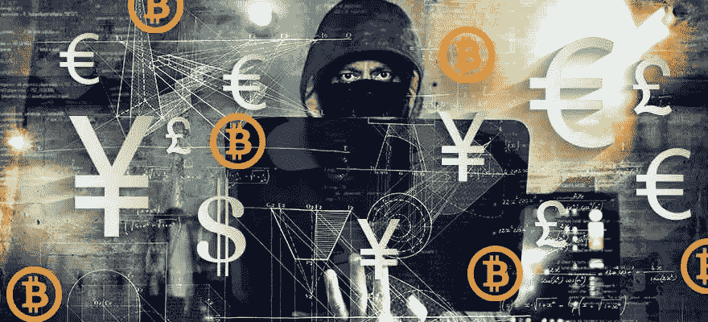
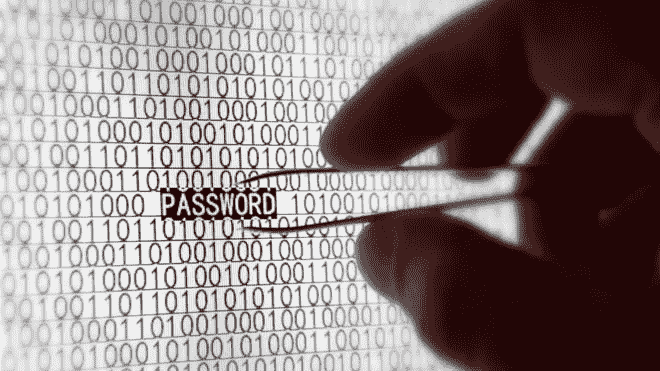
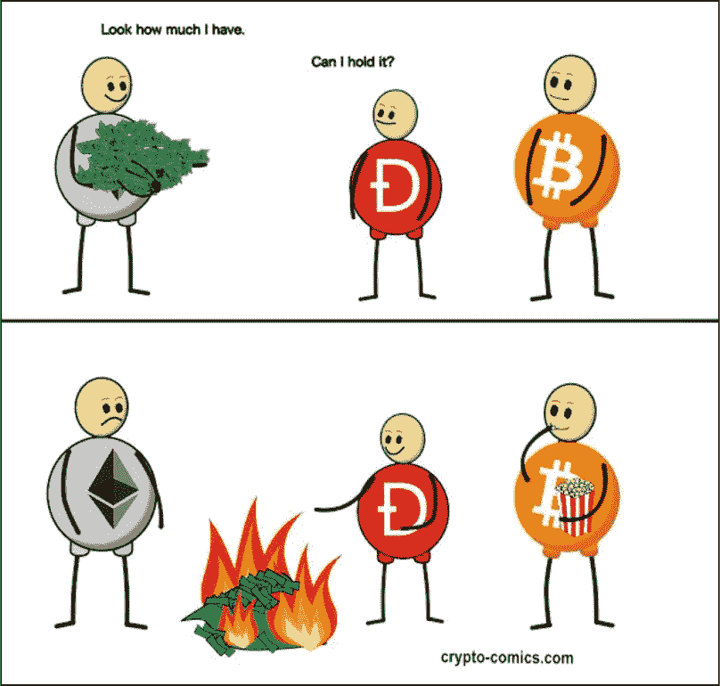
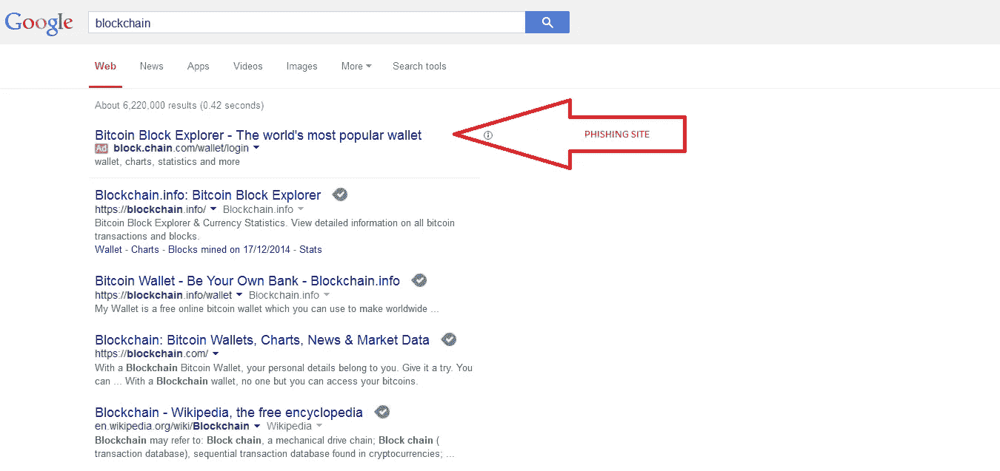
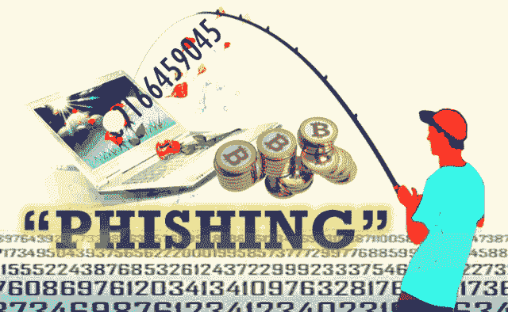

# 您的 Crypo 是否安全，不会受到黑客、网络钓鱼和击键记录的攻击？

> 原文：<https://medium.com/hackernoon/is-your-crypo-secure-from-hackers-phising-and-keystroke-logging-4f5470485aca>

## 遵循这 16 条规则，将丢失加密货币的风险降至最低

你有时会在交易后离开你的交易账户吗？有没有可能猜出或找出链接到您的交易或比特币基地帐户的电子邮件的恢复信息？你有没有搜索过“币安”，然后点击链接，而不是直接在浏览器中输入网址？

如果你对以上任何一个问题(或者其他一些常见错误)的回答是肯定的，那么你可能会让自己面临不必要的风险。虽然实施以下所有建议似乎有些过头，但当涉及到像[加密货币](https://hackernoon.com/tagged/cryptocurrency)这样容易被盗的资产时，谨慎的做法是采取尽可能多的预防措施。

虽然目前的市场已经看到投资组合在看似永无止境的熊市运动中价值缩水，但我更担心的是我的投资组合中的恶意软件可能会损失一大块，而不是市场崩溃。

对主要加密货币交易所的黑客攻击是一个相当频繁的重复事件。从 2014 年 [Mt. Gox 失窃](https://blockgeeks.com/guides/cryptocurrency-hacks/)价值 4.75 亿美元的[比特币](https://hackernoon.com/tagged/bitcoin)到今年 6 月[价值 5 亿美元的 NEM 被盗](http://fortune.com/2018/01/31/coincheck-hack-how/)。

Etherium Classic was the [result of the DAO hack in 2016](https://blockgeeks.com/guides/cryptocurrency-hacks/)

虽然如果交易所本身受到损害，你也无能为力，但你可以采取一些预防措施来避免由于你成为故障的中心点而导致资金损失。

个人未能采取必要预防措施的众多例子之一是 Blockchain.info 用户被盗的 5000 万美元，block chain . info 是一家受欢迎的数字货币钱包提供商。盗窃发生在很长一段时间内，使用网络钓鱼添加。骗子会购买谷歌 Adwords 的加密货币相关术语，淹没真正的 Blockchain.info 网站和 Blockclain.info 等相似的链接，然后在用户在相同的网站上输入私钥后窃取私钥。

虽然下面的许多建议似乎显而易见，但我敢打赌大多数投资者至少会触犯其中一条(我当然有！):

## 存储在交易所的加密货币:

*   为每个交易账户设立一个专用的电子邮件地址。
*   用于交换的电子邮件帐户应该启用 2FA，并且没有帐户恢复。
*   使用唯一且难以猜测的电子邮件用户名。
*   使用所有可用的密码字符。
*   不要使用你在其他地方也使用的密码组合。
*   在 exchange 上使用私人浏览器，并删除任何历史记录/cookie。
*   请勿在您的电脑上保存交易所的自动填充帐户详细信息(用户名和密码)。
*   Exchange 应启用 2FA。
*   将 2FA 恢复密钥保存在安全的位置。
*   只保留你计划在交易所积极交易的资金。
*   定期运行杀毒软件。
*   千万不要点击广告。
*   请务必在浏览器中直接键入 exchange URL。

## 交易所外存储的加密货币:

*   使用直接从制造商处购买的冷存储硬件钱包或使用从未连接到互联网的设备来生成钱包和私钥。
*   将硬件钱包的私钥保存在安全的地方。
*   切勿公开讨论/披露您的加密货币资产的价值。

喜欢这篇文章吗？在 Twitter 上添加我([https://twitter.com/BareShylls](https://twitter.com/BareShylls))或者在 Medium 上关注我( [Bare Shylls](https://medium.com/u/1e7aa51bf607?source=post_page-----4f5470485aca--------------------------------) )。

您是否有以上列表中未包含的任何安全建议？发现错误？不同意我写的东西？写在评论里，我会回复你(或者把它加到列表里)。

如果你认为这篇文章可以帮助你或其他人保护他们的加密货币的安全，那么请广泛分享这篇文章。

别忘了按住那个按钮。

