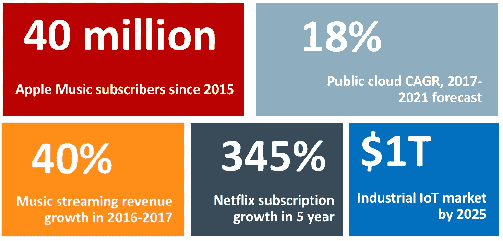

# 你的创业想法为现在的经济做好准备了吗？

> 原文：<https://medium.com/hackernoon/is-your-startup-idea-ready-for-the-now-economy-d5dcbaa4c154>

世界正在走向数字化:互联设备层出不穷，每天都有大量数据可供使用，消费者关系通常通过社交媒体渠道形成和管理。这些和其他趋势使商业模式在世界各地不断变化，美国和中国处于这一趋势的前沿。

成功的创始人和开发者明白，市场颠覆将继续加速，创新是实现竞争差异化的唯一途径。

> 人、设备、应用程序和“事物”根据需求、环境和偏好进行实时通信、响应和适应。

当你在验证你的想法或着手你的[创业](https://hackernoon.com/tagged/startup)时，考虑以下趋势并分析你的工作是否适合未来的环境:

*   **联网设备**将无处不在，不仅仅是在房屋、车辆和工厂里。
*   **用户体验**日趋统一:“发现- >购买- >使用- >获得关怀”循环成为跨应用和设备的单点接触。
*   计算的未来在边缘:数据处理将发生在与现实世界相交的设备上，而不是在云中。[技术](https://hackernoon.com/tagged/technology)进步和业务需求[推动了这一趋势](https://www.ft.com/content/1dba534a-5857-11e8-bdb7-f6677d2e1ce8)。
*   服务差异化将在**内容**，而不是网络。电信公司看到了这一点，并朝着这个方向大步前进。

人与人、互联设备和软件之间的交互日益影响着我们生活的方方面面，包括交通、工作、社会关系、商业和安全。创始人必须认识到订阅经济的趋势，才能创新，而不是陷入不断变化的商业模式。