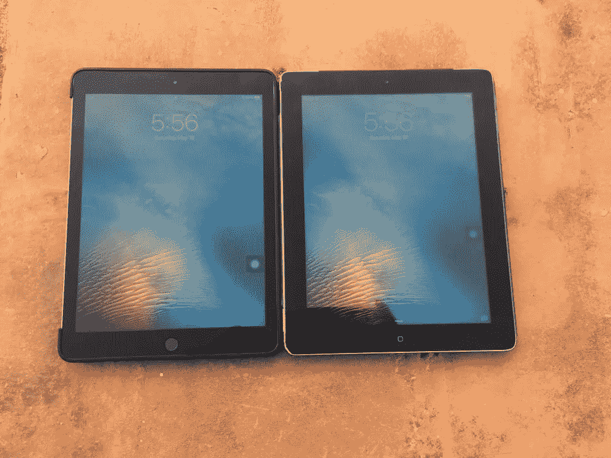

# 升级还是不升级；信息时代的困境

> 原文：<https://medium.com/hackernoon/isad-an-upgrade-or-hang-on-dilemma-5be394651f20>

Sitting on the fence for two years till Apple gave me a gentle push

2016 年 9 月 13 日，也就是 iOS 10 发布的那一天，我第一次觉得有必要升级我的 iPad。那时，我终于接受了苹果不再为我的 iPad 3 升级操作系统的事实。然而，对我来说，缺少更新本身似乎不是升级到昂贵的新 iPad 的足够有力的理由。

首先，我和我的 iPad 已经在一起六年了。虽然有点慢，但它仍然可以使用，而且我不喜欢和它分手。其次，制造商总是敦促我们升级，但我们需要推迟这样做，以避免增加世界上的电子垃圾。第三，iPad 在印度并不便宜，苹果产品在印度可能贵得令人望而却步。(iPhone X 的基本款在印度或₹89000).上市，售价 1313 美元所以我决定留着我的 iPad，直到我在最新款的 iPad 上买了个好价钱。

但这被证明是一个永无止境的循环。我越是等待价格下跌，就越是接近新款 iPad 的发布，我就越想为新款 iPad 多等一会儿。但是新型号总是要多花一点钱，这让我又回到了起点。

因此，两年后，又一次 iOS 升级，我仍然拿着 iPad 3 观望，等待合适的时机升级。

## 我不想要的设备

我第一次接触 iPad 是在 2011 年，一个朋友得到了第一代 iPad。在大屏幕上看应用程序很有趣。但是我不知道它如何融入我的生活。所以我懒得去弄一个。一年后，准确地说是 2012 年 3 月，苹果推出了搭载 A5X 芯片和当时全新的 iOS 5.1 的第三代 iPad。虽然理论上它是 iPad 3，但苹果只是称它为“新 iPad”一个月后看到那台 iPad，在某商场 iPad 2 旁边展示，对比之下它的画面绝对弹出(2048 x 1536 @ 261 PPI vs 1024 x768 @ 132 PPI)。

## 新 iPad 死了；新 iPad 万岁

我立刻就被它吸引住了，并拿起了它，营销人员恰当地称之为“冲动购买”。同年 11 月，苹果推出第 4 代 iPad。它配备了两倍速度的处理器和新的 lightning 连接器。仅仅 7 个月，我刚推出的‘新 iPad’就变成了老款 iPad。

六年后，我仍然感到痛苦。市场上有一条不成文的规则，即如果你支付溢价购买一款新推出的产品，那么你应该被允许在一定时间内享受拥有该产品最新版本的状态，通常是一年左右。幸运的是，苹果似乎终于明白了这一点。苹果公司从未有过像 iPad 3 这样生命周期如此短暂的产品。

## 我的 iPad 找到了它的位置

无论如何，在我买了 iPad 3 后，我意识到我想知道我是否真的需要它是对的。我的 21 英寸大屏幕 iMac 非常适合工作，而我当时的 iPhone 4 是我的便携式设备。没有地方放 iPad。此外，在 iPad 屏幕上打字不方便超过几分钟。我试过用蓝牙键盘，小屏幕和低高度还是让它很痛苦，不夸张。

然而，我的 iPad 慢慢地融入了我的生活。当我有工作时，它是完美的，但由于某种原因被迫离开我的 Mac。它更大的屏幕让我打字比我的 iPhone 4 的 3.5 英寸屏幕更快更容易。它也更适合阅读和上网。在我习惯了屏幕之后，我也慢慢开始在家里使用我的 iPad。就像在早餐时，它开始补充日报，部分是因为它更新了更多突发新闻，部分是因为我可以关注更多我感兴趣的故事的链接。

不过，我确实犯了一个错误。我选择了有蜂窝连接的 iPad。这被证明是多余的，因为印度的蜂窝网络允许热点定位或共享你的手机数据连接。所以我从来没有在我的 iPad 里用过 SIM 卡。

## 6 岁，准备退休

我已经用了我的 iPad 六年了，它正慢慢地走向淘汰。苹果预计人们最多会使用其设备 2-3 年，然后随着技术进步使新软件难以在旧硬件上运行而更换它们。

我的 iPad 3 是 32 位设备，很多 64 位的 iOS 和应用程序功能都无法在上面运行。事实上，我听说苹果正在停止所有 32 位应用程序(或者可能已经停止了)。所以我 iPad 3 上的应用程序经常过时，有时甚至不存在。此外，新的操作系统是为新的硬件设计的，许多功能在旧的硬件上不能很好地工作或者根本不能工作。

就像 2015 年 9 月 iOS 9 推出的时候，我高高兴兴的装在 iPad 上。但令我震惊的是，新的操作系统让我的 iPad 反应迟钝。就像如果我输入一个句子，在输入出现在屏幕上之前会有明显的延迟。或者，当我重启 iPad 时，屏幕会显示出来，但过了一分钟左右，它才会对我的触摸做出反应。

我的解决方案是删除 iPad，全新安装 iOS 9，只安装基本应用。Safari 和 Mail 内置在应用中，我经常使用。我还下载了写作页面、几个新闻应用、Skype、YouTube、VLC 和其他一些应用，包括媒体应用。只有这些应用，iPad 似乎运行得更流畅，尽管反应仍然滞后。

## 苹果决定我需要一个温柔的推动

让我的 iPad 问题如此明显的是，我拥有一部运行 iOS 11 的 iPhone 6S Plus。我的 iOS 9 版 iPad 不仅速度慢，还错过了很多 iOS 11 的好东西。比如实时照片、“空投”、“移交”、新的通知和控制中心、夜间阅读模式(苹果已经从 App Store 中移除了 Flux，尽管它可以在旧款苹果设备上实现夜间阅读，这不是一件好事)。

但真正让我决定是时候升级了的是苹果的这组制作精良的[视频。(注意，显示的一些应用是付费应用)。这个系列的其他视频的链接可以在同一个页面找到。](https://youtu.be/JAvwGmL_IC8)

这让我意识到不升级会错过什么，也让我意识到 iPad 6 可以做我的手机做不到的事情。所以第六代 iPad 推出的时候，我肯定是感兴趣的。

## 我的 iPad 电池快没电了吗？

That’s straight from the horse’s [mouth](https://www.apple.com/in/batteries/service-and-recycling/)

还有一个因素促使我决定购买新的 iPad。从上面的[来看，苹果似乎建议更换只能充到原始容量 80%的电池。之后，我认为电池性能会下降，不太容易预测。](https://www.apple.com/in/batteries/service-and-recycling/)

我使用了一个名为[电池寿命](https://itunes.apple.com/us/app/battery-life-check-devices-runtimes/id1080930585?mt=8)(底部有广告)的免费应用程序来检查我的 iPad 电池的健康状况。我安装这个应用程序的时候，正在写一篇关于给手机电池充电的正确方法的文章。

20% wear level at 492 charge cycles — my battery performance may start degrading fast

看起来我的 iPad 的电池健康状况已经下降到 80%磨损的危险水平，尽管它还没有达到 500 次循环。我认为 iPad 的年龄(6 年)增加了它的磨损程度。基本上，从这一点开始，我在 iPad 上的任何额外时间都是额外的，苹果公司不保证。是啊，是时候继续前进了。

## 业余爱好者对工作狂

我们都想拥有法拉利，但最终都买不到超出预算的车。我的 iPad 也没有什么不同。我想要 12 英寸的 iPad Pro，但是它对我的需求来说是不是太大了？我不是艺术家，我的 iPad 将主要用于网上冲浪、浏览媒体和写点东西。事实上，我通常在我的 Mac 电脑上做大部分与工作相关的事情，包括这篇文章。所以做一点研究似乎是有必要的。

上面的评论对我来说很有意义。他是一名艺术家，拥有一台 iPad Pro，他把它用作工作马。他在 iPad Pro 上的工作收入是他在这上面花费的几倍，大约是 1400 美元。他认为 iPad 6 是苹果有史以来最物有所值的设备，对于那些可能还没有多少收入的学生艺术家来说绰绰有余。由于我对 iPad 的使用将比一个学生艺术家更少，这个论点肯定适用于我。所以我最终决定买 iPad 6，并决定暂缓苹果铅笔。是的，我知道它的视网膜显示屏和我六年前的 iPad 3 一样。剩下的唯一事情就是寻找合适的时机购买它。这基本上是大型在线零售商进行销售的时候。

## 价格惊喜

价格在印度是一个问题，因为苹果产品在这里通常贵得令人望而却步。那是因为印度政府对在印度以外制造的产品征收重税。这是为了鼓励那些外国公司在当地投资。例如，第六代 iPad 在美国苹果商店售价 329 美元(₹22,375)，但在亚马逊印度(印度没有苹果商店)售价 412 美元(₹28,000)。

4 月中旬，亚马逊在打折，我当时设法以 360 美元(₹24,499)的价格买到了 iPad。我信用卡上的一个优惠把₹1500 从₹25,999.的售价上打了下来但它仍然比美国贵 30 美元(₹2,040)。

An offer on my credit card knocked a further ₹1500 off but it’s stil $30 more than the US price

如果我再等几个月，我可能会得到更好的交易，但就像我说的，这是一个价格与最新技术不断下降的永无止境的循环。所以我就去订了 iPad 6。我记得六年前我花了 397 美元(₹27000)买了 iPad 3，但这并不奇怪，因为随着技术的进步，价格会下降。

## 印度可能拥有世界上最便宜的 iPhone

印度的价格还有另一个角度。当苹果最终承认印度是一个价格敏感的市场时，他们决定通过在当地组装 iPhone SE 来进行测试。这绕过了税收问题，差别是惊人的。印度制造的 iPhone SE 在印度(₹19000)售价 279 美元，而在美国(₹23,735)售价 349 美元。那要便宜得多。

遗憾的是，苹果尚未能为其他 iPhone 型号或 iPads 做到这一点。此外，印度市场对 4 英寸屏幕手机的需求非常有限，5.5 英寸屏幕是 iPhone SE 价格范围内的标准。我的妻子是选择这款手机的人之一，可能是因为她从 3.5 英寸的 iPhone 4 升级而来。如果你对屏幕尺寸没问题，我可以确认 iPhone SE 是一个真正的便宜货。它的内部硬件与我的 iPhone 6S 系列相同，运行最新的 iOS 11 操作系统的速度和流畅程度与我昂贵得多的 iPhone 6S Plus 相当。事实上，如果你像我在大型网上零售商促销时那样计划购买，你可以在₹17000(249 美元)买到它。

That‘s $279, or $70 less than the US Apple Store price of $349 — you can get it for even less.

## 老是金

我几乎认同苹果手机的 3 年产品更换周期。但对于我的 iPad 来说，很难接受这种观点，因为我一天只用不到一个小时。或者我的 iMac，我觉得它应该用得更久，尤其是如果它主要用于基本的写作和上网，而不是用于严肃的照片或视频编辑。所以我升级了我的手机，但继续在我的其他设备上挑战极限。我的 iMac 是 2011 年的型号，仍然可以在 Mac OS High Sierra 上流畅运行，尽管 Airdrop 等许多新功能无法在上面运行。

令人惊讶的是，我确实有一台功能正常的 2008 年 MacBook Pro，一台 17 英寸的恐龙，尽管它运行的是更老的操作系统(我认为是 Mavericks 或 Mac OS 10.9)。我换过一次电池。但当替换电池“膨胀”时，我就扔掉了它，有效地将 MacBook 转换成了笔记本电脑。对于基本的打字和上网来说，它的功能非常完美。我经常把它留在我妈妈那里。这样，每当我去拜访时，我就有了一台可以使用的大屏幕机器。这台机器还有一些我的新款 iMac 没有的端口，这让我可以用它从我的旧 DV 磁带上抓取视频。简而言之，老马仍在努力。

The MacBook Pro battery that bulged (my iPad is acting as a table for it!)

## 活得快，死得早

就我的手机而言，它每天的工作时间比我的 iPad 长得多。因此，我似乎无法从我的大型设备中提取尽可能多的生命。我拿起 iPad 3 的时候，用的是 2010 年左右买的 iPhone 4。到 2013 年，它的电池开始快速耗尽。我换了电池，但手机的耳机没电了，如果我在商场这样的嘈杂环境中，我几乎听不到电话。所以当我有机会低价升级到翻新的 iPhone 5 时，我就这么做了。那部手机用了两年，直到一天早上，它的显示屏拒绝开机。

不爽苹果，[换了安卓](/indian-ink/apple-in-androidland-c66e8c827e07)。然而，我知道我喜欢苹果的所有东西，几个月后，我妻子送了我一部 iPhone 6S Plus。那时我已经厌倦了 Android，很高兴地换回了它。那是 2015 年 12 月。我的 iPhone 现在已经是第三年了，还没有过时。它确实缺少像后置双摄像头这样的功能，当然，还有 Face ID。但我计划在年底前买一块新电池(通过利用苹果公司的打折电池更换计划，这是对手机节流灾难的回应)，应该可以从我的手机中再提取一年。如果我能做到这一点，我将能够直接进入第二代 Face ID 手机。我确实听到了更大的 6 英寸 iPhone 的传言，我可能会去。看看这会不会减少我对 iPad 的使用，这将会很有趣。

## 转世我的 iPad

我不喜欢放弃我的 iPad 的想法，因为尽管它很老了，但它仍然是一个非常令人印象深刻的设备。然而，它的电池状况意味着它随时可能会没电，所以我必须实际一点。在购买 iPad 6 的时候，亚马逊确实为我的 iPad 3 提供了退换货服务。他们愿意给我₹1805(27 美元)让我接手。如果我把它放在 Quikr 或 Olx(相当于印度的 ebay)上，也许我会得到更多。

随便啦！它仍然是微不足道的，我认为我的 iPad 3 更有价值。我的意思是，如果我的 iPad 3 是一个没有功能的电子垃圾，从环境污染的角度来看，这是有道理的。

但这是一款功能正常的 iPad，可以用来上网、浏览媒体、收发电子邮件或听音乐。它可能很慢，但它相当于便携式电脑和视频/音乐播放器的结合。此外，它配有一整天的电池和触摸屏，这使它方便易用(除了缺少 USB 访问 pendrives)。如果你对它的速度没有太多的期望，这个东西可以轻松运行几年。

## 后 PC 世界已经到来

在办公室里，个人电脑可能仍然很活跃，但在家里，它们就要过时了。我妈妈不再用她的旧电脑了，因为她的智能手机满足了她所有的需求。所以当它坏掉的时候，它看起来不值得修理，我就把它连同所有的配件和电线一起扔掉了。令人惊讶的是，我家里的旧桌子看起来很干净，上面只有一台旧的 Macbook。

我妻子最近也把她的笔记本电脑送人了。她把它借给了她的一个朋友，这个朋友似乎更需要它。截至目前，我妻子的手机满足了她所有的电脑和互联网需求。此外，她仍然可以使用笔记本电脑，因为她的办公室坚持她携带一台。问题是在坐在屏幕前一整天后，她不喜欢在家做同样的事情。她也有点技术恐惧症，这让她成为我回收 iPad 的完美目标。

她自己也意识到了这一点，并要求我把我的旧 iPad 递给她。她觉得这将满足她在家的所有需求，基本上就是在更大的屏幕上看几个视频，听音乐，检查奇怪的电子邮件。虽然我的 iPad 很慢，但对她来说应该没问题。事实上，如果我得到一个新的箱子，它会看起来像新的一样，因为它几乎没有划痕。

不管怎样，得知老伙计不会离开我们，真是令人欣慰。当然，电池 20%的磨损意味着，如果电池性能急剧下降，iPad 变得无法使用，我可能不得不更换电池。

当我到达那里时，我会过桥。

## 了解我的 iPad 6

现在拿到 iPad 6 已经一个多星期了，我还是没有真正开始用。一个原因是有一点学习曲线。我期待着浏览一些我之前提到的苹果[视频](https://youtu.be/9sJRj-4pLPU)(尽管有些功能可能只有 iPad Pro 才有)，并学习如何使用我的新玩具。但不知何故，我一直没时间去做。

就像有人说的，最好的时机就是现在。好的，我今天将从苹果公司在[上的视频开始，使用 Pixelmator 删除东西](https://youtu.be/9sJRj-4pLPU)。这是一个付费应用程序，但我似乎拥有它，所以我不妨使用它。开始了。

Before and after touching up the image using Pixelmator

老实说，分隔瓷砖的线条的颗粒感让原始照片更有趣。此外，我粗糙的修饰尝试可能会导致我的附庸风雅的朋友与我断绝关系。但是如果我想的话，我可以在我的 iPad 上做这个。我相信大多数基本的成像应用程序都可以做到这一点，包括苹果的内置照片。然而，这仍然给我留下了深刻的印象，因为我通常不会尝试在我的 iPhone 或 iPad 的小屏幕上调整图像(这不包括 Snapseed，这是一个光荣的例外)。

接下来，我试着用分屏让[同时运行两个应用](https://youtu.be/JAvwGmL_IC8)，因为我不能在我的 iPhone 上这样做。看起来，当我在一个应用程序中需要查看或使用另一个应用程序中的某些内容时，它会非常有用。让我试一试。

Split view on the iPad makes it easier to work with multiple apps

整个操作相当顺利。当时我突然意识到，这款 iPad 采用的是 A10 Fusion 芯片，而我的 iPhone 6S Plus 采用的是 A9 芯片。嗯，首先我的 iPad 比我的 iPhone 更强大(也更能节省电池电量)。让我们来点极客的吧。哦哦！

iPad 6 vs iPhone 6S Plus

看起来我会很开心地发现我的新 iPad 的功能。