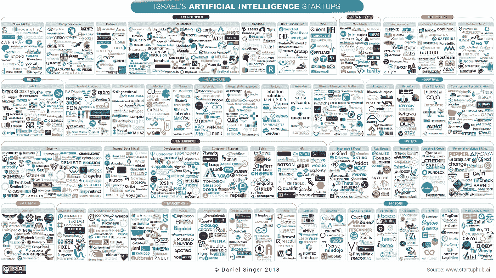

# 以色列人工智能景观 2018

> 原文：<https://medium.com/hackernoon/israels-artificial-intelligence-landscape-2018-83cdd4f04281>

以色列的人工智能(AI)创业生态系统累计融资超过 75 亿美元，正在经历爆炸式增长，其特点是大量机构和人才涌入，在未来五年内可能成为人工智能的全球领导者。尽管没有国家议程和预算，以色列已经指定了迄今为止最大的人工智能出口(mobile ye-15.3 b)，并拥有大量正在发展的利用和开发人工智能技术的创业公司。

下面的[信息图](https://startuphub.ai/israels-artificial-intelligence-startups-2018/)展示了以色列庞大的人工智能初创公司生态系统(包括机器[学习](https://hackernoon.com/tagged/learning)，深度学习，计算机视觉，自然语言处理，机器人技术，语音识别等技术。)—那些开发或利用对其核心产品至关重要的人工智能技术的公司。创业公司及其相应的信息可以在[这里](https://startuphub.ai/israel-ai/search-ai-startups/)找到。

以下是迄今为止生态系统发展的 20 大亮点:

1.  **有超过 950 家活跃的初创公司利用或开发人工智能技术**，其中 445 家初创公司已经筹集了一轮或多轮资金。在过去的五年里，平均每年有 140 家创业公司成立。
2.  **人工智能创业公司在 2017 年筹集了 19.4 亿美元的资金**，比 2016 年增长了 70%，2018 年迄今为止已经筹集了 15 亿美元，与上一时期几乎相同。交易量在 2017 年达到 207 笔投资的峰值，比 2016 年增长 19%，但截至 2018 年迄今为止，交易量为 133 笔，低于上一时期的 158 笔。
3.  **B 轮和 A 轮交易量**增长最快，从 2016 年到 2017 年分别增长 64%和 32%。2017 年种子轮交易总数为 59 笔，高于 2016 年的 56 笔，但 2018 年有望超过 2017 年的所有轮次。a 轮、B 轮和 C 轮已经超过了前期，分别跟踪 42 笔、21 笔和 5 笔交易。种子交易数量为 41 笔，略低于前一时期的 42 笔。此外，2018 年迄今为止的 A 轮融资已经达到了一个拐点，超过了种子轮的数量，这表明 A 轮融资将高于 2018 年的种子轮融资量——这是一个未知的领域。
4.  **84%的人工智能初创公司提供纯粹基于软件的解决方案**，而 16%提供硬件和软件的混合产品。
5.  **71%的创业公司是面向企业的(B2B)** ，而 28%是面向消费者的(B2C)。
6.  **51%的人工智能初创公司正在利用机器学习技术**，其中 21%正在利用深度学习技术**。** 13%使用计算机视觉技术，11%使用自然语言处理。只有 4%的人从事机器人和过程自动化工作，而 3%的人使用语音识别技术。
7.  **以色列人工智能初创公司累计退出 66 次，总价值近 44 亿美元。**在过去的五年里，AI [初创公司](https://hackernoon.com/tagged/startup)的平均每笔交易价值 1.21 亿美元，在退出之日的售价是其总融资额的 5.6 倍，但 2018 年迄今为止，这一倍数已攀升至 8.3 倍。人工智能初创公司在退出前平均筹集了 1750 万美元。
8.  **典型的初创企业在成立后需要 6.0 年才能退出**，且持续时间呈下降趋势。排除异常值，退出倍数与创业公司运营 4 年后的寿命呈正线性关系，表明在 6 至 8 年间有一个“最佳时机”，在此期间产生最高的回报倍数。倍数在 8 年后逐渐减少，并随着时间的增加而下降。
9.  **近三分之一的出口是 1 亿到 5 亿美元的交易**。只有两笔退出(Mobileye 的 IPO 和 Datorama 被 Salesforce 收购)超过 5 亿英镑，其余交易都低于 1 亿英镑(40%在 1000 万至 5000 万英镑之间)。
10.  **通过退出活动，最受以色列行业追捧的是人工智能技术产品**，即计算机视觉核心技术和计算硬件，其次是营销高级定位、分析和移动营销领域。企业网络安全和汽车自动驾驶系统紧随其后。
11.  **以色列是人工智能人才的温床，大约有 3935 名开发人员**，从事人工智能研究、开发和集成(包括软件和硬件)的工程师和数据科学家。64%的以色列人工智能人才受雇于初创公司，而 31%受雇于 58 家在以色列设有专门人工智能中心/实验室的跨国公司。其余的受雇于以色列公司和大学。
12.  **英特尔公司在跨国公司中领先**，雇佣了近 270 名人工智能员工，其次是 IBM，雇佣了近 130 名人工智能员工。他们加起来占跨国公司雇佣的人工智能人才的近三分之一。
13.  **女性占以色列人工智能人才库总数的 9%**,然而，女性占目前注册的人工智能博士生的近 30%。
14.  **希伯来大学领先以色列中等教育机构**,目前有 41 名在读博士生学习人工智能相关学科。Technion 大学排名第二，目前有 30 名人工智能博士，其次是特拉维夫大学(22 名)。
15.  **在以色列，人工智能员工的平均年薪在 10.9 万到 14 万美元之间**。A 轮融资或更少融资的早期创业公司每年在人工智能相关费用上的总支出在 35 万美元至 100 万美元之间，而 B 轮融资或更多融资的创业公司每年在 150 万美元至 230 万美元之间。
16.  **OurCrowd 是以色列人工智能初创公司**中最活跃的投资者，总共投资了 26 笔，不包括后续投资。耶路撒冷风险投资公司(Jerusalem Venture Partners)排名第二，其次是 iAngels、Pitango Venture Capital 和 Vertex Ventures。
17.  **对于加速器**，微软 ScaleUP 占据了主导地位，有 33 家参与的初创公司被纳入人工智能领域。
18.  **用于 AI 开发的顶级编程语言是 Python** ，79%的创业公司都在使用。C++排名第二，被 30%的创业公司使用，其次是 Java (25%)和 R (14%)。
19.  **对于计算能力**，89%的创业公司使用 CPU 和 GPU 的组合来满足他们的计算需求。55%的创业公司专门使用 GPU。10%的创业公司使用 DSP，6%使用 SOC，5%使用 FPGAs 和 ASICs。
20.  **28%的人工智能初创公司仍在寻找数据合作伙伴的同时构建自己的算法**。

随着世界竞相实现人工智能优势，以色列明确地在顶级舞台上雕刻自己的位置。法典化的情报在以色列根深蒂固，它将有力地决定这个国家未来的成就。

下载关于以色列人工智能状况的综合报告，以了解本文的更多详细信息。

如果你注意到任何遗漏的公司，请发电子邮件给 danielsinger27@gmail.com。注:分类过程有时是基于观点，可能会有错误。该列表并不详尽。

*以上信息图版权归丹尼尔·辛格所有，2018。分享这张信息图，但是适当地引用和归功于这篇文章。如有商业意图，请询问明确同意。*