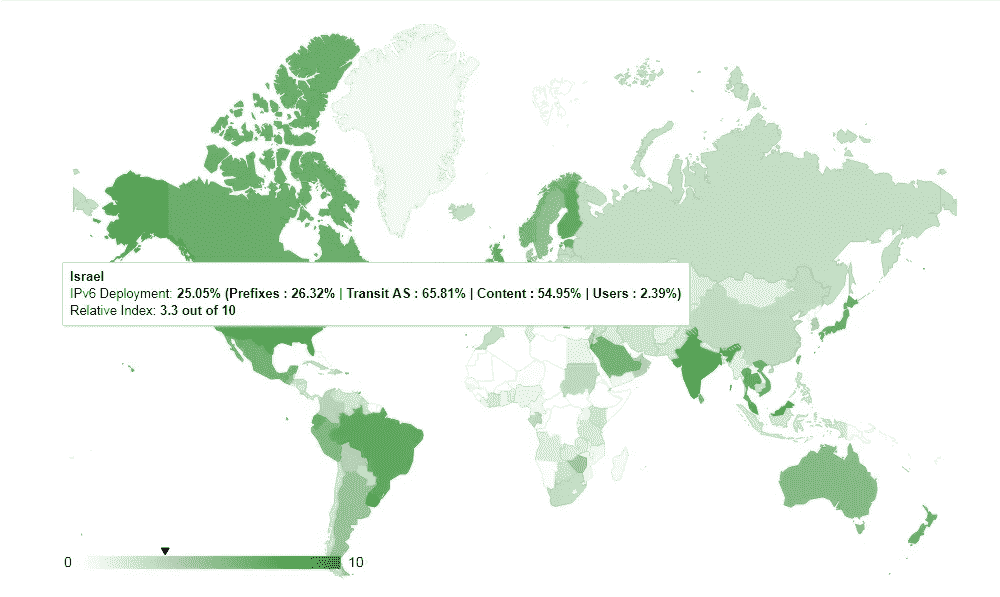

# 以色列的知识产权问题

> 原文：<https://medium.com/hackernoon/israels-ip-problem-7d8916cb93ec>

Photo by [NASA](https://unsplash.com/@nasa?utm_source=medium&utm_medium=referral) on [Unsplash](https://unsplash.com?utm_source=medium&utm_medium=referral)

以色列没有跟随世界其他地区从 IPv4 协议过渡到新的 T2 IPv6 协议。虽然这似乎是一个小问题，但它对以色列有着重大影响。我将回顾以色列是如何走到这一步的，以及该国要成功迁移到 IPv6 还面临哪些挑战。

## 什么是 IP？

每个可以连接到互联网的设备都有一个 IP( *互联网协议*)地址。该地址用于识别该特定设备。目前使用最广泛的标准称为 IPv4，它可以容纳 32 位值，允许的地址总数为 2 = 4，294，967，296 个。例如，您的 PC 的本地主机 IP 地址被配置为 127.0.0.1。虽然这似乎是一个荒谬的地址数量，但想想这个协议是在 1983 年首次推出的，当时我们没有智能手机也没有 IOT 设备。人们很快发现，IPv4 无法满足大量设备对 IP 地址的需求，因此 IPv6 应运而生，它允许 128 位的值。

Israel is not on the green side of things

## 回到未来

从上图可以看出(承蒙 [6lab](http://6lab.cisco.com/stats/) )，以色列的 IPv6 部署率约为 25%，与其他西方国家(欧洲和北美)形成鲜明对比。这些国家的 IPv6 部署率至少为 48%，几乎是以色列部署率的两倍。

虽然转换到 IPv6 协议是一项昂贵的工作，但这是一个国家必须坚持的。因为如果它不顺应潮流，在不久的将来会有很多缺点。由于 IP 地址的数量有限，我们(在以色列)已经到了无法给设备分配相应 IP 地址的地步。正如每个上过经济学课程的学生都会告诉你的，当供给很少而需求很高时，域名的 ***价格就会上涨*** 。

事实上，由于 IPv4 协议中域名的短缺，ISP(*互联网服务提供商*)正在向客户进行一种内部拍卖，因为他们正在处理其内部耗尽的 IPv4 IPs。

更令人不安的是，在 *2008* 年初发表的一篇[文章](https://www.ynet.co.il/articles/0,7340,L-3508828,00.html)中，以色列互联网服务提供商提出了这一事实，而他们一点也不担心。在这篇文章中，尽管[以色列互联网协会](https://en.isoc.org.il/) ( *ISOC-il* )已经敦促 ISP 开始转换，他们承诺当转换到 IPv6 的时候，他们会做好准备。

快进到周一， *5.11.18。*以色列通讯部 CEO，*纳蒂科恩*，[上市](https://www.gov.il/he/Departments/news/16102018_4)，警告以色列正处于域名危机。他在信中表示，由于 RIPE 网络协调中心不再向以色列发放 IPv4 IPs，因此迫切需要改用 IPV6 协议。听其自然(可以这么说)，互联网服务提供商没有注意到通信部和以色列互联网协会的呼吁。

Photo by [Evan Dennis](https://unsplash.com/@evan__bray?utm_source=medium&utm_medium=referral) on [Unsplash](https://unsplash.com?utm_source=medium&utm_medium=referral)

## 现在怎么办？

由于经济正走向越来越多的 IOT 设备的状态，以色列将没有能力允许这些产品存在。如果你没有 IP 地址可以分配，这些设备*就不能*运行。要迁移到 IPv6，与 IPs 相关的整个链都需要迁移。这涉及基础设施提供商、ISP、内容网站、应用程序和终端设备。科恩举行了一场听证会，概述了进行这一转变的计划，他表示，到 2019 年夏天，他们希望任何需要 IP 的设备的生产或进口都将采用 IPv6 协议。此外，他宣称，到 2020 年底，40%的流量也将基于 IPv6。

> ***值得注意的是，这个链条中的第一环是 ISP***

在 2018 年 10 月 16 日举行的听证会之后，要求 ISP 在 2018 年 11 月 5 日*之前做出回应。与以色列的官僚作风一样，互联网服务提供商被允许延期至 11 月底。*

接下来会发生什么？谁也说不准。

如果你喜欢这篇文章，请鼓掌让其他人也能欣赏它！👏