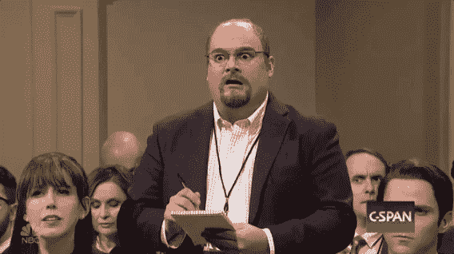
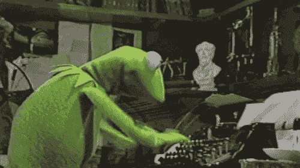

# 发行人关于如何根据 D 506(c)号法规在美国营销证券发行的指南

> 原文：<https://medium.com/hackernoon/issuer-guidance-on-how-to-market-a-security-token-offering-b08793730b6f>

请注意，我不是律师，这也不是法律建议。你应该像我们一样，在进行 506(b)或 506(c)发行前咨询你的律师。美国证券法规(以及对此类法规的解释)可能会发生变化。

*以下信息基于我的研究和对现有法律的理解，这些法律与在美国销售 Reg D 506(c)产品相关*。

When it comes to your STO Marketing, a common sense approach is always your best bet. Think Twice.

随着美国证券交易委员会(SEC)仍在积极[打击 2017 年推出的欺诈性 ico](https://www.sec.gov/news/press-release/2018-232)，当涉及到营销你的令牌产品时，公司必须充分意识到什么可以做，什么不可以做。你们中的许多人可能已经知道，根据 506(c)规则，发行人可以通过“一般征集”或“一般广告”的方式宣传私人投资。对你我来说幸运的是，美国证券交易委员会(SEC)没有明确定义 D 类法规中的术语“一般招揽”或“一般广告”，也没有提供什么指导，这使得今天的许多数字营销策略只能靠解释。这可能很快变得令人生畏，也让发行者感到困惑。然而，美国证券交易委员会无意中通过 502(c)规则提供了一些见解，给了我们一个它定义为一般招揽和一般广告的几个例子的列表:

1.  在任何报纸、杂志或类似媒体上发布的任何广告、文章、通知或其他通信，或通过电视或广播播放的任何广告、文章、通知或其他通信
2.  "任何研讨会或会议，其与会者是由任何一般征集或一般广告邀请的."

这种见解虽然有所帮助，但仍然相当模糊，很少提到互联网或数字广告作为一种沟通形式或“投资者接触”的使用。作为一个刚刚通过 D 506(c)法规和 STO 法规市场法规认证的人，相信我……这可能会让人望而生畏。我觉得围绕您的数字营销策略提供一些见解会有所帮助，这可能有助于在那些*数字灰色区域提供指导。*我认为有用的重点领域包括:

*   社交媒体和程序化广告
*   信息和内容
*   网站和登录页面
*   公关和媒体

This was me researching guidance on marketing under 506(c)

## 社交媒体和程序化广告:

随着程序化广告[的兴起](https://www.mediapost.com/publications/article/327204/data-shows-programmatic-video-ad-buys-on-the-rise.html)以及两家最大的在线广告公司重新恢复加密空间中的社交媒体广告，公司建立数字广告的基本运营程序将变得非常重要。有了社交媒体的重要背景，我想我会先处理这个部分。

在确定社交媒体广告的潜在合规责任时，我考虑了任何广告策略的三个主要组成部分:

1.  谁会得到提升？
2.  促销活动将在哪里发布？
3.  内容和信息(这非常重要，我在下面做了一个独立的部分)

当谈到受众发展时，我知道最好的起点是采取合理的措施，假设我的目标人群最有可能是合格的投资者。*如果你讲到这里，我想你已经知道了被认为是合格投资者的* [*SEC 要求*](https://www.sec.gov/files/ib_accreditedinvestors.pdf) *。这不仅有助于确保你的推广对象是有可能成为投资者的人，也有助于投资者合规。与 506(b)不同，506(c)允许多达 35 个符合复杂性要求的非合格投资者作为投资者参与，而 506(b)则允许零个投资者。它要求公司进行彻底的投资者验证，以确保每个投资者都是合格的。*

请记住，仅仅因为你可能越过了 SEC 的障碍，每个广告渠道都有自己的服务条款，你也必须遵守这些条款。重要的是要了解每个平台对广告的立场，因为这与吸引投资有关，也要了解它们对加密货币的立场，因为 ico 和 s to 之间有一些基本的重叠。

[推特广告政策](https://business.twitter.com/en/help/ads-policies/introduction-to-twitter-ads/twitter-ads-policies.html) || [脸书广告政策](https://www.facebook.com/policies/ads/) || [谷歌广告政策](https://support.google.com/adspolicy/answer/6008942?visit_id=636766143741749390-2642068508&rd=1) || [链接广告政策](https://www.linkedin.com/legal/ads-policy)

*请注意，Twitter 之前已经* [*禁止招揽 crypto*](https://techcrunch.com/2018/03/08/twitter-is-suspending-some-users-who-solicit-crypto/) *的人，LinkedIn 已经断然禁止。*

> **我的最佳实践:**无论是在脸书还是谷歌上，利用目标受众的社交媒体广告都是可以的。在发展你的受众时，重要的是要确保这些受众的基本要素得到考虑，如证券交易委员会规定的合格投资者收入和资产要求。这可以通过根据收入、净值、流动资产或支出等普查数据锁定个人来实现。它还有助于为您的受众提炼兴趣和行为数据，以更好地反映合格的投资者。这可以基于广泛可用的信息或详细的研究。
> 
> 当谈到电视时，幸运的是 502(c)将其作为一种可接受的广告形式，这意味着您的这部分程序化广告活动被覆盖。然而，程序化还跨越流媒体服务和其他在线广告平台，在这些平台上，通信可能被视为数字营销。我会把社交媒体的规则应用到程序上。然而，由于您的内容将主要是视频，因此通过您的消息传递来确保合规性是很重要的，我将在下面谈到这一点。我并不精通点击付费(PPC ),但在咨询了一些有丰富专业知识的人后，可以肯定地说，同样的规则通常也适用于任何类型的展示或 PPC 活动。

SOCIAL MEDIA ANIMATION GIF BY DENNIS MOORE

## 信息和内容

在深入我的 SEC 解释研究后，很明显，限制受众不足以确保我们的广告尽可能合规。当我开始看内容和一般招标我发现一些有趣的事情。当谈到投资者沟通时，SEC 显然对“事实信息”持强硬立场。他们也不认为在你上市期间从你的公司传播的事实信息是一般的招揽。这很好，因为这意味着你围绕真实的公司信息投放的广告真的没有限制。

那么什么是允许的呢？

SEC 认为事实信息是关于发行人的准确信息:

*   商业
*   财务状况
*   产品或服务*(这些产品和服务的广告，如果它们不包括关于您的报价的信息)*

这可以让创造促销的个人在他们的广告活动中利用他们所有公司的前进动力(只要信息是真实的！)所以你可能会想“好吧，这很好，投资者显然关心这些事情，但我的想法呢！”

SEC 提供的另一个有用的避风港是第 168 条规则和第 169 条规则。该规则表明，发行人可以公开发布前瞻性声明，因为它们涉及发行人的收入、收益(损失)、每股收益(损失)价格的预测，以及关于管理层未来经营的计划和目标的声明，包括与发行人的产品或服务有关的计划或目标。这可以让您的出版物、促销和广告突出可能关注未来公司计划或产品的内容和信息。

> **我的最佳实践:**说到开发内容和信息，很明显，常识将是最好的方法。内容不得向潜在投资者暗示任何形式的保证投资回报率或每股预期价格。我还认为，在发布前瞻性声明时，谨慎行事是明智的，因为这可能会被解读为有利于未来的股价。
> 
> 你可以发布关于公司发展、新合作伙伴、筹款公告、新客户、项目等的广告，也可以发布关于公司未来发展和时间表的广告。这类声明可能具有前瞻性，因此确保您的所有内容和信息与之前发布的内容、广告或公告保持一致非常重要。

The information your provide in your ads and on your website is very important.

## 网站和登录页面

根据规则 506(c ),你不需要在积极筹款时限制对你的网站的访问。但是，如果您在提供 Reg D 服务的同时还提供国际 Reg S 服务，可能需要考虑哪些人可以访问您的网站，哪些人不可以。我将在本系列的第 2 部分详细讨论这一点。

您的网站可以提供有关您的 STO 的详细信息，还可能包括对您的公司及其产品的支持文档的访问。这些都属于证交会提供的事实信息指导，也是我的“常识”关注领域之一。让我们现实一点，如果网站是为一个拥有合法产品或服务的合法企业服务的，它就不应该有不准确的信息。不过要记住的一点是，由于登录页面或网站可能与任何正在进行的数字活动直接相关，因此确保网站上发布的内容以及通过它可以访问的任何文档的真实性和准确性就变得更加重要。

> 我的最佳实践:采取措施确保广告合规，不提供任何误导性信息，这不应该是唯一的关注点。从活动中获得流量的网站应该经常提供关于公司和产品的更新、准确和真实的信息。有时最好确保使用特定活动的登录页面，以便广告中的信息代表网站上的信息
> 
> 如果一家公司只在美国筹集资金，最好也屏蔽掉该网站的国际 IP 地址。然而，如果该公司提供国际服务，那么我会建议阻止访问有关 s to 的网页。

## 公关和媒体

说到公关，我觉得上市公司的方法最有效。内容重点应放在围绕著名公司更新的新闻稿和谈论公司、产品和使命的特色文章上。公关在任何筹资举措的合法性方面发挥着重要作用，因为当潜在投资者开始尽职调查时，它有助于提供更多有关公司的信息。同样重要的是要记住，事实信息不仅仅在印刷品或你的网站上重要。就像在你制作的任何广告中一样，可能会因文章或视频采访而接受采访的公司个人应该始终积极避免对可能与筹款或投资活动有关或无关的问题做出宽泛的陈述。这是最好的咨询你的律师，并让你的公关代表在场，这样他们可以制定一个回答某些问题的规则。

> **我的最佳实践:**坚持事实。如果公司自然进步很大，团队和业务都在扩大，那就说说吧。人们更感兴趣的是了解公司的稳定性、领导团队的个人以及公司下一步的工作。当涉及到公关策略时，尽量避免任何形式的软销售。关于 STO 的信息或关于获得资金的新闻稿都可以，但要让你的成就和进步为你推销公司。

我知道，当涉及到为 Reg D 产品导航数字营销领域时，许多此类信息可能只是皮毛。当根据 Reg D 506(c)对安全令牌产品进行营销和广告宣传时，最重要的事情是采用非常常识性的方法进行沟通。不能通过公司官员或事实信息证实的事情不应被分享或用来说服投资者投资。希望，当你开始为你的 506(c)产品制定广告策略时，上面的信息可以帮助你提供一些关于如何处理你的数字促销的指导，并确保你在吸引投资者时符合 SEC 的要求。

欢迎在评论中提问，我会尽力提供更多的见解。