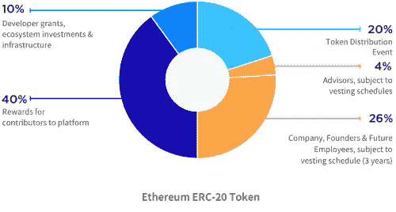
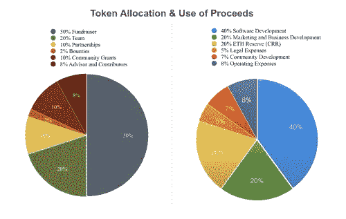
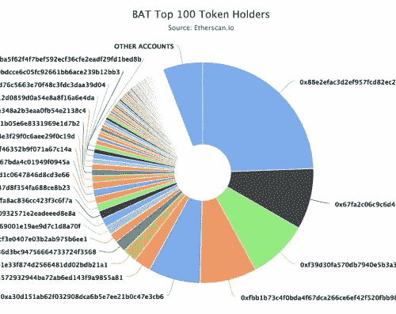

# 发放员工代币赠款？这里有一个更好的选择

> 原文：<https://medium.com/hackernoon/issuing-employee-token-grants-heres-a-better-alternative-11afcec88117>

发行股票很容易。从 PayPal 和 Google 这样的硅谷巨头到新进入者，股权通常是早期员工薪酬的一部分。这很常见，而且[这个过程有据可查](https://t.umblr.com/redirect?z=https%3A%2F%2Favc.com%2F2018%2F04%2Fthe-employee-equity-project%2F&t=ZGU5ODYxMDhjYTczODJmNTI2YWRiZjkzNzA5OTI4NTFlOTRkNDNkNCxzZmttdUtJTA%3D%3D&b=t%3AGKriAc9xHnfGyzOfRkHLVQ&p=http%3A%2F%2Flikesandlaunch.com%2Fpost%2F173196243656%2Fissuing-employee-token-grants-heres-a-better&m=0)。发行代币而不是股票是复杂的。

代币不是股权，但是很多早期团队都是一样对待的。这过度简化了不确定的监管、昂贵的税收、混合激励、归属考虑和公共账目透明性的复杂性。没有足够的先例来理解未来的风险，但我在下面概述了许多已知的考虑因素。

好消息是有一个股权令牌结构提供了一个优雅的解决方案。它越来越受欢迎，并将员工激励与象征性的升值挂钩，但也提供了股权激励的好处和简单性。

# 公司拥有的令牌模型(共有)

公司拥有的代币模型(共同拥有)将员工利益与代币增值联系起来，并使用既定的股权授予最佳实践。代币归公司所有，而不是发给员工代币。然后，员工可以获得公司的股权奖励，但不能直接获得象征性的奖励。

[Open Garden](https://t.umblr.com/redirect?z=https%3A%2F%2Fwww.opengarden.com%2Fabout.html&t=NDRmN2I2NjQyYzYyNTEwOTQ3MmZmNzM5OTU4Mjk1OGExYTdiYjQ5NSxzZmttdUtJTA%3D%3D&b=t%3AGKriAc9xHnfGyzOfRkHLVQ&p=http%3A%2F%2Flikesandlaunch.com%2Fpost%2F173196243656%2Fissuing-employee-token-grants-heres-a-better&m=0) ，一个以其 FireChat 应用程序而闻名的网状网络平台，使用共有模式。首席执行官[保罗·海恩斯沃思](https://twitter.com/mouthy)说，投资者总是惊讶地知道他没有持有公司的任何股票。他说，这种模式可以更好地将激励与项目、投资者和团队的长期成功结合起来。

在他们的模型中，Open Garden 将拥有网络中 20%的代币，因此如果它们升值，将增加公司股权的价值。这是团队 2-4 年的承诺。共同拥有能更好地协调团队和公司的成功。没有提前兑现的选择，他说这对球队很重要。

让我们看看更下游的共有模式。当一个员工离开，授予，或交易 c-corp 公司的股票，它得到了股权的税收优惠，但与代币的成功相关。然后，公司股票通过三种方式之一具有流动性:当 c-corp 上市时，在 M&A 交易中出售，或者当 c-corp 管理自己的流动性时，通过回购股权或从收入或象征性销售中发放股息。

我认为我们会看到更多的公司采用共有模式。股权授予的最初目的是将员工的发展与企业的整体成功联系起来。这种模式比向员工发放个人奖金更能满足这一使命。过去做代币销售的公司对新的监管障碍了解不多，随着员工人数增加，可能会决定转向这种模式。

同意吗？不同意？我很乐意在评论或 [@br_ttany](http://twitter.com/br_ttany) 中听到你的想法。我们可以从大声分享学习中受益。如果你想加入[每周对话，请在此订阅。](https://t.umblr.com/redirect?z=http%3A%2F%2Ftinyletter.com%2FBr_ttany&t=MzBlOTFkZDhmZmNhMTk2YTUzYjIzOGMyNWM1OThjMzllMGExOGE2NCxJQldTaGdUUw%3D%3D&b=t%3AGKriAc9xHnfGyzOfRkHLVQ&p=http%3A%2F%2Flikesandlaunch.com%2Fpost%2F171199026921%2Funsolved-issues-moving-from-equity-to-tokens&m=0)

# 还在考虑象征性拨款吗？要考虑的事情。

[*LookRev Token Allocation Plan using the old model*](https://t.umblr.com/redirect?z=https%3A%2F%2Fmedium.com%2F%40LookRev%2Flookrev-token-sale-announcement-aug-30-2017-6f54ec52d0d&t=NTZhZGNjNTIwZDg3ODZmNzFhMGJhZTMyYmNhODM2ZWViMDgxOGQ2MixzZmttdUtJTA%3D%3D&b=t%3AGKriAc9xHnfGyzOfRkHLVQ&p=http%3A%2F%2Flikesandlaunch.com%2Fpost%2F173196243656%2Fissuing-employee-token-grants-heres-a-better&m=0)

我相信随着代币支持的商业生态系统的发展，会有更好的模式，但这仍是早期的。如果你正在考虑设立员工代币赠款，下面是我从律师、会计师、工程师和该领域的创始人那里听到的一些考虑。

**税费:**

*   员工税收负担:如果你向员工发放代币，他们有责任在收到代币的当年缴纳所得税。如果你在 2018 年发行代币，但他们在 2020 年之前不能出售，锁定并不能解决这个问题，他们仍将在 2018 年就该纳税年度授予的代币缴纳所得税。如果你根据授权计划获得代币，你将在发行时支付价格税，如果公开交易，价格可能会波动。代币目前没有像证券一样受益于全面监管，因此上市公司股票带来的相同税收优惠目前没有得到相同的待遇。是的， [83B 可以有所帮助，但如何](https://t.umblr.com/redirect?z=https%3A%2F%2Fwww.mcnaul.com%2Fblog%2Fnews-and-insight%2Fstartups%2Fspecial-considerations-for-83b-elections-on-restricted-token-grants&t=ODBmMjZiYTIxNzI3ZjZiZDAwZTJiYmYyODdiZGZkMWQwY2EyZTQ3OSxzZmttdUtJTA%3D%3D&b=t%3AGKriAc9xHnfGyzOfRkHLVQ&p=http%3A%2F%2Flikesandlaunch.com%2Fpost%2F173196243656%2Fissuing-employee-token-grants-heres-a-better&m=0)还不确定。
*   执行价:如果你以股票的形式获得一家公司的股权，你必须缴税，但你可能会从低股价中受益，股价可能会随着时间的推移而升值。如果你在 ICO 后收到代币，它们将按最近的价格发行，可能是按未来的估值定价，而不是现在的价值。
*   期权和限制性股票单位:许多风投支持的初创公司从发行股票转向发行期权或限制性股票单位，以推迟员工的税收负担，直到他们行使股票。公司也可以从期权而不是股权中获益。这些结构目前在发行代币中并不存在。
*   雇主税收负担:代币税收指导不是一成不变的。除了员工在收到补助时拥有的税收之外，公司还可能因向员工发放代币而产生额外的所得税负担。
*   美国员工的认证:如果你的令牌是一种证券，你只能把它给经过认证的美国员工吗？在美国，证券代币如何发行、销售和交易仍有很多不确定性，但就目前情况来看，你可能只能向经认可的机构提供证券，这可能会淘汰许多员工。
*   短期与长期资本利得:在出售之前长期持有股票可以获得较低的成本、长期资本利得而不是短期资本利得或所得税。如果从发行到出售的时间很短，代币可能没有资格获得资本收益或长期收益。

**激励与归属:**

*   员工参与网络:发放代币意味着您的员工现在拥有了可以用来分享您的生态系统的资产，但是如果所有员工都有平等的动机参与生态系统，即使他们的代币报酬较少，不是更好吗？
*   授予时间表:2-6 年的长期股权授予时间表有助于让员工在一家公司呆足够长的时间以增加价值。在行权时间表结束时行权通常是对股票将变得具有流动性的未来押注。你必须用现金加倍你的信仰。代币有不同的动态。一旦被授予，你可以立即出售你的代币。获得现金的途径更快，但对长期代币估值的激励可能更少。
*   短期与长期代币上涨:代币在短期内是流动的，而股票不是。一旦员工获得了已授予的代币或解除了锁定，这可能会为员工创造一个优化，以最大化其代币的价值，而不是长期的整体代币价格。

**透明度:**

*   员工交易的公共记录:当员工购买、出售或交易代币时，在区块链上有一个分类账分录。更大的透明度可能是一件好事，但如果一名员工突然以公开方式而非私人方式出售他们所有的股票，这可能需要更多的信息。
*   在衰退中吸引人才:如果你的象征性价格受到打击，也许是因为整个加密领域的衰退(就像我们现在看到的)，这是否会损害你雇用人才和用象征性赠款吸引他们的能力？
*   鼓励员工参与:员工可能需要代币来测试是否是网络的参与者。在使用代币进行测试时，他们应该对价格敏感吗？如果他们被授予了令牌，但还没有授予，他们是否必须在生态系统中购买令牌才能参与？

*Transparency matters.* [*BAT token holders public addresses.*](https://t.umblr.com/redirect?z=https%3A%2F%2Fmedium.com%2F%40CryptoJennie%2Fdispelling-some-myths-about-the-distribution-of-basic-attention-token-bat-aed9f651fe9d&t=OThhZmI5M2ZhMTM5MDk4ZTE4MjhkYzNmNjgwMjY0M2Y5YmZhN2JmMyxzZmttdUtJTA%3D%3D&b=t%3AGKriAc9xHnfGyzOfRkHLVQ&p=http%3A%2F%2Flikesandlaunch.com%2Fpost%2F173196243656%2Fissuing-employee-token-grants-heres-a-better&m=0)

# 分享最佳实践有益于区块链生态系统。

我想听听你的意见、例子和反馈。我写作是为了学习。更好的讨论可以带来更好的结果。请在评论或推文中留言 [@br_ttany](http://twitter.com/br_ttany) 。

在纽约？[加入我们 4 月 30 日的 Lattice VC BlockTalk，关注区块链人才的成长和来源](https://www.eventbrite.com/e/lattice-vc-blocktalk-growing-and-sourcing-blockchain-talent-tickets-44767316248)。

如果你想继续讨论区块链、企业家的工具和投资，[点击这里加入每周对话。](https://t.umblr.com/redirect?z=http%3A%2F%2Ftinyletter.com%2FBr_ttany&t=MzBlOTFkZDhmZmNhMTk2YTUzYjIzOGMyNWM1OThjMzllMGExOGE2NCxJQldTaGdUUw%3D%3D&b=t%3AGKriAc9xHnfGyzOfRkHLVQ&p=http%3A%2F%2Flikesandlaunch.com%2Fpost%2F171199026921%2Funsolved-issues-moving-from-equity-to-tokens&m=0)

如果你喜欢这篇文章，鼓掌👏帮助其他人了解它。

*现在是免责声明，这不是法律、税务或财务建议，因此请咨询有经验的法律顾问，为您的企业确定正确的计划。*

*最初发表于*[*【likesandlaunch.com】*](http://likesandlaunch.com/post/173196243656/issuing-employee-token-grants-heres-a-better)*。*