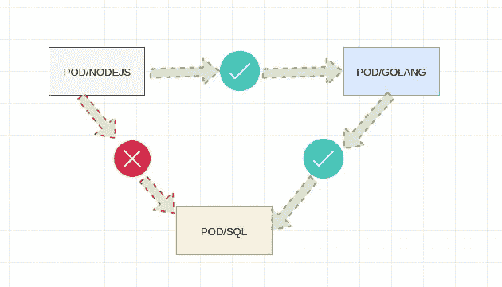
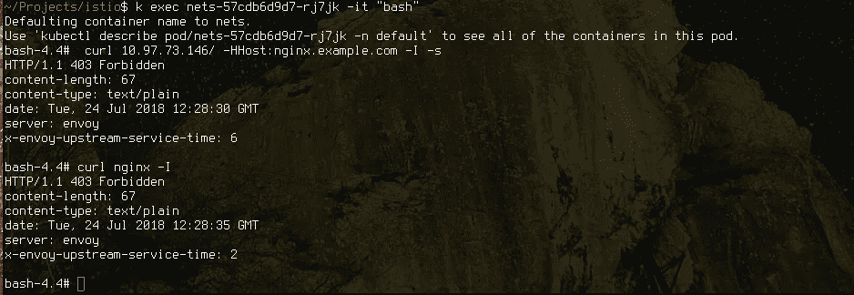

# Istio 混音器适配器。

> 原文：<https://medium.com/hackernoon/istio-mixer-adapters-4004c7156c72>

关于**混合器**和**适配器**的快速文章，我想了解的一件事是**Istio/混合器**的参与情况当流量从一个 pod 发送到另一个 pod 时，具有这种分离或隔离可能是有用的，例如，让我们想象 3 个不同 pod 中的 3 层应用程序，你不会希望你的视图层直接与模型对话，例如:



目标非常明确，在 **POD/NODE** 和 **POD/GOLANG** 之间的通信应该畅通无阻，但是当 **POD/NODE** 想要 tapo 到 **POD/SQL** 中，而**不允许**时，这可能是出于多种原因。

我可以想到很多方法在 istio 中单独实现这一点，可能是在 sql (sidecar on to)和 golang 之间隐藏一个 header 或 cookie。(假设 golang 必须传递一个 jwt 或一个 cookie 来验证请求)。也可能是由不同的 CA 签署的不同的 MTLS 配置。

你也可以做一个简单的规则，比如:

如果我传递消息头`secret=sauce`，我将接通服务`nginx`，所以让我们看看它是如何工作的(从一个注入 nginx 的 pod istio(也是 istio 注入的))


所以当我传递带有`sauce`值的`secret`头时，我得到一个 200。

有趣的是，当您对所有这些事情进行故障诊断时，mixer 有许多非常有趣的信息(有许多方法可以检查这一点，但现在让我们做 kubectl 日志)

`k logs yourtelemetrypod -n istio-system -f`

因此，对于失败的请求，我们得到:

```
{“level”:”info”,”time”:”2018–07–24T09:34:47.539084Z”,”instance”:”accesslog.logentry.istio-system”,”apiClaims”:””,”apiKey”:””,”apiName”:””,”apiVersion”:””,”connectionMtls”:false,”destinationIp”:”172.17.0.16",”destinationNamespace”:”istio-system”,”destinationService”:”istio-policy.istio-system.svc.cluster.local”,”latency”:”1.020214ms”,”method”:”POST”,”originIp”:”0.0.0.0",”protocol”:”http”,”receivedBytes”:1157,”referer”:””,”requestOperation”:””,”requestSize”:800,”responseCode”:200,”responseSize”:51,”responseTimestamp”:”2018–07–24T09:34:47.540108Z”,”sentBytes”:219,”sourceIp”:”172.17.0.13",”sourceNamespace”:”istio-system”,”sourceService”:”istio-ingressgateway.istio-system.svc.cluster.local”,”sourceUser”:””,”url”:”/istio.mixer.v1.Mixer/Check”,”userAgent”:””}
{“level”:”info”,”time”:”2018–07–24T09:34:47.541322Z”,”instance”:”accesslog.logentry.istio-system”,”apiClaims”:””,”apiKey”:””,”apiName”:””,”apiVersion”:””,”connectionMtls”:false,”destinationIp”:”172.17.0.16",”destinationNamespace”:”istio-system”,”destinationService”:”istio-policy.istio-system.svc.cluster.local”,”latency”:”1.224358ms”,”method”:”POST”,”originIp”:”0.0.0.0",”protocol”:”http”,”receivedBytes”:981,”referer”:””,”requestOperation”:””,”requestSize”:624,”responseCode”:200,”responseSize”:51,”responseTimestamp”:”2018–07–24T09:34:47.542495Z”,”sentBytes”:219,”sourceIp”:”172.17.0.19",”sourceNamespace”:”default”,”sourceService”:”nets.default.svc.cluster.local”,”sourceUser”:””,”url”:”/istio.mixer.v1.Mixer/Check”,”userAgent”:””}
{“level”:”info”,”time”:”2018–07–24T09:34:47.540899Z”,”instance”:”accesslog.logentry.istio-system”,”apiClaims”:””,”apiKey”:””,”apiName”:””,”apiVersion”:””,”connectionMtls”:false,”destinationIp”:”172.17.0.19",”destinationNamespace”:”default”,”destinationService”:”nets.default.svc.cluster.local”,”latency”:”2.389636ms”,”method”:”HEAD”,”originIp”:”0.0.0.0",”protocol”:”http”,”receivedBytes”:872,”referer”:””,”requestOperation”:””,”requestSize”:0,”responseCode”:503,”responseSize”:57,”responseTimestamp”:”2018–07–24T09:34:47.543193Z”,”sentBytes”:149,”sourceIp”:”172.17.0.13",”sourceNamespace”:”default”,”sourceService”:”nets.default.svc.cluster.local”,”sourceUser”:”kubernetes://nets-57cdb6d9d7-rj7jk.default”,”url”:”/”,”userAgent”:”curl/7.60.0"}
{“level”:”info”,”time”:”2018–07–24T09:34:47.538628Z”,”instance”:”accesslog.logentry.istio-system”,”apiClaims”:””,”apiKey”:””,”apiName”:””,”apiVersion”:””,”connectionMtls”:false,”destinationIp”:”172.17.0.13",”destinationNamespace”:”istio-system”,”destinationService”:”istio-ingressgateway.istio-system.svc.cluster.local”,”latency”:”5.990164ms”,”method”:”HEAD”,”originIp”:”0.0.0.0",”protocol”:”http”,”receivedBytes”:628,”referer”:””,”requestOperation”:””,”requestSize”:0,”responseCode”:503,”responseSize”:0,”responseTimestamp”:”2018–07–24T09:34:47.544296Z”,”sentBytes”:122,”sourceIp”:”172.17.0.19",”sourceNamespace”:”default”,”sourceService”:”nets.default.svc.cluster.local”,”sourceUser”:”kubernetes://nets-57cdb6d9d7-rj7jk.default”,”url”:”/”,”userAgent”:”curl/7.60.0"}
{“level”:”info”,”time”:”2018–07–24T09:34:48.541291Z”,”instance”:”accesslog.logentry.istio-system”,”apiClaims”:””,”apiKey”:””,”apiName”:””,”apiVersion”:””,”connectionMtls”:false,”destinationIp”:”172.17.0.14",”destinationNamespace”:”istio-system”,”destinationService”:”istio-telemetry.istio-system.svc.cluster.local”,”latency”:”8.229042ms”,”method”:”POST”,”originIp”:”0.0.0.0",”protocol”:”http”,”receivedBytes”:1305,”referer”:””,”requestOperation”:””,”requestSize”:980,”responseCode”:200,”responseSize”:5,”responseTimestamp”:”2018–07–24T09:34:48.549353Z”,”sentBytes”:174,”sourceIp”:”172.17.0.16",”sourceNamespace”:”istio-system”,”sourceService”:”istio-mixer.istio-system.svc.cluster.local”,”sourceUser”:””,”url”:”/istio.mixer.v1.Mixer/Report”,”userAgent”:””}
{“level”:”info”,”time”:”2018–07–24T09:34:48.544250Z”,”instance”:”accesslog.logentry.istio-system”,”apiClaims”:””,”apiKey”:””,”apiName”:””,”apiVersion”:””,”connectionMtls”:false,”destinationIp”:”172.17.0.14",”destinationNamespace”:”istio-system”,”destinationService”:”istio-telemetry.istio-system.svc.cluster.local”,”latency”:”8.098142ms”,”method”:”POST”,”originIp”:”0.0.0.0",”protocol”:”http”,”receivedBytes”:1069,”referer”:””,”requestOperation”:””,”requestSize”:744,”responseCode”:200,”responseSize”:5,”responseTimestamp”:”2018–07–24T09:34:48.552195Z”,”sentBytes”:174,”sourceIp”:”172.17.0.19",”sourceNamespace”:”default”,”sourceService”:”nets.default.svc.cluster.local”,”sourceUser”:””,”url”:”/istio.mixer.v1.Mixer/Report”,”userAgent”:””}
{“level”:”info”,”time”:”2018–07–24T09:34:48.552645Z”,”instance”:”accesslog.logentry.istio-system”,”apiClaims”:””,”apiKey”:””,”apiName”:””,”apiVersion”:””,”connectionMtls”:false,”destinationIp”:”172.17.0.14",”destinationNamespace”:”istio-system”,”destinationService”:”istio-telemetry.istio-system.svc.cluster.local”,”latency”:”4.24435ms”,”method”:”POST”,”originIp”:”0.0.0.0",”protocol”:”http”,”receivedBytes”:1237,”referer”:””,”requestOperation”:””,”requestSize”:912,”responseCode”:200,”responseSize”:5,”responseTimestamp”:”2018–07–24T09:34:48.556842Z”,”sentBytes”:174,”sourceIp”:”172.17.0.13",”sourceNamespace”:”istio-system”,”sourceService”:”istio-ingressgateway.istio-system.svc.cluster.local”,”sourceUser”:””,”url”:”/istio.mixer.v1.Mixer/Report”,”userAgent”:””}```
```

成功的一个例子是:

```
{"level":"info","time":"2018-07-24T09:34:54.741027Z","instance":"accesslog.logentry.istio-system","apiClaims":"","apiKey":"","apiName":"","apiVersion":"","connectionMtls":false,"destinationIp":"172.17.0.4","destinationNamespace":"default","destinationService":"nginx.default.svc.cluster.local","latency":"2.51907ms","method":"HEAD","originIp":"0.0.0.0","protocol":"http","receivedBytes":883,"referer":"","requestOperation":"","requestSize":0,"responseCode":200,"responseSize":0,"responseTimestamp":"2018-07-24T09:34:54.743548Z","sentBytes":200,"sourceIp":"172.17.0.13","sourceNamespace":"default","sourceService":"nets.default.svc.cluster.local","sourceUser":"kubernetes://nets-57cdb6d9d7-rj7jk.default","url":"/","userAgent":"curl/7.60.0"}
{"level":"info","time":"2018-07-24T09:34:54.740708Z","instance":"accesslog.logentry.istio-system","apiClaims":"","apiKey":"","apiName":"","apiVersion":"","connectionMtls":false,"destinationIp":"172.17.0.13","destinationNamespace":"istio-system","destinationService":"istio-ingressgateway.istio-system.svc.cluster.local","latency":"3.603382ms","method":"HEAD","originIp":"0.0.0.0","protocol":"http","receivedBytes":639,"referer":"","requestOperation":"","requestSize":0,"responseCode":200,"responseSize":0,"responseTimestamp":"2018-07-24T09:34:54.744135Z","sentBytes":200,"sourceIp":"172.17.0.19","sourceNamespace":"default","sourceService":"nets.default.svc.cluster.local","sourceUser":"kubernetes://nets-57cdb6d9d7-rj7jk.default","url":"/","userAgent":"curl/7.60.0"}
{"level":"info","time":"2018-07-24T09:34:54.741426Z","instance":"accesslog.logentry.istio-system","apiClaims":"","apiKey":"","apiName":"","apiVersion":"","connectionMtls":false,"destinationIp":"172.17.0.16","destinationNamespace":"istio-system","destinationService":"istio-policy.istio-system.svc.cluster.local","latency":"1.185697ms","method":"POST","originIp":"0.0.0.0","protocol":"http","receivedBytes":1066,"referer":"","requestOperation":"","requestSize":710,"responseCode":200,"responseSize":51,"responseTimestamp":"2018-07-24T09:34:54.742529Z","sentBytes":219,"sourceIp":"172.17.0.4","sourceNamespace":"default","sourceService":"nginx.default.svc.cluster.local","sourceUser":"","url":"/istio.mixer.v1.Mixer/Check","userAgent":""}
{"level":"info","time":"2018-07-24T09:34:55.743929Z","instance":"accesslog.logentry.istio-system","apiClaims":"","apiKey":"","apiName":"","apiVersion":"","connectionMtls":false,"destinationIp":"172.17.0.14","destinationNamespace":"istio-system","destinationService":"istio-telemetry.istio-system.svc.cluster.local","latency":"3.483434ms","method":"POST","originIp":"0.0.0.0","protocol":"http","receivedBytes":1236,"referer":"","requestOperation":"","requestSize":912,"responseCode":200,"responseSize":5,"responseTimestamp":"2018-07-24T09:34:55.747342Z","sentBytes":174,"sourceIp":"172.17.0.4","sourceNamespace":"default","sourceService":"nginx.default.svc.cluster.local","sourceUser":"","url":"/istio.mixer.v1.Mixer/Report","userAgent":""}
{"level":"info","time":"2018-07-24T09:34:55.744173Z","instance":"accesslog.logentry.istio-system","apiClaims":"","apiKey":"","apiName":"","apiVersion":"","connectionMtls":false,"destinationIp":"172.17.0.14","destinationNamespace":"istio-system","destinationService":"istio-telemetry.istio-system.svc.cluster.local","latency":"2.92787ms","method":"POST","originIp":"0.0.0.0","protocol":"http","receivedBytes":1333,"referer":"","requestOperation":"","requestSize":1008,"responseCode":200,"responseSize":5,"responseTimestamp":"2018-07-24T09:34:55.747057Z","sentBytes":174,"sourceIp":"172.17.0.13","sourceNamespace":"istio-system","sourceService":"istio-ingressgateway.istio-system.svc.cluster.local","sourceUser":"","url":"/istio.mixer.v1.Mixer/Report","userAgent":""}
{"level":"info","time":"2018-07-24T09:34:55.743733Z","instance":"accesslog.logentry.istio-system","apiClaims":"","apiKey":"","apiName":"","apiVersion":"","connectionMtls":false,"destinationIp":"172.17.0.14","destinationNamespace":"istio-system","destinationService":"istio-telemetry.istio-system.svc.cluster.local","latency":"3.811374ms","method":"POST","originIp":"0.0.0.0","protocol":"http","receivedBytes":1044,"referer":"","requestOperation":"","requestSize":719,"responseCode":200,"responseSize":5,"responseTimestamp":"2018-07-24T09:34:55.747434Z","sentBytes":174,"sourceIp":"172.17.0.16","sourceNamespace":"istio-system","sourceService":"istio-mixer.istio-system.svc.cluster.local","sourceUser":"","url":"/istio.mixer.v1.Mixer/Report","userAgent":""}
```

这给了你一个线索，混合器在整个流量中的参与程度有多高，envoy 上有很多缓存，所以每个请求都不会利用混合器，但两者之间有足够的流量。

# 混合器适配器:

另一种方法是使用混合器适配器(例如 denier)，您可以完全拒绝来自给定 pod 的访问。

例如，看看这个丹尼尔+规则组合:

这是非常不言自明的(但是如果你想阅读更多，你可以看看 https://istio.io/docs/tasks/security/secure-access-control/的

因此，基本上它是一个拒绝处理程序，根据规则做出反应，如果请求试图从源名称空间== default 登录到 app==nginx，它应该会得到某种错误(403 ),可能是:

这就是结果:



很好，很酷的一点是你可以做各种组合，例如我们可以基于用户代理或服务帐户等进行阻止。

有一些适配器可用于 mixer，但编写自己的适配器并不复杂，您可以轻松地与其他服务和端点集成。

我希望这能让你了解这整个事情有多灵活，你可以用任何你觉得更舒服的方式来实现它。