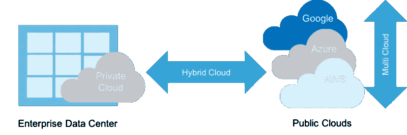
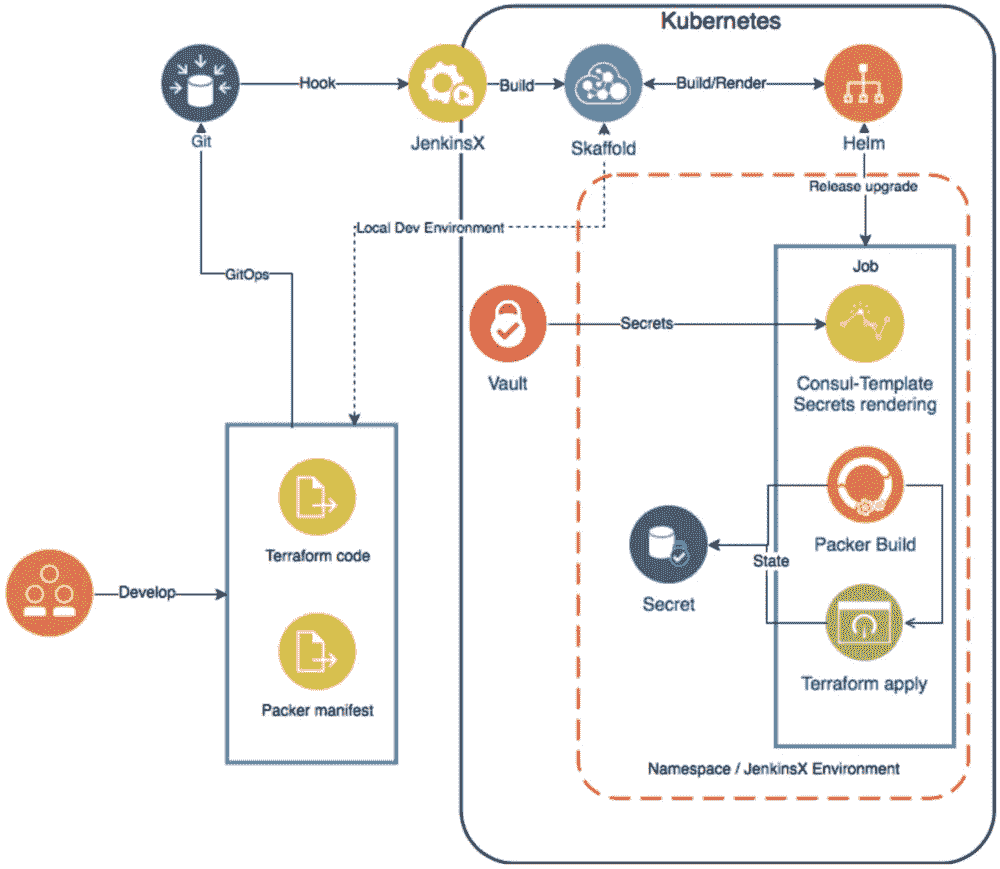

# 使用 Skaffold 和 Kubernetes 进行迭代地形开发

> 原文：<https://medium.com/hackernoon/iterative-terraform-development-with-skaffold-and-kubernetes-42cb6d60f7dc>

Kubernetes 和 **Terraform** 是两个众所周知的用于构建基础设施的基础开源工具。它们在性质和应用场景上有很大不同，但也有很多相似和交叉之处。我将跳过哲学方面，展示两种技术可以相互补充的实际例子。



cisco.com

**什么是普遍？**

*   **多用途**和涵盖基础设施、应用和服务。
*   提供**抽象**并隐藏底层基础设施的复杂性。
*   **云不可知**并支持混合云开发。
*   **期望状态和**允许关注最终结果，绕过中间步骤编程。

# 开发经验

**地形配置与 Kubernetes 清单**

在最低层次上，使用这两种工具的工作假设在 [YAML](http://yaml.org) / [HCL](https://github.com/hashicorp/hcl) 或 [JSON](https://www.json.org) 中编写 DSL 清单，验证并提交它们以便使用 **terraform** 或**ku bectl**CLI**工具执行。虽然这种方法对于临时任务或“快速启动”很好，但它缺乏迭代部署、堆栈生命周期管理和第三方自动化重用。**

**模块和** [**舵**](http://www.helm.sh) **包**

通过使用具有 terraform 的公共[注册表](https://registry.terraform.io)的[工作空间](https://www.terraform.io/docs/state/workspaces.html)和[模块](https://www.terraform.io/docs/modules/usage.html)部分解决了上述限制。对于 Kubernetes 来说，它是通过使用[舵](https://www.helm.sh)和众多可用的[图表](https://github.com/kubernetes/charts)来改进的。然而，这一级别的开发假设花费大量的人工努力来完成工作并实现持续的部署。

**开箱即用 CI/CD**

这是最有趣的部分，与 kubernetes 相比，terraform *opensource* 生态系统缺少很多东西，你需要弄脏你的手来获得基本的 CI/CD。

一些例子:

*   **管理 secrets**至关重要，因为你需要与不同的云平台 API 进行通信，你不能将敏感数据保存在代码中。虽然在 Kubernetes 中通过加密机密、[保险库集成](https://www.vaultproject.io/docs/auth/kubernetes.html)和[服务目录](https://kubernetes.io/docs/concepts/extend-kubernetes/service-catalog/)设计启用，但您需要花费一些宝贵的时间来集成到您的 CI for terraform 中。
*   开箱即用**自动化**持续开发**开发和生产的工作流程**。简单来说，terraform 缺少类似于 [skaffold](https://github.com/GoogleContainerTools/skaffold) 、 [draft](https://github.com/Azure/draft) 、 [gitkube](https://github.com/hasura/gitkube) 甚至 [metaparticle](https://metaparticle.io) 的“Day 0”工具，这些工具实现了典型的开发流程，并形成了 you 管道的基础。

# 如果我们可以使用 Kubernetes 工具来制作 Terraform 呢？

除了利用最大和最大的生态系统之外，我们可以统一两者的工具和开发经验，因此，最小化维护工作。

## 原型

我已经创建了草案包，它说明了上述内容，并使用 skaffold，helm 自动化 terraform 开发，并内置了[打包器](https://www.packer.io/intro/index.html)、[金库](https://www.vaultproject.io)集成。本质上，每个地形的改变都会导致头盔版本的升级，并且可以很容易地与[詹金斯 X](https://itnext.io/jenkins-x-or-2-0-db17138b3ba2) 集成。



Jenkins X Terraform pipeline reference architecture

# 快速入门

先决条件:安装吃水，斯卡福德，头盔，库伯内特斯

克隆存储库并安装草稿包:

```
git clone [https://github.com/odzhu/infrapack.git](https://github.com/odzhu/infrapack.git)
cd infrapack
cd tests/ && make addpack
```

使用 skaffold 根据示例代码运行 Packer 和 Terraform 构建和部署

```
make test
```

在发动机罩下，它将:

1.  创建临时目录并复制样本 terraform 和 packer 代码。
2.  使用舵图执行草图创建和获取代码。
3.  构建和部署。

```
NAME:   infrapack
LAST DEPLOYED: Wed May 30 18:58:11 2018
NAMESPACE: default
STATUS: DEPLOYEDRESOURCES:
==> v1/ServiceAccount
NAME                 SECRETS  AGE
infrapack-infrapack  1        0s==> v1/Role
NAME                    AGE
state-writer-infrapack  0s==> v1/RoleBinding
NAME                    AGE
state-writer-infrapack  0s==> v1/Job
NAME                  DESIRED  SUCCESSFUL  AGE
infrapack-infrapack1  1        0           0s==> v1/Pod(related)
NAME                        READY  STATUS   RESTARTS  AGE
infrapack-infrapack1-97r8t  0/1    Pending  0         0s==> v1/Secret
NAME             TYPE    DATA  AGE
state-infrapack  Opaque  1     0s==> v1/ConfigMap
NAME                DATA  AGE
scripts-infrapack1  3     0sDeploy complete in 585.116428ms
0 tests$ helm list
NAME      REVISION UPDATED                  STATUS   CHART      NAMESPACE
infrapack 1        Wed May 30 18:58:11 2018 DEPLOYED hcl-v0.1.0 default
```

切换到临时目录并启动 skaffold。

```
cd /tmp/sandbox/ && skaffold dev
```

该环境已准备好沙盒，任何代码更改将自动应用，您可以检查舵释放的细节！