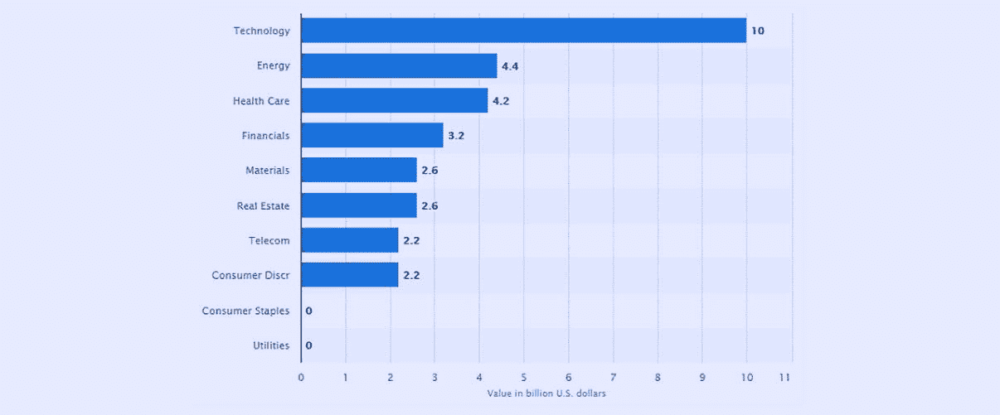
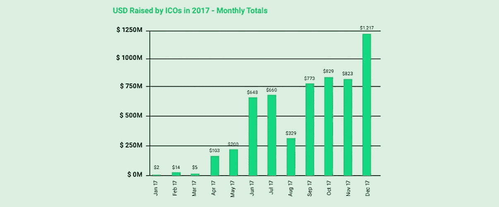
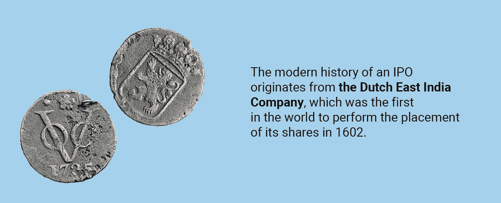
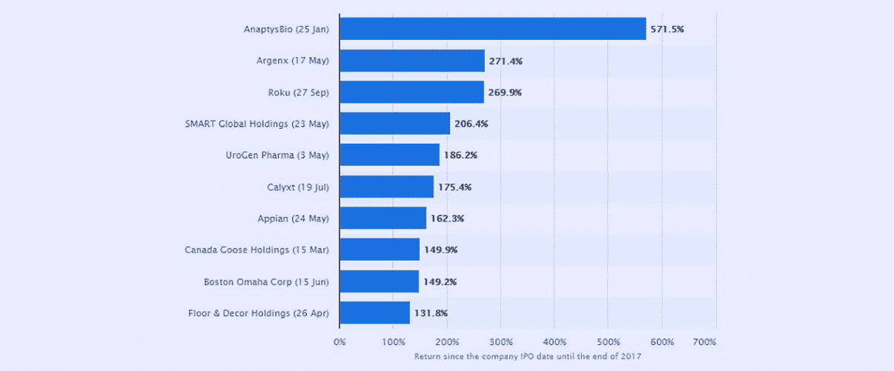
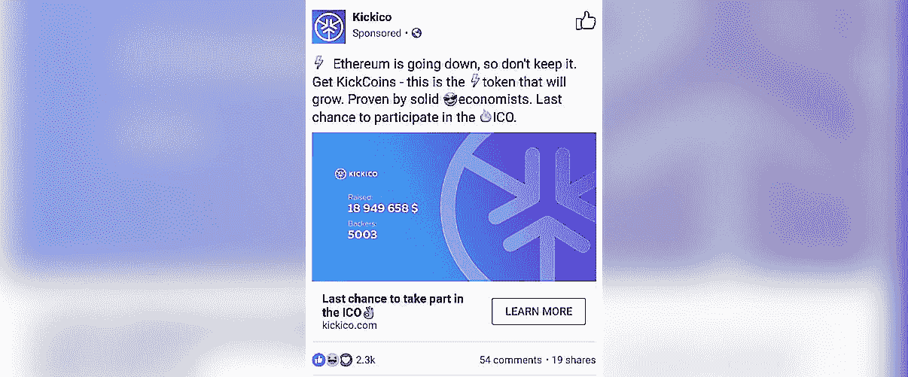

# 伊藤:一种新的投资模式还是密码爱好者的游戏？

> 原文：<https://medium.com/hackernoon/ito-a-new-investment-paradigm-or-a-game-for-crypto-enthusiasts-42f7b395ca0a>

2017 年密码市场的快速发展催生了投资创业公司的新模式。这个充满活力的年轻行业可能已经被称为首次公开募股(IPO)的传统融资流程所压制，这种流程缓慢，并受到严格的监管。最初的代币发行(ITO)这种新模式旨在应对时代的挑战。

那么，在哪种情况下，公司应该选择 ITO 而不是屡试不爽的 IPO，采取这一步骤的风险和好处是什么？

# 2017:ICO 的崛起

现代首次公开募股的历史起源于 1602 年世界上第一家进行股票配售的荷兰东印度公司。通过机构投资者吸引资金的做法由来已久，因为这一过程吸引了大量资金。看看 2017 年美国的[IPO 数量就知道了](https://www.statista.com/statistics/453869/ipo-deal-value-usa-by-sector/):

来源:statista.com

上图按行业显示了 2017 年美国首次公开募股的价值(投资者为 IPO 带来的资金量)(以 10 亿美元计)。

去年，仅在美国，首次公开募股就筹集了大约 300 亿美元(我们稍后将回到这个数字)。

只是在最近几天，区块链的技术才允许我们在风险资本投资方面打开一个新的篇章。

去年，由最初的硬币发行模式资助的加密初创公司市场出现了前所未有的增长。

来源:[代币市场的状况](https://static1.squarespace.com/static/5a19eca6c027d8615635f801/t/5a73697bc8302551711523ca/1517513088503/The+State+of+the+Token+Market+Final2.pdf)

众所周知，以太坊 ICO 是最早的初始硬币产品之一，也是人类历史上最成功的众筹活动之一。

受到以太坊和其他先行者成功的鼓舞，开发商开始将他们的项目一个接一个地放到 ICO 上，投资者在市场整体增长的背景下获得了[十倍的利润](http://icowhitelists.com/2017-ico-review/)，而这还只是在去年年底。但是故事并没有就此结束。

2018 年，该领域的积极增长不仅继续，而且有所增加:2018 年前六个月的 ICO 融资[已经超过了 2017 年](https://icobench.com/stats)筹集的资金总额(约 60 亿美元)。据公共风险投资基金创始人 [Richard Muirhead](https://www.fabric.vc/report/) 称，“我们很少对上升的一年承诺交付的东西感到如此兴奋:打算在主网络上上线的数字项目，分散化的交易所采矿牵引，包括托管和会计在内的行业级服务，身份网络和数据所有权模型，使主权个人的发展成为可能，等等。”

ICO 行业在这种背景下的“爆发”不仅仅是文字。你可以看到 Elementus 团队完美地执行了这个过程的[可视化](https://www.youtube.com/watch?v=rIMKNkF6d28)。顺便说一下，在这个视频中，所有 ico 的总资本总额的增长停止在 230 亿美元(2018 年 3 月 31 日)。还记得之前的数字吗？仅在 2017 年，美国投资者在传统 IPO 中筹集的资金就有 300 亿美元。这表明，尽管密码爱好者保证“传统投资方案的死亡”，但在新老模型下筹集的资金仍然是不可通约的。

许多人[将现代密码市场与发生在 90 年代末的“网络泡沫”](https://hackernoon.com/popping-the-bubble-blockchain-and-cryptocurrency-7130156f91b2)相提并论。在那个时候，拥有一个域名就足够了。然后在你公司的商业计划中输入“互联网”这个词，这样你就可以让钱直接流入你的口袋。根据怀疑论者的说法，同样的事情正在区块链科技发生——太多的项目吸引了赤裸裸的营销和空洞承诺的资金。

有趣的是，[IPO 系统的兴起是在“网络泡沫”的兴起之际，](https://www.cnbc.com/2012/05/17/Failed-IPOs-of-the-Dot-Com-Bubble.html)人们经常将它与加密货币市场的迅速破裂相提并论。

今天投资市场的状况似乎是，传统的 IPO 模式已经动摇，其“区块链颠覆者”ITO 和 ICO 正在积极征服市场。

然而，现在谈论已经存在了 400 多年的投资模式的崩溃还为时过早。IPO 和 ITO 都有各自的优点和缺点，我们很快就会讨论到。

那么，是什么催生了金融科技领域这一新的强大趋势呢？象征性出售而非首次公开募股能给公司带来什么？

# IPO vs. ITO:投资模式的碰撞

# 第一轮:观众

想象一下，你穿越到 2004 年，你正在考虑购买一家名为谷歌的相对较小的公司股票的机会，这家公司将首次公开募股。你认为这是个好主意吗？毫无疑问。通过现在出售这些股票，你将在 10-15 年内获得 1850%的收益率(T1)，这在传统金融领域被认为是疯狂的。

但有一个问题:在 2004 年，如果你不是来自华尔街，你就不会在投标前购买这些股票。这只能通过有资格的经纪人来完成，他们更喜欢与机构投资者合作(你可以在这里阅读更多关于 IPO 程序和细节[)。根据 Investopedia](https://www.investopedia.com/university/ipo/ipo1.asp) 的说法，作为一个散户投资者，你“很少甚至根本没有机会接触 IPO，”[。这只是股市的规律。因此，这里我们面临着首次公开募股的第一个显著特征:**首次公开募股主要面向大型风险投资者。**](https://www.investopedia.com/articles/active-trading/030515/what-difference-between-institutional-traders-and-retail-traders.asp)

好了，现在我们可以看看被 ICO 项目吸引的观众了。
让我们考虑一个从加密领域成功创业的例子——比如以太坊。任何在 2014 年投资 BTC 以太的人都可以匿名获得他的硬币，汇率为 2000 以太兑换 1 BTC。没有验证。没有限制。纯粹的众筹而已。

投资者控制方法的如此巨大的差异让我们想到了下一个要点:

# 第二轮:销售的目的

有必要理解为什么公司不管其形式如何都要进行公开出售。在传统金融领域，一家公司的首次公开募股是一个严肃的步骤，涉及许多监管阶段的通过。一次恰当的公开出售最终会极大地提高公司的权威，并允许它大幅增加资本(正如谷歌的情况一样)。因此，在传统市场上，有一些实力雄厚的公司**希望通过完成首次公开募股来提高自己的声誉，并在投资者眼中“成长”。**

在加密的世界里，情况更加疯狂。众所周知，ICO 内部的资金往往是靠一个很有前景的想法聚集起来的，这个想法一文不值。这未必是一件坏事——例如，一个成功的“第二波”NXT 区块链项目是从志愿者捐赠的[2 万美元比特币](/@aajaji_m/why-ardor-blockchain-is-important-to-know-77166bf7b6fa)开始的。我们最近写到了 NXT 的继承人——一个被称为 Ardor 的有前途的区块链。

# 第三轮:经济模式

这里首先要强调的是，ico 和 ITOs 略有不同。[代币是比硬币更一般的概念](https://cryptocurrencyfacts.com/what-is-a-cryptocurrency-token/)(但仍可作为支付手段)。它也不仅仅是一家公司的股份。

传统的股份制度基于支付股息的原则:股东购买公司的一小部分，并有权要求公司的部分利润(与他或她持有的股份数量成比例)。

在加密领域，我们只能希望我们投资的选定平台保持需求，这将直接影响令牌的价格(如果是公用事业)。公用事业代币的作用相当于门票或优惠券，代表使用公司产品或服务的权利。这种代币的主要特点是，它们不是作为投资而设计的(这就是为什么公用代币可以更容易地避免监管机构的问题)。只要投资者不拥有区块链创业公司的任何部分，这种新经济模式的成功就在很大程度上取决于该平台的增长和使用。加密货币正在催生大量 DApps，并管理着大量新 ico。这就是为什么以太公司已经为其早期投资者赚了 [> 200，000%的原因——这是在考察](https://www.statista.com/statistics/251173/best-performing-ipos-in-the-united-states-by-return/)[美国 2017 年最佳 IPOs】时要考虑的另一件事，这些 IPO 要温和得多，尽管从传统角度来看仍然非常有利可图:](https://www.statista.com/statistics/251173/best-performing-ipos-in-the-united-states-by-return/)

# 伊藤的危险

前一部分似乎不是一个很好的平衡和冷静的审查 ITO 和 IPO 的优势，对不对？似乎这种新的投资模式看起来更有趣:它让你能够通过广泛的受众吸引更多的资金，以避免漫长而昂贵的监管审批，并让你购买受智能合约约束的代币，因此比传统股票灵活得多。我们也知道[像 IOTA](https://coinmarketcap.com/currencies/iota/) 这样的成功创业公司的迷人例子，它们通过 ico 给投资者带来了巨额利润。如此高的回报在“传统”投资中是不可想象的。

但同时，重要的是要明白，没有大风险就没有大利润。众所周知，从长远来看，大多数 ico 都会失败。以下是在关于 2017-18 年 ICO 市场状况的[卓越报告](https://www.fabric.vc/report/)中介绍的情况，“……当前的令牌模型仍然远远不能解决开源资金问题。大多数投资者对加密货币的特殊性质比对开源开发的效率更感兴趣。这些项目中有很多在获得任何市场认可之前就已经筹集了大量资金，这给团队的长期认同带来了问题。”

随着加密货币项目越来越多，开发者越来越难吸引观众的注意力。结果是下面的“天才”广告:

密码社区[对 Kickcoin](https://www.reddit.com/r/ethereum/comments/6y5sjo/is_this_the_worst_ico_ad_ever_run/) 的这张图片大加取笑，但它确实反映了 ICO 领域的现状。不幸的是，来自小投资者的“虚拟”资金主要输给了在加密货币诞生前几十年参与经典 IPO 的聪明投资者。

Telegram 的例子很能说明问题，它只为其[吨项目](https://www.coindesk.com/telegram-ico-know-dont-2018s-biggest-token-sale/)向机构投资者募集资金(你可能知道，Telegram 拒绝了一轮公开的象征性出售)。事实上，如果一个项目可以通过私人基金的方式关闭整个硬资本，那么它为什么要与密码市场上的数百万小玩家打交道呢？Telegram 的 ICO 与传统 ICO 几乎没有共同之处。所有的代币都是根据一个简单的未来代币协议(SAFT)出售的，并且有一个很长的锁定期。这意味着投资者并没有完全购买代币，而只是购买了允许他们在以后认领代币的合约。TON 的开发商以及拒绝公开发售代币的其他大型项目都害怕将代币撤回到动荡和不可预测的加密货币市场。这可以通过单日抛售 BTC 抑制其资产的所有基本面增长。

# ITO 的使用案例

对于有些项目，使用 ITO 是唯一正确的选择。其中包括，例如， [Dominium](https://dominium.me/) 区块链房地产管理平台。

该平台的创建者旨在征服世界上最大的市场之一——房地产市场，据估计该市场的价值超过 200 万亿美元。

DOM 令牌是一个实用程序。它们用于支付平台上的所有活动，如创建资产、交易资产、创建支持票、为慈善机构投票、列出待售物业、列出出租物业、注册租赁协议、注册购买协议以及注册物业管理行为(维护等)。).

Dominium 为什么选择一个 ITO 作为投资模式？

*   这是一个早期项目。该团队没有数十亿美元的资金支持，所以他们更愿意通过象征性出售来筹集启动资金。ITO 的一个最重要的特点是，它允许公司非常容易地将基础从项目爱好者提升到早期采用者。
*   多米尼亚需要大量采用他们的技术。这就是为什么首次公开募股不是一个明智的决定，尽管它可能会涉及财务问题。象征性销售和空投要好得多，因为它启动了项目受众的有机增长。Airdrop 是一种围绕项目创建社区的好方法，而对代币的稳定需求将导致新投资者的流动，这相当于代币购买者。

众筹是让人们认可你的品牌，为你的产品创造潜在市场需求的好方法，不管它是否存在。

以下是该项目的计划:

首先，Dominium 已经将鹿特丹的 24 套公寓转移到 Dominium B.V .公司，他们将在 ITO 之前将更多资产转移到 Dominium。这确保了在 ITO 开始之前，公司已经有大约 500 万€的未来价值。该金额将成为 ITO/私人销售前的硬上限。

接下来，Dominium 将把前 ITO 和 ITO 期间筹集的几乎所有资金投入房地产。整个过程都将被审计，因此每个参与 ITO 的人都确切地知道他们的钱去了哪里。一旦租金收入开始进来，Dominium 将开始回购 DOM 并使它们退出流通(连同在平台上赚取的 DOM 代币交易费)，从而确保 DOM 代币的供应不断减少。

综上所述，ITO 和 IPO 各有各的优势。选择哪种方案取决于公司的商业模式。

ITO 可以用于项目的初始启动，并吸引忠实的观众，而不会引起监管机构的太多注意。

## 关于作者:

基里尔·希洛夫——geek forge . io 和 Howtotoken.com 的创始人。采访全球 10，000 名顶尖专家，他们揭示了通往技术奇点的道路上最大的问题。加入我的**# 10k QA challenge:**[geek forge 公式](https://formula.geekforge.io/)。