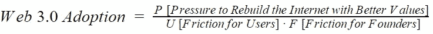

# 这与价值观有关，但价值观并不总是胜利:为什么我不看好 Web 3.0

> 原文：<https://medium.com/hackernoon/its-about-values-but-values-don-t-always-win-why-i-m-bearish-on-web-3-0-4e8dea92285f>

*—本帖是* [*区块链万亿美元期货*](https://itai.com/2018/11/14/blockchains-trillion-dollar-futures/) *系列的一部分—*

Web 3.0(也称为“分散式 Web”或简单地称为分散式网络和应用的新兴空间)是未来几年每个人都应该关注的加密类别。成千上万的创始人、基金和媒体机构每天都声称[现金和储值手段](https://itai.com/2018/11/14/blockchains-trillion-dollar-futures-cash-and-store-of-value/)仅仅是个开始，就像 1995 年毫无防备的地球人一样，我们即将见证由区块链驱动的大规模、改变世界的应用程序的出现。

现在做出古怪的预测还为时过早，但这并不妨碍许多人做出预测，并虔诚地为之辩护。在这篇文章中，我将尝试把这种情况归结为一系列观察和关键问题，当我思考 web 3.0 的未来时，我会问自己这些问题。

让我们从一些观察开始:

*   **区块链并不是任何应用的唯一推动者**。独一无二的促成因素是智能手机对于优步的意义。从技术上来说，100%可以用区块链构建的应用程序也可以用任何商业数据库构建
*   然而，区块链不同于常规应用，它提供了“牢不可破的保证”:它们无需许可，不受审查，不受任何单一实体的控制。他们为所有参与者预定义角色和规则
*   这些保证吸引了一些人，因为它们意味着开放、竞争、真正的所有权、技术统治、自由和自由市场
*   使用区块链产品的用户需要为这些保证付出代价。我们生活在一个很多人都不会做简单外汇数学的世界。截至 2018 年，使用去中心化 web 需要理解私钥等技术概念，使用一套新的软件工具，并管理不同实用工具令牌的库存，以消费不同的服务。用户还不得不接受灾难的不可避免性，如丢失私人钥匙，以及在最坏的情况发生时往往没有客户支持电话号码可打
*   与传统科技企业相比，这些担保对创始人来说也是有成本的。走激进去中心化路线的创始人无法使用世界上最先进的云基础设施(比如 AWS)。他们的服务不能收费。他们在潜在用户面前设置了极高的障碍(从获得实用工具令牌到安装特殊软件)。随着时间的推移，他们牺牲了治理以及迭代和改变产品的能力，这是科技创业公司的现实。他们必须考虑流动性，并选择一个区块链单独运行，因为区块链还不能互通

互联网之所以有今天，是因为它让用户和创始人的生活变得方便。**但是去中心化网络的成功似乎与其说是便利，不如说是价值**。我认为 web 3.0 是互联网的一个版本，用便利换取更好的价值。

价值观总是胜过便利吗？理想主义者是这样认为的。我更愿意问价值观有多吸引人，牺牲了多少便利。这就是为什么我认为未来几年我们应该关注三个重要的变量:

*   **P(压力)** = **要积累多少压力**“用更好的价值观重建互联网”？
*   **U(用户摩擦)** =使用**区块链产品**与集中式产品相比有多复杂？
*   **F(创始人的摩擦)** =建立一家区块链公司**与建立一家中央集权公司相比有多复杂？**

如果 P 上升，U 下降，F 下降，Web 3.0 更有可能发生。冒着笨拙地把定性陈述打扮成定量陈述的风险，你可以这样想:

您还可以使用这个框架来评估特定的项目和用例。例如，让我们看看它如何解释比特币作为价值储存手段的成功:

*   **高 P** :全球金融危机后，比特币利用高压建立了一个更好的货币体系
*   **低 U** :随着钱包和兑换变得更加可信和简单，用户之间的摩擦得到了控制
*   低 F :摩擦对创始人来说从来不起作用。比特币是一个极其简单的发明，(可以说)从来不需要更新

人们假设极客们会通过为 web 3.0 构建去中心化的基础设施来“解决问题”，并将 U 和 F 降低到零，但这不是一个微不足道的说法:

*   **P 问题**:是否存在来自用户的重建互联网和消费这种基础设施的真实压力(P)，还是本末倒置的情况？
*   **U 和 F 问题**:当我们慢慢构建去中心化的互联网时，人们似乎忘记了中心化的互联网还在继续发展。亚马逊、苹果、Facebooks 和 Stripes 都在不懈地努力，让集中式产品更容易启动、运行和使用。像 Carta 这样的公司可以与监管机构合作，帮助初创公司向早期采用者授予股权，解决市场鸡生蛋的问题，一些人希望区块链能够解决这个问题。随着分散式基础架构在未来 3 年内提高 5 倍，是什么阻碍了集中式基础架构取得同样甚至更大的进步，从而提高 U 和 F？

有趣的是，今天有一个囚徒困境在起作用:当互联网有更好的价值观时，世界会变得更好，但作为一名创始人，我宁愿围绕我 99.5%的想法建立一个集中化的公司，因为这样我有更高的胜算。

理想主义者庆祝“重建互联网”和创造新型经济活动的想法。当然，这意味着巨大的价值创造。我认为目前的市场价格、投资者资金和媒体报道对这种情况的反应过于激进。

这里有一个可能发生的不那么革命性的场景:分散技术将是未来的**部分**，而不是**定义的**未来。几个大区块链可能成为互联网从未有过的“原生数据库”。比特币可能是现金的数据库。公民可以是身份的数据库。以太坊可能是一个所有权数据库(在 AWS 术语中，这意味着以太坊将更像 [S3](https://aws.amazon.com/s3/) 而不是 [EC2](https://aws.amazon.com/ec2/) )。如果发生这种情况，以太坊的市值会从目前的 200 亿美元起飞或下降吗？

密码社区中大量的过度自信和群体思维会迷惑最清醒的头脑。也很难知道人们的理想主义在哪里结束，他们的贪婪在哪里开始。至少，我认为现在判断革命是否不会集中，或者革命是否会发生还为时过早。

*原载于 2018 年 11 月 14 日*[*itai.com*](https://itai.com/2018/11/14/its-about-values-but-values-dont-always-win-why-im-bearish-on-web-3/)*。*