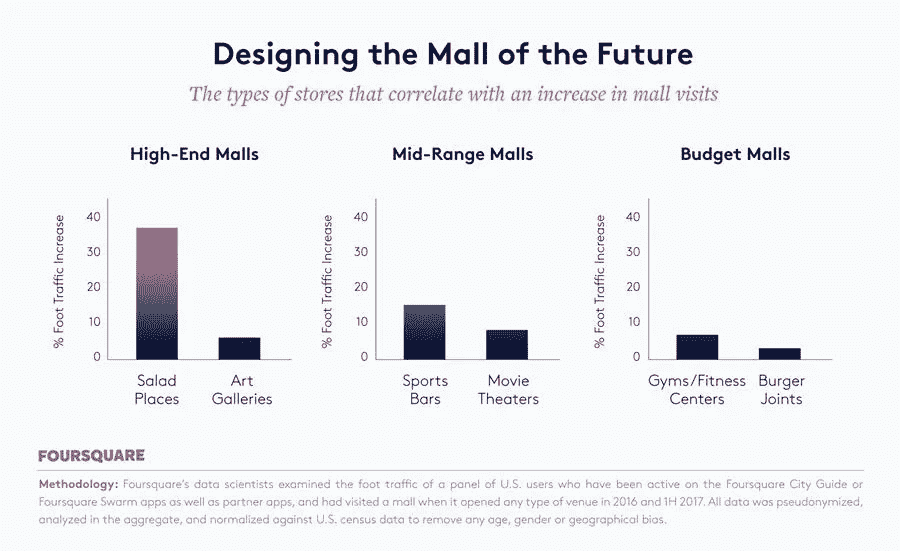
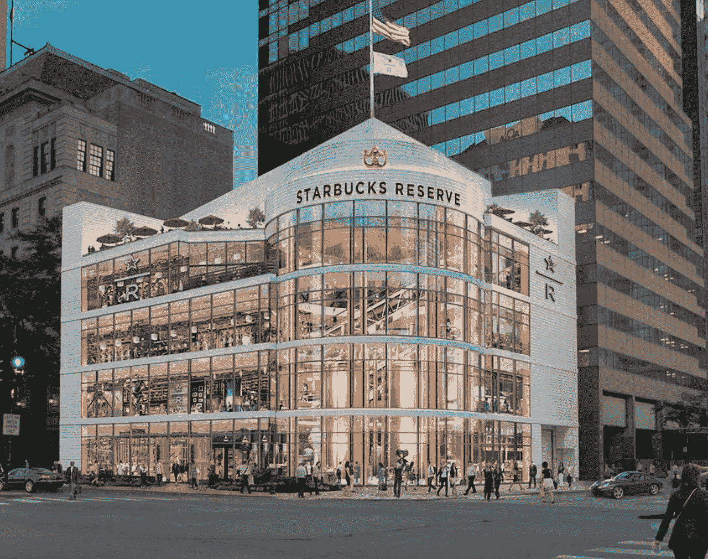
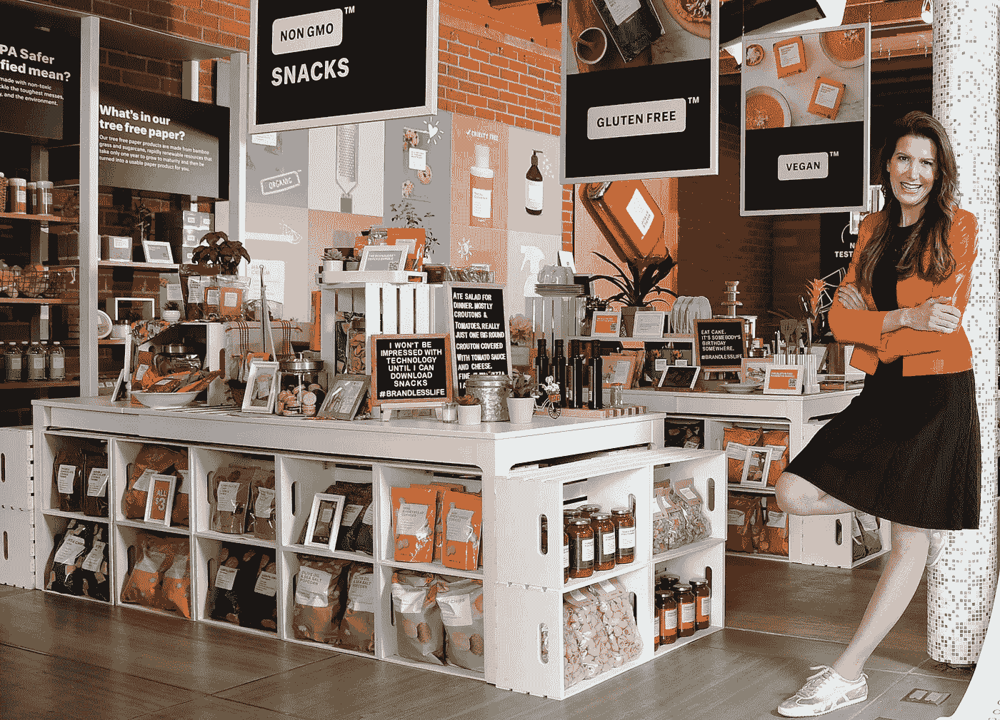
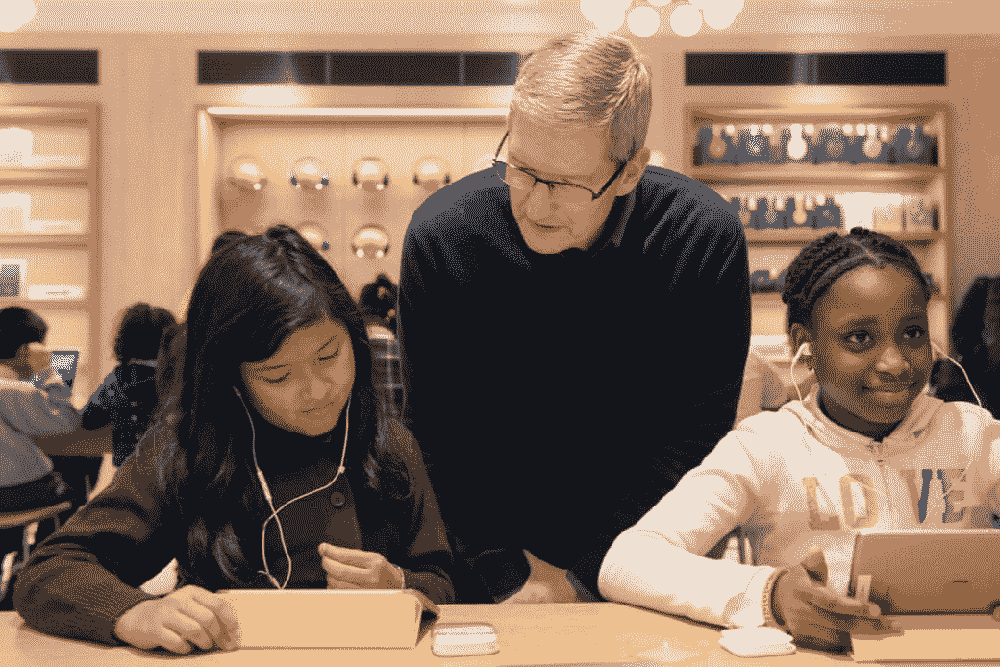

# 一切都是为了体验

> 原文：<https://medium.com/hackernoon/its-all-about-the-experience-eba1f8bbc958>

我最近在 Alex Kantrowitz 的[科技巨头更新](https://www.buzzfeed.com/alexkantrowitz/sign-up-for-tech-giant-update-a-newsletter-on-amazon-google?utm_term=.guKa57KGm#.wwwMedXYA)中看到了这张图表。这是一个有趣的图表，显示了以“体验店”为特色的购物中心客流量的增加。虽然众所周知，人们喜欢体验，但随着零售业继续从面对面的活动转向在线活动，这是一种新趋势。

我发现观察品牌如何应对这一趋势特别有趣。零售创业公司和巨头都在建立不同类型的体验，以保持和吸引新客户。

让我们来看看。

## “美食体验”

仅在美国就有超过 13，000 家分店，星巴克需要探索新的方法来吸引、娱乐和留住顾客。星巴克一直是一个注重“体验”的品牌。他们战略的核心是成为客户不在家或不在办公室时聚会、工作和放松的“第三场所”。然而，随着零售点客流量的普遍下降，该公司必须在如何创新其“第三地”战略方面更具创造性。

*2014 年 12 月 5 日，星期五，星巴克开启了全新的咖啡体验:星巴克保留烘焙和品尝室。这是一个你可以体验从未经烘焙的咖啡豆到你的一杯咖啡的地方。你可以看着它被烤。你会看到它装在麻袋里。可以看着它被装入* [*青咖啡装载坑*](http://starbucksmelody.com/2015/10/11/coffee-education-the-green-coffee-loading-pit-at-the-roastery/) *。你可以在咖啡勺吧买到它。你可以体验倒杯咖啡、虹吸冲泡咖啡、三叶草冲泡咖啡、一杯浓缩咖啡、浓缩咖啡饮料等等。”*

有了 Starbucks Reserve，该公司采取了一种不同的方式来销售咖啡，向顾客展示从咖啡豆到杯子的链条。虽然这些类型的体验店通常不太喜欢回头客，但它允许公司将目标受众扩大到家庭。凭借 Reserve 概念，星巴克实际上开辟了一个博物馆，父母可以在这里享受他们喜爱的饮料，孩子们可以欣赏风景和讲述一杯咖啡的故事。如果你问我，我会觉得很酷！

## “弹出体验”

同样有趣的是，零售创业公司是如何跳过实体店铺的。

[我最喜欢的创业公司之一](https://hackernoon.com/fantasy-vc-portfolio-6686b5371859)、[无品牌](http://brandless.com/)，销售日常杂货和家庭必需品。然而，与其他在线零售商不同，他们开设弹出式商店是为了促进社区参与，而不是销售。

> “整个体验是关于无品牌社区走到一起，这就是为什么没有人可以带着公司的任何产品进来和出去。相反，无品牌大使将带着 iPads 四处走动，帮助人们在商店里制作一个无品牌的盒子，但最终仍然会把它运到他们家里。
> 
> “我们不卖任何东西，因为每个人都有自己的商店，”夏基说，“我们不需要在实体零售中卖任何东西。在实体零售中，我们卖的是善良。”——[广告周刊](https://www.adweek.com/digital/brandless-pop-up-is-focused-on-community-engagement-rather-than-selling-products/)

Casper 也求助于 Nordstrom，在全国各地的实体场所做[一系列弹出式广告](https://www.retaildive.com/news/casper-turns-to-nordstrom-in-latest-pop-up-effort/527946/)。这些伙伴关系往往会增加那些想“先试后买”的人的销售额和客流量，这有助于在线零售商增加对那些不习惯在线购买产品的人的销售额。这是一个双赢的局面，因为 Nordstrom 迫切需要吸引顾客的创意。顾客来买床垫，留下来买衣服，希望两样都买。

## “教育经历”

苹果公司一直以通过店内体验向儿童介绍技术的策略而闻名。如果你在周日下午走进任何一家苹果商店，你会看到几十个孩子坐在豆袋上玩耍、学习，并与苹果的产品和员工互动。这是一个明智的策略，不仅能增加店内流量，还能从早期就提高品牌忠诚度。公司的这一举措尤其有趣，因为每个人都在周末寻找和孩子们一起做的活动。通过提供一个成人和儿童都想花时间的地方，它将苹果定位为一个致力于教育儿童的家庭品牌。

## 一切都是为了体验

这些只是我印象深刻的几个例子。众所周知，如果品牌想让人们从沙发上站起来，就需要提升他们的店内游戏。此外，随着我们越来越习惯把东西送到家门口，观察其他零售规范的变化会很有趣。但有一点很清楚，无论你是在店内购物还是在网上购物，体验才是最重要的！

感谢阅读！

你好！我叫乔丹，在以色列的一家全球风投公司工作。风险投资/创业领域发生了很多事情，我想我应该在这里发表我的观察。所有观点都是我自己的。 *随时关注并在 Twitter 上取得联系*[*@ jordanodinsky*](https://twitter.com/jordanodinsky)*。*