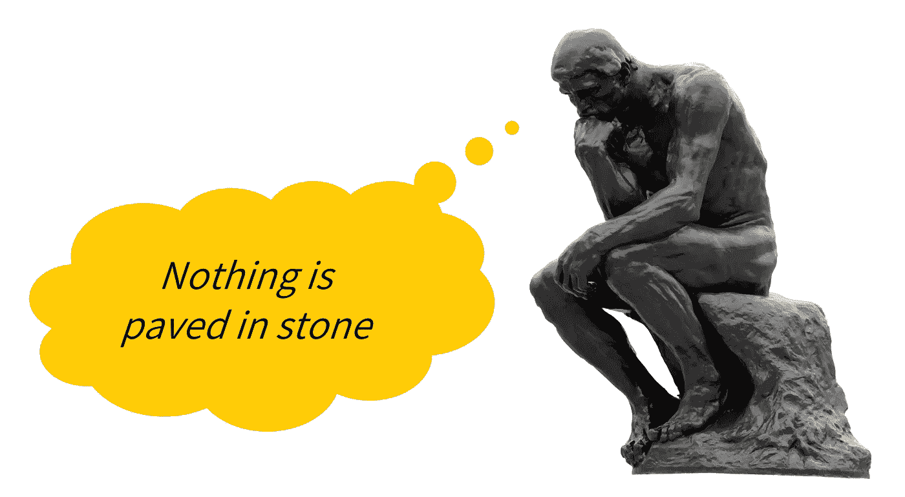
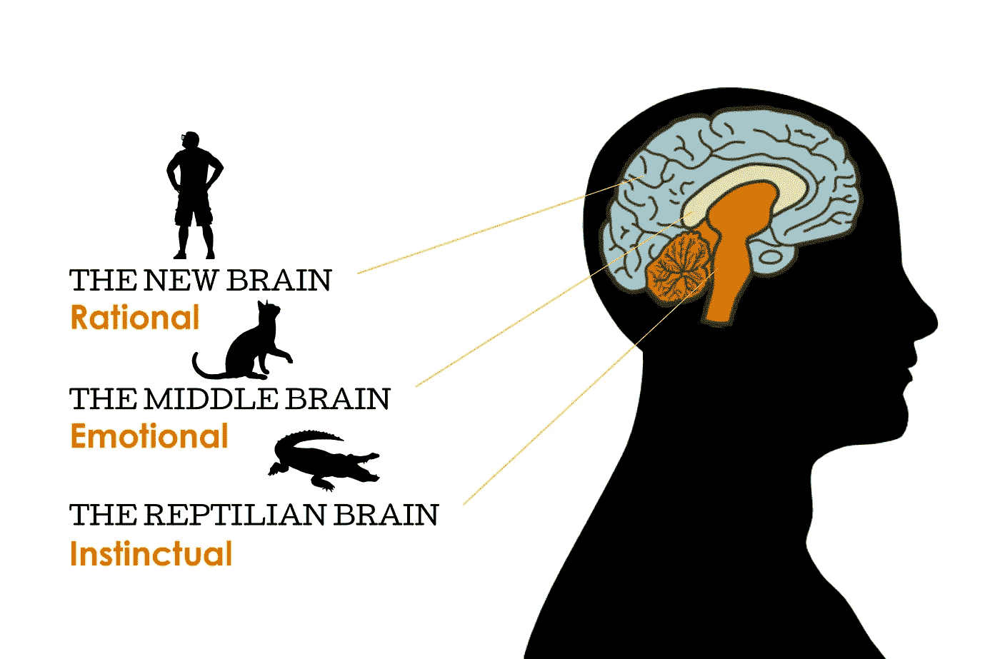
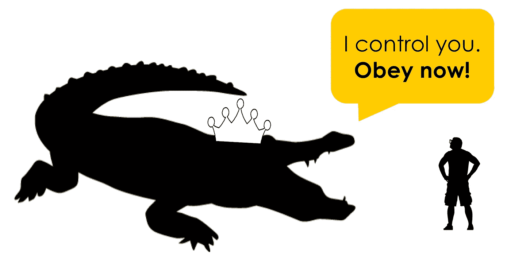

# 你还认为你的决策是理性的吗？最好摆脱这种观点来推动你的事业(和个人生活)向前发展。

> 原文：<https://medium.com/hackernoon/its-completely-irrational-to-think-decision-making-is-rational-2fabe48dfb4c>

*【不，没有博弈论的乐趣——事实摆在这里】*

你是一个理性的人吗？如果你在我十八九岁到二十八九岁的时候问我这个问题，我会自豪地说……是的！很有可能我也会开始胡言乱语人们有多愚蠢，95%的人是完全不理智的。

以这种方式思考，假设他人受到某种荷尔蒙情绪的内心声音的影响，而你自己的思考和决定是基于对信息的坚实加权，这种感觉真好。

回顾这个年龄的自己，我现在可以承认，我在个人和职业生活中做出的所有错误选择都源于这种自我认知。更重要的是，我相信人们做出的所有最糟糕的决定，无论是关于自己还是他人，都源于这种自我认知。

在过去的几年里，我几乎完全摆脱了这种态度。不，这并不意味着我开始做愚蠢的决定。相反，我认为我的决策能力提高了。

在专业方面，这也让我成为一个更好的营销人员和商人。就个人而言，我现在更快乐，也更能与世界和平相处，世界也与我和平相处。

*我把这篇文章献给所有的理性斗士，我遇到的所有超级聪明的技术人员，所有的自由主义者，所有的正义斗士。我爱你们所有人*——*请不要再挥舞错误的旗帜了。这会让你的生活变得更好。*

# 人类无法做出理性的决策

通常这样的一句话是从一个有些傲慢的角度来说的，针对的是别人，而不是自己。但事实是，这是一个简单的生理和心理事实。

请允许我先准备一下。在我们大脑的核心有一个我们称之为爬行动物大脑的结构。这不仅仅是一个昵称，这是一个真实的结构，从我们习惯用肚子爬行的时候起，它就已经留在了我们的大脑中。在它之外是一个中间的大脑，从我们成为哺乳动物的早期就一直存在。理性大脑位于这两个结构之上。

基本上，我们的大脑就像运行在非常古老的硬件上的非常复杂的软件，已经经历了无数次升级。这是非常错误的，而且非常容易产生偏见。

最大的“问题”是，我们大脑的基本功能，如决策，从未迁移到我们大脑中更高级的部分。他们受到大脑新区和中区的影响，但真正的决策老板仍然是我们内心的鳄鱼。

这意味着你不能用理性的言辞说服人们去做一些超出他们舒适区的事情。如果不涉及大脑更原始的部分，从生理上来说 *是不可能的*。

**理性的争论导致结论，但情感/原始的争论导致行动**。

试想一下:你什么时候见过一个人在激烈的讨论后改变了对政治的看法？你什么时候能说服一个苹果人转用安卓？

为了改变既定的政治观点，人们需要某种戏剧。没有什么比街上的血更能让一个人重新考虑自己的政治观点了(鳄鱼喜欢血)。以我们的手机为例，一个没有保险的碎屏足以让一个苹果粉丝变成安卓手机用户。

更聪明的人真正擅长的是事后把事情合理化。在这方面,**我们的新大脑就像一个辩论队,** — **它接收一个几乎没有参与决策的决定，并开始思考支持它的主张。**

没有鳄鱼的参与，人类根本无法做出理性的决定。承认吧，让自己自由！

# **你甚至不应该想保持理智**

想想吧。理性有很多种:一个精神病患者在“消灭”一个竞争对手时，会认为自己是极端理性的。人们为种族主义、厌女症等等找到合理的理由。那么为什么理性仍然被认为是一种美德呢？

把自己看得很理性，也是极端的居高临下。当你认为另一个人不理性，而不是简单地认为他是错误的或被误导的，你是在暗示他没有正确思考的能力。你给他打上了他无法摆脱的个人特征的烙印。

理性思考为看待政治竞争创造了一个可怕的镜头，并在很大程度上导致了现代社会差距的扩大。将一个对立的群体标记为不那么理性会立即产生一个不可逾越的鸿沟。谁会自愿去教育一个不理智的人？他不理智——那是行不通的。

总结这一点，对我来说，做一个理性的人仅仅意味着做一个傻瓜，我已经不再是了。

# 是的，但是你不能把我和其他人相比…

如果你觉得这篇文章有点陷阱，你就对了。我确实试图提出可以被理解为理性的论点来证明你是不理性的。你有没有觉得有点困？太好了！现在请允许我把你从陷阱中释放出来。

那么，如果你不是一个理性的人，你是什么？一个聪明人？一个聪明的？也许是一个把事情过度合理化的人？[我曾经是一个……而且从来没有好结果。]我的建议是把自己视为一个批判性思考者。

你以为只是术语？不，不是的。成为一名批判性思考者需要努力——它需要不断的自我质疑和改进，这与理性相反，理性是一种不需要努力或投资的恒定品质。

**改善与其他“不理智”的人的沟通**

理解并接受所有人，即使是最聪明的人，都是非理性的，这让我更容易接近他们，赢得他们的信任，并说服他们跟随我的领导。

但最重要的是，它让我发现并深刻理解了影响人类决策的唯一途径(超越个人经历)。一条比理性辩论更有效的途径。某种东西点亮了我们大脑前面提到的所有三个区域(如果你通过核磁共振成像来观察大脑，确实会点亮)。这个特定的东西就是**故事**(就像我在这篇文章中使用的那些)。

从分析/批判性思维的角度来看，当试图说服人们相信某事时，使用故事是一个人能做的最“理性”的事情。越来越多的研究证明了故事对人类的力量。自从人类开始使用语言以来的 10 万年里，这是人类交流中唯一允许我们作为一个物种进化的部分。这是我们真正学习的唯一途径。

从关系到商业，从艺术到科学，故事可能是接触和感动人类的唯一途径。因此，如果说做一个理性的人意味着做一个傻瓜，那么做一个批判性的思想家和讲故事的人就意味着站在人类进化的最前沿。这意味着充分利用你的大脑——理解和感受人性的方方面面。

无论如何，这是一个很长的故事，如果你还活着，你可能会想订阅。在以后的文章中，我会试着讲述更多关于故事在生活不同方面的效率，以及如何为不同的目的组织合适的故事。你也可以在这里阅读更多关于我自己的顿悟。