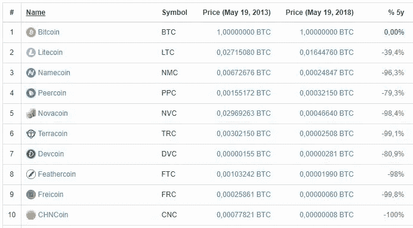

# 它就在这里——接受它吧

> 原文：<https://medium.com/hackernoon/its-here-live-with-it-d07479a00e8f>

The only coin still on the list is Litecoin — down 39,4 percent since then

随机现象很难理解。最常见的误解不是关于区块链的技术功能，而是发明的根本原因。*为什么*比特币被发明出来，而不是它是如何工作的。为什么比特币中的每一个历史事件都很重要，它们意味着什么，以及它们对于实现本发明的预期目的将产生什么样的长期影响。比特币是在 2008 年金融危机后发明的。这是一种创造*可靠货币*的尝试，即任何人都不能以任何方式伪造或篡改的货币。无通货膨胀货币。世界上只会有 2100 万个比特币，而这个，*只有这个，*才是区块链被设计来确保的。

另一个误解是，如果一种新的世界货币出现，它将以某种方式在国家或公民之间或多或少地平等分配。这充其量只是天真。供给和需求决定着每个市场，不管你在市场上使用什么样的政治过滤器。钱只是我们在和不认识的人交往时，用来表达价值的语言。当你意识到货币是一种语言时，你也意识到篡改货币供应是限制言论自由的一种方式。但是有一个转折。增加某种东西的供给会自动减少对这种东西的需求。说到钱，增加供应可能会在短期内为经济注入一些燃料，但总是以子孙后代为代价。简而言之，没有免费的午餐。

当你推出更好的东西时，有些人会比其他人更早意识到它的潜力。这是不可避免的，它会给早期采用者一个良好的开端。发明越大，优势越大。当这项发明像比特币一样对整个社会产生如此深远的影响时，早期采用者的收益将是巨大的。比特币的价格在很大程度上直接反映了这一点。大约每隔两年，这个数字就会增加一个零。这在那些还没有比特币的人当中引起了很多怀疑和嫉妒，因为他们中的大多数人仍然无法掌握比特币的潜力，他们认为比特币可以被复制，它已经达到了顶峰等等。这不是什么新鲜事，可能还会持续一段时间。因为一枚替代硬币的繁荣-萧条生命周期的繁荣部分可能会持续相当长一段时间。看看五年前的十大币就知道了。其中有一个今天仍然存在，以比特币计价，价值是当时的五分之三。

每个人都将不得不适应这样一个世界:比特币制造者每两年变得更富有 10 倍，以及这意味着什么。分散化现在是一个现实，地球上没有什么可以改变这个事实。这对于大多数人来说是很难理解的。他们愿意做的事情来证明他们的否认，有时简直令人难以置信。比特币是一个完全自愿的系统，开放给世界上的每个人使用。为什么一开始会有人反对呢？如果你没有在去年的反弹前买入，那就忍着吧。不要卖，等上几年，突然之间*你就成了*早期采用者之一，嘲笑那些抱怨显然是你生命中最美好的事情之一的可悲尝试。好东西最终真的会降临到那些耐心等待的人身上。作为一个局外人，T2 对比特币完全无能为力。作为业内人士，你也没什么可做的，但至少你可以享受其中的好处。

另外，今天我们庆祝比特币披萨日。查一下！