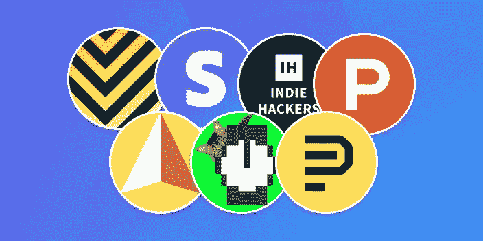
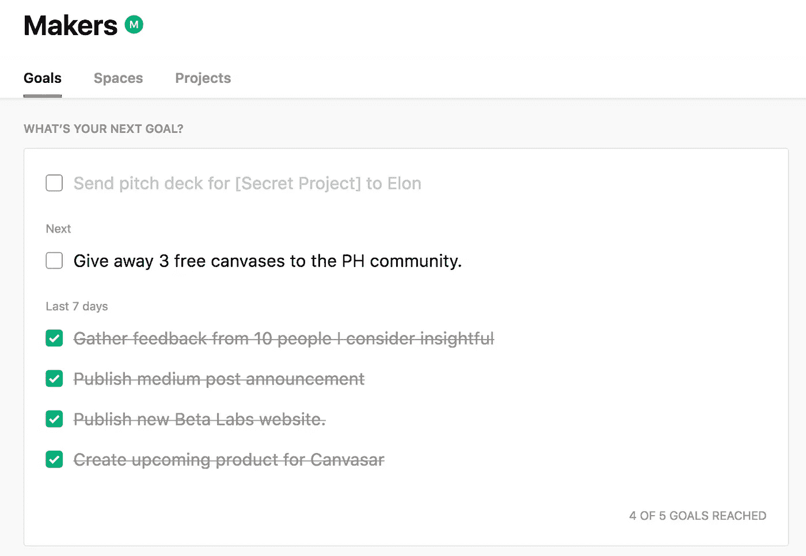
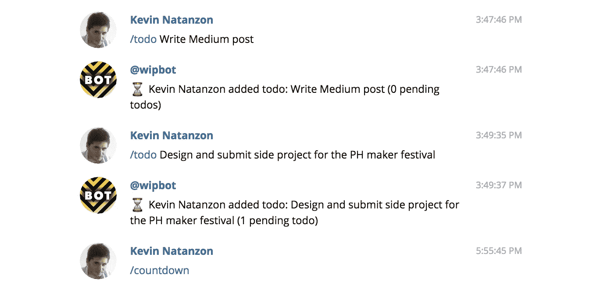
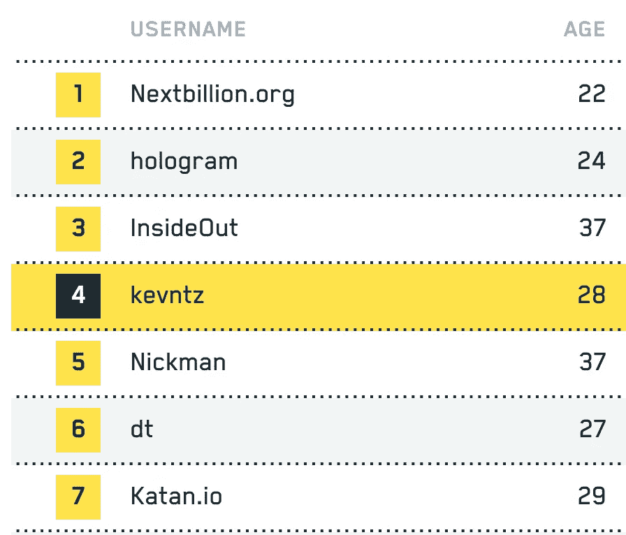
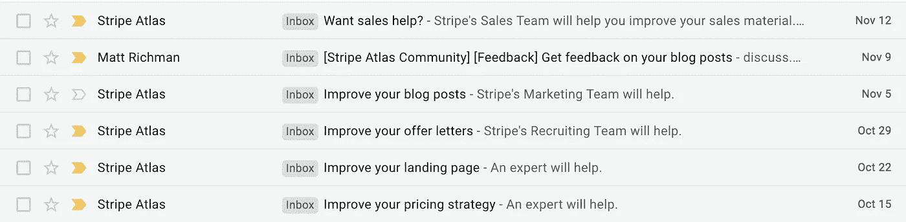

# 打造数字产品从未如此简单。

> 原文：<https://medium.com/hackernoon/its-never-been-easier-to-build-digital-products-18a7325bec6a>

## 创客支持社区的兴起。

创业公司很难建立。开发 app 很难。很难推销它们。这就是为什么只有少数人成功做到这一点。

尽管制作数字产品真的很难，但我相信这从来没有这么容易过。从来没有这么多的工具可以用来快速验证想法，加速开发、营销、产品设计以及其他许多与在线构建相关的任务。这篇文章不是关于创业公司可用的大量 SaaS 工具。我认为这个网站涵盖了其中的大部分:

 [## StartupStash——为你的创业公司管理的工具目录

### 建立你的创业公司的工具和资源的精选目录

startupstash.com](http://startupstash.com/) 

在我看来，这篇文章更重要，它将对成功的创始人数量产生更大的影响:**创客支持社区的兴起。**

这些社区帮助创始人从社区中获得鼓励，社区也是一个责任伙伴，迫使你完成目标。

所有这些社区都有着相同的使命，并且都是由志同道合的人推动的。然而，每一个都有一些不同的非常有价值和特别的东西。这些是其中的一些:

# **产品搜寻制造者**

我还在想我在发表[时写的《九强如何火起来并在一个月内获得 130 万用户](https://blog.beta.uy/top-nine-is-going-viral-1cef13033635):

> 产品搜寻团队和社区在我们的旅程中给了我们很大的帮助。从非常诚实的反馈到建议和支持。
> 
> 我相信产品搜索是一个制造商应该在构建任何东西的过程中使用的第一资源，无论目标受众是否是产品搜索社区，它都将帮助你获得可见性和反馈。

但我们不是在谈论作为一个发布平台的产品搜索。我们谈论的是创客社区:

 [## 制造商-产品搜寻

### 友好制造商的新社区

www.producthunt.com](https://www.producthunt.com/makers) 

maker 平台最棒的一点是，它与所有其他产品搜索功能深度集成。其中大部分是我们产品创造工作流程的一部分。我们使用我们即将推出的产品页面为 Canvasar.com[收集反馈，如果你想关注我们其他项目的更新，你可以](https://www.producthunt.com/upcoming/canvasar-com)[关注我们的团队页面](https://www.producthunt.com/team/beta-labs/)。

产品搜寻制造者社区是其中最大的一个。在我发布第一条“待办事项”几分钟后，人们已经开始提问并试图提供帮助。这也可能使它成为一件坏事，因为社区不像 WIP 那样近。无论如何，我认为 Abadesi 正在做一项了不起的工作，帮助许多创造者、创始人和制造者。

# **在制品**

就工作方式而言， [Wip.chat](http://wip.chat) 平台与 PH one 非常相似。你发布你的待办事项，每天你需要至少做一件来保持你的连胜。一个重要的区别是 WIP 平台是为独立制造商而不是团队设计的。它也深度整合到了[游牧者](http://nomadlist.com)中，所以它绝对是游牧者的最佳选择。

Wip.chat 甚至在产品搜寻制造商之前就开始了。它是由 Marc Kö hlbrugge 建立的，作为一个简单的电报组，供几个制造商分享他们正在做的事情，并让彼此负责每天发货。如今，这个团体已经发展成为一个充满活力的社区，成员们在公共场所工作，分享他们的进步，并互相激励继续发货。

关于 WIP 最好的部分？这是付费会员。事实上，它是付费的，使它变得更小，但这也意味着社区真的致力于运输和互相帮助。

大部分 WIP 仍然发生在电报群聊上。你有一个电报机器人，可以让你轻松地在聊天中执行任务，这些任务反映在平台上。

我还没有成为 WIP 社区的一员，但是到目前为止它看起来很有前途！我遇到了优秀的创始人和创客。

# 开拓者

先锋是一款提高生产力的在线游戏。你通过在项目上取得进展来获得分数。

I’m currently #4 on the non US category!

先锋锦标赛每月举行一次。你可以单独申请，也可以和整个团队一起申请。每周其他参与者都会给你反馈和分数。你的作品越有趣，你的分数就越高。其他申请人对您的申请进行投票，但他们只能看到您的部分回复。他们看不到你是谁，所以他们只根据你的进步来评价你。

每个月，排名第一的申请者都会成为新的开拓者。获胜者可以获得 6000 美元的恒星流明，5000 美元，专家指导，以及其他有趣的奖品。

我真正喜欢先锋的是，如果你真的在进步并努力工作，你肯定会获得先锋网络的曝光率和帮助。对于任何在网上建立任何东西的人，我绝对推荐它。你可以在这里报名参加下一届先锋锦标赛:

 [## 先锋——雄心勃勃的外来者的家园

### 我们正在建立一个由有创造力的年轻人组成的社区，他们在全球范围内从事有趣的项目。

先锋. app](https://pioneer.app/join/kevntz) 

# 条纹图谱

三年前，当我们决定在美国开设 C 公司时，我们认为这将是一场真正的噩梦。冗长的文书工作、银行访问、法律复杂性和许多其他意想不到的任务。令人惊讶的是，这真的很容易。几天之内，一切都准备好了。这只有使用[条纹图谱才有可能。](http://stripe.com/atlas)

Stripe Atlas 最棒的地方不是在美国注册 a C 公司的惊人服务，而是你得到的持续建议和宝贵支持。

当您使用 Stripe Atlas 组建您的公司时，您可以独家访问 Stripe Atlas 社区。它运行在一个类似论坛的平台上，在这里你可以与其他创始人联系，并向 Stripe 每周带来的专家学习。Stripe 还努力保持社区的活跃和有益。每周一，我都会收到一封电子邮件，里面有些东西可能会对我有所帮助:

# 其他社区

还有许多其他社区，我建议去看看。有几个值得一提:

【Indiehackers.com】(被条纹获得)拥有非常有价值的知识。我在社区上并不活跃，但我阅读了收件箱中的许多帖子。

如果你正在构建机器人，[机器人列表](https://botlist.co/)是另一个值得命名的平台。如果你不是，那么我鼓励你去看看，了解成长中的行业。僵尸名单策划周围发生的一切。

如果你正在读这篇文章，可能是因为 Hackernoon 社区给了我一个声音。如果你在写作中付出了努力，我推荐你在这里发表它们。很少有其他出版物在能够快速发布文章的同时，做了如此多的内容管理工作。Hackernoon 社区正在成长和发展，这就是为什么他们提高！在此处拥有 Hackernoon 的股份:

 [## 黑客正午

### 首屈一指的独立技术出版物

www.startengine.com](https://www.startengine.com/hackernoon?dig=5b9972903f4edf3bd4000689) 

我确信还有很多我不知道的或者不适合我们团队的社区。上周，levels.io 在推特上发布了其他一些消息:

# 结束语

对于那些愿意改变做事方式的创新者和制造者来说，总会有资源、金钱或建议可供利用。然而，到目前为止，这些资源并不是世界上每个人都可以访问的。

这些社区及其背后的领导者正在改变创业和在线产品的模式。现在有了大量可用的工具，无论你住在加拿大、葡萄牙还是乌拉圭，打造有价值的东西都变得前所未有的简单。利用它，并开始建立一些真棒！