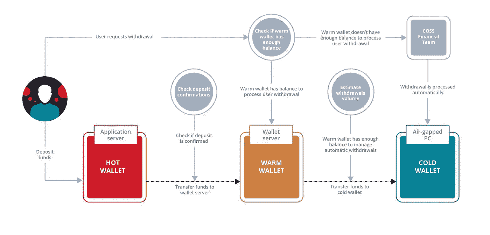

# 是时候解决集中式密码交换的大量问题了

> 原文：<https://medium.com/hackernoon/its-time-to-address-the-massive-problems-of-centralized-exchanges-ac2cfb66bef8>

# 需要解决的问题

正如 2017 年的大规模牛市所证明的那样，加密货币的早期采用主要是投机交易。然而，目前交易加密资产的经验是分散的流动性，以及高度技术性和高摩擦的过程。

安全缺陷困扰着整个行业，阻碍了它的应用。今天的投资者需要对风险有特别的偏好和容忍度，更不用说从猖獗的退出骗局和网络钓鱼攻击中辨别合法投资的敏锐能力。

## 集中式交易平台存在巨大的安全风险

如今，散户投资者可以利用的集中式交易所太多了，但这些交易所中只有一小部分得到了适当的监管，更不用说值得信赖和可靠了。

虽然像比特币基地这样的行业先驱推动了这个领域的发展，像币安这样的新进入者提高了另类硬币交易体验的门槛，但这个行业仍然遭受不断的黑客攻击和恶意行为。

> [仅在 2018 年，就有超过 10 亿美元的加密资产被黑客窃取&](https://www.coindesk.com/nearly-1-billion-stolen-in-crypto-hacks-so-far-this-year-research)

过去十年来，许多安全漏洞、黑客和骗局一直困扰着加密领域，不幸的是，2018 年已经发生了一些备受瞩目的事件:

*   ——日本第二大交易所——价值 5 亿美元的 NEM 被盗
*   1.95 亿美元从 BitGrail 窃取——意大利交易所，也是第一家上市 Nano 的交易所
*   从全球最大的交易所之一币安窃取了 4500 万美元
*   韩国一家精品交易所在 Coinrail 黑客攻击中被盗 4000 万美元
*   [从 Zaif](http://fortune.com/2018/09/20/cryptocurrency-exchange-hack-zaif-japan-60-million/) 窃取 6000 万美元——日本交易所

## 集中式钱包越来越成为大蜜罐

资金托管对交易所及其用户来说是一个巨大的风险。随着越来越多的资金从新投资者手中涌入这个领域，集中交易成为越来越大的“蜜罐”——对恶意参与者来说是一个诱人的目标。

集中式交易所的性质决定了一些受信任的第三方正在存储其用户的加密资产，以创建一个流动性池，这主要是通过将资金聚集到交易所拥有的数字钱包中来完成的，来自用户的资产被汇集到数字钱包中。

> 数以百万计的人不仅会失去他们的身份和数据，而且还会失去他们的钱。

Josh Edelson/Agence France-Presse — Getty Images

预计攻击的频率和严重性只会随着市场的增长而上升，并且可能会发生像最近发生的 5000 万用户脸书黑客攻击那样广泛的攻击，在这次攻击中，私人数据和金钱都被盗。

> [顶级交易所将价值超过 15 亿美元的代币存放在集中的“热门钱包”中](/faast/which-crypto-exchange-is-putting-your-funds-most-at-risk-517ca3c45ef2)

“热钱包”被集中交易所用来使资产可供交易，而其余未被交易的资产被卸载到“冷存储”，这意味着它们被存储在未连接到互联网的安全设备中。

虽然这应该是标准做法，但用户几乎不可能知道交易所是否真的采取了这些安全措施，交易所也不急于对他们拥有的钱包和资金的处理完全透明。

An example diagram of an exchange wallet system from COSS.io

## 缺乏安全保障和监管监督

除了保管用户令牌的风险之外，还有关于建立交易所的网络和基础设施的安全因素。

目前缺乏监管的明确性导致运营加密交易所的准入门槛较低。这反过来又使得人们很难区分那些遵守最严格安全标准的交易所和那些仅仅制造可信度和可信度假象的交易所。

政府方面的模糊立场意味着许多加密初创公司在监管灰色地带运营。美国证券交易委员会最近才澄清，他们认为[以太坊不是一种安全令牌](https://www.reuters.com/article/us-cryptocurrencies-ether/u-s-sec-official-says-ether-not-a-security-price-surges-idUSKBN1JA30Q)，这意味着它不受现有证券法的约束。

## 缺乏多样化的加密投资产品

直到最近，你只能从交易所购买代币。如今，我们开始看到基本指数基金的出现，如新比特币基地捆绑基金和 Bitwise。直到 2017 年底，我们才看到 CBOE 和芝加哥商业交易所推出比特币期货。

我们预计新进入者将继续进入这一领域，尤其是加密 ETF，以及指数基金或衍生品的其他尝试。湖泊项目采取了一种不同的方法，利用其专有的人工智能将投资置于自动驾驶仪上(在研发方面)。

## 猖獗的贪婪

虽然这不是一个特别局限于集中交易的问题，但据报道，上市一个代币可能会花费高达 300 万美元。相比之下，在纳斯达克上市一只股票需要 12.5 万至 30 万美元，外加年度维护费。

这只是那些有影响力的人和从中获利的中间人(顾问、经纪人、ICO 公司等)所表现出的贪婪的一个例子。这些高昂的费用抑制了创新，因为对于大多数 token/ICO 项目来说，这是一个无法承受的巨大成本。这对于大多数项目来说至关重要，因为它们需要流动性来支撑自己的网络，并与投资它们的社区保持良好关系。

## 其他挑战

除了安全问题，集中交易往好里说是不透明，往坏里说是垄断和腐败。说到底，他们是一个中间人，你必须信任他们才能与之交易，你必须遵守他们的规则和运作方式。

> [前 10 大交易所中至少有 7 家从事 12 倍至 100 倍真实交易量的过度清洗交易](https://www.blockchaintransparency.org/reports/)

*   **不公平交易** 大量的集中交易被怀疑和指控为不正当交易(制造虚假交易量)、内幕交易和[价格操纵](https://www.coindesk.com/study-claims-tether-props-bitcoins-price-in-market-downturns/)。
*   **高用户交易费用** 由于集中式交易所风险更大，对其平台的控制更不透明，因此与分散式交易所相比，它们通常收取更高的费用。
*   **提款限额** 集中交易实行提款限额，作为限制一次可提取金额的安全措施。然而，也存在激励错位的问题，因为当你将资金锁定在他们的平台上，让他们能够最大限度地提高交易费用时，他们就会受益

# 权力下放是答案。

为了实现自由流动的令牌化经济的未来愿景，这些基本层面的问题——价值和贸易的自由流动——需要得到解决，而这要从安全开始。

在 Lake 项目中，我们相信分散平台将解决这些问题。在下一篇文章中，我们将深入探讨:

*   什么是分散式交易所，它们是如何工作的
*   它们的使用案例和潜力
*   利与弊以及它们与集中式 exchange 的区别
*   分散式交易所如何解决本文中的一些问题

与此同时，如果你想了解更多关于我们去中心化金融未来的愿景，请访问[http://lakeproject.co。](http://lakeproject.co.)

我们还刚刚推出了零费用的分散式交易所 Lake Trade，现在在 main-net 上直播！

试试湖贸易这里:【https://trade.lakeproject.co 

## 感谢阅读！

## 想和我们联系吗？

加入我们的社区: [Reddit](http://reddit.com/r/lakeproject) | [不和](https://discordapp.com/invite/QeePZaE) | [电报](https://t.me/lakeproject) | [推特](http://twitter.com/lakeproject) | [媒体](http://medium.com/lakeproject)