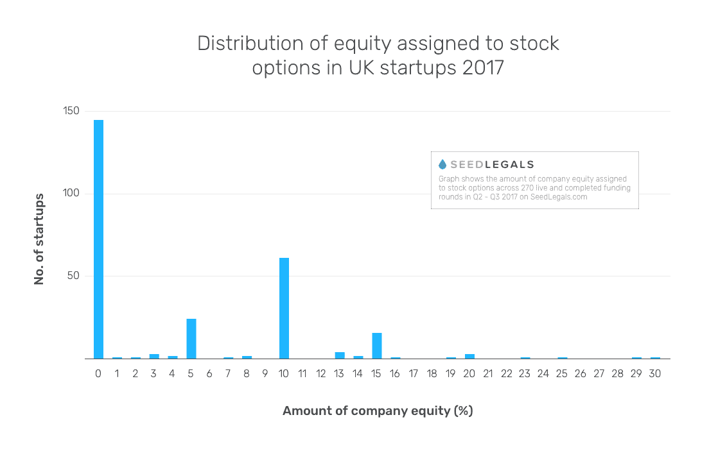

# 是时候改变英国初创公司对员工权益的看法了

> 原文：<https://medium.com/hackernoon/its-time-to-change-how-uk-startups-think-about-employee-equity-db344e8f6157>

英国创业文化与美国不同的一个重要方面是，我们英国人对股票期权(或我们这里称之为股票期权)不太感兴趣——这对企业家来说可能是一个真正的问题。

在美国，创始人利用期权来吸引顶尖人才。“帮我建立这个企业，”他想，“你可以以折扣价购买它的股份，当我们被收购或上市时，这有望让你变得非常富有。”

在英国，科技人才倾向于将股票期权视为一份不错的奖金，但他们仍希望获得反映其技能的高薪。考虑到大额资金退出在这里是多么不常见，这是可以理解的。

我们最终面临的是一个“先有鸡还是先有蛋”的局面。科技人才没有看到很多退出的机会，所以不想在基于股权的薪酬上冒险。但是，如果创始人不能在早期阶段，在他们支付得起人才要求的薪水之前，将顶尖人才招入董事会，他们就不太可能建立能够实现重大退出的公司。

设立股票期权计划是一件非常令人头疼的事情，这也于事无补。期权被视为一种“应税福利”,可能会给公司及其员工带来巨额税款。解决方案是政府的节税型 EMI 股票期权计划，但这需要大量的文书工作，可能需要与会计师来回几个月才能完成。

结果呢？2017 年 SeedLegals 平台上 200 多轮融资的数据显示，不到一半的高增长英国公司向员工提供股票期权，仅占 47%。

# **进入 SeedLegals 选项方案**

在 SeedLegals，我们的存在是为了让创业公司的生活更轻松。[我们新的 EMI 计划](https://seedlegals.com/emi-scheme)为您的员工消除了设立和实施股票期权计划的痛苦。

这一切都始于您的 SeedLegals 仪表板。只需填写一些快速的细节，让您的计划成立。曾经是严重的管理难题现在变得简单而容易。它也比旧的做事方式快 10 倍。

一旦一切准备就绪，你就可以将你的期权池作为你的资本表的一部分来管理，并在你需要的时候，通过定制的授予时间表将期权分配给特定的员工。员工可以在任何需要的时候登录并查看其期权的详细信息。只需点击几下鼠标，你就可以在你的计划中添加或删除员工——这在过去每次都需要更多的文书工作。

虽然您通常希望至少支付 5，000 英镑来建立一个符合 EMI 标准的选项计划(50 名以上员工的计划需要 10，000-20，000 英镑以上)，但我们只需 1，500 英镑，您就可以随时添加多达 250 名员工。更重要的是，因为一切都是简化的，并且是专门为帮助创始人而设计的，SeedLegals 可以阻止你在文书工作中犯代价高昂的错误。人类会犯错，机器不会。

这项新计划不会在一夜之间改变英国的期权文化，但它将帮助创始人提供一个压力小、费用低、效率高的期权计划。

如果你的早期员工相信你的企业，SeedLegals EMI 计划将帮助你回报这种信念。缓慢但肯定的是，我们可以改变期权文化，吸引最优秀的人才到英国创业公司。

有兴趣了解更多信息吗？[免费加入 SeedLegals】，让我们开始您的股票期权计划。](https://seedlegals.com/)