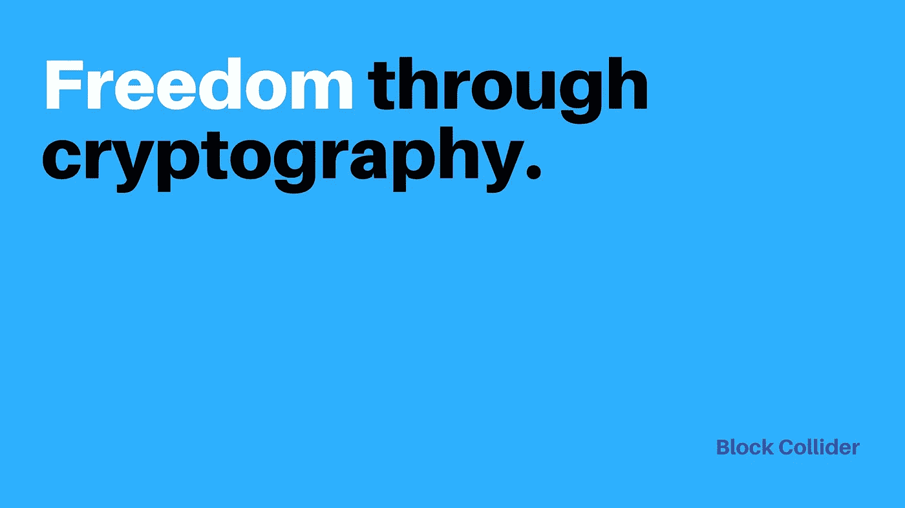

# 该放权的时候了。

> 原文：<https://medium.com/hackernoon/its-time-to-decentralize-decentralization-7a43eca350ee>

权力下放并不是什么新鲜事。

作为一种哲学，去中心化已经存在了几百年，如果不是几千年的话。

雅典、斯巴达和希腊城邦的遗产延续了足够长的时间，使其租户被纳入美国联邦国家体系。

几代人以来，自由市场和自由贸易一直很流行——而且似乎胜过了中央集权的国营经济(在很大程度上……)

然后比特币出现了——突然间，去中心化有了一个新的真正独特的典型代表。

对于许多不了解其优点、害怕其后果或者干脆忽视它的人来说，权力下放成了一个代名词。

> 新颖别致。时尚。前卫。

随着时间的推移，野间聪(Satoshi Nokamoto)提出的美丽、优雅而简单的模型产生了许多后代，引起了世界上一些最集中的生物的强烈兴趣( ***，是的，想想杰米·戴蒙…*** )，并引发了对它创造的新投资世界的轻率蜂拥。

随着时间的推移，它也失去了相当一部分光泽——以及分散的 DNA。说它变回了一个中央集权的怪物有点过了，但它也没有像它可能或应该的那样纯种。

随着去中心化的世界开始发展，这一点变得更加明显。

# 泳池派对

矿工和他们所做的工作构成了区块链网络的主干——就像今天一样。

但随着采用的增加、交易越来越多，以及有时相互冲突的技术愿景，矿工之间那种随遇而安、无拘无束的分权关系已经被对经济回报的盲目关注所破坏。

结果是**一个越来越排外的矿池派对**——那种不一定适合快乐邻居……呃……用户的派对。

好的——所以分散模式并没有完全被破坏。没有人仅仅因为比特币沾染了一点中央集权的贪婪，就威胁要交出比特币。

但是——事实上，普通人被排除在聚会之外，只是因为更大的团体拥有更好的设备。

# 走向集权的潜在趋势

但不仅仅是随着时间的推移，采矿权集中在少数人手中，区块链和区块链应用的快速扩张——是的，甚至是爆炸式增长——也对去中心化的理想构成了威胁。

> 等等——更多的区块链实际上正在创造更多的中央集权？你会说这很疯狂…但是，是的，这是真的。

加密世界正在到达(或者已经到达)一个非常类似于 90 年代互联网第一次爆炸的时刻。当时和现在一样，有成千上万的网站、工具等。涌现出来。

但很快就清楚了，这一景观是如此分散，以至于创意头脑的**“自然解决方案”**(和商业机会)是开始思考如何将它们连接在一起。

没过多久，一些最聪明的人就抓住了“连接人们”的主题，并利用其可以理解的受欢迎程度创造了脸书、谷歌和亚马逊的财富、名声和财富。

> 数字实体中的集中化。

同样的事情可能发生，而且今天正在发生。聪明人(有些比其他人更聪明……)正在努力解决如何连接多个区块链、加密货币和分散应用的难题。

他们这样做也许是出于好意——但不是出于 T2 科技的最佳考虑。危险，非常严重的危险，是“去中心化”的“德”将会消失，留给世界的只是一个巧妙的品牌重塑。

**所以——是的……现在是下放权力的时候了。**

# 阻止潮流

如何才能做到？

> 首先，它需要一种哲学。那就需要好的技术。**还有承诺。**

几个项目显示出巨大的潜力——[0x 是其中之一](https://0xproject.com)，还有那些与之关系密切的[，比如 b0x。](https://b0x.network)

然后还有[块对撞机](https://www.blockcollider.org/)——整个区块链世界的潜在游戏规则改变者。

Block Collider

Block Collider 是第二代多链对撞机，用于连接任何和所有其他区块链，致力于通过加密技术实现自由的愿景。如果说分权背后有一个核心原则，那就是自由和独立。

这是希腊城邦的原则——它仍然是瑞士 26 个州的原则，也是新世界许多人珍视的原则。

> 块对撞机背后的技术使这种自由成为可能。

首先，[在块碰撞器上的挖掘](https://blog.blockcollider.org/collision-course-mining-the-block-collider-102e77dbd193)被分割为块挖掘和事务挖掘。

这为大型采矿企业和小型个体采矿者提供了参与的机会。

此外，可以在不使用任何需要信任的授权者或第三方的情况下验证和连接交易和块。整个系统运行在 **FIX(金融信息交换)**协议上，这使得它能够足够快地跟上现在和将来快速发展的世界。

权力下放的时间已经不多了——尽管民主面临着那些希望看到一个强有力的核心人物“让事情发生”的人越来越多的攻击

所以是时候去分散化了，去实现技术的承诺。

**是时候实现它了。**

## **在这里阅读**[**Block Collider 白皮书**](https://s3.amazonaws.com/blockcollider/blockcollider_wp.pdf) **。**