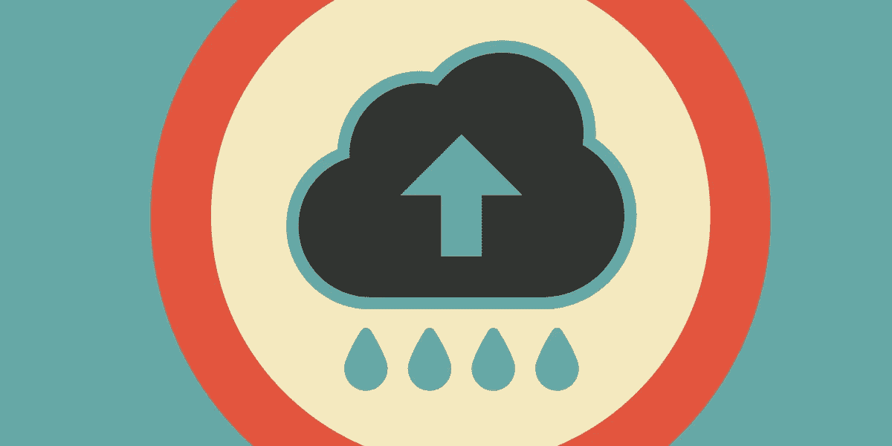

# 是时候谈谈云法案了

> 原文：<https://medium.com/hackernoon/its-time-to-talk-about-the-cloud-act-95e7256b6854>

2018 年 3 月 23 日，唐纳德·特朗普总统签署了一项 1.3 万亿美元的政府支出法案，使之成为法律。这项政府支出法案包括《澄清海外数据使用(即云)法案》，该法案具有广泛的影响，可能对消费者的隐私产生潜在的有害影响。

> 在这部长达 2232 页的综合法案的最后几页，立法者能够偷偷加入这部与削减预算、政府拨款、支付政府工资或任何支出相关的立法。

据电子前沿基金会(EFF)称,《云法案》从未被众议院或参议院的委员会审查或标记过，也没有举行过听证会。相反，国会领导层似乎在最后一刻偷偷加入了云法案。

## 那么，为什么云法案如此重要呢？

The CLOUD Act would erode user privacy

该法案为美国执法部门获取*“有线或电子通信的内容以及任何记录或其他信息”*做出了明确规定，无论此人居住在何处，也无论该信息位于世界的何处。此外，该法案将允许美国总统获取存储在其他国家的用户数据，而无需遵循其他国家的隐私法。

> 《云计算法案》赋予执法部门的单边权力增加，可能会产生各种各样的负面后果

首先，美国警方可以强制服务提供商(如脸书、谷歌等。)移交用户的内容，即使它存储在外国。这将允许美国警方绕过外国的隐私法。

其次，外国有可能窃听位于世界任何地方的人，只要该人不是美国人或不在美国。这将允许外国政府绕过保护消费者隐私的程序性措施，例如需要搜查令或通知美国政府。

## 《云计算法案》将:

*   使外国警察能够从美国公司收集和窃听人们的通信，而无需获得美国的搜查令。
*   允许外国要求存储在美国的个人数据，而不需要法官的事先审查。
*   允许美国总统签署“行政协议”，授权隐私法弱于美国的外国警方在无视美国隐私法的情况下，在美国境内获取数据。
*   允许外国政府的警察在不通知他们的情况下收集某人的数据。
*   授权美国警方获取任何数据，无论它是否是美国人的，也无论它存储在哪里。

## 《云法案》的替代方案

有一种替代方案可以解决《云计算法案》试图解决的问题，同时尊重和保护消费者的隐私。解决办法是加强现有的法律互助条约系统(MLAT)，该系统允许需要储存在国外的数据的警察通过与数据所在国合作获取数据。

> MLAT 将加强数据隐私，因为它要求外国政府/警方在获取存储在美国的数据之前遵守第四修正案的授权要求

此外，当美国警方在海外寻找数据时，MLAT 将要求美国遵守数据存储国的数据隐私规定。

## 谁在反对云法案？

EFF opposes the CLOUD Act

几个关注隐私的美国团体反对《云法案》扩大单边权力，该法案向美国和外国执法机构提供了单边权力，包括 EFF。

[开放技术研究所](https://www.newamerica.org/oti/press-releases/oti-opposes-cloud-act/)反对云法案，称“*该法案首次允许外国政府进行实时监控，造成了新的隐私威胁，并且未能包括基本的保障措施，如对数据请求进行事先独立司法审查的要求”。*

[民主和技术中心](https://cdt.org/press/cloud-act-would-erode-trust-in-privacy-of-cloud-storage/)反对云法案，声称*“云法案忽略了授权的要求*……*云法案将侵蚀人们对存储在云中的数据隐私的信任。”*

[Access Now](https://www.accessnow.org/new-u-s-cloud-act-threat-global-privacy/) 反对云法案，声明*“这个提议可能是修改现有系统的最糟糕的尝试。”。* Access Now 进一步阐述了这一点，指出*“拟议的立法将扩大美国执法的范围，而无需更新法律来要求内容授权”*

## 最后

不幸的是，云法案所做的是为执法部门提供更多单方面的权力，以换取用户的个人隐私。我同意 EFF 的观点，MLAT 系统应该被加强，而不是被云法案摧毁。我反对云法案，因为它破坏了我们现有的系统，侵蚀了个人隐私。

> 公众应该有更多的机会来讨论《云法案》的利弊，以检查其对用户数据隐私的广泛后果和影响。至少可以说，这种情况没有发生是令人失望的。

我相信云法案并没有被谈论太多，原因有几个。首先，《云法案》的后果有些难以理解。其次,《云法案》得到了几家大型科技公司(微软、苹果、谷歌、脸书)的支持，一般来说，人们认为如果他们支持一项法案，那么它一定是好的。然而，事实上，《云计算法案》只赋予这些大型科技公司特权，同时也侵犯了这些平台的个人用户的数据隐私。

你喜欢这篇文章吗？

*如果你喜欢我的文章，给我 50 个掌声，并与他人分享我的文章！*

*在 Medium 上关注我，获取技术方面的最佳见解。*

*可以在这里捐赠以太坊或者其他 ERC20 代币支持我的写作:0x 0 BCB 78d 67 d8d 929 DC 03542 a5 aedef 257 f 378 e 513*