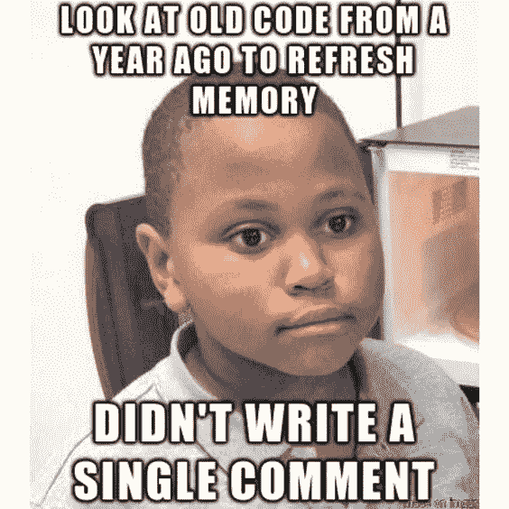
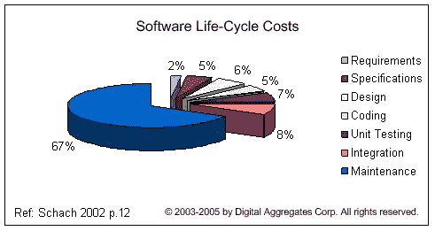
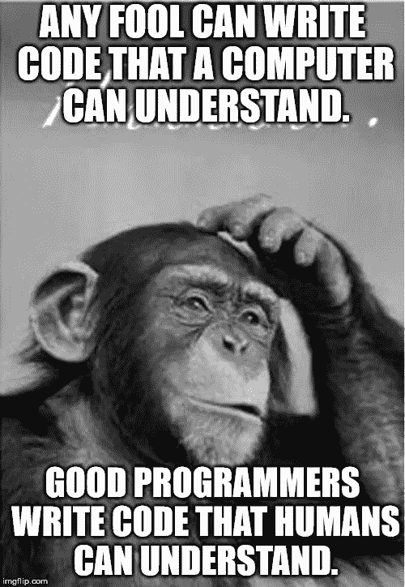

# 是我们用英语编码的时候了

> 原文：<https://medium.com/hackernoon/its-time-we-code-in-english-e02df6b62ecc>

如果你和我一样，你可能有过这样的经历:重温几个月前写的代码，却一行也看不懂。我知道这在我身上发生过无数次。与此相反，如果我在 10 年后阅读这篇文章，我仍然会理解它的含义(尽管我可能会认为我写这篇文章是幼稚和无知的)。原因是显而易见的，这段文字是用简单的英语编写的，而不是像 Javascript 或 C++这样的编程语言。即使有经验的程序员也能更好地理解自然语言。



## 编程语言怎么了？

很明显，即使我们可能已经花了数年时间来编写计算机代码，我们仍然对英语感到更舒服。使用非自然语言进行编码会带来巨大的成本。任何程序员都知道，写代码只是一个开始。代码需要记录、调试、维护和重构。代码的非自然本质需要大量的努力和时间来理解代码的逻辑。培训其他开发人员使用这些代码更加困难。使用公共 API(或公司范围的 API)对文档和培训提出了更大的挑战。要是我们能用英语编码就好了。



Initial coding is just 5% of software life-cycle costs

## …但是自然语言编程可行吗


自然语言编程一直是软件世界的圣杯。曾经有过一些设计类似自然语言的编程语言的尝试(Cobol，SQL，AppleScript)，但是 non 很接近于真正的自然语言。自然语言编程被认为是一个无法实现的目标。现代常用的编程语言都没有试图模仿自然语言。放弃 NLP(自然语言编程)最常见的原因是:

*   语言太复杂了，计算机无法理解
*   用人类语言表述一条指令有很多种方式
*   语言本来就有歧义。计算机语言必须是明确的(确定性的)

虽然没有人能否认这些陈述的可行性，但它们呈现了目标的二元观点，要么你有自然语言编程，要么你没有。

我想建议达到 NLP 的目标应该是一个渐进的过程，沿着非自然计算机代码和自然语言之间的连续体前进。为了实现这个令人生畏的目标，我想提出以下几个阶段:

1.  受限自然语言处理
2.  计算机辅助自然语言处理
3.  需求编程

## 第一阶段—受限 NLP

在这一阶段，我们建议使用一种读起来像自然语言的计算机语言，但编写它需要对编程有所了解，并了解可用的自然语言功能。考虑以下 JavaScript 表达式:

```
strlen(Str);
getElementById('button1').focus();
Node2.parentElement.insertBefore(Node1,Node2);
```

这种符号是从数学函数中借用的，是数学系研究软件时代的遗留物。这一点也不自然。现在，考虑以下相似之处:

```
length of Str
focus on element "button1"
insert Node1 before Node2
```

第二个序列的含义与第一个序列完全相同，但是第二个序列是可读的，即使对于非程序员来说也是自然的。主要的区别是参数内联在函数名中，而不是分组在括号中。一个小小的语法差异会造成代码可读性的巨大差异。内联格式不需要任何复杂的机器学习算法。它只是与改变语言的语法有关。考虑函数的以下定义:

```
DEFINE length of S AS
  return S.length;
END
```

这个定义可以是确定性编程语言的一部分，与我们习惯的编程语言范例一起工作。唯一的区别是参数是内联的。

自然语言的另一个重要的“特性”是使用上下文，它可以被导入到正式的编程语言中。在自然语言中，通常在短语的上下文中使用限定词“the”来指代实体，例如`move **the image** 23 pixels to the right`。在传统的编程范式中，最大的罪过之一就是引用函数体之外的对象。实际上，引用上下文对于编程来说是必不可少的。解决方法是将上下文作为附加参数传递。不用说，这不会提高代码的可读性。在自然编程语言中，可能是这样的:

```
//defining the function
DEFINE move to next token CONTEXT the text, the current position,the current token AS ... END
// ==> function moveToNextToken(theText, theCurrentPosition, theCurrentToken){...};//calling the function
the text = "hello world"; the current position = 0;
move to next token;//referencing *the text* and *the current position
show (the current token)*
```

显然，自然语言编译器需要支持引用调用，使用一些保存原始值的上下文值对象。

对现有的编程语言有额外的“调整”,可以使它们更加“自然”,比如键入和使用代词。

注意，当程序员写代码时，需要知道可用的函数`length of S`，函数的参数，以及，一般来说，程序是如何编写的，任何阅读文本`length of Str`的人都能很容易理解这个短语的意思。受限 NLP 意味着作者必须使用现有的 NLP 函数，但读者可以在没有先验知识的情况下理解代码。这意味着不需要额外的文件。代码就是文档。

我在 github 项目 [**naturaljs**](https://github.com/elshor/naturaljs/blob/master/readme.md) 中为这种语言提出了一种可能的语法。这是一个 Javascript 自然语言扩展的建议，它将文件转换成 Javascript 代码，类似于转换文件类型脚本的工作方式。**如果你相信这个项目请** [**明星吧**](https://github.com/elshor/naturaljs) 。我承诺一旦这个项目获得 100 颗星，我就实施它。

## 第二阶段—计算机辅助自然语言处理

在第一阶段，编程体验与当前的编程语言范例非常相似。程序员需要:

1.  请注意不同的可用函数及其语法
2.  下载并集成所需的库
3.  编写明确的代码— `show (length of S)`而不是`show length of S`

计算机辅助的 NLP 将通过放松这些限制来简化编程过程。输出仍然是相同的确定性代码。然而，程序员可以写得更自由一些，交互式编译器将基于先前的编程历史、可用的 NLP 编程语料库和机器学习来建议不同的选项。它可以提出以下建议:

*   当程序员写“关注按钮 1”时，它会建议“关注(标记为‘按钮 1’的按钮)”
*   当程序员写下“S 中的字符数”时，它会暗示现有的自然函数“S 的长度”
*   当程序员编写“S 中大写字符的数量”时，它会建议导入包“natural-text ”,并将代码更改为“S 中大写字符”,以匹配“natural-text”包中自然函数的语法。

我相信，通过实施第一阶段和第二阶段，我们将极大地改善编程体验，并显著降低软件开发和维护的成本。然而，第三阶段将完全改变我们的软件开发概念。

## 第三阶段——需求规划

在我看来，自然语言编程的最终目标应该是从需求文档中自动导出计算机代码。这意味着更深层次的自然语言理解能力，解决方案的很大一部分是某种程度的自动化软件设计。“计算机”可能使用在线分析或需求暗示来为工作设计最佳设计。设计也可能随着需求改变而自动改变。

虽然这在目前看起来有些遥不可及，但我确实相信，随着机器学习技术的进步，依靠前面两个阶段，这个目标是可以实现的。这可能需要一些形式主义的需求写作，但是达到这样一个阶段的意义是巨大的。这将彻底改变我们对软件工程的认识。

## 你能帮什么忙

如果你相信自然语言编程的概念，我建议你看看我的 [naturaljs github 项目](https://github.com/elshor/naturaljs)。它包含了一些关于阶段 I 的想法。我承诺一旦该项目获得 100 颗星，就开始实施第一阶段。

[](https://github.com/elshor/naturaljs) [## elshor/naturaljs

### natural js——为 javascript 添加自然语言编程能力

github.com](https://github.com/elshor/naturaljs) 

Quote from Martin Fowler