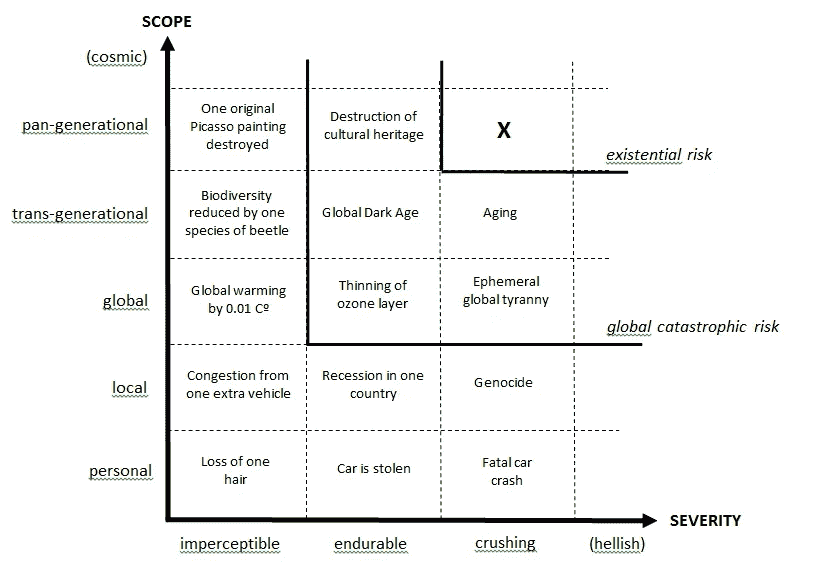

# 锯齿状边缘

> 原文：<https://medium.com/hackernoon/jagged-edges-5a1fa198e429>

## 以我们自己的形象创造技术的危险

Photo by [John Salvino](https://unsplash.com/photos/1hMZUQwAE0A?utm_source=unsplash&utm_medium=referral&utm_content=creditCopyText) on [Unsplash](https://unsplash.com/search/photos/architecture?utm_source=unsplash&utm_medium=referral&utm_content=creditCopyText)

> 该死的创造者！为什么你造了一个如此丑陋的怪物，连你都厌恶地离开我？-玛莉·渥斯顿克雷福特·雪莱，弗兰肯斯坦
> 
> 今天有一种比权力更大的春药——永生。

人类是机器人吗？想想看，从我们醒来的那一刻起，公开的和潜意识的信息就跟着我们。根据闹钟的品牌，你可能会想起宜家、沃尔玛或生产闹钟的特定公司。我们被外部输入所淹没，这些输入以一种相当机械的方式规划着我们白天的行为，这让我想起了斯坦利·库布里克有争议的电影《发条橙》。媒体的连珠炮不仅在我们身上滋生偏见，还强化了我们现有的偏见。我们倾向于阅读更多强化我们有限世界观的东西。

*此外，人造系统效率非常低。肉类生产的全球碳足迹如此之高，以至于初创公司现在已经开始致力于开发“合成肉”，以减少人类对动物的依赖。*

*这篇文章深入探讨了令人上瘾的低效技术的问题，然后进一步扩展了这个问题。它试图回答一个关键问题:如果我们以与我们对早期技术建模非常相同的方式对人工智能、CRISPR 和区块链等指数级技术进行建模，我们会有足够的机会纠正我们的错误吗？*

# 为什么边缘是锯齿状的？

Wikimedia Commons

人类天生是好奇的动物。我们有数百万个问题需要回答。我们在寻找这些答案的过程中，很多都是复制自然的一切，也就是创造一个人造的世界。当玛丽·雪莱写《弗兰肯斯坦》时，她提到了一个非常重要的悖论。在一位科学家寻求将生命注入无生命的肢体的过程中，弗兰肯斯坦由人体部分组成。因此，问题变成了:弗兰肯斯坦是人吗？因为它是由人体组成的，所以答案是肯定的。然而，他是世界上大多数人所说的“非自然的”。他确实有人类的情感，这使他寻找一个伴侣。现在，想象一下如果我们以同样的方式创造人工智能。我们对人脑的了解非常有限，对意识的了解更少。然而，这并不妨碍我们通过人工智能和机器学习来复制人脑。

杰里米·里夫金在他关于第三次工业革命的纪录片中谈到了生产力的三个组成部分，即劳动、机器和总效率。根据里夫金的说法，历史上经济学家没有考虑总体效率，因此无法解释为什么日本、德国和美国等处于技术前沿的国家的生产率停滞不前。根据热力学定律，能量既不能被创造也不能被毁灭，里夫金解释说，如果我们只利用自然发生的东西的 40%，而浪费其余的，或者把它扔进垃圾填埋场，产生有毒废物，我们的效率是 60%。但是，如果我们有可再生能源，或者如果我们在价值链的每一步都变得更有效率，我们就可以大幅提高生产率。同样，我们有限的理解和缺乏跨学科的方法来解决问题意味着边缘仍然参差不齐。

# 当社交媒体变得反社交

The Lonely Monk by Enoch Wood Perry, Jr. [Public domain], via Wikimedia Commons

孤独与黑暗面有很深的联系。在约翰·弥尔顿的伟大诗篇《失乐园》(1667)中，撒旦说:“我离开他们/这笨拙的差事，一个人为所有人/我自己暴露，用孤独的脚步踏着/这毫无根据的深渊。后来，1904 年，奥古斯特·罗丹的雕塑《思想者》出现在世界舞台上。最初构思为另一部史诗作品“地狱之门”的一部分，思想家描绘了写诗“神曲(1321)”的诗人但丁·阿利格伊切里号战列舰。正如法国罗丹博物馆所说:“《思想者》描绘了一个身体强壮的人，一边沉思着自己的作品，一边俯身观察地狱的轮回。*因此，思想者*最初既是一个饱受折磨的身体，几乎是一个被诅咒的灵魂，又是一个自由思考的人，决心通过诗歌超越他的苦难。这个人物的姿势很大程度上是由于卡珀的*乌戈利诺* (1861)和米开朗基罗雕刻的洛伦佐·德·美第奇坐像(1526-1531)”

当我使用脸书和谷歌时，我会想到奥古斯特·罗丹的《思想者》。我想到我的自由思维被来自大众的谎言、广告和算法偏见所折磨。我在社交媒体上的经历产生了一种明显的孤独感。精神思想的孤独。我不断问自己:“我是不是唯一一个承认内心困惑，但向外界投射坚定观点的人？”显然，这个问题的答案是“不”。英国有一个“孤独部长”来应对疫情。

这也是一个社会的反映，这个社会认为说实话和寻求帮助是对软弱的承认。

具有绝对讽刺意味的是，补充现有人类联系的工具已经转变为新闻和通信的唯一手段。除了促使我们对他人最微小的古怪行为感到愤怒的个人主义之外，城市化和数字化也极大地减少了我们与人类自我的接触。所有这些趋势都成了大规模萧条的武器。

作为人类，我们缺乏自我调节，直到我们被推到绝对的边缘。这就是指数技术的问题。他们没有提供适度的故障保险，因为这将违背他们的预期目的。中道是建立一个提醒和推动我们走向温和的财团。一个这样的例子是[人类未来研究所](https://www.fhi.ox.ac.uk/about-fhi/)，它致力于确保我们不会提供具有致命能力的人工智能机器人。

一个更好的解决方案是在推出所有指数技术之前，嵌入这样一个代表人类和更大利益的联盟。有些人可能会把这个想法称为白日梦，但至少它会防止我们在未来做噩梦。

# 并非所有技术都允许平等访问

CRISPR CAS-9 等基因编辑技术允许在小型实验室中编辑人类 DNA。如果这种极其强大的技术变得只有少数人可以获得，这将导致几个伦理和道德难题。一个这样的问题是:当世界其他地区的不平等指数地恶化时，超级富人能够创造超级婴儿吗？

为了理解指数级技术的重要性，以另一家科技公司 Sensetime 为例。商汤科技是香港资金最多的私人人工智能公司。它的技术基本上允许街道监控，任何人都可以使用面部检测和传感器进行监控。

大多数技术都来自重大投资——公共或私人投资。因此，有一种将它们“商业化”的动机，即从它们身上赚钱。来自 [Element AI](https://www.elementai.com/) fame 的 Yoshua Bengio 希望对人工智能采取不同的方法。他不希望人工智能成为谷歌等垄断企业的领地。Yoshua 和其他加拿大人 Geoffrey Hinton 和 Yan Lecun 代表了人工智能前沿的三巨头。他们被戏称为加拿大人工智能黑手党。虽然商业化有明显的动机，但我们也需要倡导者向普通人开放辩论，并使获取民主化。

我们当然有这样做的工具。区块链的支持者强烈主张去中心化通过以下方式导致权力的重新分配:

1.  计算能力的实际分散化和建立容错超级计算机。
2.  通过创建一个巨大的虚拟机来模糊民族国家的地缘政治边界。
3.  使新闻的产生和信息的传播民主化。
4.  通过横向整合和创建自我调节智能电网改变能源格局。
5.  为发展中国家提供跨越或赶上发达国家的工具。

去中心化、分布式计算和众包承诺给所有人平等的权力。问题是:如果人类注定要追求成为平等中的第一，我们该怎么办？我们的想法有点不同。正如奥修所说:

> 没有人高人一等，没有人低人一等，但也没有人是平等的。人们是独一无二的，无可比拟的。你是你，我是我，我要把自己的潜力贡献给生活；你必须把你的潜力贡献给生活。

# 平滑边缘

神经黑客集体的联合创始人丹尼尔·施马赫滕伯格说:

生物圈是一个复杂的自我调节系统。这也是一个闭环系统，这意味着一旦一个组件停止发挥其功能，它就会被回收并重新整合到系统中。相比之下，人类创造的系统是复杂的开环系统。它们既不能自我组织，也不能自我修复。来自进化的复杂系统是抗脆弱的。由人类设计的复杂系统是脆弱的。复杂的开环系统是存在风险的第二个生成函数。

在最近的播客中，丹尼尔解释了为什么科学可以向*展示事物的现状*，却不能向*展示它们应该如何*。技术是应用科学，根据定义，需要讨论它对人类的不利影响。指数技术更是如此。让我们一致认为谈论乌托邦是徒劳的，因为完美的世界是不存在的。然而，反面乌托邦和灭绝是可能的结果。

Existential Risk, Nick Bostrom (2012)

我们需要意识到，就个人而言，我们的理解是有限的。因此，如果我们在没有考虑包容性的情况下过快地推出技术，我们不会立即看到的二阶效应可能是毁灭性的。以我们对内燃机和化石燃料的依赖为例。如今，像德里和上海这样的城市都笼罩在雾霾之中。人们需要戴口罩来应对极度污染的空气。直到我们到达一个极端的场景，我们才意识到不利的影响。

然而，作为一个集体，我们必须像我们的祖先智人那样一起工作。他们团结一致，比尼安德特人活得更久。不用说，我们孩子的未来取决于磨平我们参差不齐的棱角。