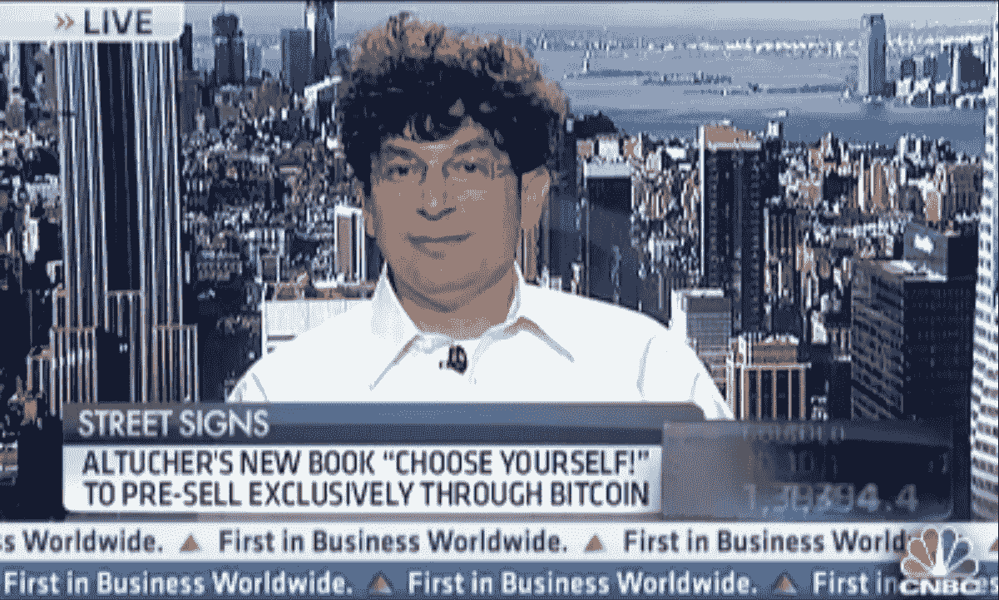
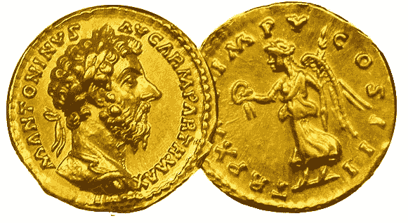
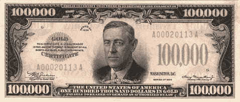
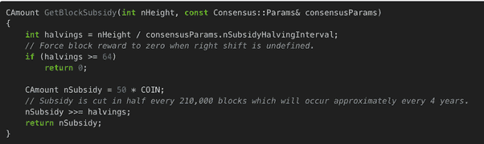
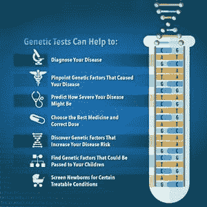

# 詹姆斯·阿尔图切的比特币常见问题

> 原文：<https://medium.com/hackernoon/james-altuchers-bitcoin-faq-38edc8f58037>

> 作者:詹姆斯·阿尔图彻。【JamesAltucher.com 原载

**问题来了:**对比特币了解很多的人，大多只会说“科技”。

我最近参加了一个会议。我是主题发言人，但像往常一样，我没有准备任何发言。这是一个众筹会议，所以我把我的演讲“众包”了。

我问观众:我可以讲创业或者我可以花十五分钟解释比特币，不用任何技术术语。为你想要的而鼓掌。

几乎 100%的人都想了解比特币，而不想使用技术术语。

人们渴望这个。他们不想听到“密码”或“区块链”。他们只是想知道比特币到底是怎么回事。

早在 2013 年，我就认为比特币是个骗局。我错了。

首先，一些凭证。

2013 年初，我有过疑虑。我开始阅读我能阅读的一切。然后我把手弄脏了。

自 1985 年以来，我一直是一名程序员。我决定编写一个只卖比特币的商店(可能是有史以来第一个)，在我的书《选择你自己》在亚马逊上发布之前，在上面出售。

这很难。我不得不从零开始开发商店，因为没有简单的工具来帮助我。还是没有(提示:商机)。

我一推出，就有相当多的人买了我的书。我把我的书的一个 PDF 卖了 0.1 比特币。比特币当时是 60 美元，所以我以每 PDF 6 美元的价格出售。现在，就好像我把每个 PDF 卖了 1600 美元。我卖了很多本。

当他们听说我在做这个的时候，我去了美国消费者新闻与商业频道。主播问我:“你这么做只是为了宣传吗？

我说，“嗯，我上了国家电视台，所以我想这是可行的。”

另一件值得注意的事情是:我的大多数客户来自一个域名(他们必须提交他们的电子邮件地址给我来处理销售):[Amazon.com](http://amazon.com/)。你想怎么做就怎么做。

几个月前，我又开始写关于加密货币的文章。我看到这么多人卷入骗局，我想帮忙。

前几天，我遇到一位优步司机，他在乘车过程中感谢我帮助他“明白了”。

昨晚在一家餐厅，用餐结束时，服务员握着我的手，感谢我帮助他“终于”开始理解比特币是怎么回事。

为了让加密货币获得成功，人们需要在基本层面上理解它们是什么。没有人需要学习复杂的密码学或区块链。

现在才明白为什么。为什么这对我们这个社会很重要。

**两个关键原因比特币具有重要的历史意义，并将继续存在**

明白这两个道理就行了。然后你就知道比特币的潜力了。你会在鸡尾酒会上很受欢迎。

**A)货币的历史**

每一种新的货币都解决了上一种货币的主要问题。

**1..物物交换**

如果我有一袋大米，我需要鞋子，那如果你做鞋子但是你只需要 1/2 袋大米呢？我能得到一双鞋的 1/2 吗？

易货有很多问题。在上面的例子中，想出大米和鞋子的汇率是困难的。

那么仅仅为了出去买杂货而想出 1000 的汇率几乎是不可能的。

另外，如果你不得不搬家(你的王国被攻击)怎么办。你将如何携带所有的米？所有那些鞋子？

钱有两个目的:

*   作为财富/储蓄的储备
*   进行交易

还有第三种，世界上最大的对冲基金 Brigewater 的负责人雷伊·达里奥前几天告诉我的。但我们稍后会谈到这一点。

作为财富的储存，物物交换是可怕的。对于交易来说，最好的情况是非常困难的。

但是问题会带来机会。这导致…

**2。贵金属/硬币**

金银稀缺。很难开采它们。

但是很难伪造，因为你可以用重量来衡量。

所以稀缺性加上没有伪造，使它们成为很好的货币选择。我可以把我的大米换成金币，你可以把你的鞋子换成金币，现在我们可以交易了，现在我们可以买任何我们想要的东西了。

*(金币上的马可·奥勒留)*

作为财富的储存，它不伟大但也不可怕。

如果我的王国受到攻击，我不得不搬家，黄金和白银很容易储存和携带，就像设计好的珠宝一样。

但是，有两个问题。

一:如果你生活在一个没有任何金矿的国家会怎样？现在你要么进行黄金交易，要么开始攻击其他国家:(这对阿兹特克人来说并不奏效)。

第二:如果你现在想买房子，你真的要带一卡车金条去交易会吗？或者，如果你不得不搬到另一个国家，而且你有一辈子的积蓄:你会把所有的金条都运到你的新家吗？

人们说黄金是“真实的”，而不是(后来的)纸币和加密货币。

这不是真的。黄金是一块石头。但它确实有工业用途(因为价格的原因，银在这方面更好，但仍然……)。金和银是很好的导电体，可以用作银器。可用作抗生素(因此非常适合补牙)。

因此，我们可以说，黄金货币是由具有实际用途和相关价值的东西“支持”的。

但是我们还是要解决上面的问题。

由黄金支持的纸币和…纸币

各国发行纸币，就像与政府签订了一份合同，所有的钱都可以兑换成黄金。

这对交易来说非常好(便于携带纸币)。

这对于储存财富来说非常好(把钱放在银行里，你可以去任何地方)。第一批由黄金支持的纸币银行资助了 19 世纪欧洲的每一场战争。干得好！

当纸币由黄金支持时，它也抑制了通货膨胀。一个国家的纸币和黄金一样多。

(是的，在美国有一张 10 万美元的钞票。伍德罗·威尔逊在上面)。

因此，你可以相信政府不会疯狂印刷没有黄金支持的货币(就像德国在 20 世纪 20 年代印刷了数万亿马克，德国陷入了通胀死亡螺旋，这至少是第二次世界大战的一个原因)。

但是，为什么要让那些容易开采黄金的国家受益，而惩罚那些难以开采黄金的国家呢？

此外，世界在各个方面都在扩张:更多的人，更多的技术，更多的创新，更多的东西。

我不确定这是好事还是坏事(见上图:德国)，但有时国家需要通过印钞来平衡债务，以管理其财政政策。

为了满足越南战争和林登·约翰逊的社会改善计划的财政需求，美国在 70 年代早期放弃了黄金。

这造成了通货膨胀。

纸币往往会导致这种情况。有人会说:我们为什么需要黄金部分？

再说一次，可能是好的也可能是坏的。有很多争论。2008 年和 2009 年，印钞拯救了美国吗？也许吧。或者他们会因此成为未来的问题吗？也许吧。

然而，**纸币还有其他问题需要解决:**

**答:没有隐私。**

如果我正在进行一笔大额(超过 1000 美元)交易，我通常不使用现金，而是使用信用卡或电汇。

所以这意味着你的银行知道。其他银行知道(你汇款到的银行，美联储，当地储备银行等)。

政府机构知道(国税局、国安局等)。

像谷歌和亚马逊这样的网站可能会根据你使用的支付服务和你购买的东西来知道。

所以你在纸币交易上没有隐私。

**b .费用。**

如果我给韩国的朋友寄钱，我会通过我的银行(费)，当地储备银行(费)，美联储(费)，国际电报系统(费)，他们的中央银行(费)，他们的当地储备银行(费)，他们的当地银行(费)。

那是一大笔费用。这些费用有助于制造通货膨胀，因为每笔交易都需要在这些费用的基础上获得利润。

**c .伪造。大约有 2000 亿美元的假币正在流通。**

**d .人为失误。**这是一个很关键的问题。人为错误的机会太多了。当你转账的时候，他们会把钱打到错误的账户。或者一家银行的软件可能被黑客攻击，你失去了所有的钱。

或者，最重要的是，美国美联储可以决定再印 1 万亿美元(就像 2009 年一样)，而没有你的允许，你的美元已经贬值了。

在美国，我们很幸运。但是整个南美并没有这么幸运(他们所有的货币在 80 年代都崩溃了。大多数亚洲国家在 90 年代就没有这么幸运了(他们的货币将他们一扫而光)。俄罗斯在 1997 年被消灭了。

许多国家依靠人类来印刷(或不印刷)钞票，最轻微的人为错误就能摧毁整个国家的经济。

美国是幸运的。暂时如此。但这是一个我们每天都在冒的巨大错误。

这些都是基本问题。还有更多(比如盗窃)。

**e .什么是支持纸币？**

只有我们的信任。我不想成为阴谋论者。但现实是:一块钱就是一张纸。就像金子只是一块石头。

他们如何让我们相信钱是有价值的？

他们在上面写上“我们相信上帝”。他们把乔治·华盛顿。他们把财政部长的签名(假装是一份合同。).

对于古怪的人，他们甚至放了一个有眼睛的金字塔。

这就是我们信任它的原因。我不相信它。

**4)比特币(顺便说一句，比特币不是终结。会有一个“5”)。**

比特币解决了上面的问题。

**答:人为错误:没有印钞票。有 2100 万枚硬币的固定供应量。**

我怎么知道这个？我是一个怀疑论者。于是我看了比特币背后的软件。我读了一遍又一遍，直到我能理解它。在代码的一部分，他们清楚地定义了可以“开采”/印刷多少硬币(印刷是一个错误的词，但我在这里用它来联系纸币)。代码的另一部分“执行”了第一部分。

*(将比特币总数限制在 21，000，000 的代码的一部分。我通过阅读比特币的所有代码发现了这一点)。*

**b .盗窃。与其他形式的货币一样，存储比特币的交易所(比如银行)可能会被黑客攻击，钱也会被盗。**

但是，我只在交易所里存了少量的钱。你可以得到一个存储驱动器，存储你的钱，并把它放在一个保险箱。所以即使交易所被攻击，你还有你的钱。

所有的盗窃都可以通过比特币来防止。你不能用纸币做到这一点，因为如果你有太多的美元，你将如何储存它？黄金也是如此。

**c .伪造。**软件保证比特币无法被伪造。

**d .隐私。我可以给你发一个比特币，但没人知道谁在发，谁在收，也没有政府机构知道这件事。**

**戊.费。**

部分比特币交易有小额手续费。但这与上述交易中通过六家银行的费用完全不同。

**它的后盾是什么？**

大约有 1000 个人年的科学支持比特币。

比特币的底层技术涉及大量的密码学、金融知识和合同法基础知识，加上“区块链”有 100 多个用例，我们才刚刚开始尝试。

即使比特币从未被用作硬币(尽管注意:它每天都被用作货币)，比特币还有 100 或 1000 种与基本货币用途无关的其他用途。

这里我就不赘述了:但足以说明的是，所有合同法最终都可能(也将会)被比特币取代。

所有的物流都将被比特币取代(例如，UPS 正在用比特币技术取代他们所有的内部物流(跟踪每天从数百万个地点到数百万个其他地点的数百万个包裹)。

纸币或黄金的背后没有像这样的东西。

现在……比特币也有问题。

因此需要其他加密货币。但是没关系，这不是这里的主题。可以说，比特币解决了纸币的所有基本问题，解决了黄金的问题，解决了物物交换的问题。

然而，比特币存在并如此引人注目还有另一个原因。

**各行业的演变**

生活中的一切都在进化。不仅是物种，还有思想。

再来看一些行业。

**药**

**有神论** : 500 年前，如果你生病了，你要么向神祈祷让自己好起来，去找萨满，做一次牺牲，要么认为自己犯了罪，让自己生病，并试图赎罪。

人文主义:人类诞生后，我们有了被称为医生的人类“专家”,他们要么用水蛭吸死我们，进行会杀死我们的可怕手术，要么拍拍我们的背，敲敲我们的膝盖，说:“吃两片阿司匹林”。

医生不坏。他们救了很多很多人的命。但是人道主义有其局限性。一个众所周知的事实是，平均而言，医生最有效的时刻是他或她从医学院毕业的第一年。在那之后，统计数据开始走下坡路。

**数据-ism:**

如果你去看医生，你会做检查。你做血检，做核磁共振，脑电图，x 光，x 光可能会进入数据库，人工智能算法会将它与其他 x 光进行匹配(它与肿瘤 x 光还是非肿瘤 x 光匹配？).我们甚至进行基因测试，看看我们的疾病是否在我们的染色体上。

然后，有了数据，通常计算机会告诉我们正确的解决方案(甚至计算机可以进行所需的机器人手术)，或者人类会帮助解释数据(但这里也有人为错误的空间)。

*(source: National Genome Research Institute)*

所以医学已经从

**有神论→人本主义→数据主义**

让我们选择另一个行业:

**战争**

有神论:3000 年前，如果两个国家发生战争，国王们会在前一天举行盛大的祭祀活动。

在《圣经》中，谁的神更强大(巴力和耶和华是一场著名的希伯来战争)，谁就将赢得战争。

现在就有这样的片段:愿原力与你同在，在卢克飞往死星战斗前对他说。

人文主义:在过去的 500 年里，谁在地面上有最多的人，最多的子弹，然后是最多的飞机，然后是最多的炸弹。会赢得这场战争。

**数据主义:**

现在每天都在打仗。每一天。每天都有一些国家试图破坏波兰的电网。

每天，每一家财富 500 强公司都受到来自…没人知道的“机器人军队”的攻击。

我已经在网络安全领域工作了 25 年甚至更长时间。

我曾经和一家帮助财富 500 强公司对抗“机器人军队”的公司交谈过。所有的员工都是顶尖的博士，他们都是各自领域的专家。

一个人告诉我，“不管我们有多聪明，他们更聪明。”

“他们”是谁？制造机器人军队的人。他们从哪里来？我们不知道。他们来自各地。他们只是比我们聪明。

选举被操纵了。公司受到攻击。信息被盗。

我们已经处于第三次世界大战至少 20 年了，它永远不会结束。数据主义已经接管了战争。

好吧…

**钱**

有神论:“我们相信上帝”

**人文主义**:《乔治·华盛顿》。独立大厅的照片。或者白宫。任何事。任何事情，让我们相信人类用我们每天辛勤劳动换来的东西。

我们信任人类吗？我倾向于相信人类。但这可能并不总是明智的。人类犯了很多错误，这导致了很多公司、很多家庭和很多事情的失败。

**数据主义。**比特币和现在的其他加密货币。

1000 人年的科学。由 10，000 名最优秀的程序员检查过的 100，000 行代码。

数据主义防止伪造，保持隐私，重新创建所有合同法，避免费用，避免盗窃。这只是数据赚钱的一个小例子。

**“在我们信任的数据中”**无论好坏。但这很有效。

货币的自然进化已经到来。而且不仅仅是比特币，还有其他加密货币。

**常见问题:**

**我们为什么需要其他加密货币？**

为什么我们需要不止一种货币？为什么会有美元和加元。

无缘无故。只是 1770 年创造的一条人工边界，我们有两种不同的货币。

加密货币有我所说的“问题边界”。

一个硬币比比特币更适合做合约(以太坊)。

另一枚硬币比较好隐私((Zcash。比特币的一个问题是，虽然交易中没有名字，但我可以看到交易的规模和时间。所以隐私还是个小问题)。

另一枚硬币可能更好地解决了分散存储的问题(而不是像 Google Drive 那样将所有照片存储在一个可以被黑客攻击的集中点)。比特币没有解决这个问题。

问题边界创造了新的货币。

**现在投资比特币等加密货币还来得及吗？**

现在，这让我想起了 1995-1996 年的互联网。新硬币中有一点非理性繁荣。价格快疯了。

将会有大规模的回调。但是，合法的硬币已经存在并将继续存在。

当互联网撤退的时候，亚马逊当然撤退了。现在它将最终成为一家万亿美元的公司。许多始于上世纪 90 年代的公司幸存下来并蓬勃发展，是获得回报的伟大长期投资。

**加密货币是“货币互联网”。**互联网将继续存在，货币互联网也将继续存在。

我们的钱只是处于加密货币转变的第一局。

**加密货币会取代纸币吗？**

是的。最终。可能不是比特币，虽然比特币会一直存在。

但是每个国家，为了解决纸币的问题，最终都会改变。正在辩论的国家包括:以色列、爱沙尼亚、委内瑞拉、阿根廷。

将在其央行中使用加密货币技术的国家很快将包括中国、韩国、俄罗斯，是的，还有美国。

许多国家将拒绝加密货币，但他们的人口将集体转向加密货币，以避免腐败、人为错误、盗窃等。我首先想到的是阿根廷。

**加密货币的价值会是什么？**

当我第一次写这个的时候，所有的加密货币加起来大约是 2000 亿美元。现在是 7500 亿美元左右。虽然我认为许多货币是骗局，所以数量真的很少。

这就是加密货币的“供给”。

需求是存在的纸币+黄金的数量。

这个数字是 200 万亿美元。

因此，从 1 万亿到 200 万亿，这是 200 倍的增长。换句话说，1 万美元变成了 200 万美元。

如果你专注于合法货币，收益会大得多。

所以，再说一次，我们才刚刚开始。在我们的一生中，没有比这更好的投资机会了。我们才刚刚开始。

**合法的加密货币有哪些？**

有很多。我不想在这里讨论所有的技术。

我也不喜欢所有正在进行的加密货币投机交易。投机导致骗局和泡沫。

但就像有互联网公司在泡沫破灭后幸存下来，成为我们每天使用的公司一样，现在存在的加密货币十年后我们将每天使用。

你在美国消费者新闻与商业频道说比特币会涨到 100 万澳元？你在开玩笑吗？

号码

比特币最近触及 2 万美元。我们刚刚说过，它至少可以提高 200 倍。那是 400 万美元。因此，即使是 100 万美元，比特币也是值得购买的。

**一个人还能如何在比特币领域赚钱？**

你不一定要成为软件开发人员。

当 19 世纪淘金热来袭时，李维斯牛仔裤成了大赢家。还有卖“镐”和“铲”的公司。

比特币领域将会出现许多挖取和铲取公司。

拥有最新比特币新闻和分析的网站会做得很好。交易所会做得很好。帮助传统公司与比特币技术的更深层部分整合的公司将会做得很好(就像帮助 UPS 将区块链技术整合到他们的物流中的人一样)。

帮助新加密货币发行的公司将会表现良好。

等等等等。

**有人说你在 2013 年初称“比特币是庞氏骗局”。我们现在为什么要相信你？**

首先，我始终相信最好的投资是在你自己身上。这将提供超过 200 倍的回报。

也就是说，2013 年初我错了。

我做软件已经有 25 年多了。我可以做我的研究。我做到了。

到 2013 年 5 月，我已经做了足够多的研究，可以建立自己的比特币商店，去美国消费者新闻与商业频道讨论比特币，并在它只有 60 美元的时候成为一名倡导者。这都是公开信息。

但是，对我来说，关注我的身体健康、情绪健康、创造力健康和精神健康，将永远是我可以开发和交易的最有价值的“货币”。

比特币可能只是一种时尚吗？

号码

纸币确实存在上述问题。必须有人来解决这些问题。比特币和其他加密货币解决了这些问题。

每个行业都在发展。加密货币是货币发展的“我们信任的数据”方式。

7500 亿美元相信我。

**谁是聪？**

Satoshi 是比特币神秘的创始人。他现在拥有数十亿的比特币。他是匿名的，记者、政府等从来没有弄清楚他是谁。

也就是说，很多人知道他是谁。我每天都看他的博客，他是一个神秘的人，没有人想暴露他的身份。

**嗯，现在该怎么办？**

别听我的。

**答:在比特币基地**(或任何地方)获得一个帐户。购买价值 10 美元的比特币，只是为了品尝和感受它。

**b .然后读。读了很多。**

以下是一些与比特币无关的书籍，值得一读:

[**智人**](http://amzn.to/2COsjwR) 尤瓦尔·胡拉里著

[**万物的进化**](http://amzn.to/2CPwbhY) 作者马特·雷德利

[**金钱的上升**](http://amzn.to/2qyNyOh) 尼亚尔·费格森。

纳西姆·塔勒布的 [**抗脆弱**](http://amzn.to/2FbbIBL)

Reddit 和 Twitter 上有很多关于加密货币的讨论。不要读那些。尽管有一些不错的消息来源，但大多数讨论都充斥着巨魔。

**博客/网站:**从 Coindesk 和 CoinTelegraph 开始。当你读得更多的时候，你会找到其余的。

 [## 比特币-黑客正午

### 比特币是一种世界性的加密货币和数字支付系统。这是第一种分散的数字货币。的…

hackernoon.com](https://hackernoon.com/bitcoin/home) 

➤ [注册](https://altucher.leadpages.co/start-here/?_ga=1.147953332.2077339586.1472084123?utm_source=medium&utm_medium=syndicate&utm_term=free-updates&utm_content=&utm_campaign=free-updates)订阅我的时事通讯。你会收到我最新内容的每日邮件！

➤或访问我的[网站](http://www.jamesaltucher.com/?utm_source=medium&utm_medium=syndicate&utm_term=home-page&utm_content=&utm_campaign=home-page)阅读我的免费博客内容

➤，你有问题吗？在 Quora 上问我…我每天都回答问题！

[*詹姆斯·阿尔图彻*](http://www.jamesaltucher.com/?utm_source=medium&utm_medium=syndicate&utm_term=home-page&utm_content=&utm_campaign=home-page) *是畅销书《选择你自己》的作者，* [*的编辑，《阿尔图彻报告》*](http://www.thealtucherreport.com/?_ga=1.127276173.1850486739.1486068468?utm_source=medium&utm_medium=syndicate&utm_term=altucher-report&utm_content=&utm_campaign=altucher-report) *和流行播客* [*的主持人，《詹姆斯·阿尔图彻秀》*](http://www.jamesaltucher.com/category/the-james-altucher-show/?utm_source=medium&utm_medium=syndicate&utm_term=james-altucher-show&utm_content=&utm_campaign=james-altucher-show) *带你超越商业和企业家精神，探索在一个日益复杂的世界中，作为人类和实现福祉意味着什么。*