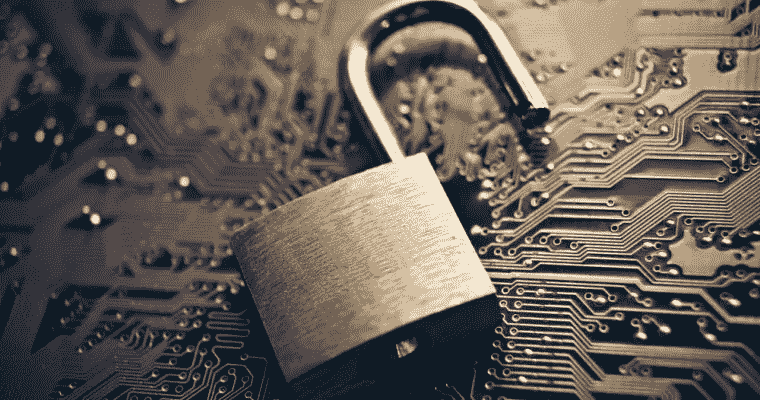
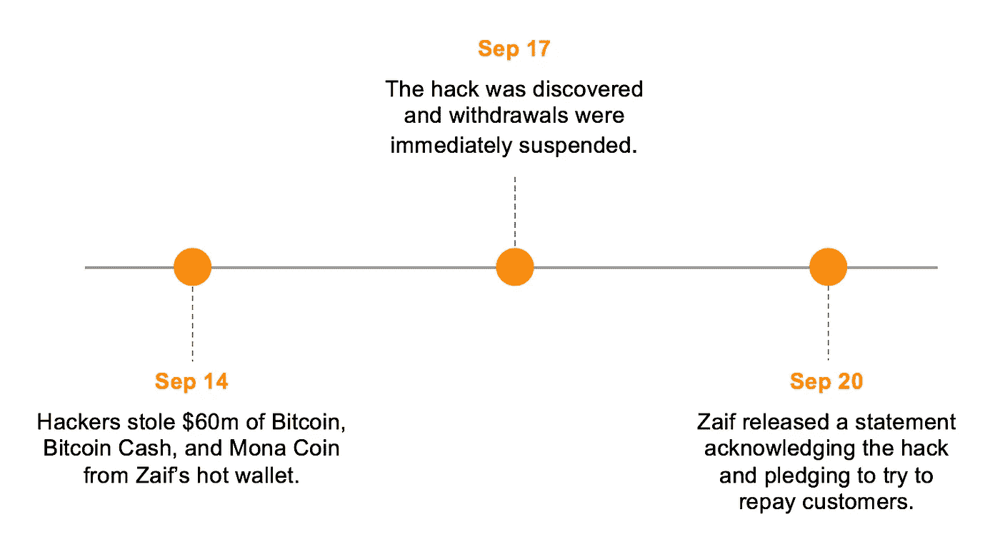

# 日本加密货币交易所遭遇 6000 万美元黑客攻击

> 原文：<https://medium.com/hackernoon/japanese-cryptocurrency-exchange-hit-with-60-million-hack-9d156b1e25bf>

## 2018 年从加密货币交易所窃取的总金额超过 8.65 亿美元

9 月 20 日，Zaif 的所有者 Tech Bureau Corporation 发布了一份声明，承认该交易所的热门钱包遭到破坏，6000 万美元被盗。

根据 Coinmarketcap.com 的数据，在黑客攻击之前，Zaif 是交易量排名前 25 位的交易所，今年 3 月被勒令改善运营，否则将面临严厉处罚。

从未开出任何罚金或处罚。

# 细节

在被盗的 6000 万美元中，约 2000 万美元的硬币属于该交易所，这意味着约 4000 万美元的客户存款被盗。

被盗物品的具体分类仍未公布，但我们知道有 5966 枚比特币被盗(约 4000 万美元)，还有 2000 万美元的 Mona Coin 和比特币现金仍下落不明。

Timeline of Events

# 这是怎么发生的

[黑客](https://hackernoon.com/tagged/hacker)用来访问三个独立的热钱包的方法可能在一段时间内不会公开，但它反映了 Zaif 的安全协议很差。

单个受损的热钱包可能是一次性的网络钓鱼骗局或安全漏洞。然而，**三起独立的热门钱包黑客事件表明系统缺乏强大的安全性**，其责任完全落在技术局身上。

更令人担忧的是，Zaif 是日本 16 家获得政府许可的交易所之一，这一区别意味着 Zaif 通过了严格的安全和反洗钱测试。

这次黑客攻击让人们对 FSA(日本监管加密交易所的政府机构)审查交易所安全行为的能力产生了质疑。

# 余波

为了弥补损失的客户资产，Tech Bureau Corp 宣布，他们打算以 4450 万美元的价格将大部分交易出售给 Fisco Digital Asset Group。目前还不知道具体的指控或处罚，但 Tech Bureau 的高管已经宣布他们将辞职。

两人计划在 10 月下旬主持股东会议，在 11 月 22 日执行转让之前对拟议的交易进行投票。

> 技术局在一份声明中说:“我们拒绝评论这种非法访问是如何发生的细节，因为这是一种犯罪，我们已经要求当局进行调查。”

目前还不知道客户是否会得到赔偿，但预计来自 Fisco 的全部 4450 万美元投资将用于退还客户存款。虽然，由于在日本警方完成调查之前，可能不会支付任何款项，但客户可能需要等待数月才能收到任何形式的和解金。

Zaif 客户应该认为自己很幸运，因为他们最终有机会得到偿还。然而，在相当长的一段时间内，客户仍将不得不应对不确定性。**这种黑客行为再次提醒** [**不要让你的资产不受保护。**](/@Jake_Hannah/the-12-6-billion-black-hole-are-your-assets-protected-7ee34d9c810e)