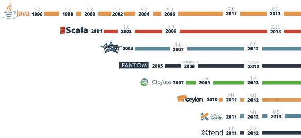

# Java 太老了，2018 年该学什么？

> 原文：<https://medium.com/hackernoon/java-is-too-old-what-should-you-learn-in-2018-12cd0151b2d1>

Java 已经成为遗产。它不可能在保持向后兼容性的同时发展成一种现代语言。但它给了我们一个美妙的 JVM 生态系统，并创造了许多优秀的语言 Groovy、Scala、Clojure、Kotlin。

# 欢迎最新的婴儿科特林

Kotlin 诞生于 2011 年，但在去年谷歌宣布将其作为 Android 的官方语言后，它开始流行起来。Kotlin 带来了许多其他 JVM 语言的强大特性。让我们快速浏览一下 Kotlin 给 Java 开发人员带来的好处。

## 永远不要担心 NPEs

每个 Java 程序员都讨厌在运行时抛出空指针异常。Kotlin 提供了一流的支持，以避免编译时的空引用。默认情况下，所有对象都是不可空的，你必须使用`?` 操作符来定义可空的类型。编译器会强迫你使用安全的调用操作符`?.`来访问可空的对象。你也可以使用埃尔维斯运算符`?:`来分配默认值。

## 不需要提供显式类型声明。

Kotlin 自动推断类型，所以不需要显式声明。您可以简单地使用`val`定义最终变量，使用`var`定义非最终变量。只有在声明和赋值都在单个语句中完成时，才能推断出注释类型。

## 避免复杂的字符串格式。

在 Kotlin 中，您可以使用字符串模板来简化字符串的格式化。`$`用于引用变量，您可以将`${}`用于复杂表达式

## 创建简单的 POJOs 不需要锅炉板代码。

Kotlin 为用于简单保存值的对象提供了`data`类。它自动为数据类生成`equals`、`hashCode`、`toString`、`copy`、`getters`和`setters`(对于定义为`var`的属性)方法。您还可以对数据类进行对象解构，以提取变量的属性。

## 您可以避免生成器类和多余的方法重载。

Kotlin 支持命名方法参数，因此在大多数情况下，您不需要创建构建器。此外，Kotlin 支持默认方法参数，因此您不需要创建冗余的重载方法来传递默认值。

## 您不再需要 guava 库来静态初始化集合。

Kotlin 提供了使用`listOf`、`mapOf`、`setOf`方法内联初始化集合的简洁方法。地图还支持直观的语法`key to value`进行初始化。它还提供了对映射键、值的解构，以便于迭代。

## 你不需要复杂的方法来创建单例。

Kotlin 支持`object`声明，在单行中创建单例。

## 你不需要不必要的局部变量

在 Kotlin 中，像`try`和`when`这样的结构是返回值的表达式。例如，你可以将`try`的结果赋给一个变量，而不是创建一个局部变量。同理对于`when`也可以作为表达式使用。`when`相当于 Java 中的`switch`，但功能强大得多。

## 您将避免类强制转换异常。

Kotlin 提供了`is`操作符(相当于 Java 中的`instanceOf`)来检查对象是否为特定类型。使用`is`操作器会自动为你铸造。这将防止在转换为错误类型时出现类转换异常。

## 您不需要重复变量名来调用同一对象中的序列方法。

Kotlin 提供了`with`构造来轻松调用同一对象上的方法序列，而不必重复变量名。在 Java 中，我们通常使用构建器模式和方法链接。Kotlin 使类似的事情变得简单，甚至对非构建类也是如此。

Kotlin 也提供了`apply`扩展函数来实现同样的事情。

## 使用委托或装饰模式不需要样板代码。

为了支持组合而不是继承，我们经常使用委托或装饰模式，但是我们必须在包装类中复制委托类的每个方法。Kotlin 使用`by`操作符为简化委托提供了一流的支持。它会自动实现必要的方法来调用委托类的方法。当然，您可以在需要时覆盖特定的方法。

## 你不需要一个类来创建静态函数。

Kotlin 支持类之外的函数，因此您不需要仅为静态实用函数创建一个类。

## 修改 lambdas 中的非 final 变量不需要黑客。

Java 通过用匿名内部类自动替换 lambda 来支持它，但是不能在 lambdas 内部修改非 final 变量。但是在 Kotlin 中，你也可以在 lambda 中修改非最终变量。

## 懒装不需要努力。

Kotlin 提供了一种非常简单的方法来使用`lazy`关键字惰性地初始化一个属性。

## 你不必完全转换到一种新的语言。

Kotlin 与 Java 无缝互操作，因此您可以轻松地与遗留 Java 代码集成。您可以继续利用第三方 Java 库和框架。与 Scala 不同，Kotlin 没有自己的收藏库，但扩展了 JDK 收藏。所以不需要编写 glue 代码在 Java 和 Kotlin 集合类型之间进行转换。

## 您可以编写简洁且可读性更强的代码。

Kotlin 使用方法名称约定来重载许多操作符以提高可读性。例如方法`plus`用于重载`+`运算符，`minus`用于重载 `-`运算符，`times`用于重载`*`运算符，`div`用于重载 `/` 运算符，以此类推。它支持重载更多像`%, += , +- , ++,--`这样的操作符

Kotlin 提供了使用`..`操作符定义范围的简洁方法。它还提供了用于排除边界的`until`关键字和用于跳过项目的`step`运算符。它有`in`操作员检查范围内的东西。我们也可以通过实现`rangeTo`和`contains`方法来重载`..`操作符和`in`操作符。

## 您可以轻松地扩展现有的 JDK 类。

Kotlin 支持向现有类添加扩展函数的简单方法。这是一个非常强大的功能，可以帮助我们轻松地扩展核心语言 API。

# 为什么要使用 Kotlin？

## 它能成倍提高你的生产力

*   它是静态类型的语言，所以你会在编译时发现很多错误。
*   它有强大的工具支持。毫无疑问，它是由 IDE 公司开发的
*   它是由 JetBrains 创建的，JetBrains 是一家关注开发人员生产力的 IDE 公司。
*   避免 Java 开发人员的许多日常挫折。

## 默认情况下，您会受益于许多最佳实践(来自 [Effective Java Book](https://amzn.to/2qi8VRv) 的原则)。

*   所有课程都是最终的。
*   集合是不可变的。
*   覆盖强制关键字，而不是可选注释
*   没有已检查的异常
*   没有原始类型
*   更干净的泛型支持。

## 非 JVM 支持。

*   Kotlin 还编译成 Javascript 用于前端开发。
*   他们还致力于添加本地运行时，使其在没有 JVM 的情况下运行。

# 你应该换成科特林吗？

科特林很棒，但还不够完美。进化成一门伟大的语言需要一些时间。JetBrains 和 Google 都在积极支持 Kotlin，所以你可以肯定它只会变得更好。

如果你是 Android 开发者，你应该立即开始使用 Kotlin。

如果你是一名 Java 开发人员，你可能需要考虑其他因素，比如团队成员、公司采用等。但即使不能马上使用，也绝对要学习这种现代的美。

最后，根据 thoughtworks 技术雷达，公司可以在能够处理一些风险的项目中进行尝试。

***2018 . 10 . 10 更新:***

Kotlin 在[thoughtworks technology radar](https://www.thoughtworks.com/radar/languages-and-frameworks)中的 ***试用*** 升级为 ***采用*** 类别，因此公司可以在适当的时候在项目中采用使用 kotlin。

# 参考

 [## 我应该学习 Kotlin 还是坚持 Java？

### 在 GoogleIO 2017 中，谷歌宣布 Kotlin 作为 Android 开发的官方语言。某著名开发商…

medium.com](/mindorks/should-i-learn-kotlin-or-stick-to-java-3a73c3580ac3) 

[科特林在行动书](https://amzn.to/2qiL8Ro)作者[德米特里·杰梅罗夫](https://www.amazon.com/s/ref=dp_byline_sr_book_1?ie=UTF8&text=Dmitry+Jemerov&search-alias=books&field-author=Dmitry+Jemerov&sort=relevancerank)(作者)[斯韦特兰娜·伊萨科娃](https://www.amazon.com/s/ref=dp_byline_sr_book_2?ie=UTF8&text=Svetlana+Isakova&search-alias=books&field-author=Svetlana+Isakova&sort=relevancerank)(作者)

如果你喜欢这篇文章，请鼓掌，这样会有更多的观众看到。我正计划写一些关于 Kotlin 特征的深度文章。如果你想了解更多关于科特林的内容，请关注我，这样你会得到新故事的通知。