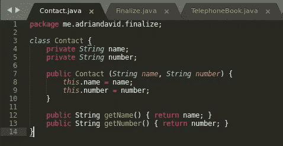
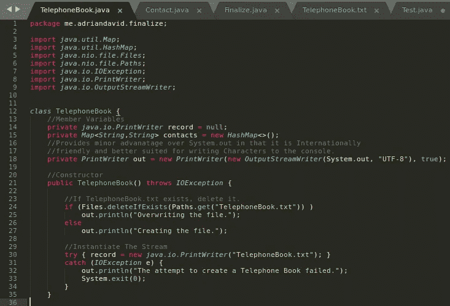
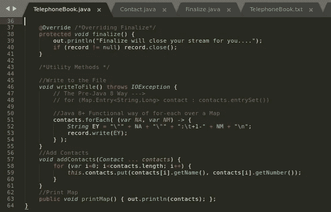
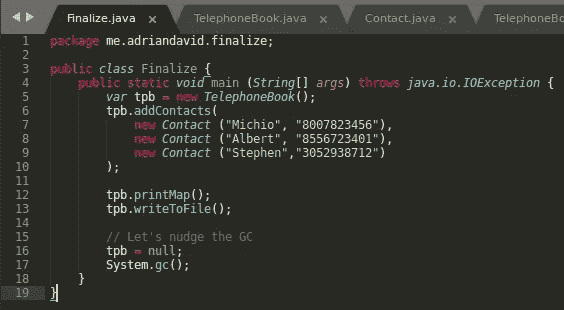
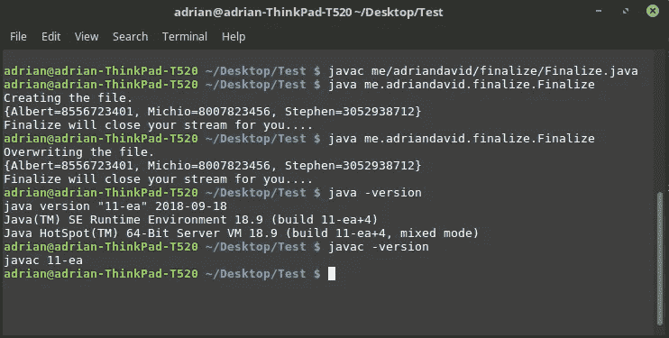

# java.lang.Object.finalize()最终被弃用

> 原文：<https://medium.com/hackernoon/java-lang-object-finalize-is-finally-deprecated-f99df40fa71>


[GIPHY](https://giphy.com/gifs/monday-the-it-crowd-workplace-c6DIpCp1922KQ)

就这样，finalize()受够了自己的不可靠，走出了 Object 的会议室，再也没有出现过，或者说我们愿意相信。

尽管很多人可能没有意识到，随着 JDK 9 的发布，finalize()的**被弃用了**。不信，查一下 [Java 9 的文档](https://docs.oracle.com/javase/9/docs/api/java/lang/Object.html#finalize--)！读者应意识到**弃用并不一定意味着移除或未来移除**。这是一个指示，用于指出应该(如果可能的话)避免注释元素，并且在 Java 平台的未来版本中可能会移除注释元素。

目前，还不确定 finalize()是否会被标记为移除。我个人不相信会被去掉，但也不确定。我所能做的就是，JDK 11 的早期版本没有移除它，因为它是 Java 生态系统中每个类都继承的方法，我的直觉告诉我，它会一直存在下去。

然而，如果元数据是 API 编写者意图的任何指示，至少在编写时，它似乎不会被删除——至少在不久的将来不会。我们可以通过运行和分析以下代码的结果来得出这个结论:

```
/* Note that this uses language features only available in Java 10 and 11, namely, local variable type inference. The use of this feature within Lambda Expression arguments came about in Java 11 and is used in this article. Java 10 is set to be released 6 days following the publishing of this article. You may learn more about local variable type reference @ [bit.ly/VarJava](http://bit.ly/VarJava) */import java.lang.annotation.Annotation;...var annos = Object.class.getDeclaredMethod("finalize", (Class<?>[]) null ) .getAnnotations();for (var anno : annos) System.out.println(anno + "\n");Output: @java.lang.Deprecated(**forRemoval**=false, since="9")
```

我们运行这段代码的原因很明显，那就是以编程方式显示**Java . lang . object . finalize()**还没有被标记为删除。

> 对 finalize()的反对在某种程度上可以被认为是一种仪式上的锦上添花。

追溯到 2001 年，在他的重磅经典*“Effective Java”*(这应该是认真的 Java 开发人员的必读书)的第一版中，Joshua Bloch 警告了依赖 finalize()的[危险。](https://www.amazon.com/Effective-Java-3rd-Joshua-Bloch/dp/0134685997/ref=mt_paperback?)

Sun(以及后来的 Oracle)一直在告诫 Java 开发人员使用终结化，以及为什么它几乎(如果不是完全)总是一个坏主意。开发 finalize()的主要动机是能够处理代码中“不可及的对象”,比如本机资源。

在过去，人们可能会尝试使用 finalize()，如下所示。

**关于我的环境的一些说明:**我将在 Linux Mint MATE 上使用 JDK 11 的早期版本。

# finalize()能可靠地关闭您的流吗？

> 让我们写一个用 MVC 架构模式建模的电话簿。

## *首先，*这位**模特**，一个叫 Contact 的 POJO 豆。



## 第二，控制器，一个叫电话本的类。



## 第三，视图，我们的主类，叫做 Finalize。



## 运行时，这是输出。



## **分析。**

花点时间查看一下代码。这里要把握的要点是，我们依赖 finalize()来做一些清理工作:关闭 java.io.PrintWriter 流。现在请注意 Finalize 类的第 16 行和第 17 行。请注意，我们都将 TelephoneBook 的一个实例设置为 null，并温和地向垃圾收集器建议现在可能是运行的好时机。回想一下，System.gc()不是垃圾收集器的直接触发器，finalize()也不是析构函数。**都不需要运行**。所有这一切的核心是，垃圾收集器将在它高兴的时候运行，而我们无法(出于我们的实际目的)控制它何时运行。

您是否注意到在我们的示例中，垃圾收集器运行了，finalize()被调用了？试试这个实验。删除 finalize 类的第 16 行或第 17 行，查看是否调用了 Finalize()方法。我愿意是它没有，虽然我不能确定。对我来说，它一再没有。记住，我们不能(至少在大多数实际情况下)确定性地控制垃圾收集器何时运行。

> 因此，如果我们依赖 finalize()来关闭我们的 OutputStream，我们就是在进行草率的编程。

你明白为什么 finalize()不是个好主意了吗？这只是许多例子中的一个，但是消息是清楚的:**因为我们不能保证 finalize()将被调用或者确定 GC 何时运行，我们不能可靠地使用 finalize()来完成关闭任务，比如关闭 I/O 流**。如果我们不得不关闭一个 SSLSocket 呢？或者和 JDBC 有联系？还是 JNI 资源？我将留给读者的想象力(或噩梦)去思考可能导致的混乱。

# 结束语

Java 9 是一个期待已久的老生常谈:你不能依赖 finalize()来清理。行为规范，并通过其他方式明确清理您的资源。正如所暗示的，finalize()还有其他问题，即:**性能、死锁和挂起** [1]。

要更深入地理解 System.gc()为什么是不好的实践，请访问:

[](https://stackoverflow.com/questions/2414105/why-is-it-bad-practice-to-call-system-gc) [## 为什么调用 System.gc()是不好的做法？

### 这是一个非常麻烦的问题，我觉得这是许多人反对 Java 的原因，尽管 Java 是一种非常有用的语言

stackoverflow.com](https://stackoverflow.com/questions/2414105/why-is-it-bad-practice-to-call-system-gc) 

> **像我们一样鄙视 finalize()吗？还是你觉得这还是个好主意？请在下面的评论中告诉我:)**

# 想要出处？抓住这里。

你需要 JDK 11 号，你可以在这里找到它。

[](https://github.com/afinlay5/finalize-) [## 最终确定 5/最终确定-

### 个人博客上的 Java . lang . object . finalize()Java 11 示例的 Gradle 源代码库…

github.com](https://github.com/afinlay5/finalize-) 

# 再见，敲定()。不会有人想念你的。


# 对 Java 感兴趣？加入我在脸书的 Java 小组:

[](/@afinlay/join-my-java-facebook-group-a32cee52a0d9) [## 加入我的爪哇脸书群

### 对 Java 感兴趣？看看我的脸书小组:Java 软件开发小组！

medium.com](/@afinlay/join-my-java-facebook-group-a32cee52a0d9) 

# 喜欢我的内容？订阅我的邮件列表:

# 别忘了给它一个…；)


[IEmoji.com](http://www.iemoji.com/view/emoji/1315/skin-tones/clapping-hands-medium-light-skin-tone)

**作品被引用**

[1] — [JDK 9 API 文档:java.lang.Object.finalize()](https://docs.oracle.com/javase/9/docs/api/java/lang/Object.html#finalize--)