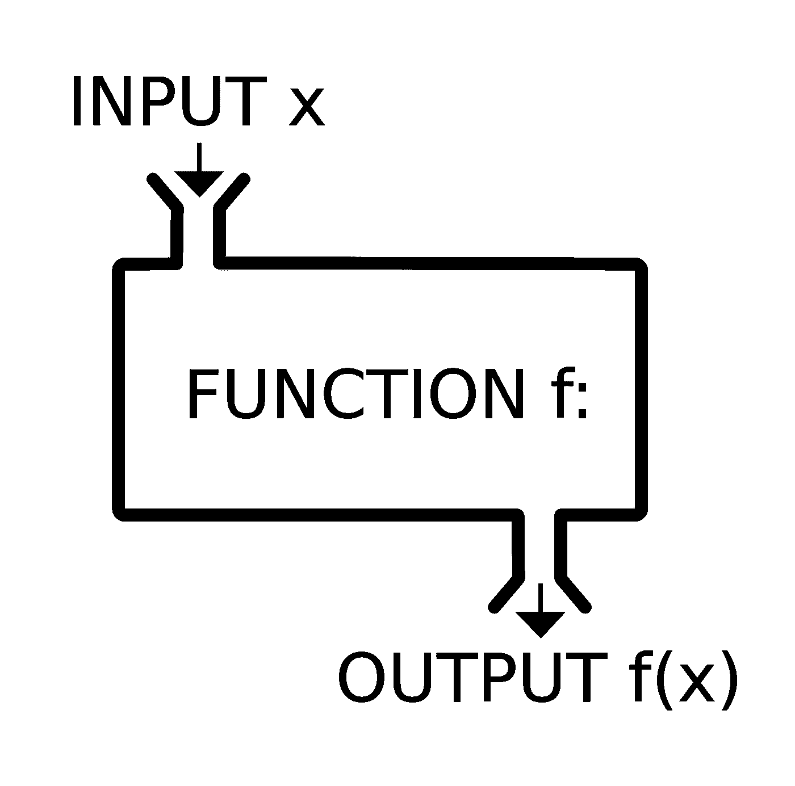

# Java 可选是复杂的

> 原文：<https://medium.com/hackernoon/java-optional-is-complicated-d6dc5c061e57>

很久很久以来，我都没有用 Java 写代码，因为如果需要 JVM，那么 Scala 就是我的选择。然而，这种情况时常会发生变化，尤其是当我不得不在 Java 商店工作的时候。

随着 *Java* 语言的新进展，我会说 *Java* 比几年前更容易使用。函数式编程有很大的发展，这可以在最新版本的 Java 中看到。

在做了很多努力来整合所有这些特性之后，有一些仍然是不完整的。

让我们看看 ***可选*** 以及如何使用它，以及它与 ***Scala* 相比如何。*选项*选项**。

***可选*** 背后的主要思想是避免空值和避免 NullPointerException。然而，它感觉我们在 *Java* 中发现的那个实际上促进了空值的使用。让我们看看怎么做。

每当我们向它发送一个 null 时，这个就会抛出***NullPointerException****。相反，我们需要使用`.ofNullable`方法。*

*主要思想不是避免这些异常吗？那为什么我们会有两种截然不同的工作方式，并且会有如此不同的结果。*

*在 *Scala* 中，我们只需要做:*

*请注意，我将类型保持在最高级别，因此每个人实际上都可以为 null。*

*重点是`Option.apply(somethingNull)`，它和`Option(somethingNull)`一样，会处理空值并为我们创建适当的结果，而不会抛出 NullPointerException，这正是我们想要避免的问题。*

*为了我们自己的缘故， *Java* ***可选*** 有权利`.map`和`.flatMap`，它们在 *Scala* 或任何其他语言中工作。然而， *Java* 使得这些方法的签名方式比它们的 *Scala* 的对应物更加复杂。*

*换句话说，这与 *Scala* 中的以下内容相同:*

*注意，我保留了相同的泛型类型名。*

*`.flatMap` 最差。*

*在 *Scala* 中我们写道:*

*在这两种语言中，我们都可以使用`.get()`从 ***可选的*** 中提取值，但是，这种操作是不鼓励的，因为在这两种语言中这可能会以异常结束。为了避免这一点， *Java* 和 *Scala* 采取了不同的方法。*

*在 *Java* 中，如果包装的值是`null`，我们需要使用`.orElse`来提供默认值。*

*在 *Scala* 中我们使用`.getOrElse`*

*正如我们所见，这两种方法是相似的，尽管 *Scala* 更简洁地描述了如何创建*可选值以及如何避免空值问题。**

**还有一点 *Java* 短， ***Java 可选不可折叠*** 。**

**每次我们把一个值放入一个可选值中，我们都会想知道里面有什么样的值。它是 null 还是只是一个常规值？**

***Java* ，再次选择了冗长、不太方便的路径。**

**因为 *Scala* 选项是可折叠的，我们可以用一种更优雅的方式来做这件事。让我们看看怎么做。**

***Scala* 中的`.fold`签名如下:**

***注意* `*ifEmpty: => B*` *与 Java 中的* `*Supplier<B>*` *相同。***

**那么问题是他们为什么没有给 *Java* ***可选*** ？**

**仅出于教育目的，让我们自己在 *Java* 中创建一个***foldable optional***，看看实现`.fold`有多容易。**

**正如我们在这里看到的，`.fold`的实现不能再简单了，因为我们在 *Java* 中有有限的工具箱；尽管如此，非常直截了当。**

## **结论**

**尽管 Java 语言在过去几年里一直在发展，但它仍然远远落后于其他语言，比如 Scala，尤其是在函数方面。令人印象深刻的是, *Scala* 如何在整个库中保持相同的 API，并保持一致。甚至开源库和项目都使用相同的标准。另一方面， *Java* 正在朝着更好的 *Java* (如果真的存在的话)迈出正确的步伐，但是还有很长的路要走。与此同时，我们必须继续使用手头的工具来做我们的日常工作，所以让我们在使用好的同时继续增强它。**