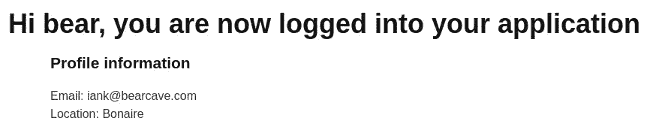

# Java 模板引擎

> 原文：<https://medium.com/hackernoon/java-template-engines-ef84cb1025a4>

# 介绍

所有 web 应用程序都显示从支持 web 应用程序的计算机资源中提取的动态信息(与网站相反，网站可能只显示静态内容)。在许多情况下，一个 web 应用程序是由一个 web 服务器支持的，比如 Tomcat 或 Amazon Web Services (AWS) Lambda 这样的“无服务器”组件。为了简化本文中的讨论，后端系统将被称为 web 服务器。

当显示 web 应用程序页面时，它将包含从 web 服务器获取的动态信息。有两种方法可以将来自服务器的动态信息包含在网页中:

1.  在客户端(web 浏览器)上运行的 JavaScript 可以从服务器获取数据，并通过修改页面 HTML 的内存中表示(例如，DOM)将数据插入页面。
2.  可以在服务器上修改网页的 HTML，将数据插入到网页的 HTML 中。这通常被称为“服务器端渲染”。

本文讨论了三个模板引擎，它们可用于利用 [Spring 框架](http://topstonesoftware.com/publications/simple_spring_boot_mvc_example.html)的 Java 应用程序的服务器端呈现。

# 显示服务器端数据

下图显示了 [AWS Cognito 演示应用](http://topstonesoftware.com/publications/authentication_with_aws_cognito.html)的部分屏幕截图。这个简单的页面在用户登录到应用程序后显示。该页面显示用户名( *bear* )和一些简单的用户资料信息。

使用 HTML 中的模板引擎标记将数据包含在网页中。在下面的示例中，使用了 FreeMarker 标记。

这部分网页的 HTML 如下所示:

在 Spring 模型-视图-控制器范例中，每个网页都有一个关联的控制器类，该类包含处理网页交互的函数(例如，HTTP GET 和 POST，如果有表单的话)。应用程序页面的 Java 函数如下所示。

在上面的例子中，一个 UserInfo 对象被添加到模型映射中，并以 user_info 作为键值。当模板引擎(在本例中是 FreeMarker)在服务器上呈现 web 页面时，对象的值被填充到页面 HTML 中引用它的位置。

HTML 网页被称为模板，因为当页面被呈现时，数据值动态地替换模板标记。

# Java 模板引擎

最早的模板引擎之一是 PHP，它可以追溯到网络的早期。

1999 年，Sun Microsystems 发布了 Java Server Pages (JSP ),这是一个用于 Java web 应用程序的模板引擎。2006 年发布了 Java 服务器页面标记库(JSTL)。JSTL 使 JSP 更容易使用，生成的网页也更容易理解。

除了 JSP/JSTL 之外，还有许多为 Java 软件生态系统发布的模板引擎。其中包括[阿帕奇速度](http://velocity.apache.org/)、[自由标记](https://freemarker.apache.org/)、[百里香叶](https://www.thymeleaf.org/)和[皮波](http://www.pippo.ro/)(似乎是从一个更早的名为 Pebble 的模板引擎演变而来)。 [Groovy 服务器页面](https://gsp.grails.org/latest/guide/index.html) (GSP)用于 Grails/Groovy 应用程序。

# 选择模板引擎

web 应用程序可能由大量网页组成。例如，[地下](http://www.nderground.net/)社交网络，由 [Topstone 软件](http://www.topstonesoftware.com/)建立，拥有超过 35 个网页。设计和开发这些 web 页面代表了构建 web 应用程序工作的重要部分。为网页实现选择模板引擎是软件架构中的一项重要投资。

评估 Java 模板引擎的一个核心要求是它是否受 Spring 框架支持，Topstone 软件使用 Spring 框架开发 web 应用程序。已经对 Spring 支持的三个模板引擎进行了评估。

1.  带有 Java 服务器页面标记库的 Java 服务器页面(JSP/JSTL)
2.  百里香叶
3.  自由市场

除了支持 Spring，模板库还需要支持在主页中包含(插入)HTML 片段的能力。这个特性允许在页眉中包含普通的 CSS 和 JavaScript，在应用程序页面中包含普通的页眉和页脚。

评估模板引擎(或任何软件开发框架)的最佳方式是在真实的应用程序中使用它。每个模板引擎都在 Cognito 演示应用程序的一个版本中使用。

## JSP 和 JSTL

开发 [Cognito 演示应用](http://topstonesoftware.com/publications/authentication_with_aws_cognito.html)是为了探索 AWS Cognito 认证服务。该应用程序包含十个网页，其中几乎每个网页都包含动态服务器端数据。

Cognito 演示应用程序的原始版本在 web 页面中使用 JSP 和 JSTL 模板。

JSTL 支持<import>标签，该标签允许在页面或页眉中包含 HTML 片段。</import>

下面的例子显示了如何为服务器端页面生成添加条件逻辑。当一个页面被发送到客户端时，它将由静态 HTML 组成，而 HTML 是在服务器上动态生成的。

## [百里香叶](http://www.thymeleaf.org/)

百里香目前在春天社区很流行。许多关于 Spring 的文章在示例网页中都使用了百里香。关于 Spring 框架的最佳参考之一， *Spring in Action，第五版*，Craig Walls，Manning Press，2018 年 10 月，也使用了百里香叶。

百里香有很多问题，其中一些是文体上的。

百里香叶将百里香叶标记嵌入 HTML 标签中，通常是

或标签。我觉得这不像 JSP/JSTL 或 FreeMarker 标签那样简洁、易于读写。显示百里香标记的示例如下所示。

百里香支持 th:replace 和 th:include 标签，这些标签允许将 HTML 的部分插入到页面中。下面的例子展示了如何使用 th:replace 标签将 CSS 和 JavaScript 链接插入到页面头部。th:replace 标签也用于添加一个页面标题，这样页面就有共同的标题了。

百里香有一些超越文体的问题。

当百里叶在处理百里叶标记时遇到错误，它会抛出一个 Java 异常。该异常不包含任何关于错误原因的信息(即行号和字符号)。这使得查找和纠正百里香叶标记错误非常耗时，减慢了应用程序的开发。

另一个担心是，百里香叶可能会成为一个孤儿开源项目。

虽然百里香叶在 Spring 社区很受欢迎，并且百里香叶目前由 Spring 工具套件项目构建器支持，但我注意到 Pivotal(支持 Spring 框架的公司)不支持百里香叶。百里叶由三个 GitHub 提交者支持，大多数 GitHub 提交来自两个人。如果这些 GitHub 提交者不能够或不愿意支持百里香，这个项目可能会成为孤儿。

## [FreeMarker](https://freemarker.apache.org/)

FreeMarker 由 Apache 软件基金会支持，拥有庞大的用户社区，包括几个内容管理系统的页面模板(见[谁使用 FreeMarker](https://freemarker.apache.org/poweredBy.html) )。FreeMarker 也支持 Spring 框架。

在风格层面，我更喜欢 FreeMarker 的 JSP/JSTL 式的标签结构。下面是一个例子。请注意，条件句中的表达式不一定要加引号。

FreeMarker 支持 include 标记，该标记可用于在页面中包含 HTML 部分。下面是一个例子。

FreeMarker 并非没有怪癖。我花了几个小时进行令人沮丧的实验，然后才能将图像加载到 FreeMarker 页面上(参见 FreeMarker GitHub 项目中的 Java 配置类 cognitodemo . FreeMarker . config . appconfig)。

Free marker 也有一个语法，需要慢慢习惯。在下面的示例中，FreeMarker 页面引用了字符串变量 login_error。但是，这个 FreeMaker 标记将导致 FreeMarker 解析错误。

FreeMarker 要求您使用 FreeMarker 操作符来比较 null 和字符串长度。空比较运算符是“？?"不允许使用字符串长度()函数。相反，必须使用内置的 FreeMarker 长度操作符:login_error？长度。正确的 FreeMarker 标记如下所示:

## [速度](http://velocity.apache.org/)呢？

Velocity 是一个老式的模板引擎，是 JSP/JSTL 的替代品。Velocity 有一个庞大的社区和许多功能。从 2010 年到 2017 年，没有主要的 Velocity 版本，包括 Spring 开发团队在内的一些人得出结论，Velocity 项目处于冬眠状态。

在[吉拉发布的一篇文章](https://jira.spring.io/browse/SPR-13795)中，Spring 开发组声明 Velocity 将不再是 Spring 支持的一部分，但是 Apache Velocity 组可以支持 Velocity 的 Spring 适配器。

2017 年，Apache Velocity 发布了模板引擎 2.0 版本，2018 年，他们发布了 Velocity 工具 3.0 版本。因此，速度项目似乎很活跃。

关于速度和将速度与弹簧结合的参考资料包括:

*   [Spring MVC with Velocity 快速指南](https://www.baeldung.com/spring-mvc-with-velocity)概述了如何将 Velocity 与 Spring 集成
*   [Apache Velocity 简介](https://www.baeldung.com/apache-velocity)
*   Apache 项目已经发布了指南[用 Velocity 构建 Web 应用](http://velocity.apache.org/engine/2.0/webapps.html)

虽然 Velocity 似乎可以与 Spring 集成，但我担心 Velocity 与 Spring 的兼容性似乎不是 Spring 项目或 Apache Velocity group 的关注点。考虑到这一点以及在某些时候探索必须让位于应用程序开发的事实，我决定不开发 Cognito 演示应用程序的 Velocity 版本。

# 结论

在调查了 JSP/JSTL、百里香和 FreeMarker 之后，我决定在我的下一个 Topstone 软件 web 应用程序中使用 FreeMarker。

JSP/JSTL 的一个问题是，自 2008 年以来，该技术没有发生太多变化。尽管 Java 背后有一个活跃的开源社区，但不清楚这是否扩展到了 JSP/JSTL。这使得该技术与 FreeMarker 相比吸引力下降，FreeMarker 拥有庞大的用户社区和活跃的 Apache 项目。

百里香叶有一个小的开发组。除非这个小组扩大，否则我担心百里香会成为一个孤儿项目。事实上，目前，当遇到标记错误时，百里香不会提供有用的错误消息，这使得查找问题非常耗时。在风格层面上，我不像 JSP/JSTL 或 FreeMarker 那样喜欢百里香标记。

FreeMarker 是 Apache 基金会的一个项目，有一个庞大的用户社区。当 FreeMarker 处理器遇到错误时，它会提供有用的错误消息。在使用 Groovy 服务器页面和 JSP/JSTL 之后，FreeMarker 标记感觉很熟悉。

## Cognito 演示应用 GitHub 存储库

*   https://github.com/IanLKaplan/CognitoDemo
*   百里香叶:【https://github.com/IanLKaplan/CognitoDemoThymeleaf】T2
*   自由标记:【https://github.com/IanLKaplan/CognitoDemoFreeMarker 

# 附录

# 模型-视图-控制器与客户端页面呈现

Cognito 演示应用程序中使用的服务器端模型-视图-控制器(MVC)范式的一个缺点是客户端 web 页面逻辑与服务器端控制器集成在一起。对网页的更改可能会导致控制器代码的更改。

另一种方法是实现支持 API 的服务器端代码，该 API 返回数据供客户端显示。客户端代码使用 JavaScript 框架(如 AngularJS 或 React)实现，使用 API 引用(HTTP GET 操作)获取显示在网页上的数据。

按照这种架构，客户机显示层与服务器代码分离。只有在需要显示新数据时，才需要更改服务器代码。

在这种体系结构中，客户端的应用程序显示可以完全改变，而不会影响服务器。

对于大型组织来说，脱离模型-视图-控制器范式(控制器在服务器上)可能是有吸引力的。客户端和服务器端组可以并行工作，影响较小。

对于较小的组织或快速应用程序开发来说，开发一个单一的 Spring MVC 应用程序通常会更快更灵活，因为开发服务器端控制器和客户端 web 页面的是同一批开发人员。

在应用程序赢得市场后，转向在服务器上使用 Spring 来实现服务器 API 和客户端框架(如用于客户端显示的 AngularJS)的架构可能是有意义的。然而，过早采用这种方法很可能会增加开发时间，而尽快将应用程序交付给用户是非常重要的。

*[*本文原文*](http://topstonesoftware.com/publications/java_template_engines.html) *发表在托普斯通软件咨询网站上。**