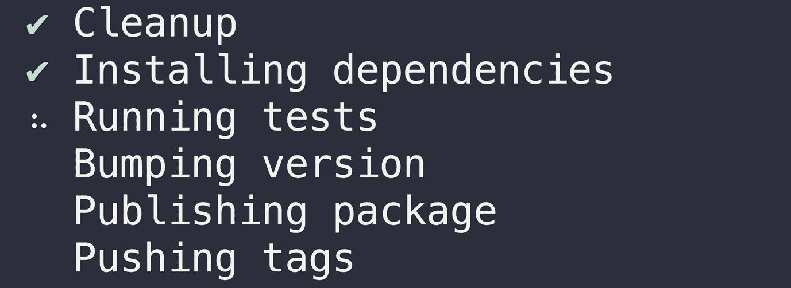
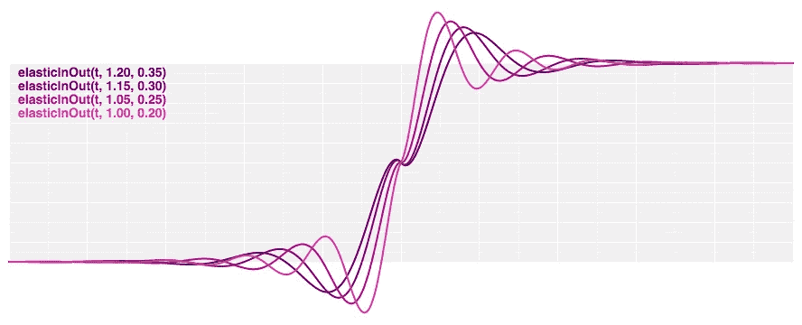

# 🔥值得使用的 JavaScript 模块🔥

> 原文：<https://medium.com/hackernoon/javascipt-modules-worth-using-9aa7301e41ac>

我发现自己反复使用的最有用的 JavaScript 模块的快速分类。

这是一篇有见解的文章，重点关注通用模块和实用程序，我发现它们对 NodeJS 和前端 JavaScript 开发非常有价值。它不会是详尽无遗的，也不会包括任何特殊用途的模块，因为那些类型的[牛逼列表](https://awesomelists.top/)确实很牛逼，但往往有点势不可挡。

Yeahhh we all love npmmmmm huzzahhhhhh!!! (Image Credit: [npm](http://blog.npmjs.org/post/161081169345/v500))

# 命令行工具

让我们从一些非常有用的命令行工具开始。

> [**NP**](https://github.com/sindresorhus/np)——更好的`npm publish`。

如果你是一个 npm 作者，我强烈推荐你去看看 [np](https://github.com/sindresorhus/np) ，因为它让修改版本、添加 git release 标签和发布到 npm 的过程变得轻而易举，尤其是当你开始有很多模块需要维护的时候。同样值得注意的是[发布](https://github.com/zeit/release)由 [Zeit](https://zeit.co/) 作为一个可靠的替代方案。

Image Credit: [np](https://github.com/sindresorhus/np) by [Sindre Sorhus](https://sindresorhus.com/)

> [**纱**](https://yarnpkg.com) -兼容`npm`的更好的包管理器。

虽然 npm [v5](http://blog.npmjs.org/post/161081169345/v500) 比以前的版本快了很多，但我仍然认为 [yarn](https://yarnpkg.com) 在速度和一致性方面比 npm 更适合本地开发。无论哪种方式，你都是在使用同一个 npm 模块数据库，我觉得这两者之间没有明显的赢家。您应该选择最适合您的项目需求的包管理器。

然而，作为 2018 年的 JS 开发者，我会确保你至少熟悉`npm`和`yarn`，并且在它们之间切换自如。

> [**更漂亮**](https://prettier.io/)——一个固执己见的代码格式化者。

Prettier 通过解析您的代码，并根据自己的规则(考虑到最大行长度，在必要时换行)重新打印代码，来强制实现一致的风格。

我喜欢 eslint，尤其是长期使用 JavaScript T2 标准风格的 T3，但是像 T4 漂亮 T5 和 T6 gofmt T7 这样的自动代码格式化器背后的想法无疑是有吸引力的。

作为开发人员，我们花费了太多的时间和精力来担心代码的表示和样式，而[beautiful](https://prettier.io/)减轻了对这些思考过程的需求，并允许您专注于您正在编写的内容，而不是如何编写。

Image Credit: [prettier](https://github.com/prettier/prettier)

> [**现在**](https://zeit.co/now)——极其简单的部署。

就简单性、可靠性和特性集而言，Now 绝对是当今最好的免费部署系统。它非常适合测试静态和动态部署，并且在您需要更多服务器时可以很好地扩展。Aaaaaaaaaand 我提到过它是免费的吗？！

它与 Node.js 和 js 支持的 webapps 配合得非常好。我也强烈推荐看看 Zeit 的其他产品，因为他们的团队是由社区中最好的 JS 开发者组成的。

Image Credit: [Zeit](https://zeit.co)

> 用于记录高质量终端会话的免费工具。

参见我之前的博客文章“让你的代码变得漂亮”中关于如何利用 asciinema 制作高质量代码演示的分解。

# 承诺

这一节确实值得写一整篇文章，尤其是现在[async&wait](https://zeit.co/blog/async-and-await)已经开始成为 JavaScript 并发编程事实上的标准范例。话虽如此，如果你还没有的话，我强烈推荐你去看看[辛德雷·索胡斯](https://sindresorhus.com/)‘卓越[许诺-乐趣](https://github.com/sindresorhus/promise-fun)模块集。我对这些模块唯一的不满是，它们可能无法与大多数前端工具链一起开箱即用，如 [create-react-app](https://github.com/facebook/create-react-app) 或 [rollup](https://rollupjs.org) 。

以下是一些最有用的宝石，它们在 Node 中处理承诺和异步风格的代码时非常突出:

> [**pify**](https://github.com/sindresorhus/pify) -承诺一个回调风格的函数。

有很多方法可以将函数从老派的回调风格转换成承诺风格，但是我发现 [pify](https://github.com/sindresorhus/pify) 是最好的。它很小，并且有一些内置的[util . promise rify](https://nodejs.org/api/util.html#util_util_promisify_original)所缺乏的类似自动方法绑定的细节。

> [**p-Map**](https://github.com/sindresorhus/p-map)-Map over promises 并发。

并发性很好，但大多数时候，您希望对并行性设置一个实际的限制，无论是限制网络带宽还是计算资源。这才是 [p 图](https://github.com/sindresorhus/p-map)真正出彩的地方。我 99%的时间都用它来替代`Promise.all(…)`，它不支持限制并行。

在我知道 [p-map](https://github.com/sindresorhus/p-map) 之前，我创建了自己的版本 [async-await-parallel](https://github.com/transitive-bullshit/async-await-parallel) ，但是你应该使用 [p-map](https://github.com/sindresorhus/p-map) 因为它更好。😛

> [**p-重试**](https://github.com/sindresorhus/p-retry) -重试承诺返回或异步功能。

我通常用 [p-retry](https://github.com/sindresorhus/p-retry) 包装任何 HTTP 请求和外部服务调用，以增加它们的基本健壮性。与 [p-map](https://github.com/sindresorhus/p-map) 相结合，您可以用受控的并行性处理大批量的外部请求，而不必太担心偶然的传输错误、套接字挂起或服务器超时。

> [**p-timeout**](https://github.com/sindresorhus/p-timeout) -在指定的时间后超时一个承诺。

除了 [p-retry](https://github.com/sindresorhus/p-retry) 之外， [p-timeout](https://github.com/sindresorhus/p-timeout) 也是与第三方 API 和服务可靠协作所必需的。你也可以指定一个可选的回退，因为经常返回*一些东西*比无限期挂起或者过了很长时间才返回要好。

> [**p 缓存**](https://github.com/transitive-bullshit/p-cache) 或 [**p 内存**](https://github.com/sindresorhus/p-memoize)——通过 [LRU 缓存](https://github.com/isaacs/node-lru-cache)来内存异步函数的结果。

许多这些有前途的实用程序的目标让我想起了许多架构健壮的微服务，其中每个外部依赖都可以用一个支持重试、超时、缓存、断路器、回退等的公共接口来处理。

功能的适度退化通常比让系统不堪重负或完全不响应更好，所以如果你不太熟悉微服务，请查看它们，看看它们的设计决策是否也能帮助提高你的承诺处理能力。

# 擦

有很多很棒的抓取工具，其中一些运行在原始的 HTML 上，比如 [cheerio](https://github.com/cheeriojs/cheerio) ，还有一些模拟了完整的浏览器环境，比如[木偶师](https://github.com/GoogleChrome/puppeteer)。您决定使用什么实际上取决于您的用例，因为使用原始 HTML 更快、更轻量级，而自动化无头浏览器更健壮，但代价是入门更重。

> [**cheerio**](https://github.com/cheeriojs/cheerio)——专为服务器设计的内核`jQuery`的快速、灵活和精简实施。

Cheerio 对于快速和肮脏的网页抓取非常有用，在这种情况下，您只需要对原始 HTML 进行操作。它为遍历和操作 HTML 文档提供了健壮的类似 jQuery 的语法。Cheerio 与下面的 [request-promise-native](https://github.com/request/request-promise-native) 配合得特别好，用于获取远程 HTML 文档。

> **-无头 Chrome 节点 API**

**与 cheerio 不同，puppeteer 是一个自动化无头 chrome 实例的包装器，这对于使用现代 JS 驱动的 spa 非常有用。由于您使用的是 Chrome 本身，它还具有同类最佳的解析/呈现/脚本一致性支持。无头 Chrome 仍然相对较新，但它可能会在未来几年逐步淘汰旧的方法，如 [PhantomJS](http://phantomjs.org/) 。**

**如果你需要忠实地抓取网站，自动化基于网络的工作流程，或捕捉截图，[木偶师](https://github.com/GoogleChrome/puppeteer)是一个明显的赢家，只会随着时间的推移越来越受欢迎。**

# **节点. js**

> **[**dotenv-safe**](https://github.com/rolodato/dotenv-safe)**-**从`.env`加载环境变量并确保它们都存在。**

**这个模块扩展了非常流行的 [dotenv](https://github.com/motdotla/dotenv) 模块，通过一个`.env.example`文件来加强预期环境变量的存在。像最初一样，它为 Node 提供了快速、安全和健壮的环境变量支持。**

**它还可以很好地与 Zeit 的 [now.sh](https://zeit.co/now) 部署一起使用 [now.json](https://zeit.co/blog/now-json) 中设置的`”dotenv”: true`选项。**

> **[**请求**](https://github.com/request/request) 和 [**请求-承诺-原生**](https://github.com/request/request-promise-native) -简化 HTTP 请求客户端。**

**发出 HTTP 请求是一个极其常见的操作，我这里的 goto 模块是 [request-promise-native](https://github.com/request/request-promise-native) ，它用原生 ES6 promise 支持包装了原来的 [request](https://github.com/request/request) 模块。95%的时间我希望等待一个承诺的 HTTP 请求的结果。其余 5%的时间我想直接处理响应流，在这种情况下，我使用底层的[请求](https://github.com/request/request)模块，放弃承诺支持。**

**为了保证健壮性，我经常会将[请求-承诺-本机](https://github.com/request/request-promise-native)调用包装在[p-重试](https://github.com/sindresorhus/p-retry)、[p-超时](https://github.com/sindresorhus/p-timeout)和[p-缓存](https://github.com/transitive-bullshit/p-cache)的某种组合中。**

**同样值得一提的是，[得到了](https://github.com/sindresorhus/got)作为[请求](https://github.com/request/request)的更新替代，并内置了承诺支持，尽管我个人并没有怎么用过。**

**Example of downloading an HTML document with [request-promise-native](https://github.com/request/request-promise-native).**

> ****-模板引擎为节点合并库。****

****Consolidate 非常适合处理任何类型的后端模板(电子邮件、推文、原始 html 等)。).我通常使用[手柄](http://handlebarsjs.com/)作为我选择的模板引擎，但无论如何，我总是将我的模板使用包装在 [consolidate](https://github.com/tj/consolidate.js) 中，因为它提供了一个简单的&一致的模板接口，而不管您决定使用哪个模板引擎。****

****例如，我在 [create-react-library](https://github.com/transitive-bullshit/create-react-library) 中使用 consolidate 来呈现带有库特定变量的样板文件模板。****

> ****[**execa**](https://github.com/sindresorhus/execa)——更好的`child_process`。****

****如果您需要运行 shell 命令或生成一个子进程，这非常有用。****

> ****[**fs-extra**](https://github.com/jprichardson/node-fs-extra) -有附加方法和承诺支持的更好的`fs`。****

****我发现自己很少再直接使用`fs`了。试试`fs-extra`就不会回头了。****

# ****数学****

****D3 (数据驱动文档)是一个流行的数据可视化和动画前端库。它还包含了一些最好的用于普通数学运算的*独立软件包*，我发现自己总是选择它们而不是其他模块。****

> ****[**D3——随机**](https://github.com/d3/d3-random)——从各种分布中生成随机数。****

****当`Math.random`不行的时候，给 [d3-random](https://github.com/d3/d3-random) 一个尝试。它支持从不同的常见分布中取样，包括均匀分布、正态分布和指数分布。****

> ****[**D3-缓动**](https://github.com/d3/d3-ease) -平滑动画的缓动功能。****

****

Image Credit: [d3-ease](https://github.com/d3/d3-ease)**** 

> ****[**D3-插值**](https://github.com/d3/d3-interpolate) -插值数字、颜色、字符串、数组、对象，无论什么！****

****这个模块为两个任意值之间的混合提供了多种插值方法。值可以是数字、颜色、字符串、数组，甚至是深度嵌套的对象。****

# ****测试****

> ****[**ava**](https://github.com/avajs/ava) -牛逼的 JS 试跑者。****

****毫不奇怪，我的 Node.js 单元测试运行程序是 Sindre Sorhus 创建的另一个工具。艾娃是一个较新的单元测试运行程序，它吸取了[摩卡](https://mochajs.org/)、[胶带](https://github.com/substack/tape)、[柴](http://chaijs.com/)和其他 JS 测试运行程序的许多优点，并把它们捆绑在一起，成为一个优质的项目，并带有明智的默认设置，这些默认设置“只是工作”。****

****值得注意的是，默认情况下，艾娃的测试是并行运行的，对于像数据库测试这样的用例，单元测试运行的顺序可能很重要，您可以在文件级禁用它。****

********

****Image Credit: [ava](https://github.com/avajs/ava)****

> ****[**nock**](https://github.com/node-nock/nock)——HTTP 嘲讽与期望库。****

****Nock 非常适合测试独立执行 HTTP 请求的模块。如果您的节点模块发出 HTTP 请求，并且您想要提供适当的单元测试，那么 [nock](https://github.com/node-nock/nock) 就是您要走的路。****

> ****[**sinon**](http://sinonjs.org/) -用于 JS 测试的函数间谍、存根和模拟。****

****Sinon 是一个非常有用的工具库，通过利用依赖注入来编写隔离测试。它应该是每个节点开发人员工具带的一部分。****

# ****包扎****

****我希望你已经发现这个分解是有帮助的，即使它只是学习你以前不知道的一个质量模块。我认识很多有抱负的、经验丰富的开发人员，他们最终推出了自己的解决方案来解决常见问题，这本身就是一种有用的实践，但是知道什么时候应该使用高质量的现有解决方案也是很好的，而不是不断地重新发明轮子。****

****NPM 模块库的规模和范围是前所未有的，我认为这是 JavaScript 相对于其他编程语言的最大优势之一。作为一名开发人员，你越善于利用 npm 模块，你就会变得越快越有效率。像这样的高阶“软”技能是成为[神话中的 10x 程序员](http://antirez.com/news/112)的标志之一。****

****有没有我漏掉的最喜欢的 npm 模块？在评论里分享你喜欢的模块让我知道！❤️****

## ****在你走之前…****

****如果您喜欢这篇文章，请点击👏下面，并与他人分享，这样他们也可以享受它。****