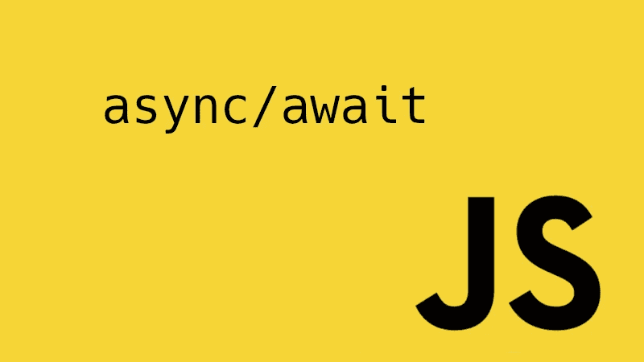

# JavaScript async/await:优点、缺陷和使用方法

> 原文：<https://medium.com/hackernoon/javascript-async-await-the-good-part-pitfalls-and-how-to-use-9b759ca21cda>

ES7 引入的`async/await`是 JavaScript 异步编程的一个了不起的改进。它提供了使用同步风格代码异步访问资源的选项，而不会阻塞主线程。然而，很好地使用它有点棘手。在本文中，我们将从不同的角度探索 async/await，并展示如何正确使用它们…