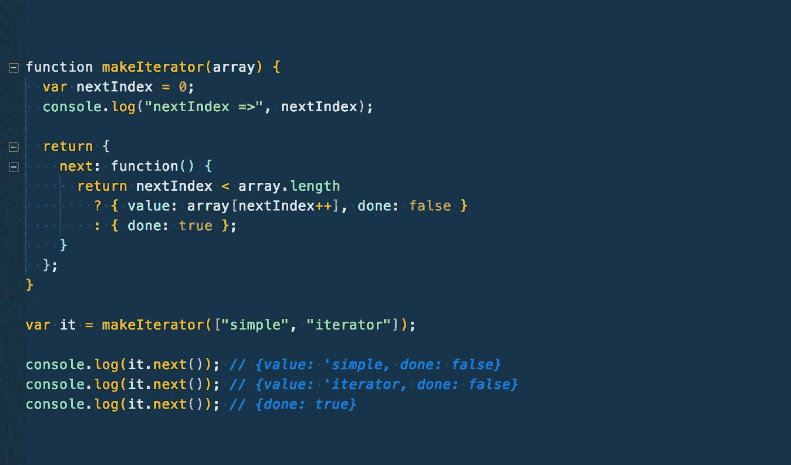
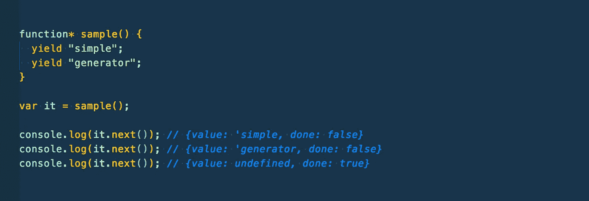
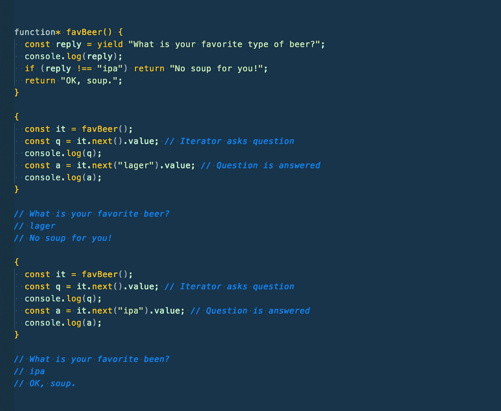
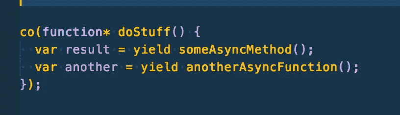

# JavaScript ES6——你真的不需要学习生成器

> 原文：<https://medium.com/hackernoon/javascript-es6-you-dont-really-need-to-learn-generators-96aa2e9114fa>

## 但无论如何你都应该读读这个…

随着 async/await 语法越来越受欢迎，人们对其内部工作方式的好奇也越来越多。通过[谷歌搜索](https://www.google.com/search?ei=ZE1FW87YKsnzzgLG-anIBw&q=how+does+async+await+work&oq=how+does+async+await+work&gs_l=psy-ab.3..35i39k1j0i67k1j0i20i263k1j0j0i30k1j0i8i30k1.4146.6328.0.6467.2.2.0.0.0.0.78.145.2.2.0....0...1.1.64.psy-ab..0.2.145...0i13k1j0i22i30k1.0.86ChreR7zqA)很容易拼凑出 async/await 的基础是承诺(好吧，我当然知道承诺)和生成器(嗯？).

本条的目的如下:

*   探索生成器的基本功能
*   谈论生成器+承诺=异步/等待
*   证明你不需要担心学习生成器
*   本文假设*一些*承诺的基本知识

## 迭代器和生成器——但主要是生成器

从 ES6 开始，该语言增加了几个新功能，旨在使处理异步数据流和对象集合变得更容易。迭代器和生成器就属于这一类。

迭代器非常强大，因为它们提供了一种每次访问集合中一个条目的方法，同时跟踪当前索引。

[https://gist.github.com/btg5679/91048cc658db67594b6fe2bca4c70ef1](https://gist.github.com/btg5679/91048cc658db67594b6fe2bca4c70ef1)

上面我们传入了一个包含 2 个值的简单数组，并通过调用它. next()来迭代这些值。请注意完整的评论回复。

现在对于**发电机。**生成器是充当**迭代器**工厂的函数。让我们看一个基本的例子，然后我们将讨论生成器的两个基本部分，生成器函数**和生成器迭代器**。

[https://gist.github.com/btg5679/d830f0067e5ae1610459131d38ce636e](https://gist.github.com/btg5679/d830f0067e5ae1610459131d38ce636e)

注意语法，*星号*表示该函数是一个生成器，*产生*关键字，该关键字暂停函数执行(😮)并返回(产生)一个值。

前面我提到了发电机的两个部分:

*   **发生器函数** —定义在或附近带有星号[或*的函数名或关键字*](http://2ality.com/2014/08/formatting-generator-asterisk.html)
*   **生成器迭代器**——在调用生成器函数时创建

这里我们看到了工作中的生成器工厂，生成迭代器。

此时，事情开始变得更有趣了。与生成器的通信可以双向进行，生成器可以通过*向迭代器输出*值，但是迭代器也可以通过`iterator.next('someValue')`方法向生成器发送值。

[https://gist.github.com/btg5679/ffe53b3522abeb49ac11ea9844890899](https://gist.github.com/btg5679/ffe53b3522abeb49ac11ea9844890899)

## 发电机+承诺

现在我们可以讨论一下生成器和承诺是如何构成异步/等待表达式的基础的。想象一下，生成器没有产生值，而是产生了承诺函数。然后，您可以将生成器包装在一个函数中，该函数可以等待承诺解析并将承诺值返回给。我们刚才演示的 next()方法。有一个叫做[协程](https://github.com/tj/co)的流行库就是这么做的。很简单，就像这样:

## 我需要它吗？

我对生成器的看法是，为了让 async/await 工作，您需要它们，但是您不需要学习将它们直接合并到您的代码中。生成器为 JS 引入了暂停函数执行并在我们认为合适的时候返回的能力。到目前为止，我们期望函数在执行时运行到完成。这是一个启示，但 async/await 为我们巧妙地包装了这个启示。

一些反驳的论点是，捆绑代码将 async/await 转移到生成器中，因此，熟悉生成器可能会在调试过程中对您有所帮助。我对此有不同的看法，尽管试图找到将生成器直接集成到代码中的方法。

这一轮就到此为止。我们讨论了迭代器和生成器的基础知识，Generators + Promises 如何让我们异步/等待，以及为什么不应该尝试将生成器强行加入 JS 指令清单。

你对发电机有什么想法？有我没有想到的用例吗？让我知道你的想法和问题，并在 [twitter](http://twitter.com/_bengarrison) 上关注我。坚持下去。

## 我发现有帮助的进一步阅读:

[https://blog . benestudio . co/async-await-vs-coroutines-vs-promises-eaede E4 e 0829](https://blog.benestudio.co/async-await-vs-coroutines-vs-promises-eaedee4e0829)

 [## 在 JavaScript 中使用迭代器和生成器来优化代码

### 引言你是否曾经需要循环遍历一个列表，但是这个操作花费了大量的时间…

code.tutsplus.com](https://code.tutsplus.com/tutorials/using-iterators-and-generators-in-javascript-to-optimize-code--cms-30395)  [## ES6 发电机的隐藏能量:可观测的异步流量控制

### 在我用 JavaScript 编写斐波那契生成器时学到的 7 件令人惊讶的事情中，我介绍了 ES6 的一个明显的用例…

medium.com](/javascript-scene/the-hidden-power-of-es6-generators-observable-async-flow-control-cfa4c7f31435) 

[https://hacker noon . com/async-await-generators-promises-51 f1 a6 CEE de 2](https://hackernoon.com/async-await-generators-promises-51f1a6ceede2)