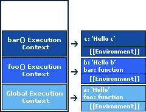
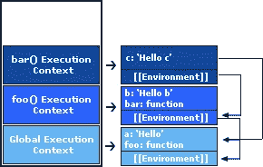

# 解释了 JavaScript 执行上下文和词汇环境。

> 原文：<https://medium.com/hackernoon/javascript-execution-context-and-lexical-environment-explained-528351703922>


Photo by [Shane Rounce](https://unsplash.com/photos/1ZZ96uESRJQ?utm_source=unsplash&utm_medium=referral&utm_content=creditCopyText) on [Unsplash](https://unsplash.com/search/photos/machine?utm_source=unsplash&utm_medium=referral&utm_content=creditCopyText)

作为一名 [JavaScript](https://hackernoon.com/tagged/javascript) 程序员，你有没有想过当 JavaScript 引擎在[浏览器](https://hackernoon.com/tagged/browser)中运行时，它是如何执行你的代码的？以及它们在执行时如何使用 ***词法环境*** 来跟踪局部范围？

在这篇文章中，我将向你解释它是如何在幕后工作的。

当您的代码在 JavaScript 引擎中运行时。你的代码的每一条语句都是在某个 ***执行上下文*** *中执行的。*

在 JavaScript 环境中，有两种主要类型的执行上下文。首先是 ***全局执行上下文*，**当您的代码最初运行时，即使它是使用 ***<脚本/ >*** 标签跨页面运行的，JavaScript 也会创建一个全局执行上下文，当它们在浏览器内部执行和运行时，您的代码会被放置在其中。第二个是 ***函数执行上下文*** 来自单词本身，它是在您调用您定义的函数时创建的。

每次你调用一个函数，它都会创建一个新的**函数执行上下文。**

**例如:**

```
var message = ‘Hello there’;function foo(message) {
  bar(message);
}function bar(message) {
  console.log(message);
}foo(message);
```

这段代码运行时，JavaScript 引擎创建一个 ***全局执行上下文*** 并将其推送到 ***执行上下文堆栈*** 。

> *执行上下文堆栈——是处理和操作全局和函数执行上下文的地方。*

当我们调用函数 **foo，**全局执行上下文被暂停，因为 ***JavaScript 是单线程环境*** 它们一次只能执行一个代码。之后，JavaScript 引擎将为 foo 创建一个新的函数执行上下文并将其推入执行上下文堆栈，当 **foo** 函数执行时，我们调用 **foo** 定义**中的**栏**。** JavaScript 引擎暂停了 **foo** 函数中的执行上下文，并为**栏**创建一个新的**函数执行上下文**，并将其推入堆栈。当**条**执行完毕后，它将在 ***执行上下文堆栈*** 中弹出，并返回 **foo** 继续执行。相同的过程将应用于 **foo** 直到我们完成并返回到全局执行上下文并继续执行。


How Execution Context push in Execution Context Stack.

正如我们已经知道 JavaScript 执行上下文是如何工作的，让我们深入到 ***词汇环境*** 并解释它们是如何工作的。

最有可能的是 ***词法环境*** 在**代码嵌套**中工作，当你有一个函数并且在那个函数中你有另一个函数。

**例如:**

```
var a = ‘a’;function foo() { var b = ‘b’; function bar() {
    var c = ‘c’; console.log(c); // You can access me here.   
    console.log(b); // You can access me too..
    console.log(a); // You can also access me..
  } bar();}foo();
```

没什么特别的，我们在代码中定义了一个嵌套函数。

当这段代码最初运行时，一个**全局环境**被创建，并且**一个**和 **foo** 被存储在其中。当我们调用下面的**函数** **foo** 时，一个新的环境被创建并存储了 foo 环境中的**变量 b** ，它只对 **bar 函数**可见，因为 bar 是 **foo** 环境中的内部函数。当调用 **foo()** 时，我们也调用了 **bar()函数**，这也为它们的定义创建了一个新的环境。

> *“每当我们调用一个函数时，都会创建一个新的函数执行上下文，并与新关联的词法环境****[[Environment]****”一起推入执行上下文堆栈。*



Diagram for Lexical Environment how they works

在**栏函数**中，我们进行日志记录来检查我们创建的变量是否可见，以及我们是否可以在它们的环境中访问它。

当**变量** **c** 登录到酒吧环境中时，因为在他的环境中，所以显示成功。

然而，当我们记录变量 **b** 和变量 **a** 时，它也被成功显示。这是怎么发生的？

让我们讨论一下。

在第二次日志记录中，我们调用不在**条函数**范围**内的**变量 b** 。**所以 javascript 在内部这样做，在其他的 ***外部环境*** 中搜索，直到找到那个变量。在我们的例子中，他们在 **foo 函数**处找到了变量 **b** ，因为 bar 函数引用了 foo 函数，所以 foo 函数环境不会在执行上下文中弹出！当**变量 a** 被记录时，它也被成功显示，因为**变量 a** 存储在全局执行上下文中。每个人都可以访问全局执行上下文中的作用域。



Accessing other environment

既然您已经理解了 JavaScript 中的执行上下文和词法环境是如何工作的。现在，您可以避免 JavaScript 程序中的一些细微错误。

如果你喜欢读这篇文章，请为我鼓掌…

希望对^_^有帮助

谢了。

# **“不要做一个平庸的 JavaScript。”**

在推特上关注我[***https://twitter.com/llaudevc/***](https://twitter.com/llaudevc/followers)