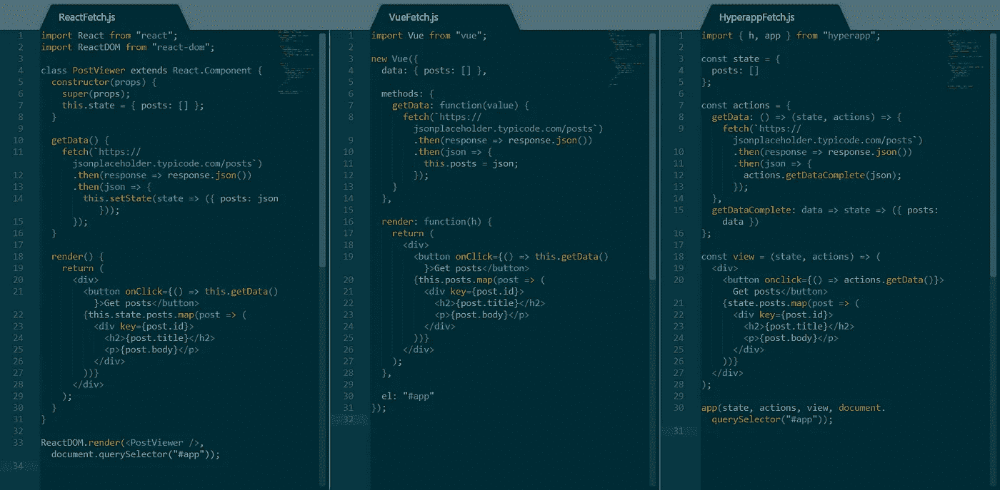

# Javascript 框架与示例的比较(React、Vue 和 Hyperapp)

> 原文：<https://medium.com/hackernoon/javascript-framework-comparison-with-examples-react-vue-hyperapp-97f064fb468d>

在我的上一篇文章中，我试图解释为什么我认为 Hyperapp 是 React 或 T21 的一个可行的替代方案，以及为什么我觉得它更容易上手。许多人批评那篇文章，因为它固执己见，没有给其他框架一个适当的展示机会。因此，在本文中，我将尽可能客观地比较这三个框架，提供一些最小的例子来展示它们的能力。

## 臭名昭著的反例

计数器可能是反应式编程中最常用的例子之一，非常容易理解:

*   您需要有一个变量来跟踪计数器的`count`。
*   您需要两种方法来递增和递减`count`变量。
*   你需要一种方法来呈现所说的`count`变量并呈现给用户。
*   您需要两个按钮连接到您的两个方法，以便在用户与它们交互时改变`count`变量。

以下是以上三个框架中的实现:

Counter example in React, Vue and Hyperapp

这里可能有很多东西需要理解，尤其是如果您对其中一个或多个不熟悉，那么让我们一步一步地解构代码:

*   所有三个框架的顶部都有一些`import`语句。
*   React 更喜欢面向对象的范例，它为`Counter`组件创建了一个`class`。Vue 遵循类似的模式，创建一个新的`Vue`类实例并向其传递信息。最后，Hyperapp 坚持功能范式，同时完全将`view`、`state`和`actions`彼此分开。
*   就`count`变量而言，React 在组件的构造函数中实例化它，而 Vue 和 Hyperapp 只是分别在它们的`data`和`state`中设置一个属性。
*   向前看，我们注意到 React 和 Vue 有非常相似的方法来与`count`变量交互。React 使用从`React.Component`继承的`setState`方法来改变它的状态，而 Vue 直接改变`this.count`。Hyperapp 的方法是使用 ES6 胖箭头语法编写的，据我所知，它是唯一一个偏好这种语法的框架，因为 React 和 Vue 需要在它们的方法中使用`this`。另一方面，Hyperapp 的方法需要状态作为参数，这意味着在不同的上下文中重用它们是可能的。
*   所有三个框架的呈现部分实际上是相同的。唯一的细微差别是 Vue 需要一个函数`h`传递给渲染器，Hyperapp 使用`onclick`而不是`onClick`的事实，以及引用`count`变量的方式基于每个框架中实现状态的方式。
*   最后，所有三个框架都被安装到`#app`元素上。每个框架都有稍微不同的语法，Vue 是最简单的，它通过使用元素选择器而不是元素来提供最大的通用性。

## 反例裁决

并排比较所有三个框架，Hyperapp 需要最少的代码行来实现一个计数器，并且它是唯一一个采用函数式方法的框架。然而，Vue 的代码在绝对长度上似乎略短，而元素选择器安装是一个很好的补充。React 的代码似乎是最冗长的，但这并不意味着代码不容易理解。

## 使用异步代码

很有可能你将不得不处理异步代码。最常见的异步操作之一是向 API 发送请求。出于这个例子的目的，我将使用一个带有一些虚拟数据的[占位符 API](https://jsonplaceholder.typicode.com/) ，并呈现一个帖子列表。必须完成的概要如下:

*   存储一个数组`posts`的状态。
*   使用一个方法用正确的 URL 调用`fetch()`，等待数据，转换成 JSON，最后用接收到的数据更新`posts`变量。
*   呈现一个按钮，该按钮将调用获取帖子的方法。
*   渲染`posts`的键控列表。

Fetching data from a RESTful API

让我们分解上面的代码，比较三个框架:

*   与上面的反例相似，所有三个框架之间的状态存储、视图呈现和挂载都非常相似。不同之处与上面讨论的相同。
*   用`fetch()`获取数据非常简单，并且在所有三个框架中都能正常工作。然而，这里的关键区别是 Hyperapp 处理异步动作的方式与其他两个稍有不同。当数据被接收并转换为 JSON 时，动作将调用不同的同步动作，而不是直接在异步动作中修改状态。这使得核心功能更强大，更容易分解成更小的、潜在可重用的单元，同时避免了一些可能出现的回调嵌套问题。
*   就代码长度而言，Hyperapp 仍然需要最少的代码行来达到相同的结果，但 Vue 的代码似乎不那么冗长，并且具有最短的字符绝对长度。

## 异步代码判决

无论您选择哪种框架，异步操作都非常容易。当处理异步动作时，Hyperapp 可能会迫使您编写功能性和更模块化的代码，但是其他两个框架肯定也可以做到这一点，并且在这方面为您提供了更多的选择。

## 待办事项列表项组件

可能是反应式编程中最著名的例子，待办事项列表已经用几乎所有现存的框架实现了。我不打算在这里实现所有的东西，只是一个无状态的组件来展示这三个框架如何帮助为您的 web 应用程序创建更小的可重用构建块。

Sample TodoItem implementations

上图展示了每个框架的一种技术和 React 的另一种技术。以下是我们在阅读这四本书时注意到的:

*   就编码模式而言，React 是最灵活的。它支持功能组件和类组件。它还支持右下方的 Hyperapp 组件，开箱即用，无需任何更改。
*   Hyperapp 还支持功能性的 React 组件实现，这意味着两者之间有很大的实验空间。
*   Vue 排在最后，它有一个相当奇怪的语法，即使是对其他两个有经验的人也不能立即理解。
*   就长度而言，所有示例的长度都非常相似，React 在某些方法中稍微长一些。

## 待办事项列表项目判断

Vue 需要一点时间来适应，因为它的模板与其他两个框架有点不同。React 非常灵活，支持几种不同的创建组件的方法，而 Hyperapp 保持一切简单，并提供与 React 的兼容性，如果您想在某个时候进行切换的话。

## 生命周期方法比较

另一个关键的考虑是每个框架允许您根据需要订阅和处理哪些组件生命周期事件。下面是我根据每一个的 API 参考创建的表格:

Lifecycle method comparison

*   Vue 拥有最多的生命周期挂钩，提供了处理生命周期事件触发之前或之后发生的任何事情的机会。这对于管理更复杂的组件很方便。
*   React 和 Hyperapp 的生命周期挂钩非常相似，React 将`unmount`和`destroy`事件捆绑在一起，而 Hyperapp 将`create`和`mount`事件捆绑为一个事件。两者都在处理生命周期事件方面提供了相当多的控制。
*   Vue 根本不处理`unmount`(据我所知)，而是依赖`destroy`事件在组件生命周期的后期触发。React 不处理`destroy`事件，而是选择只处理`unmount`事件。最后，Hyperapp 不处理`create`事件，而是完全依赖于`mount`事件。根据您的需求和经验，在围绕组件的生命周期事件进行设计时，记住这些差异可能很重要。

## 生命周期方法比较结论

总的来说，每个框架中都提供了生命周期挂钩，它们帮助你处理组件生命周期中的许多事情。所有这三个框架都为它们所有的生命周期事件提供了挂钩，它们之间的细微差别可能源于实现和方法的根本差异。Vue 提供了更细粒度的事件处理，允许您在生命周期事件被触发之前或之后处理它们，这无疑是领先一步。

## 性能比较

除了易用性和编码技术，性能也是大多数开发人员的主要考虑因素之一，尤其是在处理更复杂的应用程序时。 [js-framework-benchmark](https://github.com/krausest/js-framework-benchmark) 是比较框架的一个很好的资源，所以让我们看看每组基准测试的数字说明了什么:

Table operations benchmark

*   在所有三个框架中，非键控操作比键控操作快得多。
*   非键控 React 是所有六种变体中性能最好的，它在所有基准测试中都取得了令人印象深刻的性能。
*   键控 Vue 仅比键控 React 稍有优势，而非键控 Vue 的性能明显不如非键控 React。
*   Vue 和 Hyperapp 似乎在部分更新基准测试中遇到了一些问题，而 React 似乎在比较中针对该特定操作进行了很好的优化。

Startup metrics benchmark

*   Hyperapp 是三个框架中最轻量级的，而 React 和 Vue 的大小差别非常小。
*   Hyperapp 有一个更快的启动时间，这肯定是由于其微小的尺寸和极简的 API。
*   就启动时间而言，Vue 比 React 略胜一筹。

Memory allocation benchmark

*   Hyperapp 是三者中资源最少的，与其他两者相比，任何操作都需要较少的内存。
*   资源消耗不是很高，所有三个框架在现代硬件上的表现应该是相似的。

## 性能比较结论

如果性能是一个问题，你应该考虑你在做什么样的应用，你的需求是什么。Vue 和 React 似乎最适合更复杂的应用程序，而 Hyperapp 更适合较小的应用程序，需要处理的数据较少，以及需要非常快速启动或需要在低端硬件上工作的应用程序。

但是，请记住，这些基准远远不能代表平均用例，因此您可能会在现实生活中看到相当不同的结果。

## 附加注释

比较 React、Vue 和 Hyperapp 在很多方面可能感觉像是在比较苹果和橙子。关于这些框架，还有一些额外的考虑因素，可以很好地帮助您决定选择哪一个:

*   React 通过引入[片段](https://reactjs.org/docs/fragments.html)绕过了相邻的 JSX 元素必须包装在父元素中的问题，这些元素允许您分组子元素列表，而无需向 DOM 添加额外的节点。
*   React 还为您提供了[高阶组件](https://reactjs.org/docs/higher-order-components.html)，而 Vue 为您提供了[混合组件](https://vuejs.org/v2/guide/mixins.html)，用于重用组件功能。
*   Vue 通过利用[模板](https://vuejs.org/v2/guide/syntax.html)来分离结构和功能，从而更好地分离关注点。
*   与其他两个相比，Hyperapp 感觉像是一个低级别的 API，它的代码要短得多，如果你想调整它并了解它是如何工作的，它允许更多的通用性。

## 结论

我想如果你已经读到这里，你已经知道哪种工具更适合你的需要。毕竟，这不是讨论哪一个是最好的，而是讨论哪一个更适合每种情况。总而言之:

*   React 是一个非常强大的工具，它有一个庞大的开发者社区，可能会帮助你找到工作。不是特别难进，但是肯定要花很多时间去掌握。然而，它是非常棒的，值得你花时间去做。
*   如果您过去使用过另一个 Javascript 框架，Vue 可能看起来有点奇怪，但它也是一个非常有趣的工具。如果 React 不合你的胃口，它是 React 的一个可行的替代方案，可能值得学习。它内置了一些很酷的功能，而且它的社区正在增长，甚至可能比 React 还要快。
*   最后，Hyperapp 是一个用于小型项目的很酷的小框架，也是初学者开始的好地方。与 React 或 Vue 相比，它提供的工具较少，但它可以帮助您快速构建原型并理解许多基础知识。您为它编写的许多代码都与其他两个框架兼容，要么是现成的，要么稍加修改，因此一旦您对其中一个框架有信心，就可以切换框架。

如果你喜欢这篇文章以及你为此付出的努力，记得给它一两下掌声，并在社交媒体上与你所有的朋友分享！