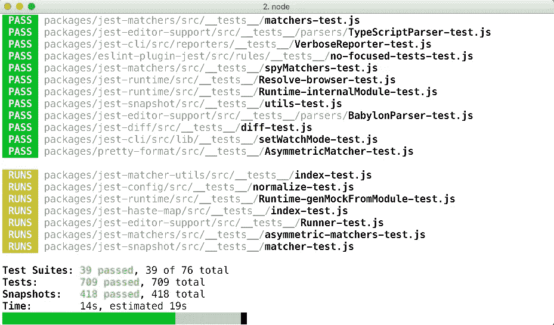
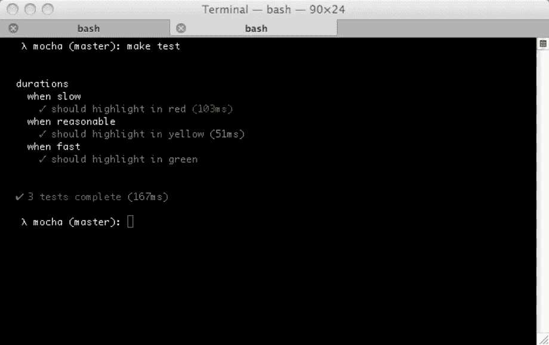
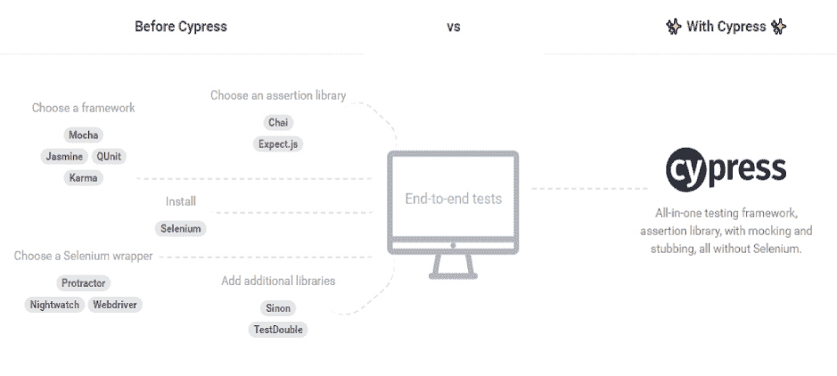
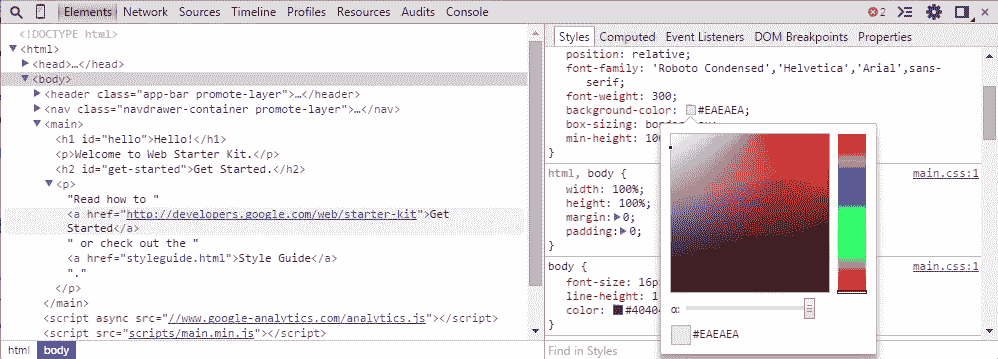
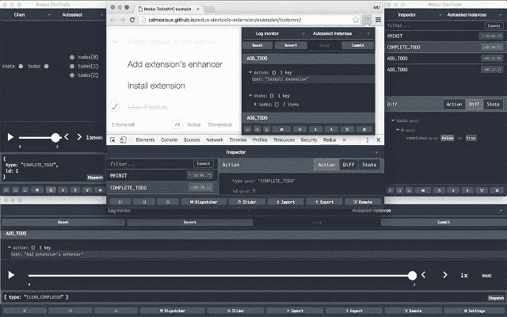

# JavaScript 测试和调试工具

> 原文：<https://medium.com/hackernoon/javascript-testing-and-debugging-tools-ee81374c01aa>


三思，切一次。

多年来指导软件工程师和开发人员的范例。在开始编码之前进行规划和思考有助于使开发变得更加容易，并且有助于在构建过程的最后开发更精确的软件。

然而，并不是所有的问题都得到了解决，因为一些错误仍然会通过防火墙。在开发之后纠正错误要困难得多，这就是为什么我决定写一篇文章来解决这个问题。

有很多工具可以帮助我们简化开发、提高生产率和增强软件的健壮性。但是，我们将看一看几个测试和调试工具。当他们习惯于自己的优势时，他们每个人都有非常强大的权利。

这些工具包括:

*   玩笑
*   摩卡
*   Cypress.io
*   Chrome 开发工具
*   冗余开发工具

让我们来看看这些漂亮的测试和调试工具。

# [笑话](https://facebook.github.io/jest/)

版本 22.4.1 / 16 883 GitHub ★ / 2 依赖项



Jest 是一个由脸书维护的流行测试工具，主要用于 React 应用程序的测试。

这是一个非常简单易用的框架，因为它所做的只是检查和测试所需的文件，并显示测试结果。

就像脸书处理的几乎所有事情一样，Jest 附带了大量的特性，使得每个开发人员的测试更加容易。

Jest 支持异步测试，这意味着可以在更短的时间内完成更多的工作，因为测试是作为并行过程运行的。

Jest 还允许在测试文件中使用函数和定时器模仿特性来模仿对象。

在 React 应用程序上使用 Jest 时，您还可以执行快照测试，因此您可以非常容易地知道导致失败的更改。

这些是这个令人惊奇的框架的一些可爱的特性。其他包括代码覆盖支持、与其他库完全集成的能力、测试隔离等等。

借助 npm 工具，Jest 易于安装和设置:

您可以使用以下方式在本地安装:

```
npm install --save-dev jest
```

您还可以使用以下工具进行全局安装:

```
npm install -g jest
```

要了解更多关于这个由脸书维护的框架，请查看 [github 知识库](http://facebook.github.io/jest/)。

# [摩卡](https://mochajs.org/)

版本 5.1.0 / 15 138 GitHub ★ / 11 依赖项



这是另一个流行的执行单元和集成测试的框架。Mocha 是一个依赖于 Node.js 的测试框架，具有许多令人难以置信的特性。

摩卡是轻量级的，使用起来也很简单。

具有诸如浏览器支持、测试覆盖支持、异步测试、超时支持和许多其他特性。考虑到它是轻量级的，并且不会对计算机资源产生疯狂的需求，Mocha 已经成为许多开发人员的选择。

使用 npm 安装 Mocha 非常简单。

本地安装可以通过以下方式完成:

```
npm install --save-dev mocha
```

它也可以通过以下方式在全球范围内完成:

```
npm install --global mocha
```

想了解更多关于摩卡的信息，可以访问 [Github 页面](https://github.com/mochajs/mocha)。

# [Cypress.io](https://www.cypress.io/)

版本 2.1.0 / 4 735 GitHub ★ / 38 依赖项



你是前端开发人员还是身边有人？叫他们过来。 [Cypress.io](https://dashbouquet.com/blog/frontend-development/cypressio-and-docker-the-ultimate-e2e-stack-part-1) 是一个非常强大的开源前端测试工具，可以帮助和改进 web 开发过程。

Cypress.io 是你能找到的使用起来最简单的工具之一，一切都非常容易，包括测试的设置、测试的编写、测试的运行和测试的调试。

使用 [Cypress.io](https://dashbouquet.com/blog/frontend-development/cypressio-and-docker-the-ultimate-e2e-stack-part2) 你可以编写各种测试，从端到端测试到集成测试到单元测试，由于这个功能，它已经赢得了质量保证测试人员对 Selenium 的比较。然而，使用过这两者的开发者会承认 Cypress.io 功能性更强。

Cypress.io 提供了一些令人惊叹的功能，比如他们称之为“时间旅行”的快照测试、自动等待功能、控制函数行为和服务器响应的能力，以及与 Chrome DevTools 等调试工具的有效集成，这些工具将在本文的后面介绍。

您也可以使用 npm 命令安装 Cypress.io。

本地安装可以通过以下方式完成:

```
npm install cypress --save-dev
```

Cypress.io 非常容易使用，并且有适当的文档记录。要了解这个奇妙框架的更多信息，请查看它的[文档](https://docs.cypress.io/)。

# [Chrome 开发工具](https://developer.chrome.com/devtools)

版本 1.0.548690 / 693 GitHub ★ / 0 依赖项



谷歌致力于让软件开发者的生活变得简单，这一点每个人都可以清楚地看到。

Google Chrome DevTools 是一套调试、web 创作和分析工具，可以用来调试内置在 Chrome 浏览器中的 JavaScript 代码。只需点击 inspect element 按钮，就可以在浏览器中与 HTML、CSS 和 JavaScript 进行交互。

Chrome DevTools 带有不同的面板:

*   用于提高网页渲染性能的时间轴面板。
*   用于更好的 JavaScript 和 CSS 性能的配置文件面板。
*   用于检查网页存储的资源面板，如 HTML5 数据库、cookies、本地存储等。

除此之外，DevTools 还具有快速文件切换、在源代码中搜索、选择代码中的 JavaScript 元素、更改设备模式(这样您就可以在移动设备上查看网页的外观，而无需切换设备)、选择颜色以获取十六进制代码等功能。

你可能这些年一直在用 Chrome，却不知道它有这么强大的调试工具。

互联网上有很多关于如何充分利用 Chrome DevTools 的教程，因为你可以用这个工具做很多事情来提高生产率。

# [Redux 开发工具](https://chrome.google.com/webstore/detail/redux-devtools/lmhkpmbekcpmknklioeibfkpmmfibljd?hl=ru)

版本 3.4.1 / 39 897 GitHub ★ / 3 依赖项



这是另一个和 Chrome DevTools 一样强大的工具，但是它只用于调试 Redux 应用程序。

Redux DevTools 非常适合在应用程序状态下调试代码，它非常易于使用和安装，具有非常漂亮的用户界面，可以根据您的喜好进行定制。

它附带了一些功能，如允许您检查每个有效负载，拍摄代码版本，这意味着您可以恢复以前的代码版本，您还可以在网页重新加载时保留调试会话。

您可以简单地通过克隆项目将 Redux DevTools 集成到您的项目中:

```
git clone https://github.com/gaearon/redux-devtools.git cd
redux-devtools
```

然后，您可以在根文件夹中运行以下内容:

```
npm install
```

最后，您可以进入您的应用程序文件夹，然后再次运行 *npm install* 命令。

然后，您可以运行开发服务器:

```
npm start
open [http://localhost:3000](http://localhost:3000)
```

如果你不想经历安装工具的“麻烦”,你可以很容易地利用浏览器扩展。

你可以查看 [github 页面](https://github.com/gaearon/redux-devtools#installation)了解更多关于这个工具的信息，也有一个扩展可以在浏览器上使用[。](https://github.com/zalmoxisus/redux-devtools-extension)

# 结论

本文讨论的所有 JavaScript 测试和调试工具都有各自的优缺点。

由于测试工具可以用来测试任何类型的 JavaScript 代码，我们必须注意以下几点:

*   Jest 最适合测试 React 应用。
*   Mocha 最适合测试节点应用。
*   Cypress 最适合测试前端代码。

另一方面，我们讨论了一个通用调试工具，然后讨论了一个专用工具。

虽然 Google Chrome DevTools 非常适合调试前端代码，并且可以很容易地与 Cypress 等测试工具集成，但 Redux DevTools 专门用于调试 Redux 应用程序，并且还具有浏览器扩展，可以在 Chrome 和 Mozilla Firefox 等浏览器上使用。

安东·沙列尼科夫撰写