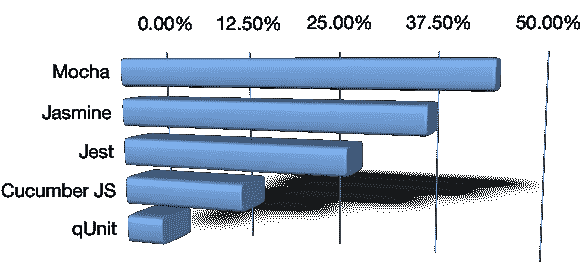

# 2018 年 JavaScript 测试工具调查:结果出来了

> 原文：<https://medium.com/hackernoon/javascript-testing-tools-survey-2018-the-results-are-in-732017a00a9c>

> 如何在一个生态系统中选择一个生成框架比虫族蜂群更快的工具，用达尔文对安非他命的狂热杀死它们？

对于大多数团队来说，JavaScript 可能不是首选，但我们行业中超过一半的人都在使用它。StackOverlow 称其连续五年成为[最受欢迎的编程语言](https://insights.stackoverflow.com/survey/2017#technology-programming-languages)。十年前，测试 JavaScript 组件基本上是事后的想法，委托给手工工作。今天，它不再是旋转网络部件的边缘平台，而是业务流程的核心部分。这意味着大多数团队需要非常认真地测试他们的 JavaScript 组件。

我最近进行了一项调查，以了解更多关于 JavaScript 测试的开发人员偏好和体验。对整个生态系统来说，典型的选择暴政是相当明显的。有 683 个调查回复，有超过五十个不同的测试自动化框架条目*。面对这样一个大杂烩，没有人有时间去调查所有的选择。然而，如此庞大的菜单也回避了这样一个问题:是否有比我们目前使用的[工具](https://hackernoon.com/tagged/tools)更好的东西？那么对于一个变化如此频繁的生态系统，人们应该如何选择合适的工具呢？*

整个平台的发展速度如此之快，以至于工具在几年内就会过时，除非有一个活跃的社区支持它们。鉴于 JavaScript 工具和框架的预期寿命比 Dragonflies 短，工具的安全选择*应该是有活跃社区的东西。理论上，这反映在受欢迎程度上。流行的工具使得传递知识和让其他人参与开发变得更加容易，无论是为了商业项目的招聘还是为了让人们参与开源工作。但是受欢迎程度本身并不是最好的标准。由于 JavaScript 工具残酷的达尔文主义，存活时间更长的旧工具很可能比其他工具更受欢迎。与此同时，生态系统发展迅速，因此更新的工具不断涌现，试图覆盖更现代的用例以及最近的平台变化。*

我让参与调查的人评价他们使用这些工具的体验。有些问题着眼于*过程的好处*，比如对频繁发布和防止 bug 的信心。其他问题包括*工具的可用性*，开发人员使用他们的工具有多容易，以及他们维护和理解测试用例有多容易。这些问题组的综合得分很好地表明了团队对所选工具的满意程度。当然，过程的好处更多地取决于测试用例的内容，而不是工具本身，但是好处评级的巨大差异可能会指出该工具不适合某些关键的工作流。

从这个角度来看，一个*工具的好选择*应该是:

*   容易让其他人参与进来，迅速消失的风险低(所以有合理的知名度，不一定是#1)。
*   不缺少任何主要功能，并支持关键的现代平台需求(因此流程优势评级与顶级工具一致)。
*   使编写、理解和维护测试用例变得容易(通过前两个标准的工具的最佳开发者可用性)。

## 关于准确性的快速注释

在我们进入数字之前，这里有一个关于数据准确性的快速注释。根据 683 份回复和对全球开发人员数量的最新估计，调查结果的误差范围为 4%，置信度为 95%。此外，请注意，好处和可用性问题是这样制定的，人们对他们的整个设置进行评级，而不是对单个工具进行评级，这在工具组合发挥作用时很重要。

最初的研究还包含了关于相关工具的问题，如浏览器运行程序和持续集成平台。如果你想深入挖掘数据或查看其他问题的答案，请[下载完整结果](https://gojko.net/assets/201802-js-research.pdf)。

## 最流行的工具是什么？

单看人气，三款工具明显脱颖而出。前两项对于任何参与社区几年以上的人来说都不会感到意外，但铜牌对我来说相当意外:

Top 5 most popular test automation tools

以下是用户对前三种工具的使用体验的评价:

就对开发过程的积极影响而言，Mocha 略微胜出，但其他工具紧随其后，这意味着对于关键的现代工作流来说，前三名中的任何一个都可能没有大问题。 [Jest](https://facebook.github.io/jest/) 在开发者可用性方面领先，不明显超过 Mocha，但明显超过 [Jasmine](https://jasmine.github.io/) 。所有其他工具都不太受欢迎。

细心的读者会注意到百分比加起来超过 100%，因为许多团队使用不止一个工具。(稍后会有更多关于这方面的内容，有一个非常有趣的笑点。)另一方面，大约有 *12%的受访者没有对他们的 JavaScript 代码使用任何自动化测试工具*！

除去团队使用多种工具的回答，排名保持不变:

Jest 最近的流行可能是由 React 的迅速崛起引起的，因为它们都来自同一个来源。在调查中，大约 80%使用 Jest 的人也使用 React。

当然，您工作的软件类型对于测试工具包的选择有很大的影响。在 JavaScript 领域，这通常与前端框架密切相关。以下是调查受访者使用的框架列表。

Front-end frameworks used by teams in the survey

以下是关注几种常见应用类型时，这些数字的变化情况:

## 反应

大约 43%的受访者在工作中使用 React。Jest 和 Mocha 似乎在这个用例中同样受欢迎，但是 Jest 在测试 React 应用程序的开发人员可用性方面领先。

## 有角的

大约 34%的受访者使用某种形式的 Angular。在 Angular 应用程序开发世界中，Jest 从雷达上消失了，另一个工具突然出现在第三位: [Cucumber JS](https://github.com/cucumber/cucumber-js) 。茉莉是目前最受欢迎的选择。使用 Cucumber 的人似乎对他们的测试设置有更高的评价，但这里的总体差异是不确定的，所以我需要更多的数据才能做出任何大的建议。

## 后端应用程序

大约 20%的受访者只从事后端应用。不幸的是，这里的数字开始变得有点不可信，但摩卡似乎比其他品牌更受欢迎，评分也更高。然而，我想在作出任何结论之前收集更多的对此案的答复。也许你能帮忙？

## 工具组合

正如我之前提到的，这些数字加起来超过了 100%，因为许多团队使用了不止一个工具。事实上，只有大约一半的团队使用单一的工具。

Number of test automation frameworks used by teams in the survey

看着流行的组合，我对结果感到非常惊讶！

最受欢迎的组合似乎是茉莉和摩卡，这很奇怪，因为它们都倾向于解决相同的问题。我只能假设这是因为人们早期使用一个工具，然后切换到另一个工具，所以不同的部分被不同的工具覆盖。基于之前对后端测试和 Angular 的观察，另一个选择是人们在后端代码上使用 Mocha，在前端代码上使用 Jasmine。然而，这并不是工具组合表中真正有趣的部分。

查看按优势订购时出现的模式:

Top tool combinations, ordered by process benefits as voted by teams in the survey

尽管 Cucumber JS 本身并不流行，不足以进入列表中的前 3 名，但是将 Cucumber 与一个更流行的工具结合起来，似乎对 bug 预防和部署信心有很大的影响。黄瓜和摩卡加在一起，在收益表上得了 74%的分数，高于任何其他单独的工具，或者任何其他的组合。

当按可用性排序时，出现了类似的模式:

Top tool combinations, ordered by developer usability as voted by teams in the survey

Cucumber 和 Jest 作为一个组合，似乎在让开发人员乐于维护、编写和理解自动化测试方面赢得了巨大的优势。70%的分数，高于任何其他单独的工具，或任何其他组合。

## 结论

[我们](https://www.mindmup.com)不使用 React，所以我以前并没有真正关注 Jest，但是这次调查的结果会让我对下一个项目的工具选择三思。

*Jest 似乎以微弱优势赢得了开发者的快乐。*尽管这是一个相对较新的领域，但鉴于脸书的企业支持，它可能会存在很长时间。它似乎也从 React 过渡到了一个更通用的工具，这一点被 20%不使用 React 的用户所证实。

另一个有趣的结论似乎是*将 Cucumber 与任何流行的单元测试工具结合起来提高了总体评分——非常显著*。我认为这是因为黄瓜解决的问题与茉莉花茶、摩卡咖啡或 Jest 不同。三个最受欢迎的工具是针对开发人员的，Cucumber 更适合跨职能的工作，从稍微高一点的层面来看质量。从面向开发人员的工具中提取更高级别的测试用例可能会使这两个部分更清晰、更容易使用。尽管大多数人(错误地)将 Cucumber 等同于浏览器级别的用户界面测试，但它是提取业务可读场景的不错的工具，可以由领域专家进行验证，因此这也是后端工作的有效选择。

> 我由此得出的结论是，Jest 和 Cucumber 的组合似乎在流程优势和开发人员整体可用性之间取得了最佳平衡。如果你要从头开始一个新项目，这似乎是测试框架的一个好选择，紧随其后的是 Mocha 和 Cucumber。

话虽如此，这里的数字只是略高于误差范围，我很乐意收集更多的数据来验证这一假设。如果您使用 JavaScript 并且没有参与最初的调查，请通过[填写快速表格](https://form.jotform.com/80547453104957?source=medium)来帮助创建一个更完整的图片。

最初发表于 gojko.net 的[。在](https://gojko.net/2018/02/25/javascript-testing-tools.html) [Unsplash](https://unsplash.com/search/photos/menu?utm_source=unsplash&utm_medium=referral&utm_content=creditCopyText) 上 [Igor Ovsyannykov](https://unsplash.com/photos/uzd2UEDdQJ8?utm_source=unsplash&utm_medium=referral&utm_content=creditCopyText) 的照片。