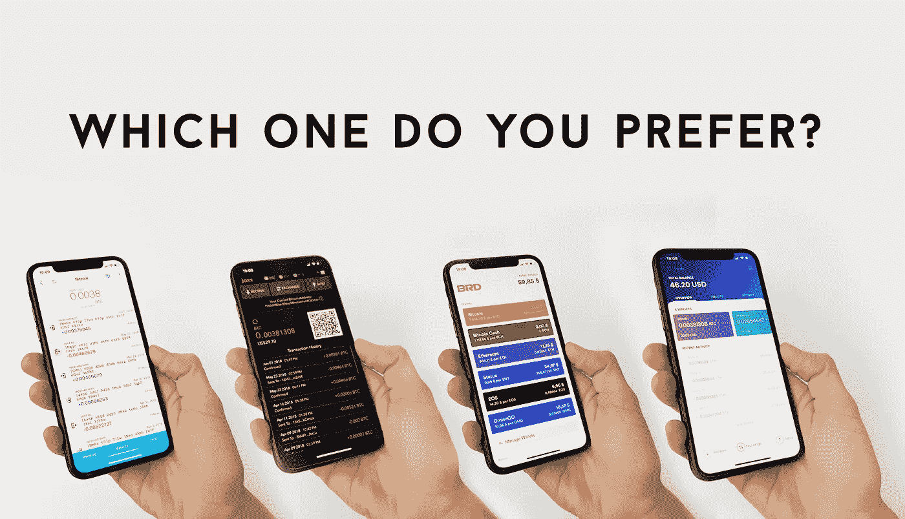
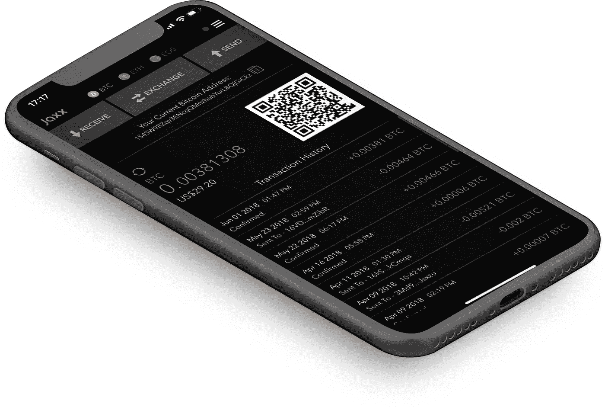
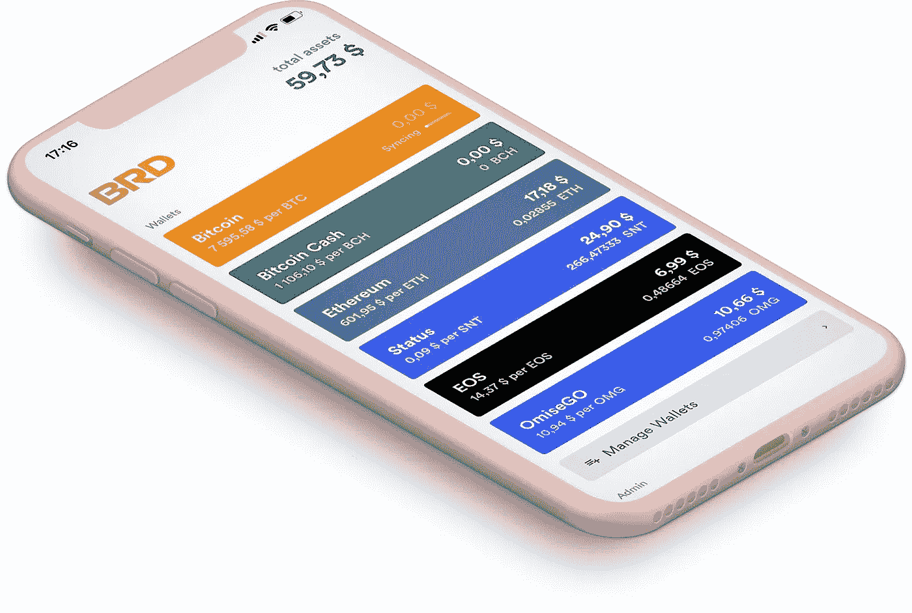
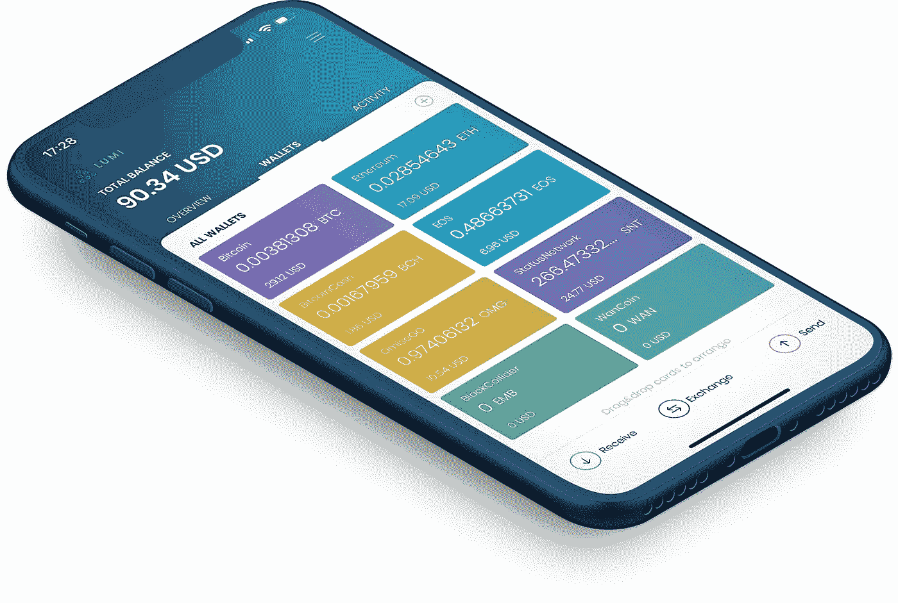
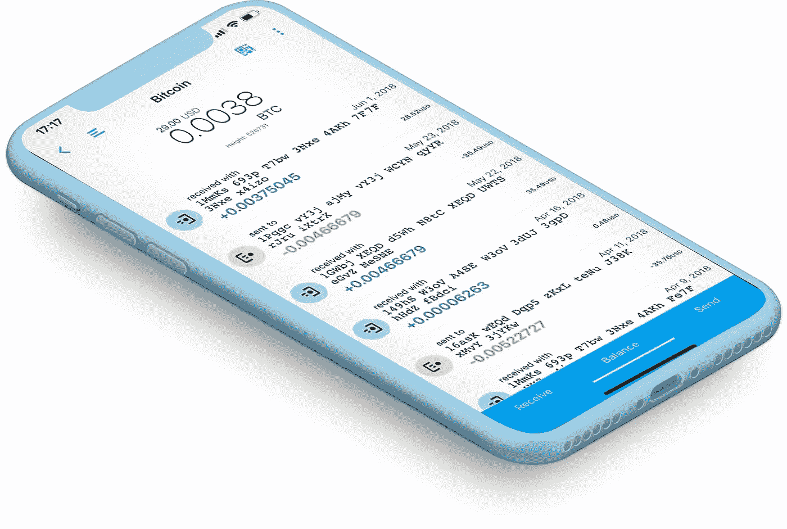

# 杰克斯，面包，米露，Coinomi？

> 原文：<https://medium.com/hackernoon/jaxx-bread-lumi-coinomi-5ddc4eedf81>

## 你选择哪一个？

声明:这篇文章可能包含偏见，因为我是世卫组织建设 LUMI 的一员

作为一名用户，我关心加密钱包的两件事。第一，安全性(请不要弄丢我的 crypto/还是做关于 Mt. Gox 的噩梦)。第二，UI/UX(有时候感觉有些界面来自 90 年代初。让我想失明)。让我们看看有什么，以及加密钱包团队是否真的关心他们的用户。

*简短介绍:加密钱包的安全有两种方法:托管/集中(第三方存储你的私钥)或客户端方法(你的私钥只和你在一起)。加密钱包的安全问题对其开发者来说是一个真正的难题，所以每一个认为制作另一个钱包是一个好主意的公司都恳求参加一场真正的军备竞赛。不过，如果我们谈论应用程序，有一个解决方案是众所周知的——客户端钱包。基本上，这意味着用户的私钥是在他们的设备上本地生成的，不会被发送或存储到设备之外。这项技术本身在一定程度上保证了安全性，所以分享它的对手必须在其他战场上竞争，比如稳定性或 UI/UX。*

*(我认为比较安全技术相似的应用是诚实的，所以我想说一些值得一提的客户端钱包)*

Jaxx wallet

[**JAXX**](http://jaxx.io) **:** 于 2014 年推出，作为首批推出的产品之一，赢得了客户的信任。支持所有主要硬币&代币，背后有强大的团队。声称是开源的，但未能向公众展示其代码。

***安全*** *:* 客户端私钥生成&存储。
***UI/UX:*** 全黑设计让它有点极客/交易者导向(2018 年用钱包的不只是他们)。请务必让我知道我的总余额。很久以前我拿到了我的 Iphone X，但是你的应用程序仍然不能适应。根据商店评论，IOS 版本一点也不稳定。
***特点:*** 以形状变换为动力的交换。这可能是最好的功能了。

***我的结论****:2 年前很好用*📟。

Bread wallet

[**面包**](http://brd.com) **:** 作为一个比特币 mono wallet 面包一直通过在客户端同步 last blocks 来吹嘘其安全性。然而，在加入替代硬币(不久前)后，他们变得和其他人一样。顺便问一下，有人成功同步了吗？我还在等我的。才过了几个月。

***安全性:*** 客户端私钥生成&存储。
***UI/UX* :** 最近的更新让这款应用更容易搭载和普遍使用。干得好！有点误导硬币的价格，有时会与天平混淆。
***特点* :** 通过与 Simplex 集成，选择购买带有菲亚特的加密。耶！

***判决:*** *由于 BTC 的滞后没有过多使用 app。以后会给它一个机会。*

Lumi wallet

[**LUMI**](https://lumi.onelink.me/Ocjn/e572235f)**:**肯定是我爱的钱包。市场上最友好、最清晰的界面。它是新的，但已经接管了一些竞争对手。首先，它和列表中的其他产品一样是客户端的，所以你不会危及你的资金安全。它是多货币和多令牌的，有钱包内兑换。每枚硬币和代币都有自己的个人卡，卡上有交易历史和市场价格图(这是米露钱包独有的)。

***安全性:*** 客户端私钥生成&存储。
***UI/UX:*** 新给了我们通过多币种设计创造思想的优势。
***功能:*** 唯一显示硬币价格图表的钱包。由市场领导者推动的交易所——不断变化。

***有什么需要改进的:*** *Android。Hugo(我们的 android 开发者)，如果你正在读这封信，请发短信。*

Coinomi wallet

[**COINOMI**](http://coinomi.com) **:** 不要诗意，界面烂透了。打字按字体，认真的？然而，它支持大量的硬币和代币，所以一些用户可能仍然需要它。oinomi 中的衍生路径是不规范的，这就是为什么如果你以前使用 jaxx、米露或任何其他遵循 [slip-0044](https://github.com/satoshilabs/slips/blob/master/slip-0044.md) 的钱包，你很可能看不到你的余额。然而，Coinomi 可以选择导入一个定制的派生路径，所以经过一些干预后，你最终会得到你的钱——尽管执行这个操作需要一些技术技能。

***安全性:*** 客户端私钥生成&存储。
***UI/UX:*** 都清不过眼睛疼。
***功能:*** 定制衍生路径。老实说，谢谢你。

你会看到所有应用都有利弊，你应该永远记住，钱包的用户越多，它收到的负面反馈就越多——有时是由于身体原因，如高负载，或者只是因为总有人不满意，而且随着应用的增长，他们的数量也在增长。

> 你选择哪个米露？有你的发言权！