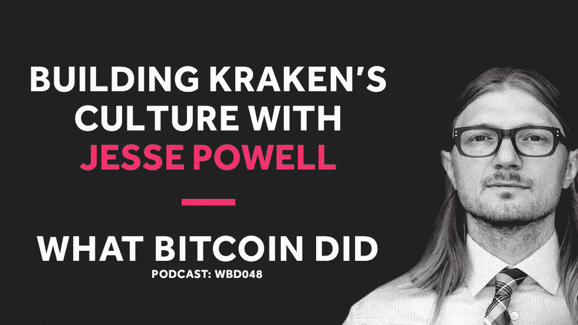

# 杰西·鲍威尔正在北海巨妖建立一种加密价值观的文化

> 原文：<https://medium.com/hackernoon/jesse-powell-is-building-a-culture-of-crypto-values-at-kraken-9d4983227c9f>

## 音频采访转录— WBD048

***注:*** *以下是我采访北海巨妖 CEO Jesse Powell 的笔录。我从翻译中使用 Rev.com，他们删除了嗯，错误和半句。我已经检查了转录，但如果您发现任何错误，请随时发送* [*邮件给我*](http://hello@whatbitcoindid.com) *。可以* [*在这里*](https://www.whatbitcoindid.com/podcast/jesse-powell-is-building-a-culture-of-crypto-values-at-kraken) *听原声录音。*

*你可以在这里订阅播客* [*听所有剧集*](https://www.whatbitcoindid.com/podcast/) *。*

在这一集里，我和北海巨妖的首席执行官杰西·鲍威尔进行了交谈。我们讨论了构建和交换的挑战，从构建分布式团队的文化到管理安全性。我们还讨论了主流的秘密新闻和行业法规。

联系比特币做了什么:
听:[**iTunes**](https://itunes.apple.com/gb/podcast/what-bitcoin-did-podcast-bitcoin-crypto-trading-strategy/id1317356120?mt=2)|[**Spotify**](https://open.spotify.com/show/0mWUJuONiilW5JSBBFZ0s7?si=5qcbjpjYSRyKpi8wycEZUw)|[**Stitcher**](https://www.stitcher.com/podcast/what-bitcoin-did)|[**SoundCloud**|](https://soundcloud.com/what-bitcoin-did)[**YouTube**](https://www.youtube.com/whatbitcoindid)|[**TuneIn**](https://tunein.com/radio/What-Bitcoin-Did-p1079869/)关注: [**网站**](https://www.whatbitcoindid.com/)

# **采访记录**

**面试日期:2018 年 11 月 13 日星期二**

> **“这不仅仅是为了赚钱。我们创办这家公司不是为了做 PayPal 2.0"**
> 
> **—杰西·鲍威尔**

**[**彼得·麦科马克**](https://twitter.com/PeterMcCormack) **:** 嗨杰西，你好吗？**

**[**杰西·鲍威尔**](https://twitter.com/jespow) **:** 嘿，干得不错。谢了。你好吗**

**[**彼得·麦科马克**](https://twitter.com/PeterMcCormack) **:** 我很好。谢谢你。我能解释一下这个采访是怎么来的吗？进来的台阶？**

**[**杰西鲍威尔**](https://twitter.com/jespow) **:** 确定。去吧。**

**[**彼得·麦科马克**](https://twitter.com/PeterMcCormack) **:** 所以你是我的赞助人。**

******:**我是。****

****[**彼得·麦科马克**](https://twitter.com/PeterMcCormack) **:** 这显然很酷。但令人尴尬的是，当它出现的时候，我还没有把它联系起来。所以很明显，你定期捐款，这是我最高的。当我跟你说话的时候，我想，“哦，你在做什么项目？”你说，“哦，我的项目是北海巨妖。”我当时想，“哦，你就是那个杰西·鲍威尔。”然后我有点尴尬。所以谢谢你这么做。****

****[**杰西鲍威尔**](https://twitter.com/jespow) **:** 没关系。也可能是 R & B 歌手杰西·鲍威尔。****

****[**彼得·麦科马克**](https://twitter.com/PeterMcCormack) **:** 还有一个……我不知道还有个 R & B 歌手。所以这真的很酷。有你在真是太酷了。我显然知道北海巨妖。显然非常成功，持续了很长时间。如果能了解并听到你是如何从一个比特币爱好者成长为拥有 800 多名员工的全球最大交易所之一的，那将是一件非常酷的事情。你自己如何理解它，你对它有什么样的看法。****

****[**杰西鲍威尔**](https://twitter.com/jespow) **:** 耶。所以这是一条漫长的路。我们从 2011 年开始。所以现在还为时尚早。而且，你知道，那时候很少有人对加密感兴趣。我记得 2011 年 8 月在纽约参加了第一次比特币大会。那里只有不到一百人。还有一堆你今天还认识的熟面孔。托尼·加利皮，罗杰·维尔，加文·安德森。你知道，基本上所有的人都开始成为社区里的杰出人物。所以那是一个非常…我想说那是一个紧密团结的社区。现在它有点失去控制，主流市场和各种各样的骗子都进来了。你知道，人们不再仅仅是为了技术创新或改变世界。有很多人只是为了利润，我认为这也完全没问题，你知道吗？但是它改变了文化。****

****[**杰西·鲍威尔**](https://twitter.com/jespow) **:** 所以，就像我说的，从零到 800，很少有人对这个领域感兴趣。所以我们尽可能地雇佣员工。所以我们不只是承诺只在旧金山招聘员工，你知道吗？那将会…让泳池变得很小。所以我们几乎在任何能远程找到人的地方都招了人。在过去的七年里，我们基本上一直在这样做。作为一个偏远的第一公司。我们绝大多数的员工都是远程的。这是一种渐进的增长速度。一路上有几辆皮卡。你知道，2014 年很艰难。进入 2015 年相当艰难。曾经有一段时间，公司只有 30 个人，我们不得不裁掉一半的员工才能生存，你知道吗？****

****[**杰西·鲍威尔**](https://twitter.com/jespow) **:** 于是我们起身到 30 左右，然后又回到 15。从那以后逐渐发展起来。我想说的是，2015 年底，我们开始盈利。我们开始逐渐成长。然后就像去年下半年一样，情况开始好转。我们基本上在一个季度内将公司规模扩大了两倍。只是想通过招聘来跟上飞速发展的步伐。然后在今年早些时候不得不再次裁员，基本上是为了降低到更适合当前需求的水平。所以，我的意思是，在这七年的加密过程中，发生了各种疯狂的事情。****

****彼得·麦科马克 **:** 我可以想象管理员工水平有时就像市场一样不稳定。因为如果你发展很快，你就会很快招到人。但是如果急剧下降，你突然不需要服务那么多客户，或者你可能没有前一年的收入，你就没有员工了。所以你有更多的临时员工政策。****

****[**杰西·鲍威尔**](https://twitter.com/jespow) **:** 是的，这不是你真正想要拥有的金融服务公司的东西，你知道吗？我的意思是，我们更希望有人能长期和我们在一起，我们可以在培训上投入很多……而且我们有更多的时间来审查。你知道，确保他们不是罪犯，只是想在里面找份工作来帮助犯罪。因此，不得不快速招聘是一件危险的事情。因此，安全地管理这一流程需要在内部建立基础设施和控制措施，以确保如果你不得不快速雇用某人，那么至少他们没有权限做一堆他们不应该做的事情。****

****[**杰西·鲍威尔**](https://twitter.com/jespow) **:** 所以也有很多工作进入后端，只是人们看不到，你知道吗？当然，用户对界面的用户体验很着迷。但作为一家金融服务公司，有大量的工作必须进入后端，以确保事情不会从内部被破坏。你的资金仍然是安全的。人们没有窃取你的信息。我们遵守监管机构的要求。我们满足了银行合作伙伴的要求。保证资金安全。所以这里就…真的有点像冰山。所有这些进入后端的东西都是用户永远看不到的。然后你就有了整个项目的提示，就像人们看到并与之交互的网站一样。所以要跟上很多。****

****彼得·麦科马克 **:** 这个行业的文化是什么样的？对于如此庞大的分布式团队，您如何保持这种文化？****

****[**杰西鲍威尔**](https://twitter.com/jespow) **:** 耶。所以，因为我们从一开始就是作为一家远程公司来做这件事的，而且大多数人都是远程的，你知道，我们很幸运，拥有一家远程公司的工具已经发展了很多。就在过去的七年里。七年前 Slack 还不存在。像信号和密钥库这样的东西是不存在的。所以做远程工作的工具正在改进。g 套房正在改善。协作工具真的变得越来越好。所以这使得拥有一个完全远程的团队变得更加容易。因此，基本上能够从世界各地招聘员工，让我们有更多的候选人可供选择。因此，我们可以对候选人更加挑剔，而不仅仅局限于旧金山的候选人。我们可以从任何地方拿。因此，我们可以通过这样做来提高标准。****

****[**杰西·鲍威尔**](https://twitter.com/jespow) **:** 你知道，我们在面试过程中有一些事情，我认为有助于我们保持高质量的水平，从…我们试图为每个角色开发一个测试。所以我们不只是雇佣最擅长推销自己的人。他们还必须喜欢参加某种形式的测试，以证明他们实际上有技能和能力去思考某些类型的问题，他们真的能够在他们申请的职能中执行这些问题。我们也有面试文化契合度的人。对于一些团队，我们有这种意识形态纯度测试，这是测试你是否与比特币和加密的愿景保持一致的一部分。我认为这对一些团队来说很重要。****

****[**杰西·鲍威尔**](https://twitter.com/jespow) **:** 你知道，我们团队中的许多人来到公司，因为他们就像是铁杆密码迷。他们欣赏北海巨妖所代表的东西。他们想做一些事情来继续拓展这个领域。在许多情况下，他们可以独立富裕。也许他们在 2011 年购买了比特币，现在退休了，但他们想继续致力于推动这个领域向前发展。所以我们真的很幸运有很多这样的人，他们基本上是在工作，因为他们有一个使命。我认为这真的有助于保持强大的文化和使命，真的。对我们来说，这不仅仅是为了赚钱，这很好。****

****[**杰西·鲍威尔**](https://twitter.com/jespow) **:** 但我们创办这家公司并不是为了做 PayPal 2.0。你知道，我们不想在下一个 10 年里处于监管者接管的同一位置。它变得如此疯狂，基本上所有的优势都消失了。我们就像一个支付比特币的贝宝。****

****[**彼得·麦科马克**](https://twitter.com/PeterMcCormack) **:** 这就是为什么有时候对你个人来说，表明立场并站出来反对事情是很重要的吗？你知道，很明显你在几个问题上发表了意见，我们很快会谈到这一点。不仅如此，还有你给硬币中心的捐款。这是否明确了北海巨妖代表自己的愿景？****

****[**杰西鲍威尔**](https://twitter.com/jespow) **:** 耶。所以对硬币中心的捐赠…嗯，我们去年过得很好，所以这很有帮助。但是，你知道，我认为随着空间的增长，硬币中心将变得更加重要。它们基本上是加密的效果。他们没有捍卫任何特定企业的任何特定利益。他们基本上是在捍卫协议，捍卫消费者。这项技术的广泛发展有什么好处。因此，他们代表整个生态系统与监管机构和执法部门进行沟通。****

****[**杰西·鲍威尔**](https://twitter.com/jespow) **:** 因此，硬币中心代表整个行业与监管机构和执法部门进行沟通。试图制止任何不必要的繁重监管。确保他们真正了解问题所在。事情以公平的方式进行，让生态系统得以发展。所以他们帮了大家一个大忙。对我们来说，它对我们有益。这些家伙的存在对整个生态系统都有好处。同时作为一个独立的中立党派出现，他们不为北海巨妖工作。他们没有在那里推销集中交易的好处或类似的东西。他们只是在那里说，“嘿，就像，让我们让这东西成长。让我们推迟疯狂的规定。我们将采取基于风险的方法。”他们在教育政客和执法人员。****

****杰西·鲍威尔 **:** 我认为他们真的做了很多事情来保持活力，你知道吗？为了防止东西过早被压碎。我仍然认为这是可能的。你可以随时召集联合国，然后说，“好吧，比特币是非法的。如果你被发现携带比特币，它将被没收，或者你将被关进监狱或其他什么地方。”他们仍然像疯狂的事情可能发生，你知道吗？我们还没有到那一步，但我认为每一天都是为了争取更多的时间，让它变得更大，更大。最终达到不可阻挡的地步。我不认为我们已经到了势不可挡的地步。****

****[**杰西·鲍威尔**](https://twitter.com/jespow) **:** 所以我认为这样的组织……你知道，甚至互联网也不是不可阻挡的。你经常看到这种对互联网的攻击，以及人们试图以某种方式控制互联网。所以我认为这将是一场永无止境的战斗，让像 Coin Center 这样的人不断成为真正有利于消费者的倡导者是非常关键的。****

****[**彼得·麦科马克**](https://twitter.com/PeterMcCormack) **:** 你的捐赠匹配吗？第二部分？****

********:**耶。是的，所以我们提供……我们捐赠了 100 万英镑，我们说我们会额外捐赠 100 万英镑。是的，实际上超额认购了。所以实际上去年我们总共为他们筹集了三百多万美元。******

****[**彼得·麦科马克**](https://twitter.com/PeterMcCormack) **:** 令人惊叹。因此，当一家公司发展到 800 人时，你显然已经经历了融资的各个阶段。你知道，你…我想我在克朗彻基地看到了四个回合，11，12，14 和 16。我不确定 Crunchbase 是否总是准确的。但是你去年没有筹集到资金，这可能是最容易的一年，最容易的一年…那么在这些不同的时间点筹集资金感觉如何？****

****[**杰西·鲍威尔**](https://twitter.com/jespow) **:** 是啊，我们其实只筹了两次。一次是在 20…2013 年底。然后 2016 年初又来了一次。这真的就像是一轮内幕交易。我们从现有投资者和其他一些战略投资者那里获得了更多的资金。在 2013 年获得资金、风险投资……实际上我们在 2013 年之前就在尝试。实际上，我们直到 2014 年 12 月才结束任何业务，或者说，2014 年 1 月。真的很难。基本上没有了解这个领域的风投。向他们解释什么是密码是一个挑战。****

****杰西·鲍威尔(Jesse Powell)**:**如果你能让他们做到这一点，我的意思是，你可以想象一下，这需要多少时间才能让他们明白。比如，“好吧，有一个叫比特币的东西，我为什么要关心它？”然后，“为什么政府不在两周内关闭它？”而且，你知道，有这么多的障碍需要你去思考。为什么比特币是一项好的投资。最重要的是，你必须相信这个理论，“好吧，如果有这个交易所，这个交易所设法不被黑客攻击，不被监管者关闭，成为其他主要金融机构的竞争对手。”所以这是一个超级强卖。****

****[**杰西·鲍威尔**](https://twitter.com/jespow) **:** 我们最终……我们基本上和硅谷的每个人都聊过。现在还为时过早。这有点打破了我对风险投资家的想象。在那之前，我一直认为这些人真的很有远见卓识。他们敢于冒险。事实证明事实并非如此。我是说，他们非常了解一些生意。****

****[**杰西·鲍威尔**](https://twitter.com/jespow) **:** 但是他们很难理解盒子之外的东西。实际上很少有风投愿意开第一张支票，你知道吗？会有很多人追随。他们会说…你知道，好吧，你有…你有同意投资的安德森。"嗯，我们会在安德森投资的任何项目上投入更多的资金."所以这很容易做到。这并不十分有价值。所以这就像拿到第一张支票真的很难。****

****杰西·鲍威尔(Jesse Powell)**:**但最终我们……我们从一家名为蜂鸟风险投资的公司拿到了第一张支票，这家公司的总部其实在比利时。我们在那里的合作伙伴是帕米尔·格林贝。他现在有了一个新基金叫做 Libertus。但是他很早就开始研究密码了。所以我们真的很幸运能找到帕米尔和蜂鸟。在我们从他们那里拿到支票后，我们就可以继续……我们并没有真正加入其他风投。我们上了车……所以巴里·希尔伯特在 DCG 之前就进来了。我们也有区块链资本的投资。因此，有一些投资者真正关注这个领域，但其他人基本上就像是加密天使。比如，早期购买了一些密码的人，喜欢我们正在做的事情，并愿意投资。****

****[**杰西·鲍威尔**](https://twitter.com/jespow) **:** 那时候……让那些已经了解加密技术优点的人用他们的加密技术换菲亚特，并给你一些菲亚特，总是有点难。他们……你总是要问这样一个问题，比如，这会胜过比特币吗？所以，你知道，这些人能来真是太棒了。我认为实际上我们已经超过了比特币，这太棒了。因此，我很高兴这些人实际上已经获得了相当可观的投资回报。****

****[**彼得·麦科马克**](https://twitter.com/PeterMcCormack) **:** 太酷了。****

****[**杰西·鲍威尔**](https://twitter.com/jespow) **:** 但是，我认为人们筹集资金仍然很困难。是的，去年是最好的时机，或者今年早些时候。幸运的是，我们已经到了不需要筹集资金的地步。你知道，我认为如果我们在这一点上再做一轮，这将纯粹是出于收购的目的。比如在市场下跌时收购更多公司之类的。但该公司自 2015 年以来一直盈利。最后一个季度不太好。无法与今年的 Q1 相提并论，那真是太疯狂了。但是，你知道，我们仍然做得很好。我认为这个空间将会继续增长。现在这个领域的每个人都有很大的进步。****

****[**杰西·鲍威尔**](https://twitter.com/jespow) **:** 所以我希望人们在未来不需要那么多风投。你知道，我认为我们会继续看到众筹工作。我确实有些担心…你知道，显然有大量的骗局被揭露出来。我希望人们更加关注他们的投资。就像任何一种早期项目一样，总有巨大的风险，你知道吗？我认为，人们已经看到一些像比特币这样的加密项目从 1 美分涨到了 2 万美元，而且，嘣，这可能发生在任何代币上。****

****[**杰西·鲍威尔**](https://twitter.com/jespow) **:** 但现实是，一路上可能会出现太多的问题，以至于有些人会把这想象成最好的情况，就像一些代币一样。就像，“好吧，如果他们打算这样做，如果他们成功地为全世界这样做，这个市场每年价值 1 万亿美元，他们可以想象会接管整个市场。因此代币可能价值一万亿美元。因此，如果我在第一天以 1000 亿美元的估值买入，你知道，我仍然有 10 倍的上涨空间。”当现实是这样的时候，你必须真正考虑执行的风险。或者任何事情都可能发生，你知道，在 10 年或 20 年的时间里，从无到有成为主导市场的东西。****

****[**彼得·麦科马克**](https://twitter.com/PeterMcCormack) **:** 对于代币交易来说，这是一个相当缺乏经验的市场，即零售市场。就像，我发现去年市场变得充斥着人们，他们只是跳进来，加入到潮流中。他们真的不知道自己在做什么。我认为没有人真正弄明白…你知道，有很多对 ico 的事后批评。但是我认为当时没有人……不是每个人都明白他们发生了什么。而现在…所以，我的意思是，人们这次损失了钱来反思并说，“看，这些东西到底有没有内在价值？”****

****[**杰西鲍威尔**](https://twitter.com/jespow) **:** 耶。我是说，市场差不多下跌了 90%。我认为有些东西在这个时候定价可能更合适。但我认为，按照风险投资的标准，有些东西的价格仍然过高。很多项目的激励机制都搞砸了，你知道吗？创始人已经退出了。他们已经找到了流动性。他们坐拥 2000 万美元左右。在接下来的 10 年里，真正努力工作并在这个项目上有所作为的动力非常低。在这种情况下，他们真的觉得这是一种道德义务，你知道吗？但这肯定不是为了他们自己的经济利益，因为他们已经做好了准备。****

****[**杰西·鲍威尔**](https://twitter.com/jespow) **:** 所以，你知道，我认为投资者总是需要担心经营者的激励问题。当你在第一天兑现你的运营商，他们会有多大的动力继续为你运营呢？****

****[**彼得·麦科马克**](https://twitter.com/PeterMcCormack) **:** 但是就像你说的，你知道…就像我们需要这股浪潮，这种疯狂的浪潮带来兴趣。我个人认为另一波浪潮将会到来。但是我觉得会很不一样。我不认为它会像我们以前那样疯狂。我想…我一直在关注一些项目。我对布鲁斯·芬顿的一些工作很感兴趣，他正在研究如何在 crypto 中引入更多的证券投资结构。我认为它会到来，我认为它会发生。****

****彼得·麦科马克 **:** 但是，反过来说，我也不确定过多的流动性对这些项目来说是不是一件好事。我认为，有时过多的流动性会导致价值下跌，因为人们希望退出得太快，你知道吗？我知道很多风险投资人抱怨退出一个项目非常困难。但通常当他们这样做的时候，它是在一个体面的估价。我对此有分歧。你对此有什么想法吗？****

****[**杰西鲍威尔**](https://twitter.com/jespow) **:** 耶。我认为……你知道，就我个人而言，我认为经营过一些公司，让你的股票公开交易会分散我的注意力。我的意思是，想想公司里有多少人每天都痴迷于比特币的价格。想象一下，你公司的股票不得不面对这种情况。让每个员工都有点纠结于，他们的股票今天值多少钱？****

****[**杰西·鲍威尔**](https://twitter.com/jespow) **:** 他们能做些什么来优化他们股票的价值，比如围绕某种个人退出的情况，而不是仅仅关注公司的长期增长？你知道吗？所以我不认为早期的流动性真的…我的意思是，我认为它可能是有害的。让人们被关起来一段时间，并被迫实际建造一些东西，并在四年、六年或十年后展示一些东西，这很好。****

****[**杰西·鲍威尔**](https://twitter.com/jespow) **:** 你知道，我认为更多的这些项目，如果他们只是致力于那种锁定，就像，“嘿，我们将筹集一些钱，创始人在 10 年内不会出售任何东西，我们将在 10 年内看到我们在哪里。如果 10 年后我们更有价值，那太好了。然后我们就可以兑现了。如果没有，那么，对不起，我们工作了 10 年，一无所获。”你知道吗？我认为这更符合投资者的利益。但我认为，在某些情况下，广泛发行一家公司的股票可能非常有价值。就像当你试图发展一个网络。****

****[那么在这种情况下，我认为赠送股票会非常好。此外，平台的激励措施与用户的激励措施非常一致。这不是你现在和脸书的情况，对吗？在某种程度上，股东的利益实际上与用户的利益不一致，对吗？用户似乎被困在了那里。](https://twitter.com/jespow)****

****杰西·鲍威尔 **:** 所以现在我们可以从他们身上榨取一切。并且，你知道，可以开始出售他们的数据。我们会做任何我们认为可以做到的事情，而不会失去大量的用户。而我认为，如果你让所有的脸书用户都成为股东，我想你会看到业务实际上更符合用户的利益，你知道吗？你不会让用户自己投票把他们所有的数据卖给营销公司。因此，肯定有一些用户喜欢的隐私价值没有得到公司的尊重。股东们愿意牺牲这一点。****

****杰西·鲍威尔 **:** 所以我希望我们能够看到更多这样的事情。因为证券法的运作方式，现在这样做是有问题的。但我认为这是安全令牌的一个很好的用例。你知道，不仅仅是为运营商的员工获得流动资金。****

****[**彼得·麦科马克**](https://twitter.com/PeterMcCormack) **:** 耶。因此，我认为经营一家交易所的一个原因是对黑客巨头的持续恐惧。我知道，到目前为止，你们还没有遭到黑客攻击，你们可能有一些最好、最严格的政策。但这是你最终能克服的吗？还是它一直伴随着你？****

****[**杰西·鲍威尔**](https://twitter.com/jespow) **:** 我觉得这不是你能释怀的事情。这是我至今无法忘怀的事情。你知道，我觉得随着时间的推移，我们的基础设施会越来越好。我们只是在建立更强大的监控系统。更好的协调系统，就像所有的东西…假设我们在某个时候会被黑客攻击，只是处理它的后果或尽可能最大程度地减轻它。但是，你知道，风险总是存在的。新的漏洞不断涌现，比如幽灵之类的东西，还有供应链攻击等等。你必须…你越来越担心我认为操作安全和你的员工的安全。随着对黑客攻击的奖励增加，我认为黑客们也愿意在攻击上投入更多。****

****[**杰西·鲍威尔**](https://twitter.com/jespow) **:** 所以你可以想象一些疯狂的类似《碟中谍》式的攻击，他们就像……黑客就像买下你街对面的大楼，在大楼里放上望远镜，试图窥视你的办公室，跟踪键盘敲击声或其他什么。你知道，这就像人们可以做的疯狂的事情，如果他们觉得奖励足够高的话。就像你看的那些抢劫电影，里面的人闯入银行金库，在地下挖隧道，喜欢做这些疯狂的事情，对吗？我的意思是，幸运的是，按照密码的工作方式，我们可以拥有世界各地的钥匙，你不能只进入一个金库就得到所有的硬币。但是你当然可以绑架一群人，把他们作为人质，对吗？这比拿到钥匙容易多了。因此，我们人民的安全是我们越来越关注的问题。****

****[**杰西·鲍威尔**](https://twitter.com/jespow) **:** 我的意思是，你可以看看詹姆森·洛普关于这方面的东西。关于如何把自己从网格中删除。但是，你知道，你只是在某个地方做了一次小小的旅行，然后你被输入了某个数据库，突然你就无处不在了。你必须从头开始。所以这真的很难做到。这个伟大的事情是你在新闻上看到的，就像一个人走进一家银行，抢劫了整个银行，枪杀了 10 个人，因为…为了 5 万美元的现金。你只是得到正确的白痴认为，“哦，如果我闯入这个密码办公室或这个密码家伙的房子，也许我可以得到 5 万美元的现金。”或者别的什么，你知道吗？即使这完全不可能，他只需要想象这是可能的，并努力去做。所以 OPSEC 非常重要。我们只是经常胡思乱想。****

****[**彼得·麦科马克**](https://twitter.com/PeterMcCormack) **:** 有没有哪一部分像……显然，我不需要透露你的任何秘密……但是有没有哪一部分能给我某种，我现在不，镜头变成那种……操作的复杂性和深度？什么都不给吗？****

****[**杰西·鲍威尔**](https://twitter.com/jespow) **:** 嗯，没有……嗯。不用说太多，我的意思是，我们做了很多事情。幕后发生了很多你永远不会知道的事情，你知道吗？这就是为什么很难真正评估其他平台的安全性。因为你就是不知道。就像这座冰山一样，你在安全上的花费是无限的。但我们正在做的一些事情，你知道，我们在不同的大陆上保存密钥，或者我们对任何事情都使用 multisig。对于人们可以在日志中做什么，内部有严格的控制，基本上就像人们在内部采取的每个行动一样。我们为在内部做可疑事情的人设置了自动触发器。有很多监控，真的，还在继续。****

****[**杰西·鲍威尔**](https://twitter.com/jespow) **:** 而且就像人事一样，公司里的关键人物都尽量保持低调。不幸的是，我不得不成为公司的公众形象。但是如果你在 LinkedIn 上看，你可能会看到这家公司只有 200 人左右。那是因为我们告诉人们，比如，“听着，如果你不需要公开与公司有关联，就不要这样做。因为它在你背上画了一个目标。你可能会被黑。然后公司可能会因此被黑。”****

****[**杰西·鲍威尔**](https://twitter.com/jespow) **:** 或者你可能是……比如，可怕的是人 SIM 卡移植仍在继续。你知道，人们仍然有他们的电话或他们妻子的电话被窃听。至少在美国，电话公司似乎无法控制这一点。他们建议人们使用 Google Fi，因为它似乎是迄今为止最安全的。但是，你知道，你的电话被黑了，然后有人进入了你的邮箱。也许他们会在你的邮件中发现一些妥协的东西。就像，“哦，你在欺骗你的妻子。”现在他们可以勒索你了，对吗？比如，他们不需要黑北海巨妖。他们可以勒索你从内部为他们运作。****

****[**杰西·鲍威尔**](https://twitter.com/jespow) **:** 所以，就像监视可能表明某人已经被入侵的东西。比如，他们在管理控制台中查看一个没有支持票的帐户，或者用户实际上没有联系我们的帐户。你知道，类似的事情会被怀疑和调查。所以真的就像…是的。很多关于监控，只是试图让人们远离公众，比如社交媒体平台之类的东西，宣传他们与北海巨妖或甚至与 crypto 有关联，你知道吗？因为这些家伙就像刮 LinkedIn 和 Twitter 一样，寻找任何提到比特币的人，然后将他们作为目标。****

****[**彼得·麦科马克**](https://twitter.com/PeterMcCormack) **:** 哇。还有……有没有什么内部工作组？就像，你…交易所之间会互相交流吗？你们分享想法吗？还是你完全被孤立了？还是彼此完全独立工作？****

****[**杰西·鲍威尔**](https://twitter.com/jespow) **:** 不多……大概大部分交易所都是一起做的。我们分享关于安全漏洞的信息。关于被黑的账户，尽可能的。你知道，通常执法请求是…禁止我们讨论。但在我们力所能及的范围内，我们分享关于威胁和账户泄露的信息，比如追踪从一个交易所转移到另一个交易所的被盗硬币。这可能是我们互动的最常见的事情，就是硬币从一个交易所转移到另一个交易所，并试图在它们流出之前冻结它们。****

****[**Peter McCormack**](https://twitter.com/PeterMcCormack)**:**你在 Mt. Gox 的经历对你构建和建立北海巨妖有多大影响？顺便说一句，我甚至不知道你和 Mt. Gox 有关系。****

****[**杰西鲍威尔**](https://twitter.com/jespow) **:** 耶。嗯，已经有一段时间了。基本上从 2014 年开始。所以…在 2014 年之前。你知道，这是开始交换的灵感来源。我第一次参与 Mt. Gox 是在 2011 年 6 月，当时他们第一次遭到黑客攻击。那次经历让我相信，在生态系统中，我们真的需要更多的交流，需要人们以正确的方式进行交流。因此，当我们创办北海巨妖时，我们从一开始就知道交易所将成为目标。人们会不断尝试黑我们。我们真的必须从一开始就把事情做好。我们必须把安全放在第一位。因为一次黑客攻击就能毁掉整个生意，你知道吗？你多年来为之努力的一切可能会在一秒钟内化为乌有。****

****[**杰西·鲍威尔**](https://twitter.com/jespow) **:** 因此，我们从一开始就在安全方面投入了大量资金，将它作为我们的重中之重。这在很大程度上是因为看到 Mt. Gox 遭到黑客攻击，然后在这一过程中，交易所的黑客多次强化了这一点。或者只是…看起来，你知道，每个季度至少会有一次重大的黑客攻击发生。因此，它只是不断强调需要非常非常巧妙的安全措施，并在这方面投入大量资金。首先，这是其中之一，你不知道它的价值，直到你被黑。但就像，你知道，没有被黑的每一天都是好日子。所以我们只是继续投资。到目前为止，它一直都有回报。我们祈祷好运。****

****[**彼得·麦科马克**](https://twitter.com/PeterMcCormack) **:** 你能监控攻击？我的意思是，你能看到你不断受到攻击吗？****

****[**杰西鲍威尔**](https://twitter.com/jespow) **:** 是啊，总有事情发生。就像，人们运行机器人，喜欢模糊的网站，只是寻找已知的漏洞。或者查找您可能正在运行的过时版本的软件，这些软件可能有某种…您知道，可能有零日或某种已知的安全漏洞，他们会检查您是否真的修补了这些漏洞。所以这种事情一直在发生。你很少能捕捉到真正有针对性的东西。****

****[**杰西·鲍威尔**](https://twitter.com/jespow) **:** 你知道，过去发生的一些事情就像有人发现你在哪个数据中心，然后试图出现在数据中心，用一个假的 ID 进入你的笼子。这实际上并没有发生，但这将是一个例子，你会有人当场抓获。但也有过他们呼叫我们的数据中心并试图冒充我们的情况。并试图让数据中心的人为他们做事。幸运的是，他们足够聪明，不会让这种情况发生。但是，你知道，这就像一个可怕的想法。然后你必须在那之后移动数据中心，对吗？我是说，你肯定不想让别人知道你在哪。****

****[**杰西鲍威尔**](https://twitter.com/jespow) **:** 所以很麻烦。但是真的没有任何……任何我们当场抓到人的事情，你知道吗？就像真的处于一个妥协的位置或者他们已经走得很远了，你知道吗？就像，没有人潜入我们的办公室之类的。****

****[**彼得·麦科马克**](https://twitter.com/PeterMcCormack) **:** 五年来印象相当深刻吧？****

********:**幸好。******

****[**彼得·麦科马克**](https://twitter.com/PeterMcCormack) **:** 因为几乎所有的交易所都有这样或那样的黑客行为。所以你一定很自豪。****

****[**杰西鲍威尔**](https://twitter.com/jespow) **:** 耶。幸好。是啊，我是。你知道，现在总是很恐怖，你知道吗？比如，我们必须假设我们在某个时候会被黑客攻击，而你只需尽最大努力确保当它发生时，损害不会那么严重。****

****[**彼得·麦科马克**](https://twitter.com/PeterMcCormack) **:** 耶。你对 Mt. Gox 发生的事情有什么看法？我遇到了一个奇怪的事件…所以我去了…我们将谈论会议以及为什么…我去了世界加密会议，不是因为我想去参加会议，因为它很糟糕，而是我去见了 Lynn Albrecht，因为她正在那里演讲。当我在那里的时候，我被邀请参加 Mt. Gox 的一个活动。这是一个新的首席律师。他们对 Mt. Gox 受托人提起诉讼，因为所有的金库硬币都没有得到处理，只是一些其他的[相声 00:38:45]。****

****彼得·麦科马克 **:** 婚礼在一个酒店套房里举行，有一名 DJ。有比特币标志的展台宝贝。就像酒吧一样，每个人都在跳舞。我觉得首席律师穿着金属乐队的 t 恤什么的。我站在那里想，“这是怎么回事？”然后布洛克·皮尔斯走了进来，我听说他现在买了 Mt. Gox 什么的，就像他买了壳牌一样。总之，我就想，“这是怎么回事？这太奇怪了。”****

****[**彼得·麦科马克**](https://twitter.com/PeterMcCormack) **:** 但是你对现在发生的一切有什么看法呢？****

****[**杰西·鲍威尔**](https://twitter.com/jespow) **:** 现在……是的，随着时间的推移，故事变得越来越离奇。但现在是在这个债权人恢复过程中，这将基本上允许每个人拿回他们按比例应得的余额。然而，如果破产程序继续进行，大部分资金将回到 Mt. Gox 股东手中，因为硬币的价值是像它进入破产程序时那样确定的。所以****

****[**彼得·麦科马克**](https://twitter.com/PeterMcCormack) **:** 哦，对了。因为他们将获得美元支付，而不是比特币？****

****[**杰西鲍威尔**](https://twitter.com/jespow) **:** 没错。所以，基本上每个人都会以 400 美元一枚的价格拿回他们的硬币，你知道吗？就像它破产时的价格。所以…除此之外的一切基本上都是商业利润。股东们会拿走。所以这是唯一的方法，债权人恢复是唯一的方法，让人们真正想拿回他们的硬币，而不是让所有的钱都到股东手里。所以现在正在进行中。希望这个问题能在接下来的几个月内得到解决。我们实际上一直在和受托人讨论这个问题。实际上，就像帮助他们认领这些分叉的或空投的硬币。价值数百万美元的硬币。你知道，鉴于他们坐拥 20 万比特币。****

****[**彼得·麦科马克**](https://twitter.com/PeterMcCormack) **:** 对。你和这件事有什么关系？比如，你最初是怎么参与进来的？****

****[**杰西鲍威尔**](https://twitter.com/jespow) **:** 耶。所以我首先…我在 2011 年，2011 年初在 Mt. Gox 上交易，所以当他们在 2011 年 6 月第一次被黑时，我在《魔术:高中聚会日》的一个老朋友 Roger Ver 碰巧住在 Mt. Gox 的街上，他去那里了解情况。他也是…我们差不多在同一时间进入比特币，2011 年初。发现整个公司有两个人。他们需要帮助。所以打电话给我。我去东京帮了他们两个星期。这就是我第一次参与的原因。****

****[**杰西·鲍威尔**](https://twitter.com/jespow) **:** 然后当他们在 2014 年一切都被黑客攻击，最终不得不永久关闭时，我们自愿在破产过程中基本上协助受托人做调查，帮助他们管理硬币，帮助他们回答人们的问题。帮助他们收集索赔。然后最终帮助他们把钱分发给人们。所以整个事情从 2014 年就开始了。所以部分原因是因为一些仍未了结的诉讼，所以它被永远搁置了。就像这个 CoinLab 的诉讼，彼得·韦森斯有一个 7500 万美元的未决诉讼。基本上它一直在拖延付款。但是现在我们又回到了债权人恢复的问题上，那就不需要解决了。****

****[**彼得·麦科马克**](https://twitter.com/PeterMcCormack) **:** 他是比特币基金会的成员吗？****

****[**杰西鲍威尔**](https://twitter.com/jespow) **:** 耶。是啊，他是。比特币基金会创始人之一。****

****[**彼得·麦科马克**](https://twitter.com/PeterMcCormack) **:** 是啊，我也这么想。我想是的。好吧，听着。很明显，我有一件事要和你谈，那就是纽约，债务许可证，现在在 Ripple 工作的本·劳斯基。本·劳西的比特许可证。所以我从来没有看过 BitLicense 文档。我想你甚至可能会说，显然，我甚至试图看看。我看了 44 页中的 3 页，然后我就想，“什么？这是什么？”所以你马上就拒绝了，对吗？****

********:**耶。嗯，我的意思是，在它真正推出之前，我们是试图让它达到一个合理状态的过程的一部分。你知道，大概有 3000 多条公众意见，我想你仍然可以在纽约 DFS 网站上看到。我们与 DFS 合作，试图让它变得合理。但是，我不知道劳斯基在想什么。看起来他想做一个政治声明，想让自己成为公众关注的焦点。******

****[**杰西·鲍威尔**](https://twitter.com/jespow) **:** 他出来的东西简直是一场灾难。我的意思是，这是…为应用程序整合一切的成本在当时是巨大的。现在，你知道，我们当然可以负担得起今天做的事情，但在当时，它就像钱一样，我们真的没有必要去做。做这个申请大概需要十万美元。那大概是我们当时银行存款的一半。所以这是荒谬的。还包括制作所有文档所需的时间。和[相声 00:44:46]的时候，当-****

****[**彼得·麦科马克**](https://twitter.com/PeterMcCormack) **:** 还有多少，好像……哦，太抱歉了。就像，要花多少时间来确保你持续遵守？****

****[**杰西·鲍威尔**](https://twitter.com/jespow) **:** 哦，对了。是啊。巨大的开销。有些事情……基本上它规范着你的整个全球业务。不仅仅是纽约的活动。你必须对你在全球范围内所做的一切负责，并为全球范围内的一切和客户信息生成文档。你可以在纽约建立一个实体，专门为纽约提供服务，把所有东西都分离出来，放在一个独立的系统中。但是这样做也有很多开销。所以对我们来说，这毫无意义。****

****[**杰希鲍威尔**](https://twitter.com/jespow) **:** 也作为一个声明，只是原则，我们反对它的不自量力。你知道，不仅仅是对我们交易所业务的影响，而是广泛的影响。这就像监管矿工和各种疯狂的事情，比如你不能交易密码猫，因为你需要在纽约获得比特许可证。所以就像…它走得太远了，你知道吗？我们希望通过袖手旁观来传达一个信息。我希望有更多的公司采取这种立场，我们也许能够谈判出更合理的东西。但是，你知道，就是这样。****

****[**杰西·鲍威尔**](https://twitter.com/jespow) **:** 我们与纽约 DFS 的最后一次互动是，他们根本没有考虑做出任何改变。他们真的致力于执行。你知道，我们听说他们可能愿意与公司合作，也许不完全按照合同执行。但有一些空间，让公司在个案的基础上评估某种定制的方法。但那也…我是说，事情不应该是这样的，对吗？我的意思是，应该…不应该像你来找我们，你有这个一次性的东西。应该是这样的，“好吧，你知道你要进入的是什么，每个人都有相同的标准。****

****杰西·鲍威尔 **:** 但是当你有这个规则的时候，那就太疯狂了，太严格了，然后人们不得不在个案的基础上进来，你在制造例外，嗯，那就不是真正的法律，你知道吗？这有点像受政治驱使，你可以多好地巴结这些人，就像得到你想要的。但是谁知道当运行它的人切换时会发生什么？你知道，你在 DFS 换岗了，现在这个新来的家伙就像这样，“好吧，我不是你们三年前讨论的一部分。现在我实际上要执行它的这一特定部分。”所以这很可怕。****

****[**杰西·鲍威尔**](https://twitter.com/jespow) **:** 所以都是迂回的事情。我希望纽约在某个时候会回心转意。但我知道他们认为自己是世界的管理者。很不幸，我认为纽约人民错过了。****

****彼得·麦科马克 **:** 我去过纽约的几家大公司。我不认为文克莱沃斯双胞胎是那种人……他们不是像你这样的反叛者，不会站出来反对他们。所以某些人会顺从，他们可能会和合适的人一起吃饭，而且……仅仅因为他们可能就是他们这样的人。就像，我希望杰西…就像，我不认识你，但我希望长大，我怀疑你是那种直来直去的人，对吗？****

********:**耶。不，我是说，我是个好孩子。但我想我有一种…不知何故我有一种…我不知道是什么让我这样，但我对恶霸有意见，我对滥用权力的人有意见，你知道吗？这就像我在纽约看到的一样。你知道，我们和劳斯基一起看的。他走出去，走进一家咨询公司，咨询如何获得你的 BitLicense。******

****[**彼得·麦科马克**](https://twitter.com/PeterMcCormack) **:** 我知道了。****

****[**杰西·鲍威尔**](https://twitter.com/jespow) **:** 而最终……还有涟漪，我的意思是，就是这么可笑，对吧？我的意思是，这应该只是…应该有一个规则，就像如果你颁布了一些法律，然后你去咨询它，那么你的法律是无效的。****

****[**彼得·麦科马克**](https://twitter.com/PeterMcCormack) **:** 是啊，我还真没把他当回事。北海巨妖的推特是你自己写的吗？拖着纽约州股份公司的那个？我拿到了。这是…这是他们指控人们仍然从纽约访问的时候，对吗？“感谢纽约纳税人资助这项研究。为我们的产品团队节省了大量时间。关于我们的竞争对手，我们有一些有趣的非公开信息。对问题的出色概述以及应该提出的一系列问题。”是你写的吗？****

****[**杰西·鲍威尔**](https://twitter.com/jespow) **:** 确实是我写的。我确实认为他们提出了人们应该问的一系列问题。****

****[**彼得·麦科马克**](https://twitter.com/PeterMcCormack) **:** 确定。但这是高超的钓鱼技巧。****

****[**杰西鲍威尔**](https://twitter.com/jespow) **:** 欣赏那。我不喜欢他们问问题的方式。你知道，它并不是以一种合作的方式呈现的。有点像，“嘿，我们是纽约。去你的。把你的屎都给我们。”你知道，有点…那是他们的态度，你知道吗？我认为如果他们想保护消费者，那是一回事。有一种合理的方式可以做到这一点，而不必激怒一群人。****

****[**彼得·麦科马克**](https://twitter.com/PeterMcCormack) **:** 我发现这……这有点难，作为一个英国人，我需要考虑 25 件事情，但这是州和联邦法律吗？****

****[**杰西鲍威尔**](https://twitter.com/jespow) **:** 嗯嗯(肯定)。****

****[**彼得·麦考马克**](https://twitter.com/PeterMcCormack) **:** 这……这感觉就像……你知道，像怀俄明州这样的地方，有像凯特琳·龙这样的人，他们似乎在挑战极限，而且他们真的很开明。然后纽约有点保守。甚至…但这甚至是在一种状态水平上，你知道吗？马耳他对印刷业如此开放。这只是…人们只是在筛选所有公司，看谁的思想最开放。这没有任何意义。为了什么？害怕什么？比如，洗钱和恐怖分子，还有…拜托。****

****[**杰西鲍威尔**](https://twitter.com/jespow) **:** 耶。是的，在联邦层面，国家政府关注洗钱。真正关心消费者保护的是各州。所以这就是为什么你有这些不同的法律，你知道吗？有些州认为你应该自己照顾自己。你自己做决定，并承担这些决定。有些州觉得他们应该保护每个人不受任何伤害，你知道吗？然后你就结束了这种超级保姆的情况，你在刷牙前要征得同意，因为，谁知道呢？你可能会把自己的眼睛戳出来。这可能很危险。****

****[**彼得·麦科马克**](https://twitter.com/PeterMcCormack) **:** 我想你更倾向于自由主义者，犯自己的错误并从中吸取教训，对吗？****

****杰西·鲍威尔 **:** 是的，我确实倾向于那样。但是我认为有一个甜蜜点。我认为在美国，不幸的是，你基本上没有金融方面的义务教育。你可以一直读到大学毕业，而不需要上一门金融课。所以，你知道，人们不知道钱是怎么运作的，你知道吗？我甚至…我甚至没有真正意识到法定货币是如何工作的，直到我进入比特币。我当时就想，“天哪，这完全是个骗局。”我认为比特币很棒还有其他原因，但是…然后我了解了所有关于法定货币的知识，我认为它甚至更好。****

****[**杰西·鲍威尔**](https://twitter.com/jespow) **:** 但是，你知道，人们不知道。你今天仍然会问别人，为什么他们相信美元有价值？他们会说，“它有黄金做后盾。”很长一段时间以来都不是这样。所以人们，他们根本不知道钱是怎么运作的。投资如何运作。如何评估一项投资？如何为自己的未来做财务规划？人们可以一直读完大学，却对这些事情没有任何了解，这就像是荒谬的一样。****

****[**杰西鲍威尔**](https://twitter.com/jespow) **:** 然后你就要怀疑那是不是故意的了。如果有某个掌权者控制着金融系统，人们就不会理解它是如何运作的。因为如果他们知道它是如何工作的，可能会有更多的起义。或者，你知道，利用这些不知道自己在做什么的人的机会不会很大。你知道，大银行可以收取这些疯狂的费用，因为人们根本不知道他们在做什么。对他们来说就像是一个黑匣子。****

****彼得·麦科马克 **:** 嗯，在我离开学校 20 年后，我才发现我花在学习约翰·梅纳德·凯恩斯上的两年时间……根据《安全与德穆斯》的说法，现在都是些废话。我有点-****

********:**完全浪费时间。******

****彼得·麦科马克 **:** 我读的所有东西都有点……好吧，我接受的是国家教育，教我政府的货币政策规则……真的，不是。你如何看待 SEC 的所作所为以及他们的监管方法？因为在我看来，我不喜欢规则。但你应该知道它会随着政府而来。感觉他们正在采取一种非常…几乎不干涉的方法，现在他们只是一步一步地寻找明显的欺诈或问题，他们认为消费者保护是必要的。****

****[**杰西鲍威尔**](https://twitter.com/jespow) **:** 耶。我的意思是，我得给 SEC 一些信任，让它真正了解这个领域，并采取了温和的方式。我认为他们发表了一些声明，或者至少一些委员独立发表了一些令人困惑的声明。就像，我看到的所有东西看起来都像是安全类的东西，但很明显……就像，事实并非如此。但是，是的，到目前为止，他们似乎把注意力集中在明显的骗局上，你知道吗？就像并非真正针对令牌化证券的直接欺诈一样。这就像有人标记了一个骗局，然后他们开始追查这个骗局。但我认为他们会…我认为他们会…你知道，他们现在在追求唾手可得的果实。****

****杰西·鲍威尔(Jesse Powell)**:**最终他们将不得不开始追逐一些更高的果实。否则法律的运作方式将会有一些实质性的改变。我认为以太三角洲真的很有趣。他们追查这个人的债务，实际上是因为权力不够分散。这就引出了一个问题，“好吧，如果这个人真的是匿名的，那又怎么样？”或者，如果有人只是在区块链上发布一份合同，比如道琼斯指数，匿名发布，没有人知道…我的意思是，我们有一些猜测，可能是谁发布了道琼斯指数的合同，但我们真的不知道是谁发布了那份合同。你知道，这是要发生的。****

****[**Jesse Powell**](https://twitter.com/jespow)**:**我想你会看到其他指数对 SEC 在 EtherDelta 上的行动的回应…将会是…去中心化。为了匿名。然后，他们将如何追求 DEX 2.0，在这种情况下，您根本不知道它是谁。我认为他们将不得不努力解决这个问题。比如，你如何对这种完全没有头绪和分散的东西实施你的规则？****

****[**彼得·麦考马克**](https://twitter.com/PeterMcCormack) **:** 我也注意到我们有一个……我认为一个潜在的共同敌人在华尔街日报。****

****[**杰西鲍威尔**](https://twitter.com/jespow) **:** 哦耶？我不是一个真正的粉丝。****

****彼得·麦科马克 **:** 这周我瞄准了保罗·维格纳。只是……我已经关注他大约 18 个月了，对比特币的文章和一些颇为居高临下的标题有着非常一致的负面偏见，这让你有理由将其与纳撒尼尔·波普(Nathaniel Popper)进行比较，后者倾向于撰写非常平衡的标题和平衡的文章。我读到……他一直在说，“比特币仍然没有增长。比特币还不成熟。”每当出现价格暴跌时，就是“价格暴跌”而且只是不断的负。所以我浏览了华尔街日报的档案大约 45 分钟，我只是在滴答作响，这是消极的吗？中立？积极？几乎所有的事情都是负面或中性的。很少积极。****

****[**彼得·麦科马克**](https://twitter.com/PeterMcCormack) **:** 但是在那里，我快速搜索了一下，有三个非常正面的故事。我不是说…我不会说这是什么阴谋，但似乎有这种偏见，写一些攻击比特币的非常负面的文章。当时我没有意识到的是，我记得那篇关于变形的文章，我记得那篇关于街区的文章。但是我没有把那篇文章和我…我这周的问题联系起来。现在我开始思考……这几乎就像是对比特币有一种编辑偏见。但也是密码。我想你感觉到了，对吗？****

****[**杰西鲍威尔**](https://twitter.com/jespow) **:** 耶。很有趣，你知道吗？保罗·维格纳曾经被认为是主流媒体的加密冠军之一。他是最早报道密码的人之一。他和迈克尔·凯西合作了一本书。所以看到这个有点奇怪。我不知道随着时间的推移他的脑子里发生了什么，或者他是否总是这样想。是的，波纹真的很奇怪，对吧？比如，这家伙有什么财产？他是不是受到了 Ripple 的激励而写了这些东西？****

****[**彼得·麦科马克**](https://twitter.com/PeterMcCormack) **:** 好吧，我并不想把这个环节和阴谋联系起来，但有人说得很对，“嗯，比特币没有公关团队。”所以可能只是…可能是那样。我是说，谁知道那是什么？但正是这种编辑偏见似乎非常反比特币和反加密。****

****[**杰西鲍威尔**](https://twitter.com/jespow) **:** 耶。这是…我希望…你知道，我认为纳撒尼尔波普做得很好。我希望能有更多中立、客观的作品。但是看起来很多媒体已经变成了舆论，而不是讲述一个平衡的故事或者陈述事实。我认为……你知道，这就是为什么当我看到 CFTC 说一些关于市场操纵和比特币的事情时，我不得不嘲笑它，因为如果你认为市场操纵来自于欺骗订单之类的人，你知道，那么它就必须……这与媒体中发生的操纵相比，人们发布……你知道，发布他们的……负面文章或热门文章或其他什么。或者他们有严重偏见的作品。****

****杰西·鲍威尔(Jesse Powell)**:**所以我认为这真的是…我的意思是，看，我们甚至不能保护我们的总统选举免受媒体的操纵。所以，你知道，我认为这些新闻机构基本上成为营销公司或广告推销员是非常不幸的。他们在卖广告。其他一切都只是达到目的的手段。现在，也许这些人也是自营交易的加密员。他们知道，“好吧，我们在卖广告。但是为什么我们不也交易密码呢？因为我们知道，每当我们在比特币上发表一篇热门文章，价格就会下跌 10 个点。所以我们应该在每次发表文章的时候做空比特币。我们这样做也能赚些钱。”****

****[**彼得·麦科马克**](https://twitter.com/PeterMcCormack) **:** 嗯，有时候我也觉得缺乏理解。你知道，我在加密领域的时间远没有你长。说真的，出柜两年了，第一次发生在四年前，但实际上是两年前。我现在还在学习。我是说，每次我做采访的时候，我都在阅读和学习。有时我会想，“天哪，一个主流记者不花这么多时间怎么能写出真正有深度的文章呢？”他们唯一能做的就是打电话和一些人说话。但是他们知道给谁打电话呢？****

****[**彼得·麦科马克**](https://twitter.com/PeterMcCormack) **:** 所以我给一些主流媒体一点通行证，因为他们只是用同样的故事来打击。在上涨过程中，他们报告说价格大幅上涨。在下降的过程中，他们报道负面新闻。但是像保罗一世这样的人对此感到非常惊讶，因为你知道，他确实知道很多。他在太空呆了很长时间。他确实知道该和谁说话。当他在周年纪念日写关于比特币的文章时，你知道，他的引语是当杰夫·加济克…你知道，我对杰夫·加济克在早期比特币时代的贡献表示敬意。但我不认为在大雾发生后，他是比特币的公平代表。所以是的。****

****[**杰西鲍威尔**](https://twitter.com/jespow) **:** Yep。我不知道…有太多关于加密的可怕报道。我认为，就像你说的，只是…真正写一篇知情的文章需要很多时间。而且真的要投入很多时间。不幸的是，似乎有太多的人对这个领域感兴趣，只是不愿意花时间或者没有花时间。也许这是他们报道的 10 件事之一。就像我们看到的华尔街日报变形一样，他们可以联系你。你可以联系一个主流知名出版物的记者。你可以花六个月的时间和他们交谈，向他们详细解释一切。最后你以这个疯狂的故事结束，这个故事完全误解了整件事。****

****[**杰西·鲍威尔**](https://twitter.com/jespow) **:** 或者只是从你身上拿走两分钟的片段。在你与他们交谈的六个月中，有两分钟你说了一些他们完全断章取义的话，或者他们找到一种方法使之变得如此淫秽和耸人听闻，以至于他们的文章变成了关于那个的。因为也许其他的东西就没那么有趣了，你知道吗？他们做了一些 A/B 测试，准确描述情况的那篇做得不太好。但是那篇基于两分钟信号的文章做得很好。****

****杰西·鲍威尔 **:** 所以你甚至不能……作为一个经常与媒体交谈的人，这很难……你总是不得不怀疑，你知道吗？这些家伙通常唯利是图。他们可能会带着一个故事的想法来找你，并征求你的意见。就像我刚刚告诉你的，当证交会说欺骗是……或者 CFTC 说欺骗是操纵而不是媒体的问题时，我认为这是疯狂的。你知道，他们根本不关心媒体。尽管这是一个大一千倍的问题。****

****[**杰西·鲍威尔**](https://twitter.com/jespow) **:** 你知道，你可以这样说……我们可以广义地谈论市场操纵，或者我们可以谈论任何事情，我会这么说。然后你的标题会是，“鲍威尔认为 CFTC 全是狗屎”或类似的东西，对不对？然后好像这就是整个故事。****

****[**彼得·麦科马克**](https://twitter.com/PeterMcCormack) **:** 这就是我现在要引用的这篇文章和播客中的内容。我们已经完成了我的问题的一半，我们已经进行了 10 个小时，所以我不会占用你太多的时间。我只想再问你一件事。今年夏天我去了旧金山。我喜欢这个地方。但是我……自从我上一次去那里已经有几年了，实际上我在这个城市呆了一段时间。无家可归者和毒品问题的增加让我有些震惊。我在推特上读到过。我看到街上对垃圾的抱怨，但我并没有真正注意到它。但是当我和我的孩子们在这个城市的时候，很明显我只是想看着他们，这让我有点震惊。我也看到你在推特上说了这件事。这对你周围的员工来说是个问题。那里发生了什么事？****

****[**杰西鲍威尔**](https://twitter.com/jespow) **:** 耶。是的，我们实际上已经有三个人被完全疯了的人袭击了。我在推特上称他们为快克僵尸。我认为有一些…我认为有些人把快克僵尸理解为无家可归的人，但事实并非如此。你知道，我没有发表任何声明，也没有对这些人是否无家可归做出任何判断。但是，是的，这些人完全疯了…你知道，你会看到人们在光天化日之下开枪射击，如果你走到那里的一个火车站，那里会到处都是针头。人们到处开枪。他们会在街上人群中游行，掀翻垃圾桶，走进便利店，在商店里制造灾难。****

****[**杰西·鲍威尔**](https://twitter.com/jespow) **:** 而且很大程度上没有受到检查，你知道吗？我认为这对警察来说是一个很难解决的问题，因为你不能把这些人关进监狱。他们真的需要心理健康支持。事情变得如此失控。我认为它已经被放任了很长时间，以至于现在它真的无处不在。你无法摆脱它。感觉好像它已经控制了整个城市。有人不想进办公室，因为走在街上很危险。就在光天化日之下，因为这些人完全失去了理智，无法预测。****

****[**杰西·鲍威尔**](https://twitter.com/jespow) **:** 你知道，就像有人抓住你并试图咬你，你知道，你甚至不能…就像，你会怎么做？你知道，这就像，“好吧，他们就像疯狗在街上游荡。我只是不想走在那些街道上。”你不能责怪动物咬你，你知道吗？这不像一个理智的人。这不是你可以负责任地说，“哇，伙计。比如，咬我真的不是…这不是一件符合道德的事情。”他们以为你的脸是苹果，所以他们想咬它。****

****[**彼得·麦科马克**](https://twitter.com/PeterMcCormack) **:** 耶。嗯，我朋友走了。她说它已经变得像《僵尸的黎明》。****

****[**杰西鲍威尔**](https://twitter.com/jespow) **:** 耶。真的是。真的是。我的意思是，人们的车被闯入是毫无意义的。我们有另一个员工，他有…所以，就像这是一个常见的做法，只是要确保你的车完全是空的，街上什么都没有。甚至没有一分钱，你知道，给他们任何理由闯入你的车。这家伙的车非常干净。有人打破了他的窗户，破门而入，从手套箱里偷走了汽车手册。比如为什么？所以没有安全的地方。处理这些东西的成本很高。所以很多人都搬出了这座城市。很多人开始远程工作。****

****彼得·麦科马克 **:** 我的意思是，金融城有很多钱。****

****杰西·鲍威尔(Jesse Powell)**:**这座城市现在的预算是每年 110 亿美元。我不知道他们把钱都花在了什么地方。好像也没走多远。你知道，加州有一个问题，我们不能真正提高人们的财产税，所有这一切就像非常古老的财产税，就像家庭的祖父税之类的。因此，城市不得不做所有这些疯狂的事情，比如引入所有这些疯狂的商业税和工资税等等，试图弥补他们的税收赤字。****

****[**杰西·鲍威尔**](https://twitter.com/jespow) **:** 这就像旧金山的另一个问题，就是你有这些天价的房地产，但房东们不为此买单，业主们也不为此买单。所以这就像是强加给企业的。现在企业在想，“那么，我们为什么要为此付费呢？我们刚刚雇佣了你们城市的所有这些人。你应该为此给我们一些好处。不像是额外的税收。”所以，我认为这真的很难…这个城市很难留住人。****

****彼得·麦科马克 **:** 那么，如果我们能结束这个话题，你能告诉我们北海巨妖接下来会发生什么吗？告诉人们你希望他们在哪里关注正在发生的事情…你自己不怎么发微博，但我认为你值得关注。但是，你希望人们如何关注你的……你希望听到谁的声音？****

****[**杰西鲍威尔**](https://twitter.com/jespow) **:** 耶。肯定关注我的推特，关注…是 [@jespow](https://twitter.com/jespow) ， [@krakenfx](https://twitter.com/krakenfx) ，还有 [@Cryptowat_ch](https://twitter.com/Cryptowat_ch) 。北海巨妖将面临什么？更多代币。我们计划在不久的将来发布更多的令牌。新网站。手机 app。我们为 Cryptowat-ch 带来了一些非常酷的东西，它也是北海巨妖的公司。所以要留意事情。订阅时事通讯。关注博客。这些都是保持更新的好方法。****

****[**彼得·麦科马克**](https://twitter.com/PeterMcCormack) **:** 酷。好吧，听着。谢谢你能来，杰西。****

********:**嘿，谢谢你邀请我。很高兴和你聊天。******

****联系比特币做了什么:
听:[**iTunes**](https://itunes.apple.com/gb/podcast/what-bitcoin-did-podcast-bitcoin-crypto-trading-strategy/id1317356120?mt=2)|[**Spotify**](https://open.spotify.com/show/0mWUJuONiilW5JSBBFZ0s7?si=5qcbjpjYSRyKpi8wycEZUw)|[**Stitcher**](https://www.stitcher.com/podcast/what-bitcoin-did)|[**SoundCloud**|](https://soundcloud.com/what-bitcoin-did)[**YouTube**](https://www.youtube.com/whatbitcoindid)|[**TuneIn**](https://tunein.com/radio/What-Bitcoin-Did-p1079869/)关注: [**网站**](https://www.whatbitcoindid.com/)****