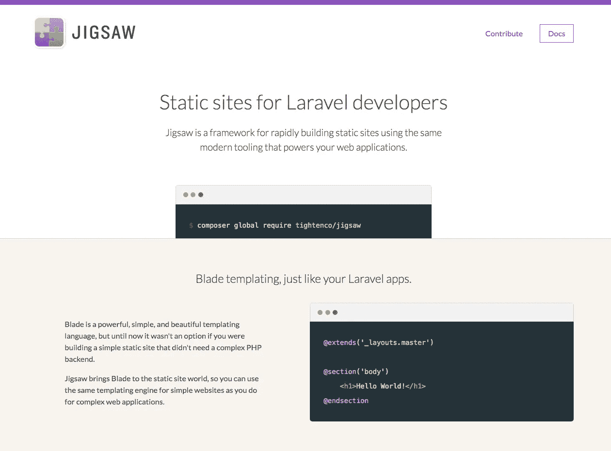
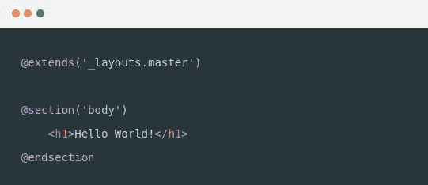
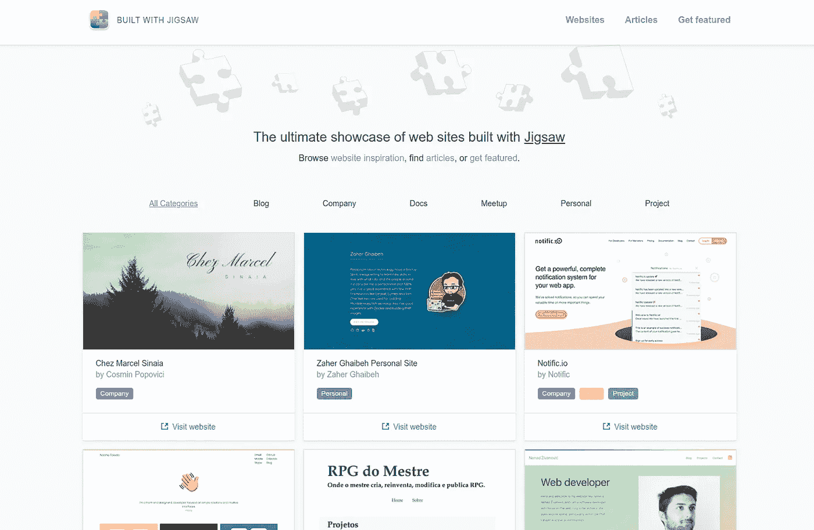

# jigsaw——Laravel 静态站点生成器。

> 原文：<https://medium.com/hackernoon/jigsaw-my-interview-with-keith-damiani-senior-developer-at-tighten-and-lead-developer-on-the-55ead103514d>

## 我采访了 Keith Damiani，他是 Tighten 公司的高级开发人员，也是 Jigsaw 项目的首席开发人员。

由团队在[tight](https://tighten.co/)开发的 [Jigsaw](https://jigsaw.tighten.co/) 是一个静态网站生成器，它利用来自 [Laravel](https://laravel.com/) 框架的组件来构建静态网站。

作为我对拼图[所做的一些研究的一部分](https://jigsaw.tighten.co/)(这原本是一个大学项目的一部分，我已经把它变成了一篇[博文！](https://medium.freecodecamp.org/how-to-use-jigsaw-to-quickly-and-easily-build-static-sites-8a3304c3ad7e))，我联系了[基思·Damiani](https://twitter.com/keithdamiani)，他是[收紧](https://tighten.co/)的高级开发人员，也是拼图项目的负责人。

Keith 很友好地回答了我关于 Jigsaw 的发展和未来计划的一些问题。

以下是他不得不说的话…

## 乌尔曼:你能自我介绍一下，告诉我你的背景和你与竖锯的关系吗？

KD:我是位于芝加哥的完全远程网络咨询公司 Tighten 的高级开发人员。我住在弗吉尼亚州的夏洛茨维尔，相对来说是编程新手，在加入紧缩公司之前，我已经经营了 20 年的平面设计公司。

我是 Jigsaw 的首席开发人员，在 Adam Wathan(最初在 Tighten 时编写 Jigsaw)离开后接替他的工作。

## RW:开发 Jigsaw 的主要动机是什么？它仅仅是一个紧缩项目的副产品，还是你/马特/紧缩特别想开发的东西？

KD:它肯定有卑微的开始；最初，它纯粹是为内部使用而设计的，主要是为我们自己的站点供电。我不得不问 Adam 他的动机，但我怀疑他看了一眼 Ruby 世界，就像他经常做的那样，并认为利用 Blade 的编译器引擎为 PHP/Laravel 世界提供类似 Jekyll 的东西会很好。

## RW:Jigsaw 和其他静态站点生成器有什么特别的不同吗？虽然你可能有偏见，但是是什么让 Jigsaw 有别于其他产品呢？

KD:它肯定是针对那些熟悉 Laravel 生态系统的开发者的，因为它对 Blade 的依赖如此之大；因此，对于整天编写 Laravel(甚至 PHP)的人来说，这是一个自然的选择，只需要很短的学习曲线就可以开始运行。

Blade example, taken from [https://jigsaw.tighten.co/](https://jigsaw.tighten.co/)

## RW:在 Jigsaw 的开发过程中，你有没有遇到过什么特殊的或者困难的技术挑战？

KD:最初的版本没有“集合”的概念，增加这个概念有点困难，因为它基本上要求每个页面处理两次(使一个页面能够引用另一个页面，例如在侧边栏菜单中)。最近，我一直致力于优化构建过程，使其尽可能高效(和快速)——特别是对于大型网站——这涉及到挖掘刀片引擎的内部，以找出如何添加对缓存的支持。

更一般地说，将 Jigsaw 的能力扩展到超出其最初目的是一个挑战，因为在它的起源，它是一个只会一招的小马:旋转一堆 Markdown 文件，并使用 Blade 构建静态 HTML。这个核心概念肯定会在某些时候成为我们所能做的事情的限制；随着我们继续添加扩展刀片引擎极限的功能，Jigsaw 代码库将变得如此古怪，以至于可能值得完全重写:)

## RW:关于代码库，你是否能够利用许多现有的包和 Laravel 组件，或者从头开始构建许多东西？

KD:因为它依赖于 Blade 作为主干，而且它是由一群 Laravel 开发者编写和维护的，所以它肯定利用了 Laravel(和 Symfony)的许多优点。除了 Blade 之外，它还非常依赖集合、Laravel 容器和 Symfony 控制台组件。

## RW:你认为 Jigsaw 的理想用例是什么？简单的博客？网站？你见过 Jigsaw 有什么有趣的应用吗？

KD:毫无疑问，它最初是为一个简单的网站设计的(在添加集合支持之前，甚至不是一个博客)，但随着它的发展，我们已经看到了各种有趣的用途。人们已经用它来消费远程的基于 API 的 CMS 内容(使用 Contentful 这样的服务)，一个开发者已经在 Jigsaw 上构建了一个完整的 HTML-email 框架。我们知道的一些开发人员有非常大的网站(6000 多页),真正扩展了最初非常简单的静态网站生成器的能力。但是 90%的用例，也是我们认为 Jigsaw 非常适合的，是博客、文档网站和传统的营销类网站(就像我们自己的)。我们创造了 builtwithjigsaw.com 来收集这些伟大的例子。

[https://builtwithjigsaw.com/](https://builtwithjigsaw.com/)

## RW:Jigsaw 是针对特定类型的开发者吗？例如，为了让经验较少的开发人员保持较低的入门门槛，保持它的易用性很重要吗？

KD:它肯定是针对(1)熟悉 Laravel 的人，和(2)熟悉命令行的人。然而，随着它的成长，受众变得更广泛，在保持较低的准入门槛的同时，平衡添加更复杂功能的愿望有点棘手。理想情况下，对于经验不足的开发人员来说，Jigsaw 总是很容易上手，但是对于高级开发人员来说，它足够健壮和可扩展，可以继续做[有创意的](https://hackernoon.com/tagged/creative)和创新的事情。

## RW:竖锯的未来会怎样？他们有什么令人兴奋的特性是你现在正在开发或者计划添加的吗？

KD:我们正在完成对初学者模板支持的[开发](https://hackernoon.com/tagged/development),包括两个漂亮的内置模板——一个用于博客，一个用于文档网站——以及第三方构建自己的模板供人们使用的能力。同样，这里的目标是让一个伟大的网站快速建立和运行变得非常简单:`jigsaw init blog`或`jigsaw init docs`你就可以开始了。优化的东西是非常令人兴奋的，至少对于那些维护大型网站的人来说，因为它减少了大约 75%的构建时间。除此之外，我们还计划继续开发一些功能，允许用户连接到外部的基于 API 的 CMS，不久我真的很想增加对国际化的支持，从第一天开始我们就收到了很多请求。

## RW:接下来，我个人喜欢 Jigsaw 的简单，但是有计划引入一个“插件”生态系统，管理界面，或者类似的东西吗？

KD:是也不是；初学者模板是可扩展性的第一步，我们正在寻找为人们构建可重用插件的方法，比如常用的助手方法。我们增加了对事件的支持，为人们在构建之前或之后运行任意代码提供了挂钩，并且`bootstrap.php`文件可以让高级开发人员完成几乎任何他们想做的事情……但是如果能让经验较少的开发人员更容易理解这一点，并允许每个人利用社区中的一些伟大想法，那就更好了。我不期望我们会添加任何种类的管理界面，它将永远是基于命令行的(主要是因为这是我们喜欢的工作方式😊)

## 乌尔曼:关于竖锯，还有什么令人兴奋或有趣的事情要告诉我吗？

KD:这是一个非常有趣的开源项目，因为它已经超越了最初的用例；它作为一种非常简单且功能有限的东西被抛向了世界，并随着用户(包括我们自己)带着许多“嘿，如果 Jigsaw 能做 X 怎么办”的请求回来而有机地增长。

感谢您的阅读！😃如果你喜欢，点击下面的按钮。我真的很感谢你的支持，这有助于其他人了解这个故事。

我总是很高兴收到志同道合者的来信，所以请随时给我发电子邮件或在 Twitter 上打招呼。