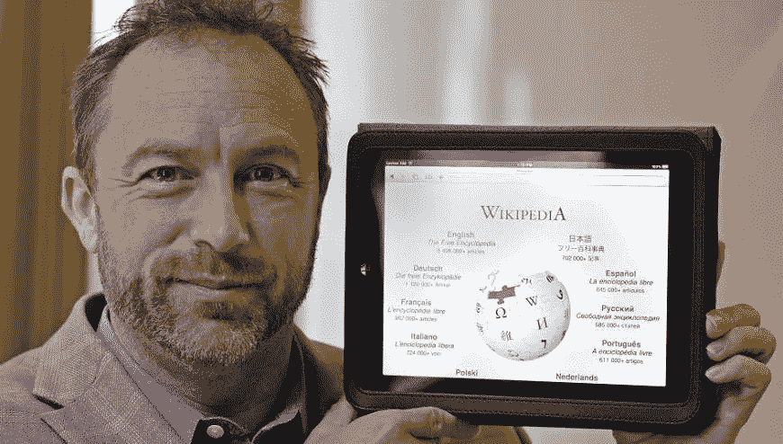
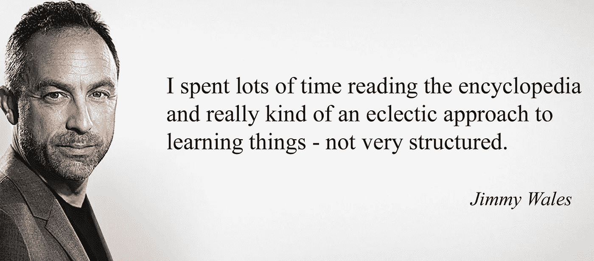

# 为世界创造免费百科全书的背后

> 原文：<https://medium.com/hackernoon/jimmy-wales-of-wikipedia-2335c43f1204>

维基百科的创始人吉米·多纳尔·威尔士告诉我们为什么他最初创建在线百科全书的尝试失败了，以及他从那次让维基百科成功的冒险中学到了什么。一路上，他还与我们分享了他在当今数字世界中建立成功企业的方法。

> 这个故事最初是由来自[专业写作服务](https://prowritingservice.com/)的贾斯汀·鲁尼恩写的

从 2000 年 3 月创建的 Nupedia 开始，威尔斯第一次尝试建立免费的在线百科全书。受到自由软件运动的发展和网上涌现的新合作模式的启发，威尔士开始着手一个他认为对世界非常有益的项目——其他人会对此充满热情，并愿意放弃他们的时间来帮助实现它。

Nupedia 原本是一项免费服务，志愿者可以一起创作文章，但也有一些限制，比如一个非常自上而下的文章创作系统，这使得它与它的继任者[维基百科](https://hackernoon.com/tagged/wikipedia)明显不同。Nupedia 冗长乏味的 7 步编辑流程导致了一个阻碍文章创作的巨大瓶颈。提交的申请甚至必须经过该领域专家令人生畏的审查过程才能获得批准。威尔士表示，Nupedia 没有成功是因为“它没有满足那些想要帮助这个项目的人的需求”，尽管他们受到了这个愿景的鼓舞。他反映说，当时他们“对社交模式没有理解”,而这是 Nupedia 成功的必要条件。尽管困难重重，威尔士还是决定继续这个项目，因为他已经决定把它作为自己的人道主义目标，而且“做这件事是互联网的意义和目的。”

然而，不到 18 个月后，Nupedia 的管道没有任何变化。显而易见的是，该网站永远无法产生足够的内容来维持运营。面对 Nupedia 团队成员的反对，威尔士决定放弃这个网站，启动另一个项目。

从 Nupedia 的灰烬中诞生了维基百科。它采用了一种新的协作方式，摆脱了旧的编辑流程，从而允许任何人快速创建和编辑文章。几乎是瞬间，威尔士就知道维基百科将会成为未来。在两周内，新网站的文章数量超过了 Nupedia 近两年的总和。虽然很明显维基百科是成功的模式，而 Nupedia 是失败的，但威尔士说，从另一个角度来看，Nupedia 没有失败，因为在他们工作的这段时间里，他们讨论了最终会在维基百科中找到自己的变化，找出了运行它所需的软件，并完善了免费百科全书的愿景。

维基百科起步很慢。最初，它依赖于一个小而专注的在线活动家团体来创作文章，这些人分享了威尔士关于免费百科全书的愿景。最终，它通过口口相传而流行起来。一旦网站能够生产出好的内容，它就会被搜索引擎选中，这只会给网站带来更多的流量。威尔士说:“如果你制作高质量的内容，人们就会来……所以我们只是专注于这一点。”威尔士说，除了将维基格式引入网站之外，并没有太大的变化，但许多小的变化使网站取得了成功。他强调要注意细节，比如移动编辑链接，让它更加突出，因为当时人们并不知道文章的编辑功能，他们自己也可以改变内容。

没有消息就是坏消息
当维基百科稳步增长，流量每 3 到 4 个月翻一番的时候，也有很多时候让威尔斯感到担忧。虽然坏的或错误的内容总是网站上的一个问题，但对文章的破坏让他感到沉重，让他晚上睡不着觉，因为他偶尔会在深夜起床检查文章的完整性。最终，随着维基百科用户群的增长，威尔士将学会信任社区，而不必彻夜不眠地监控网站，因为总会有足够多的用户来捕捉和删除破坏者的作品。

具有讽刺意味的是，这可能是维基百科某篇文章内容不准确的一个例子，而这将推动它的发展。与“没有消息就是好消息”的说法相反，维基百科一篇关于一名记者的文章中的一个“严重错误”(几个月来未被注意到)促使同一个人对该网站写了一篇严厉的评论。媒体对维基百科的报道引发了许多关于该网站真实性和有用性的问题，但这也导致了从未听说过该网站的用户流量的泛滥。虽然威尔士“并不建议你应该试图得到关于你自己的坏消息”，但他承认这确实帮助维基百科经历了历史上最好的季度之一，因为它的在线流量由于负面新闻报道而增加了两倍。

最终，是诚实和真实帮助维基百科在媒体争议中幸存下来，因为威尔士和他的团队很早就承诺他们将“对(他们的)工作完全现实和谦逊”。(他们)不会编造故事来说维基百科有多棒，(他们)会承认错误，并说:我们正在努力，你在使用维基百科时应该非常小心，有时这是错误的，但我们是一个伟大的社区，我们正在努力做一些有趣和伟大的事情。”

让人们玩得开心
维基百科及其开源哲学的核心理念是用户将成为文章的贡献者。一些人将此称为众包，但威尔士不喜欢这个术语，他说“这是一种误解，人们免费工作，免费享受乐趣。”他的意思是，人们从事某件事是因为他们这样做是为了社区的利益，或者是为了和朋友在一起。他用保龄球馆做类比，一些人为了赢得百万美元的锦标赛而玩，而另一些人免费玩。他问，“那么这些人免费打保龄球是为了什么？他们看起来一定很傻，对吗？”威尔士不这么认为，他解释说，人们打保龄球是免费的，因为他们玩得开心，我们不应该认为他们是傻瓜，因为他们打保龄球没有任何报酬。

**创业**
威尔士还经营着一家名为 Wikia 的营利性公司，为维基人提供虚拟主机服务。该公司的长期目标是改进维基的软件，让它们更容易构建。他建议企业家在制定长期商业计划时，与他们的团队进行对话，讨论和辩论项目，并就愿景达成共识。威尔士认为，要想有一个成功的企业，你需要拿出一个产品，然后了解客户和用户想要什么。你必须考虑每个参与者，满足他们的需求。他建议人们事后考虑它的商业方面，因为总有很多方法可以获得收入。

威尔士还认为，最好的企业不是由拥有 MBA 学位的人创建的。相反，他认为最成功的公司是由有激情的人创建的，他们创造概念并出售它，而不是制造满足市场需求的东西，因为这些类型的产品往往乏味无趣。

威尔斯的持久遗产是为世界创造了一部免费的百科全书，一部可以用任何语言阅读的百科全书。为了实现这一目标，他将注意力转向了发展中国家，因为那里是维基百科发展的地方。目前，大约有 10 亿人上网，这一数字将很快翻两番，涵盖地球上的绝大多数人，其中大部分增长将来自发展中国家。当他们上线时，威尔士希望在那里为他们提供正确的支持和正确的工具，以实现他的愿景