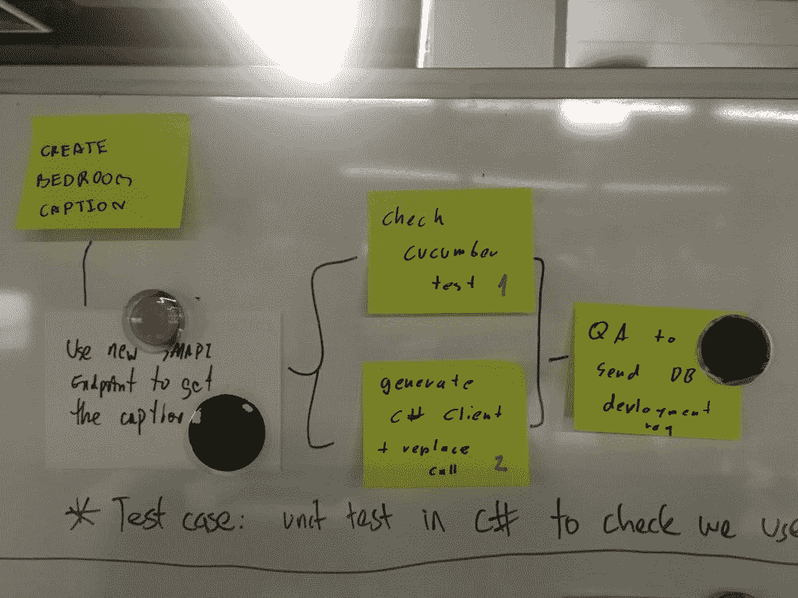

# JIRA 五世白板

> 原文：<https://medium.com/hackernoon/jira-v-whiteboard-bdc5b85dbcfd>

你知道如何自动化所有的事情，但是有些事情不应该是 T2 的。这个过程是其中之一。我个人**不是** 100%确信[JIRA](https://hackernoon.com/tagged/jira)/Trello/Online Scrum Board XXX 比你的普通旧白板好。为什么我会做出如此大胆的断言？我可以解释，真的！现在，我不是说白板更适合项目管理。因为那完全是另一种野兽。我真正说的是一个冲刺板。

# 任务分解

作为一名工程师，我们通常不得不**将更大的故事分解成任务。然后这些可以在你的团队中分配，你可以分而治之，对吗？这就是白板的亮点。任务分解可以在白板上*可视化设计*并且**快速**。哦——你想把服务器端的任务放在一个故事里？没问题。将便利贴放在黑板的相同区域，并在它们周围画一个圈(只是一个想法)。前端呢？一样的！你可以很容易地把故事视觉化地分解成更小的块，而不需要滚动。**

然而，有了在线董事会管理软件像 JIRA/特雷罗/什么的，维护起来就困难多了。他们只是进入列表。也许你可以给它们添加一些视觉标签或者改变颜色。那当然有用。但是浏览这个列表比浏览白板要多得多。而且只有一个人可以输入任务——而在白板上，任何人都可以拿起笔写在便利贴上。

我们还了解到**在您的主板上绘制依赖关系**的任务，这些任务依赖于要完成的其他任务才能被拾取。例如，在开始在客户端调用 API 之前，您可能需要创建一个模拟 API 端点*。你可以*给*画一条依赖线。这样，你和你的同事就知道他们下一步可以接什么任务，哪些任务应该避免。你能用这些在线板做到吗？*

# 每日混战

我知道不是每个人都会有每日 scrum——所以这可能对*一些*人来说*不相关*。但是有了实体白板，你可以真正地**看到人们在完成的任务周围打勾或移动时取得的进展**。你也在黑板旁边。不是你们聚集在一起的监视器。和阻塞任务？你可以绕过一些明亮的东西，不断地让团队知道你被挡住了。很简单。我们生来就是为了四处走动的。

顺便说一句:站起来去董事会不是比围在电脑前或在空闲时站起来更好吗？只是为了一般的锻炼和安康。

# 什么更有效？

对于举报案件，JIRA 几乎每次都会大放异彩。它是自动的。它可以追踪时间。就这些方面而言，这很棒。但是对于每天的 scrum/看板/单口相声，白板(或任何实体板)都会发光。你可以画东西。想链接什么都可以。你可以很容易地移动任务。你不需要跟随任何“流”。你可以发挥你的想象力。

你多久报告一次？我会说——没有你站在黑板前那么频繁。所以我认为你应该拥抱老式的白板，让你的想象力自由驰骋。你的进步不需要被塑造成一个特定的“流程”。如果你需要记录完成了多少工作——那就拍一张照片——或者在“完成”栏中计算任务数——或者计算勾选的任务数。报告不应该支配你的团队的日常流程。

*原载于 2018 年 7 月 16 日*[*www . alexaitken . NZ*](https://www.alexaitken.nz/blog/jira-v-whiteboard/)*。*