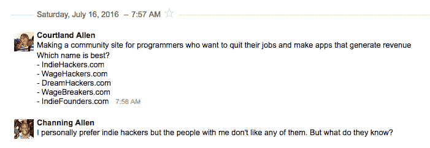

# 职位描述:激励人们创业

> 原文：<https://medium.com/hackernoon/job-description-inspire-people-to-start-businesses-22df0d1ccce>

## 柯兰德·艾伦访谈

Courtland Allen living life!

*有请* [*科特兰艾伦*](https://twitter.com/csallen?ref_src=twsrc%5Egoogle%7Ctwcamp%5Eserp%7Ctwgr%5Eauthor) *来到骇客正午！考特兰创办并运营了*[*IndieHackers.com*](http://IndieHackers.com)*，这是一个面向创业社区和各种规模的创业者的伟大网站。作为一家涵盖多种类型创业公司的自举创业公司，我非常欣赏 Courtland 如何为自举和盈利的企业家提供帮助。他采访过 320 位企业家，我希望我的采访能有他的一半好。Indie Hackers 拥有 2.5 万名社区成员、3 万名电子邮件订户、110 万播客下载量和 120 万月浏览量。如果您对 Courtland 有任何其他问题，请随时发表评论或在独立黑客社区论坛* *中发起讨论。*

你是何时/如何想到独立黑客这个名字的？该域名可用吗？你看很多独立电影吗？

决定从事独立黑客工作后，我做的第一件事就是想出这个名字。我花了一整天的时间专注于这项任务，除此之外什么都不做，定期给我的兄弟和女朋友发短信，征求他们的意见。我仍然保存着所有这些信息:

如果你曾经花了几个小时试图为一个网站想出一个好名字，那么你知道这可能是一个艰苦的过程。我想做的就是开始编码，但是我做不到，因为我不知道给我的存储库取什么名字。

但我觉得花一整天在这上面是值得的，因为如果一切顺利，我会用这个名字很多年。我不想犯任何会让自己后悔的明显错误。

> Indie Hackers 其实是我最先想到的名字之一，但是域名被人占了，所以我继续找。最终我决定给房主发邮件，看他是否愿意卖掉它，他答应了！它花了我 2000 美元——他不肯在价格上让步——但我很高兴得到这个域名。

**独立黑客的设计很棒。我也很喜欢你提供播客的完整文本。你能分享一些关于设计选择的信息吗，还有，引擎盖下是什么(你是如何制作的)，以及这个网站是如何发展的？**

谢谢大家！除了名字，我在设计初期也花了很多心思。我希望独立黑客成为一个社区，所以让网站充满自己独特的个性是很重要的。它需要令人难忘。如果有人访问你的网站三四次，却不记得他们已经去过了，这是一个真正的悲剧。

> 网络上几乎所有其他媒体网站都是白色的，所以我决定打破规则，让独立黑客变成深蓝色。我认为与别人相反的做法是被低估的。

独立黑客背后的技术完全是另一回事。我过度设计了它，使它比需要的要复杂得多。我这么做也完全是出于自私的原因。如果我要花时间在内容网站上工作，我至少想玩一些有趣的技术。

Indie Hackers 建立在 Ember.js 之上，这是一个用于创建单页应用程序的框架，我非常喜欢使用它。随着时间的推移只会越来越好。在后端，我使用 Ember Fastboot 和 node 进行服务器端渲染，因此您不必等待 JavaScript 加载和渲染应用程序，然后就可以开始阅读。我用 Firebase 存储数据，用 AWS 托管。

我必须学习的一件事是缓存。如果你的内容网站在每次做它应该做的事情和吸引大量读者的时候都失败了，那就没有意思了。我有一个相当有创意的缓存策略，随着独立黑客从一个媒体网站发展成为一个类似于社交网络的社区网站，这个策略变得更加复杂。我在这里还有很多工作要做，才能得到我想要的表现。

[**你采访过很多企业家**](https://www.indiehackers.com/products) **。尤其是在他们创业之初。你注意到了哪些导致他们业务增长的共同特征？**

他们尝试了很多事情，放弃了失败，并把气体倒在火上。他们善于利用现有的优势。他们是勤奋的工人，而且他们实际上喜欢建造东西。对他们来说不是苦差事。他们不需要特别的技巧就能在早上起床去工作。

> 创业公司创始人第一次尝试就获得大满贯的流行文化形象通常都是胡扯。

我所交谈过的最成功的人是那些总是致力于新的附带项目和想法的开发人员，他们有能力实际发布这些项目。他们已经挥了几十下，大部分都没打中，但他们还是坚持挥了。

从头开始，一遍又一遍地做新的事情是很特别的。它给你一个机会去思考你在过去学到了什么，并在下一次做得更好。它给你视角，所以你更有可能知道什么时候你应该加倍下注，因为你实际上是在做一些事情。当然，这也给了运气更大的机会出击。

我想这也适用于其他事情。

> 如果你想学习成为一名优秀的设计师，那就出去设计 100 个网站。不要永远只迭代一个网站。

古怪被低估了。我之前提到过这一点，但值得重申一下。人们真心喜欢新奇的事物。当我们一遍又一遍地看到同样的东西时，它们就被铭刻在我们的大脑中，这使得它们变得可预测，这使得它们变得乏味，所以我们失去了兴趣。如果你和其他人读同样的书，在同样的餐馆吃饭，做同样的工作，去同样的地方旅行，那么你会产生同样无聊的想法。

我采访过的很多更成功的创始人都是怪人。他们有不同的输入，这导致了不同的输出。他们还去掉了输出中的过滤器，告诉他们要顺从，不要冒险。他们制作了诅咒你的天气应用程序。他们在推特上谈论他们银行账户的内容。他们认为每个人都应该[订阅糖果](https://www.indiehackers.com/interview/candy-japan-81315f627b)。等等。真的很突出。

当他们得到最初的关注时，他们会随之而来。他们不会就这样让它消失。人们很容易相信你只需要一次幸运的突破，或者一次成功的起步，但这远远不够。衰落开始了。熵不希望你成功。成功的故事通常涉及创始人如何将短暂的小优势转化为持久的大胜利。

[**独立黑客 2017 年 4 月卖给 Stripe。你能告诉我们一些关于这次收购是如何发生的吗？为什么当时销售有商业意义，加入 Stripe 后商业目标有什么变化？**](https://www.indiehackers.com/blog/acquired-by-stripe)

> Stripe 的收购要约突然冒出来。这可能是我创办独立黑客以来发生在我身上的一长串幸运事件中最幸运的一次。Stripe 的首席执行官帕特里克·科利森给我发了一封电子邮件，主题是“收购独立黑客”，我的第一反应是，他一定是在谈论某个地方的其他独立黑客。

当时，我正处于这个网站的转折点。我的收入已经增长到接近每月 6000 美元，这足以支付成本和我在旧金山的租金。感觉棒极了！但我是靠卖广告赚钱的，这感觉就像一台永不停息的跑步机，每周都要占用大量时间，而我努力的结果实际上是让网站变得更糟。帕特里克给我发邮件时，我正在寻找新的商业模式。

> 顺便说一句，我不建议在旧金山这样的高消费城市创业。

加入 Stripe 后我写的第一个代码就是把网站上的广告全部去掉。今天，独立黑客赚 0 美元。不然我根本没怎么变。Stripe 收购独立黑客的战略目标反映了我经营它的非金钱目标——激励更多人创业，并帮助更多企业成功。

**Stripe 如何衡量独立黑客的成功？转换到使用条纹和图集？独立黑客目前的 KPI 是什么？**

独立黑客对 Stripe 来说完全是异想天开。它需要比目前的规模大几个数量级才能真正发挥作用，它需要看到类似的改进，这对企业家有多大的帮助和意义。未来，如果独立黑客如此有用，以至于相当一部分新创始人都是从那里开始的，那就太好了。

这都是非常雄心勃勃的，所以我有我的工作为我切断。

我追踪的最重要的指标是:有多少人是因为受到独立黑客的启发而创办公司的？有多少创始人根据他们从独立黑客那里学到的东西做出不同的决定？

当然，这些数字很难精确测量。但是正确的目标比简单的测量更重要。我宁愿在正确的方向上做好工作，也不愿在错误的方向上做好工作。

**你的播客******每集收听量已经超过了 3 万次。道具。你对其他在创业领域发展播客的人有什么战略和战术建议？****

**埃隆·马斯克说过什么？“经营播客就像吃玻璃，凝视深渊”？差不多就是这样。播客对我来说真的很难。我希望它很棒，但我从来没有满意过。**

> **我的建议？找有意思的嘉宾，持之以恒，做足功课，提前准备好问题。如果你要请某人抽出时间来参加你的节目，你应该至少花几个小时来研究和思考问题。你也欠你的听众。**

**利用你正在制作录音，而不是现场表演的事实。不要害怕编辑和重新记录东西。不要害怕扔掉不好的剧集。你可以通过对你的客人吹毛求疵和做好准备来避免这些工作。**

**至于增长，如果你有一个听众，那会有所帮助。如果我没有一个社区和一个每周发送的邮件列表，我怀疑独立黑客播客会得到这么多下载。一直在谈判。**

****独立黑客社区长期会是什么样子？****

**当人们互相帮助时，他们可以完成很多事情。互联网显然使我们能够以前所未有的规模进行合作，但似乎大多数人仍在独自努力工作。也许对资本主义的追求遮遮掩掩是我们的天性，但我不这么认为。**

> **我的目标是让独立黑客成为现存最大、最有影响力的企业家社区。我想让这些人互相交流。**

**我希望成功的创始人访问独立黑客，分享他们的故事，并向他们的同龄人学习。有抱负的早期创业者应该向他们的榜样学习，并在创办新企业和克服具体挑战时相互支持。有时候，这就像询问对工程决策的第二种意见，或者对新设计的反馈一样简单。其他时候，当事情看起来很糟糕，你正处于放弃的边缘时，它是寻找鼓励。**

**在你建立一家成功公司的过程中，寻求其他创始人的帮助应该是一种自然而明显的行为。**

**就独立创始人和自举运营而言，你认为哪种类型的行业/产品比去年甚至 5 年前更容易在网上赚钱？**

**几乎全部。以前从来没有这么多高质量的信息来指导你在网上赚钱。与正在做这件事的人联系从未如此容易。从来没有这么多的工具可以帮助你构建，这些工具也从来没有这么强大或便宜。当然，从来没有像现在这样多的潜在客户。不仅在线人数在增加，而且他们的精明程度也在提高。(我的*妈妈*上周问了我一个关于 GitHub 的问题。我从未想过会发生这种事。)**

> **一般来说，Startupland 的风气是筹集大量资金，然后试图主导赢家通吃的市场，成为独角兽。这种情况不会消失，但我怀疑，瞄准一个利基市场，将业务提升至每月 1 万至 2 万美元，将成为对许多创始人越来越有吸引力的途径。**

**很明显，我很喜欢社区建设。很难想象 10 年后的世界，人们在他们喜欢的事情上不再像 T4 那样联系紧密。**

**此外，教育总是有需求的。人们学习的方式多种多样，所以你很少会看到某个特定的老师、机构、风格或公司拥有市场。这对于新进入者来说非常有利。有数百万种你可以教的东西和方法的组合。**

**事实上，构建技术上复杂的产品被高估了。仅仅找到需要帮助的人并帮助他们是被低估的。独立黑客开始是一个小的采访集。你甚至不能称之为产品。**

**你认为像 Hacker Noon 这样的科技博客应该更重视什么？**

**我认识很多对世界有着强烈愿景的企业家，他们会做*任何事情*来吸引观众，帮助实现他们的愿景。我看到许多吸引大量读者的出版物，但除了给他们看广告之外，没有做任何事情。**

> **看到博客和内容网站做更多的事情来建立社区，发起运动，并尝试其他创造性的前进道路，这将是一件好事。当然，跳出你的能力范围是有风险的，但你已经建立了自己的分销平台，所以在尝试大多数企业家只能梦想的新事物时，你有巨大的优势。**

**我认为我们都局限于思考什么样的企业可以存在，媒体公司“应该”是什么样子。我们完全跟随以前的大公司的脚步。但是，如果我们不这样做，而是重复运行一个算法，利用我们现有的优势，朝着更大的愿景迈出下一步，我们就可以在真正有趣的地方结束，也许可以创造出前所未见的东西。**

****如果你能改变今天的创业方式和实践，你会怎么做？****

**实际上，我现在正试图改变它。企业家不应该试图独自完成这一切。相反，他们应该花更多的时间向同事敞开心扉，教学，学习，并寻求建议。**

**我发现做这件事的障碍主要是心理上的。许多创始人——尤其是那些更有经验的人——希望看起来他们知道自己在做什么，好像他们很擅长，并且知道所有的答案。去年，一位朋友告诉我，他的生意非常好，当时我刚从一位员工那里听说他们离破产只有几天了。**

**这是一种荒谬的事态。**

> **最好的 CEO 都有导师。没有人知道所有的事情，我们也不应该假装知道。**

**但是我们很多人都知道一些事情，所以我们可以互相帮助。这就是我打造独立黑客的原因。去寻求一些帮助，也试着提供一些帮助。**

****你对正在电脑前有创业想法的创客有什么建议？****

**好建议很少是放之四海而皆准的。了解你是谁，你在哪里，这样你就知道该听什么建议，该忽略什么。例如，如果你不想筹集资金，就停止阅读风险投资家写的博客文章。**

**我试图与独立黑客一起做的事情之一是收集尽可能多的关于人们如何将他们的想法和副业变成有利可图的生意的故事。种类之多令人震惊。**

**如果你知道 20 个、50 个或 100 个关于人们如何起步的故事，而不仅仅是 1 个或 2 个，那么你找到与你产生共鸣的方法的可能性会大得多。**

# **通过访问 IndieHackers.com，在推特 &上与[科特兰·艾伦保持同步。](https://twitter.com/csallen)**