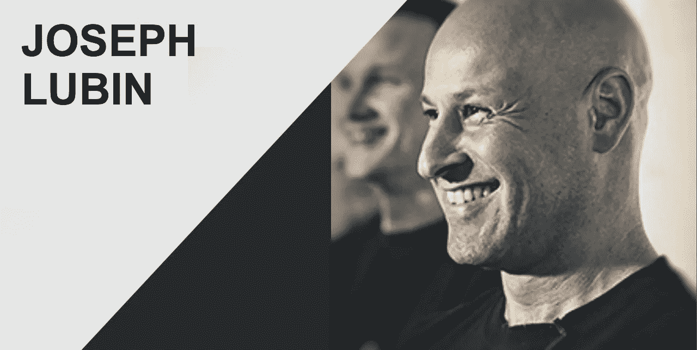

# ConsenSys 创始人 Joe Lubin 谈区块链的未来

> 原文：<https://medium.com/hackernoon/joe-lubin-on-the-future-of-blockchain-d058aa57641b>

我们采访了一些有趣且具有煽动性的人物，他们在《技术一样有趣》节目中出现，这是一个播客和现场直播节目，由 T2 和 UCB 喜剧演员 T4·乔·莱昂纳多共同主持。人们喜欢马努什·佐莫罗迪、巴拉唐德·瑟斯顿、布里奇特·凯里、尼尔·埃亚尔、劳里·西格尔和喜剧演员查克·尼斯。我们的目标是在专家的帮助下解决最棘手的技术问题。也许因为这是最棘手的，我们被问得最多的采访是我们 1 月份对 ConsenSys 创始人约瑟夫·卢宾的采访。

**所以现在我们发布文字记录。**

与如此有才华的嘉宾一起主持播客的一个有益的方面是，你在这个过程中学到了很多——无论是为节目做准备还是从嘉宾那里。区块链显然抓住了公众(和投资者)的想象力，但我们了解什么是真实的，它的含义是什么吗？我和我的搭档准备学习。加密货币是我表示怀疑的一个领域，所以我很想知道区块链技术在货币之外的各种用途和潜力。

就在一个月前，我和我的搭档受邀在纽约主持一场大型加密货币活动。很明显，我们并没有积极参与这个充满激情和活力的世界。我们就像离开水的鱼，演讲者和观众说着完全不同的语言。但是我们很想了解它。

Funny as Tech co-hosts Joe Leonardo and David Ryan Polgar with ConsenSys founder Joe Lubin. Recorded at Company in NYC (formerly Grand Central Tech)

**David Ryan Polgar** (简介):Joseph Lubin 是区块链制作工作室 ConsenSys 的创始人，该工作室在理论上为下一代分散式 web 开发分散式应用程序和实用程序。Joseph 以优异的成绩毕业于普林斯顿大学，获得电子工程和计算机科学学位，在普林斯顿大学担任机器人实验室的研究人员，然后在 Vision Applications 工作，这是一家从事自主移动机器人、机器视觉和人工神经网络领域的私人研究公司。后来，约瑟夫搬到了牙买加的金斯敦，从事音乐行业的一系列项目。音乐项目进行了两年。约瑟夫是 Enthereum 项目的联合创始人，自 2014 年 1 月以来一直致力于 Enthereum 和最近的 ConsenSys。

乔，欢迎来到我们的节目。

乔·卢宾:谢谢，伙计们

乔·莱昂纳多:我有一个问题。好吧，这是披露。首先，一个月前我买了一些以太坊。

**鲁彬**(纠正):一些乙醚。

莱昂纳多:一些乙醚。是这么叫的吗？

**鲁滨**:以太坊就是平台。以太是价值令牌，类似比特币。

**莱昂纳多**:我觉得我们刚刚在某些东西上闪耀。很多人在不知道它是什么的情况下购买它。我是其中之一，我买了一点，在我们，我们做了一个演出，而回到加密货币，我被告知我应该买一些比特币和以太，我这样做了。

这两者有什么区别？

有实际的[差别]吗？我知道一个比特币大概需要 15 分钟……(慢慢消失)……我真的不知道。我只知道我有一点零，零，零，二(比特币)…

**波尔加**(笑):你不知道，但你还是买了。

莱昂纳多:我买的。我做到了。我对所有的宣传都很着迷……所有的人都吓坏了。我知道一些重要的事情正在发生。

我知道一些重要的事情正在发生。我只是不知道是什么。但我觉得有重要的事情正在发生，你知道，这是一个即将破灭的泡沫吗？我只是…我宁愿冒这个险去买一些。

但是有一部分我觉得这种技术，这种(我听到的)对我描述的方式，是有意义的。这些都是分散的。没有政府的货币。感觉像是未来。我只是不知道到底是怎么回事。

卢宾:我同意一些重要的事情正在发生，我认为你正接触到我们如何组织这个星球上的系统的巨大变化的承诺的片段。

比特币是中本聪发明的。中本聪在 2008 年和 2009 年发明了三样东西，真的。比特币的应用、货币、储值、支付系统，这只是第一个被带入世界的应用。

第二个发明是区块链，这是一个分散的数据库基础设施，使不同的参与者能够走到一起，共享基础设施，以信任最小化的方式处理交易。一种每个人都可以确信没有人在欺骗系统的方法。

莱昂纳多:你说这是中本聪发明的。

**鲁彬**:对。

莱昂纳多:但据我所知，他完全是个谜，可能是一队人。

**鲁彬**:是一群人。

**莱昂纳多**:是一群人？

鲁彬:很有可能，我不知道他们是谁，但是有一些关于他们是谁的有根据的推测。

波尔加:你认为他们为什么这么神秘？这也给局外人抛出了几个危险信号，他们会说，“好吧，等一下。”我想我刚刚读了一点纽约时报…

鲁彬(插话):让我先回答完第一个问题，然后我来补充。

莱昂纳多(开玩笑):顺便说一下，这是一次审问。

**鲁彬**:不，这样很好。天气非常非常热。非常明亮的灯光照在我的脸上。

**莱昂纳多**:我们都在抽烟。

鲁彬:令人不安……[转换对话]

因此，区块链上的第一个应用程序让很多人意识到我是一种新型的共享基础架构——信任最小化的基础架构应该用于交付大量不同类型的应用程序。于是以太坊项目诞生了。还有许多其他的尝试，使软件开发者能够在这个共享的基础设施上构建他们想要的任何东西。

莱昂纳多:澄清一下，当你说它有多种应用时。这意味着不仅仅是货币。可能是为了其他事情。

**鲁彬**:正是。

**莱昂纳多**:技术不与货币挂钩？

Lubin :嗯，区块链上的第一个应用程序是建立在一个不太灵活的区块链上的，它的编程表达能力不是很强。所以很难在比特币区块链上建立其他东西。

# 这就是为什么我们基于同样的基本原则建立了以太坊分散应用平台，一个更具表现力的系统。它使普通的软件开发人员，他们可以构建 web 应用程序或移动应用程序，来构建没有服务器的应用程序，没有像脸书或网飞这样的中央服务器。

没有一个地方你可以从那里得到你的前端，或者你的后端驻留在那里。你的后端数据库是常驻的。因此，您的应用程序可以被发送到这个由成千上万个节点组成的网络中，这些节点由任何想要无限制地连接到网络的人运行，他们可以为您的应用程序提供服务。这些应用程序可以是任何东西。

因此，在我们公司 ConsenSys，我们正在建立一个自我主权身份系统。我们正在建立声誉系统。我们用不同种类的令牌做很多不同的事情，比如令牌发布。我们有一个去中心化的管理工具，我们有一个会计系统，我们有一个相邻的音乐产业平台。

**莱昂纳多**:像唱片公司？

**Lubin** :所以我们让艺术家注册他们的内容，并在内容上附加使用政策。我们有一个名为开放法的项目，使我们能够在区块链建立一个混合的法律强制执行的协议。它们由不同的子句组成。有些从句是普通的散文从句，但有些从句是区块链的节目。这些程序可以将托管的资金放入其中，放入实际的协议中，这些条款可以根据满足的条件执行操作。

因此，这可能是一份定期支付报酬的雇佣协议，或者是提交了某项工作，或者类似的事情。因此，你可以在这个平台上构建任何你能想象的东西，而且这个平台还在不断发展和扩展。所以我们将能够构建越来越复杂的应用程序。

# 它的美妙之处在于，它将使我们从一个为企业构建孤岛式基础设施的世界，转变为一个部门、行业、价值链(如供应链)可以共享基础设施的世界。所以这是一个更加流畅的过程，我在处理很多我们关心的事情的上下文。

乔，你之前提到我们现在只接触到了区块链潜力的一个片段，一个小片段。那你认为我们为什么只接触这个？是因为现在对加密货币的想法有太多的关注，以至于我们没有必要关注底层技术吗？

**鲁宾**:是的，所以万维网和互联网真正分支花了大约 10 年时间。从 1989 年，1999 年，蒂姆·伯纳斯·李做了一些开创性的工作，到我母亲开始听说电子邮件，基本上。

所以这是一项非常复杂的技术。它的发展速度令人难以置信，但它需要分层次构建。有一些早期的应用很有趣，甚至是一些早期的杀手级应用。

因此，随着加密货币价格的上涨，比特币本身开始被视为黄金 2.0，一种比黄金更好的黄金，一种价值储存手段。这是一个非常有趣的杀手级应用。

以太坊正被用于推出令牌，无论是令牌化的证券，还是不会被视为提供某些共享资源消费或消费者对共享资源成员资格访问的证券的实用令牌。有很多这样的项目，其中大部分是在以太坊上，但也有其他方式来执行这些令牌发布。它们使联网企业、网络服务能够预售一些服务、预售接入，并从根本上获得一些收入，在公用设施令牌环境中为即将交付或能够当场交付的服务获得一些收入。

**莱昂纳多**:你知道，这是一个很大的信息量，当涉及到这些东西时，我的大脑非常小。这看起来发展得非常快，看起来一个巨大的范式转变即将发生。你知道吗，我看到海啸来了。你们预见到成长的烦恼了吗？因为有些政府拒绝这样做，害怕这样做。这基本上是…他们正在去中心化公司。你基本上可以这样做，这是很多老富人的一大笔钱，他们会抓狂，他们有很大的权力。

鲁彬:是的，绝对的。

# 世界将如何组织自己有一个巨大的变化，它开始显现。我们与世界各地的监管机构交流。我们与美国的监管机构进行了交流。在很大程度上，监管机构确实对这项技术感到兴奋，因为它在一定程度上是为了保护消费者。

这在一定程度上是因为监管者对一家公司或一个行业的情况有自己的看法。我们有一个会计系统，使这些令牌发射有透明的会计。这种系统对慈善机构来说非常有价值，所以你可以看到慈善机构的资金流入，你可以看到慈善机构是如何花钱的。【另一个例子】在某借贷平台。有一些是在区块链的背景下开发的。

如果我可以借一些钱给世界上某个地方的某个项目，并要求该项目在一些公共共享分类账中公布他们的费用，以便我可以跟踪资金的使用情况，那就太好了。这当然需要重组，以及某些人的想法，某些企业和政府的想法…

**莱昂纳多**(插话):金融机构。

**鲁彬**:正是。

# 许多中介要么被完全挤出交易流程，要么从交易流程中提取适当的价值。所以没有那么大的利差，寻租利差。那真是太好了。这只是进化，我们都必须变得更加敏捷，更加高效。

**莱昂纳多**:是的。

波尔加:你说的那个想法，共享账本。共享账本的想法有什么发展的烦恼吗？随着规模的扩大，我们是否需要更强的计算能力，或者这不是一个问题？

Lubin :共享总账是一个术语，指的是区块链。如此笼统。我刚才说的是我们建立的一个叫做平衡三的会计系统，大约有 30 家不同的公司开始使用。他们是区块链焦点公司。这并不像 IBM 现在开始在他们的内部书籍中使用它。

那个特别的项目没有成长的烦恼。对许多不同的项目来说，这真的很令人兴奋。在整个行业中，我知道你之前提到过这一点，这是一项如此深奥的技术，你急于了解它。

**莱昂纳多**:我买了，然后看我买的东西。

卢宾:许多组织都急着用自己的头脑来研究这项技术。

# 在许多情况下，无论是技术上还是经济上，都存在 FOMO(害怕错过)。如果他们是中介，许多企业真的担心他们可能会被(it)打乱。

就像一家保险公司，你可以在区块链上建立参数化的保险合同，不需要人类作为中间人。这是一个行业可能需要重新调整自己的例子。

莱昂纳多:让我问你一个问题。这是一个假设。从现在起的十年后，你认为有了这项技术，这个世界会变成什么样子？有什么变化？

**鲁彬**:所以这个世界 10 年后会有这么多不同的发展方向……

**莱昂纳多**:财政上。

波尔加(笑):不是政治上的。

鲁宾:如果事情进展顺利…

莱昂纳多:让我重新表述一下这个问题。你认为未来 10 年这项技术会带来哪些积极的变化？为了让人们安心？

**鲁彬**:于是我们一层一层的建造了几千年的惊人技术。法律，技术，会计作为一种技术，显然技术是一种技术，计算机科学，等等，这些都是建立在主观基础上的。所以我相信我们已经有了一个更值得信赖、更公平的基础。

我们可以利用区块链基金会，利用我们所知道的如何构建系统，并在这种技术的基础上重新定位它们。我们已经开始通过这些智能合同，区块链的这些项目来做到这一点。这需要相当长的时间。

但是这让我们进入了一个更加公平的世界，因为你减少了中介的影响。你在你的文化中创造了更多的流动性。我们将利用这些古老的系统，这些我们社会的基础元素，像身份，像金钱，像名誉，像协议，像证书，土地，所有权，结婚证，等等。

莱昂纳多:所有这些都需要政府。

卢宾:嗯，政府，法律代表，等等。

# 所有这些都是在我所谓的模拟技术中实现的。这些技术本身并不是数字化的。因此，任何涉及这些技术的交易，涉及纸张或墨水或对规则或力量的主观解释，或监禁。他们都有这些内在的摩擦，他们都有清算和结算，基本上在一段时间内延伸，因为我们将所有这些东西都转移到本地数字形式。我们已经用比特币和以太做到了。

以太基本上是一种燃料，使你能够在以太坊平台上运行程序。我们正在使用 uport 项目将自主身份转换为本地数字形式。呃，我们正在使用开放法律项目将协议转换成本地数字形式。我们正在将证书转换成本地数字形式。我们在区块链颁发了教育证书和其他证书。

同样，任何涉及这些东西的交易都可以在交易实例中进行清算和结算，因为你实际上是在交易这些本来就是数字的东西。因此，这将大大提高我们经济运行的速度。我们将能够创造或拥有价值创造事件，这些事件在时间上更加紧密地聚集在一起，因为我们已经从这些流中挤出了如此多的延迟。基本上就像复利的力量一样，我们将能够在我们的经济中实现复合增长。所以我认为这将是全球增长的巨大推动力。

波尔加:你认为会有哪些障碍，因为这是对未来这种全球经济的非常乐观的看法。你会说什么会阻碍未来的实现呢？

**鲁宾**:所以，正如我所指出的，监管者对这种东西感到兴奋，但它仍然……我们仍然需要以一种几乎每个人都感到舒适的方式将它引入我们的社会。因此，监管者当然有能力抑制大量此类活动。他们没有能力杀死它，就像他们没有能力杀死 bit-torrent 一样。所以它是分散的，所以真的很难杀，但你可以吓走很多人，让事情慢下来。

但我没看到它往那个方向发展。

# 我看到监管者在这方面非常有建设性。人们拥有的力量，当你拥有对资产的控制权，可以在世界范围内转移资产时，那将会很有趣。无论如何，当你可以创建自动运行并且可能不可阻挡的协议时，在某些情况下，这将给予许多个人比他们习惯拥有的更多的权力。所以我们必须弄清楚这一切是如何分支的。

**波尔加**:你认为我们还会关注数字鸿沟吗？他们有时称之为，有这样一种想法，也许世界上的每个人都没有平等地接触数字技术，但同时我们描绘了一幅图画，说这是一个互联的社会，每个人可能都必须在他们的手中，在他们的头上，在任何地方都有非常高性能的设备。但是，这是不是因为没有权限，所以可能没有人参与到这个系统中来呢？

Lubin :是的，所以它不会像人工智能那样不对称，在人工智能中，你确实需要访问大量的数据和巨大的计算能力才能获得优势。在世界范围内，很大一部分人确实可以使用智能手机，也许不是一整天，但只要一部智能手机，你就可以连接到这些网络。你不需要在手机上安装整个网络。你只需要能和网络交流。

# 因此，我认为这将对发展中国家产生比发达国家更为显著和积极的影响。这并不是说它不会对发达国家产生非常深远的影响，但我认为它将成为一种动力，使发展中国家能够以显著的方式迎头赶上并实现飞跃。

莱昂纳多:你需要每个人都能上网来参与其中，对吗？

**鲁宾**:任何想要成为其中一部分的人，也许是为了建立他们自己完全控制的自我主权身份，必须能够连接到互联网，是的。这可以通过借来的智能手机来完成。它可以在亭子里完成。

**莱昂纳多**:是的，这是不可阻挡的。这些数字每年都呈指数级增长。

最后，在我们结束的时候，乔，你提到了区块链改变了你的身份。你能解释一下吗？我想你提到了 uPort？

鲁彬:是的。我们建立了一个名为 uPort 的项目，使世界上 74 亿人，如果他们愿意，能够建立自己的区块链身份。自我主权身份。发达国家和发展中国家的身份认同已经相当破碎。在发达国家，我们在互联网上散布我们身份的方方面面。它们被储存在公司的服务器上，被我们在不同公司的朋友货币化。如果我们能够加密我们身份的各个方面，那会更好，这就是我们所建立的。如果我们能在浏览器上保持对这些东西的访问。如果我们能在指定的情况下，有选择地披露这些元素。所以如果我们想贷款，我们会分享一些信息。

# 如果我们想在社交网络上分享我们的一些注意力，我们应该得到金钱上的补偿。

在发展中国家，情况更糟，因为许多人没有财务关系或身份证件。在发达国家，我们可以使用一种称为加密证明的东西，使传统身份基础设施能够断言这个基于区块链的构造代表你或我，我们可以去政府机构，获得我们的区块链身份认证，作为公民或合法驾驶或类似的事情，或者让我们的银行家来证明。

# 在发展中国家，你可以利用你的社会关系做同样的事情，让一个朋友证明你已经还了贷款或者是一个正直的好公民，这给了那些没有持久的可移动身份和持久的可移动声誉的人一种能力，或许可以到达世界各地，获得小额贷款，购买一件设备，或许可以在新兴的全球经济中启动一项业务。

===

这个采访也可以在[苹果](http://apple.co/2mAxIAV)、 [Google Play](http://bit.ly/2C7afyg) 以及其他各种渠道上找到。每周一新集。有问题吗？Info@FunnyAsTech.com